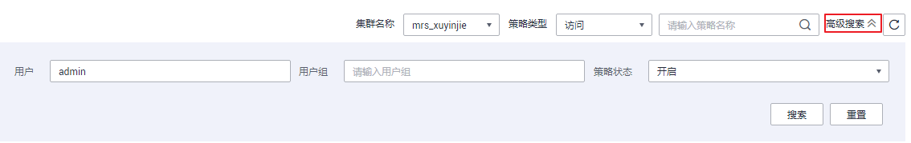
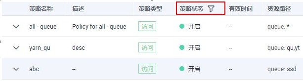

# 查看权限报告

本章主要介绍如何查看资源配置权限策略及详情。

## 前提条件

已完成权限策略配置，未配置请参考[配置资源权限](配置资源权限.md)。

## 查看策略及详情

1.  在DGC控制台首页，选择对应工作空间的“数据安全“模块，进入数据安全页面。

    **图 1**  选择数据安全  
    

2.  单击左侧导航树中的“权限报告“，进入权限报告页面。
3.  选择 MRS集群（Ranger连接） \> 服务查看该服务的策略及策略详情。
    -   高级搜索功能：

        您在查看报告时，可以使用搜索操作，高级搜索提供了根据集群、策略名称、用户、用户组、策略类型、策略状态来搜索相关策略的功能。您只需单击权限报告页面右上角的“高级搜索“即可弹出搜索框。

        **图 2**  高级搜索  
        

    -   策略状态过滤：

        在服务的策略列表中，策略状态栏提供了过滤功能，您可以单击策略状态栏的来过滤所需要查看的策略。

        **图 3**  策略状态过滤  
        

