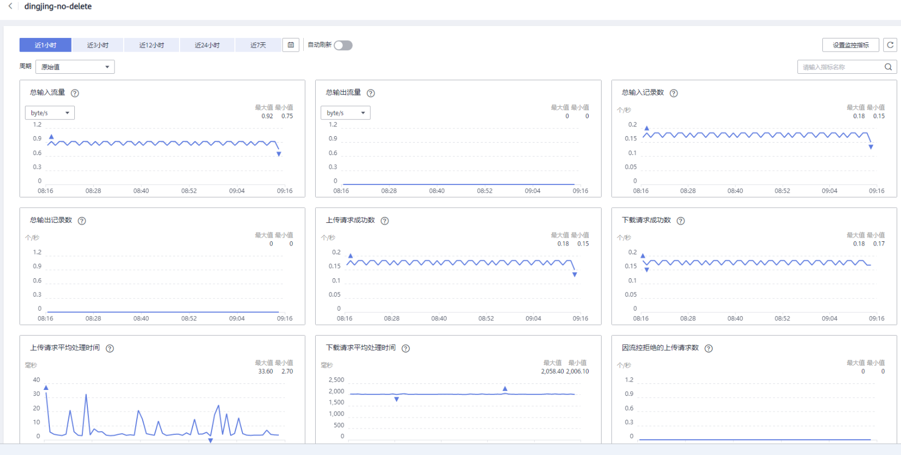

# 查看监控指标

## 操作场景

云监控服务可以对数据接入服务通道的运行状态进行日常监控。您可以通过云监控管理控制台，直观地查看各项监控指标。

由于监控数据的获取与传输会花费一定时间，因此，云监控显示的是当前时间5～10分钟前的状态。如果您的数据接入服务通道刚刚创建完成，请等待5～10分钟后查看监控数据。

## 前提条件

-   数据接入服务通道正常运行。

    > **说明：** 
    >已删除的通道，云监控将默认该通道不存在，并在监控列表中删除，不再对其进行监控，但告警规则需要用户手动清理。

-   已在云监控页面设置告警规则，具体操作请参见[设置告警规则](设置告警规则-3.md#dgc_01_0267)。

## 操作步骤

1.  使用注册帐户登录[DIS控制台](https://console.huaweicloud.com/dis/?locale=zh-cn )。
2.  单击管理控制台左上角的，选择区域和项目。
3.  在左侧列表栏中选择“通道管理“。
4.  单击需要查看监控信息的通道名称。进入监控页面。
5.  在“通道监控“页签内单击“查看更多指标详情“，系统跳转至云监控服务的监控指标页面。
6.  在监控页面，可查看所有监控指标的小图。

    **图 1**  查看监控指标  
    

7.  单击小图右上角的，可进入大图模式查看。

    可查看不同监控指标“近1小时”、“近3小时”、“近12小时”的原始监控数据曲线图。您可以选择是否开启“自动刷新”功能，云监控服务提供了“60秒”自动刷新周期。

