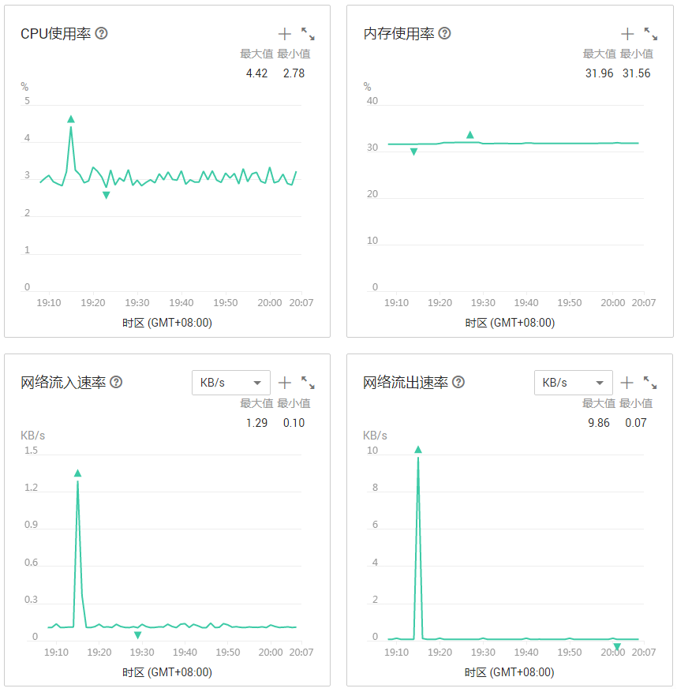
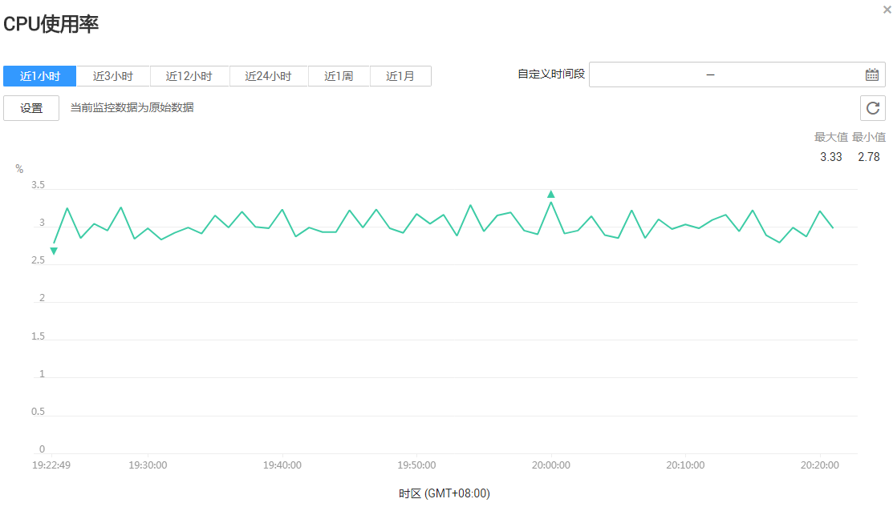

# 查看监控指标

## 操作场景

云监控服务可以对CDM集群的运行状态进行日常监控。您可以通过云监控管理控制台，直观地查看各项监控指标。

由于监控数据的获取与传输会花费一定时间，因此，云监控显示的是当前时间5～10分钟前的状态。如果您的CDM集群刚刚创建完成，请等待5～10分钟后查看监控数据。

## 前提条件

-   CDM集群正常运行。

    关机、重启失败、不可用状态的集群，无法在云监控中查看其监控指标。当集群再次启动或恢复后，即可正常查看。

-   已在云监控页面设置告警规则，具体操作请参见[设置告警规则](设置告警规则.md#dayu_01_0123)。
-   CDM集群已正常运行一段时间（约10分钟）。

    对于新创建的集群，需要等待一段时间，才能查看上报的监控数据和监控视图。

## 操作步骤

1.  登录[CDM管理控制台](https://console.huaweicloud.com/cdm?locale=zh-cn)。
2.  选择“集群管理“，单击集群操作列中的“更多  \>  查看监控数据“，页面会跳转到云监控服务的界面。
3.  在CDM监控页面，可查看所有监控指标的小图。

    **图 1**  查看监控指标  
    

4.  单击小图右上角的，可进入大图模式查看。

    系统提供了监控固定时长和自定义时长两种方式。

    1.  固定时长包括最近1小时、3小时、12小时、24小时、1周、1个月一共6个时间段，作为用户监控周期。
    2.  自定义时长支持用户在最近一个星期内选择检测时间起点和终点，作为用户监控周期。

    **图 2**  大图模式查看监控数据  
    

