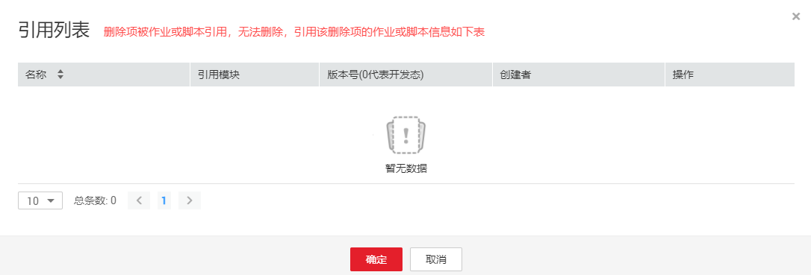

# 查看脚本引用

当用户需要查看某个脚本被引用的情况时，可以参考如下操作查看引用。

## 操作步骤

1.  登录DGC控制台。选择对应工作空间的“数据开发“模块，进入数据开发页面。

    **图 1**  选择数据开发  
    

2.  在数据开发主界面的左侧导航栏，选择“数据开发  \>  脚本开发“。
3.  在脚本目录列表中，右键单击对应的脚本，选择“查看引用”，弹出“引用列表“窗口。
4.  在引用列表窗口，可以查看该脚本被引用的情况。

    **图 2**  引用列表  
    

