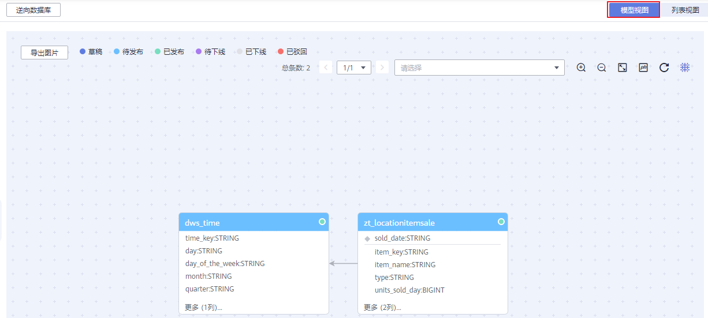
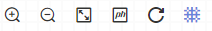
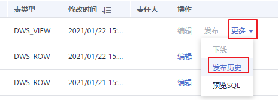

# 查看表

对于关系模型中的表，您可以查看模型视图、表详情、关系图、预览SQL以及发布历史。

## 查看模型视图

当您在关系模型中完成表的新建后，就可以通过列表视图和模型视图两种形式查看表模型。关系模型页面默认显示为列表视图，您可以切换为模型视图进行查看。

1.  在DGC规范设计控制台，单击左侧导航栏的“关系建模“进入关系建模页面。
2.  在关系模型树中选择所需要模型，展开模型树，选择一个对象。
3.  关系模型页面默认显示为列表视图，单击列表右上方的“模型视图“按钮，切换为模型视图，如下图所示。单击“列表视图“则可以重新切换回列表视图。

    **图 1**  模型视图  
    

    在模型视图中支持以下功能：

    -   双击表名，可显示表的详情信息。
    -   单击左上角的“导出图片“按钮，可以将模型视图导出成图片。
    -   在右上角的搜索框中输入表名，可以快速找到的所要查看的表。
    -   功能依次为放大、缩小、全屏、物理模型/逻辑模型切换、刷新、显示画布。

## 查看表详情以及预览SQL

1.  在DGC规范设计控制台，单击左侧导航栏的“关系建模“进入关系建模页面。
2.  在模型总览中，找到所需要的逻辑模型，单击模型卡片进入，在主题目录中选中一个主题，右侧的列表中将显示该主题下所有的表。
3.  在表的列表中，找到需要查看详情以及预览SQL的表，在表所在行，单击“更多 \> 预览SQL“可以预览SQL或复制SQL。完成预览后单击“确定“返回关系模型的列表页面。

    **图 2**  关系模型列表2  
    

4.  在表的列表中，单击表名称进入表详情页面，可以查看表的详情、关系图、发布历史和审核历史。

    **图 3**  关系图  
    

## 查看发布历史

表发布后，您可以查看表的发布历史、版本对比和发布日志。如果表发布失败，或者数据资产、数据质量同步失败，您可以通过查看发布日志定位问题、重新同步。

1.  在DGC规范设计控制台，单击左侧导航栏的“关系建模“进入关系建模页面。
2.  在模型总览中，找到所需要的逻辑模型，单击模型卡片进入，在主题目录中选中一个主题，右侧的列表中将显示该主题下所有的表。
3.  在列表中，找到所需要的表，然后在表所在行，单击“更多 \> 发布历史“，查看表的发布历史、版本对比和发布日志。

    **图 4**  发布历史  
    

