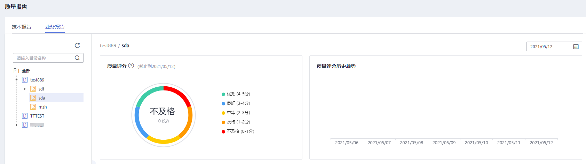
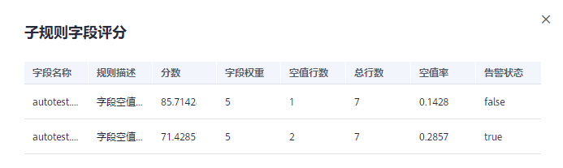
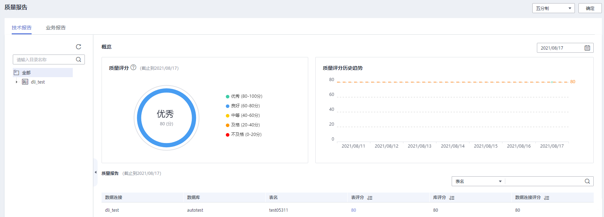

# 查看质量报告

您可以查询业务指标、数据质量中数据对象的质量评分，来判断各个对象是否质量达标。

## 查询业务质量评分

质量评分的满分可设置为5分，10分，100分。默认为5分制，是以表关联的规则为基础进行评分的。而表、业务对象、主题域等不同维度的评分，本质上是基于规则评分在不同维度下的加权平均值进行计算的。

您可以查询主题域分组、主题域、业务对象、表以及表关联的规则评分，具体评分对象的计算公式，请参见[表1](#table13961141518393)。

**表 1**  对象评分计算公式

<table><thead align="left"><tr id="row699561512395"><th class="cellrowborder" valign="top" width="17.46%" id="mcps1.2.3.1.1">
<strong id="b109951415163914">对象</strong>

</th>
<th class="cellrowborder" valign="top" width="82.54%" id="mcps1.2.3.1.2">
<strong id="b4995141519397">评分计算公式</strong>

</th>
</tr>
</thead>
<tbody><tr id="row29951615133916"><td class="cellrowborder" valign="top" width="17.46%" headers="mcps1.2.3.1.1 ">
规则

</td>
<td class="cellrowborder" valign="top" width="82.54%" headers="mcps1.2.3.1.2 ">
创建质量作业时，包含“比率”、“值率”的系统内置规则及用户自定义规则可以生成质量评分报告。

<ul id="ul3105124811524"><li>包含“比率”、“值率”的规则可以分为正向规则及反向规则，正向规则即比值越高，代表数据质量越好；反向规则即比值越高，则数据质量越差。
正向规则包含唯一值率、重复值率、合法比率规则，反向规则包含空值率规则。

</li><li>正向规则评分=满足规则的数据行数/数据总行数*满分（5，10，100）。</li><li>反向规则评分=（1-满足规则的数据行数/数据总行数）*满分（5，10，100）。</li><li>当表为空，即总行数为0时，正向规则评分固定为满分，反向评分固定为0分。</li></ul>
</td>
</tr>
<tr id="row1996121523918"><td class="cellrowborder" valign="top" width="17.46%" headers="mcps1.2.3.1.1 ">
表

</td>
<td class="cellrowborder" valign="top" width="82.54%" headers="mcps1.2.3.1.2 ">
表评分计算公式：∑(表关联的所有规则评分*规则权重)/∑规则权重

</td>
</tr>
<tr id="row499691513396"><td class="cellrowborder" valign="top" width="17.46%" headers="mcps1.2.3.1.1 ">
业务对象

</td>
<td class="cellrowborder" valign="top" width="82.54%" headers="mcps1.2.3.1.2 ">
业务对象下所有表评分的加权求平均值，即：∑业务对象下所有表评分/表的数量。

</td>
</tr>
<tr id="row7996121520393"><td class="cellrowborder" valign="top" width="17.46%" headers="mcps1.2.3.1.1 ">
主题域

</td>
<td class="cellrowborder" valign="top" width="82.54%" headers="mcps1.2.3.1.2 ">
主题域下所有业务对象评分的加权求平均值，即：∑主题域下所有业务对象评分/业务对象的数量。

</td>
</tr>
<tr id="row999641513910"><td class="cellrowborder" valign="top" width="17.46%" headers="mcps1.2.3.1.1 ">
主题域分组

</td>
<td class="cellrowborder" valign="top" width="82.54%" headers="mcps1.2.3.1.2 ">
分组下所有主题域评分的加权求平均值，即：∑分组下所有主题域评分/主题域的数量。

</td>
</tr>
</tbody>
</table>

1.  [登录DGC控制台](https://console.huaweicloud.com/dgc/)，找到所需要的DGC实例，单击实例卡片上的“进入控制台”，进入概览页面。

    选择“空间管理”页签，在工作空间列表中，找到所需要的工作空间。

2.  单击相应工作空间的“数据质量“。

    系统跳转至数据质量页面。

3.  选择“数据质量监控  \>  业务报告“。
4.  单击“业务报告“页签，选择主题及截至日期，查询截至日期前7天的数据质量评分，如[图1](#fig216416433485)所示。

    **图 1**  业务对象  
    

    > **说明：** 
    >-   以评分满分为5分为例。其中4-5分评价为优秀，3-4分为良好，2-3分为中等，1-2分为及格，0-1分为不及格。
    >-   当天质量评分数据在次日凌晨生成。
    >-   质量评分历史趋势中的实线为截至日期前7天质量评分组成的连线，虚线为这7天质量评分的平均分。
    >-   若一天多次运行该作业，当天的质量评分为最后一次的得分。

5.  单击“表评分“列的评分值链接，展开该表关联的规则评分。
6.  单击“规则评分”列的评分值链接，展开该规则关联的字段评分，如[图2](#fig14837173615320)所示。

    **图 2**  表关联规则评分  
    

## 查看数据质量评分

质量评分的满分可设置为5分，10分，100分。默认为5分制，是以表关联的规则为基础进行评分的。而表、数据库等不同维度的评分均基于规则评分，本质上是基于规则评分在不同维度下的加权平均值进行计算的。

您可以查询所创建数据连接下数据库、数据库下的数据表以及数据表所关联规则的评分，具体评分对象的计算公式，请参见[表2](#table47512091019)。

**表 2**  对象评分计算公式

<table><thead align="left"><tr id="row780115915115"><th class="cellrowborder" valign="top" width="17.23%" id="mcps1.2.3.1.1">
<strong id="b1980112919112">对象</strong>

</th>
<th class="cellrowborder" valign="top" width="82.77%" id="mcps1.2.3.1.2">
<strong id="b19801991117">评分计算公式</strong>

</th>
</tr>
</thead>
<tbody><tr id="row58011591819"><td class="cellrowborder" valign="top" width="17.23%" headers="mcps1.2.3.1.1 ">
规则

</td>
<td class="cellrowborder" valign="top" width="82.77%" headers="mcps1.2.3.1.2 ">
创建质量作业时，作业关联的规则中结果说明列包含“比率”、“值率”的系统内置规则及用户自定义规则可以生成质量评分报告。

<ul id="ul4807041790"><li>包含“比率”、“值率”的规则可以分为正向规则及反向规则，正向规则即比值越高，代表数据质量越好；反向规则即比值越高，则数据质量越差。
正向规则包含唯一值率、重复值率、合法比率规则，反向规则包含空值率规则。

</li><li>正向规则评分=满足规则的数据行数/数据总行数*满分（5，10，100）。</li><li>反向规则评分=（1-满足规则的数据行数/数据总行数）*满分（5，10，100）。</li></ul>
</td>
</tr>
<tr id="row78011191120"><td class="cellrowborder" valign="top" width="17.23%" headers="mcps1.2.3.1.1 ">
数据表

</td>
<td class="cellrowborder" valign="top" width="82.77%" headers="mcps1.2.3.1.2 ">
表评分计算公式：∑(表关联的所有规则评分*规则权重)/∑规则权重

</td>
</tr>
<tr id="row7801699110"><td class="cellrowborder" valign="top" width="17.23%" headers="mcps1.2.3.1.1 ">
数据库

</td>
<td class="cellrowborder" valign="top" width="82.77%" headers="mcps1.2.3.1.2 ">
数据库下所有数据表评分的加权求平均值，即：∑数据库下所有数据表评分/表的数量。

</td>
</tr>
</tbody>
</table>

1.  [登录DGC控制台](https://console.huaweicloud.com/dgc/)，找到所需要的DGC实例，单击实例卡片上的“进入控制台”，进入概览页面。

    选择“空间管理”页签，在工作空间列表中，找到所需要的工作空间。

2.  单击相应工作空间的“数据质量“。

    系统跳转至数据质量页面。

3.  选择“数据质量监控  \>  质量报告“。
4.  在“技术报告“页签，选择数据连接及截至日期，查询截至日期前7天的数据质量评分，如[图3](#fig1969714218119)所示。

    **图 3**  选择数据连接  
    

    > **说明：** 
    >-   以评分满分为5分为例。其中4-5分评价为优秀，3-4分为良好，2-3分为不及格，1-2分为较差，0-1分为极差。
    >-   当天质量评分数据在次日凌晨生成。
    >-   质量评分历史趋势中的实线为截至日期前7天质量评分组成的连线，虚线为这7天质量评分的平均分。
    >-   若一天多次运行该作业，当天的质量评分为最后一次的得分。

5.  单击“表评分“列的评分值链接，展开该表关联的规则评分。
6.  单击“规则评分”列的评分值链接，展开该规则关联的字段评分，如[图4](#fig9118134801217)所示。

    **图 4**  表关联规则评分界面  
    

