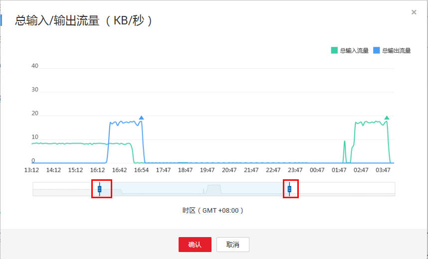

# 查看通道监控信息

用户可以通过控制台查看通道的监控信息。

1.  单击需要查看监控信息的通道名称。进入监控页面。
2.  根据实际情况在“通道管理“页面选择“通道监控”或“分区监控”页签，查看各监控项情况。监控信息参数说明如[表1](#zh-cn_topic_0120206091_table2942144318834)所示。其中，通道基本信息的参数说明请参见[按需计费方式购买实时数据接入的增量包](实时数据接入快速入门.md#section135623119496)。

    **表 1**  DIS监控信息参数说明

    
    <table><thead align="left"><tr id="zh-cn_topic_0120206091_row6686704018834"><th class="cellrowborder" valign="top" width="30%" id="mcps1.2.3.1.1">
参数

    </th>
    <th class="cellrowborder" valign="top" width="70%" id="mcps1.2.3.1.2">
说明

    </th>
    </tr>
    </thead>
    <tbody><tr id="zh-cn_topic_0120206091_row5291185918834"><td class="cellrowborder" valign="top" width="30%" headers="mcps1.2.3.1.1 ">
时间范围

    </td>
    <td class="cellrowborder" valign="top" width="70%" headers="mcps1.2.3.1.2 "><ul id="zh-cn_topic_0120206091_ul210231152417"><li>选择查看监控信息的时间段，可查看所选时间范围内的监控信息。
取值范围：

    <ul id="zh-cn_topic_0120206091_ul4520229418834"><li>1h</li><li>2h</li><li>3h</li></ul>
    </li><li>可自定义查看监控信息的时间段。<ul id="zh-cn_topic_0120206091_ul16772475349"><li>单击“自定义”页签后的，分别设置开始时间和结束时间。</li><li>其中，结束时间不能晚于当前的系统时间。</li><li>开始时间与结束时间的差值不超过168h。</li></ul>
    </li></ul>
    </td>
    </tr>
    <tr id="zh-cn_topic_0120206091_row1818369818834"><td class="cellrowborder" colspan="2" valign="top" headers="mcps1.2.3.1.1 mcps1.2.3.1.2 ">
<strong id="zh-cn_topic_0120206091_b3547017018834">分区监控</strong>

    </td>
    </tr>
    <tr id="zh-cn_topic_0120206091_row5079608118834"><td class="cellrowborder" valign="top" width="30%" headers="mcps1.2.3.1.1 ">
分区编号

    </td>
    <td class="cellrowborder" valign="top" width="70%" headers="mcps1.2.3.1.2 ">
流分区编号，默认从0开始。

    
取值方式：从下拉框选择。

    </td>
    </tr>
    <tr id="zh-cn_topic_0120206091_row4437627918834"><td class="cellrowborder" valign="top" width="30%" headers="mcps1.2.3.1.1 ">
该分区的总输入/输出流量（KB/秒）

    </td>
    <td class="cellrowborder" valign="top" width="70%" headers="mcps1.2.3.1.2 ">
用户指定时间范围内，指定分区的输入/输出流量。

    
单位：KB/s。

    </td>
    </tr>
    <tr id="zh-cn_topic_0120206091_row4467607118834"><td class="cellrowborder" valign="top" width="30%" headers="mcps1.2.3.1.1 ">
该分区的总输入/输出记录数（个/秒）

    </td>
    <td class="cellrowborder" valign="top" width="70%" headers="mcps1.2.3.1.2 ">
用户指定时间范围内，指定分区的输入/输出记录数。

    
单位：个/秒。

    </td>
    </tr>
    <tr id="zh-cn_topic_0120206091_row4997660018834"><td class="cellrowborder" colspan="2" valign="top" headers="mcps1.2.3.1.1 mcps1.2.3.1.2 ">
<strong id="zh-cn_topic_0120206091_b5993734118834">通道监控</strong>

    </td>
    </tr>
    <tr id="zh-cn_topic_0120206091_row256515918834"><td class="cellrowborder" valign="top" width="30%" headers="mcps1.2.3.1.1 ">
总输入/输出流量（KB/秒）

    </td>
    <td class="cellrowborder" valign="top" width="70%" headers="mcps1.2.3.1.2 ">
用户指定时间范围内，指定通道的输入/输出流量。

    
单位：KB/s。

    </td>
    </tr>
    <tr id="zh-cn_topic_0120206091_row4837715518834"><td class="cellrowborder" valign="top" width="30%" headers="mcps1.2.3.1.1 ">
总输入/输出记录数（个/秒）

    </td>
    <td class="cellrowborder" valign="top" width="70%" headers="mcps1.2.3.1.2 ">
用户指定时间范围内，指定通道的输入/输出记录数。

    
单位：个/秒。

    </td>
    </tr>
    <tr id="zh-cn_topic_0120206091_row6366508718834"><td class="cellrowborder" valign="top" width="30%" headers="mcps1.2.3.1.1 ">
上传/下载请求成功次数（个/秒）

    </td>
    <td class="cellrowborder" valign="top" width="70%" headers="mcps1.2.3.1.2 ">
用户指定时间范围内，指定通道的上传/下载请求成功次数。

    
单位：个/秒。

    </td>
    </tr>
    <tr id="zh-cn_topic_0120206091_row2894632418834"><td class="cellrowborder" valign="top" width="30%" headers="mcps1.2.3.1.1 ">
因流控拒绝的上传/下载请求次数（个/秒）

    </td>
    <td class="cellrowborder" valign="top" width="70%" headers="mcps1.2.3.1.2 ">
用户指定时间范围内，指定通道因流控拒绝的上传/下载请求次数。

    
单位：个/秒。

    </td>
    </tr>
    <tr id="zh-cn_topic_0120206091_row3297925818834"><td class="cellrowborder" valign="top" width="30%" headers="mcps1.2.3.1.1 ">
上传/下载请求平均处理时间（毫秒/个）

    </td>
    <td class="cellrowborder" valign="top" width="70%" headers="mcps1.2.3.1.2 ">
用户指定时间范围内，指定通道的上传/下载请求平均处理时间。

    
单位：毫秒/个。

    </td>
    </tr>
    </tbody>
    </table>

3.  在监控指标视图右上角，单击可放大查看监控指标视图详情。
4.  通过调整放大视图游标位置，可查看游标范围内时间段的监控指标详情。

    > **说明：**   
    >游标范围所定义的时间段，隶属于监控面板设置的时间段子集。  

    **图 1**  调整游标  
    

