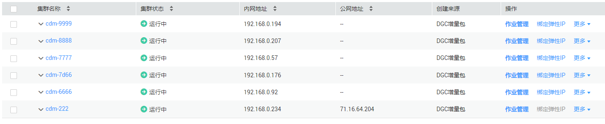
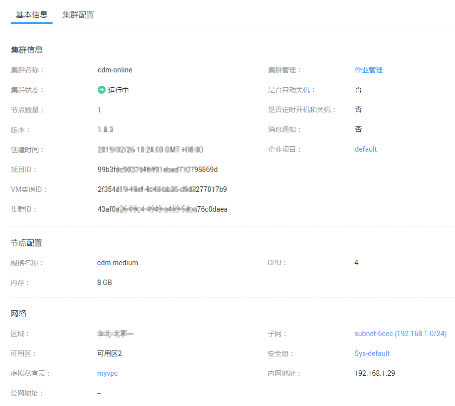

# 查看集群配置/日志/监控数据

## 操作场景

本章节指导用户查看集群的配置信息、获取集群的日志、查看云监控的监控数据。

## 前提条件

已创建CDM集群。

## 操作步骤

1.  [登录DAYU控制台](https://console.huaweicloud.com/dayu/)，找到所需要的DAYU实例，单击实例卡片上的“进入控制台”，进入概览页面。

    选择“空间管理”页签，完成工作空间的创建。

    在工作空间列表中，找到所需要的工作空间。

1.  单击相应工作空间的“数据集成“。

    系统跳转至数据集成页面。

1.  选择批量数据迁移集群管理，进入集群管理界面，查看集群列表。

    **图 1**  集群列表  
    

2.  单击集群名称，可查看集群的基本信息，包括：集群规格、创建时间、节点数量、节点配置，以及网络配置、项目ID、集群ID和实例ID等。

    **图 2**  CDM集群的配置信息  
    

3.  单击集群操作列中的“更多  \>  下载日志“，可获取集群的日志信息。
4.  单击集群操作列中的“更多  \>  查看监控数据“，页面会跳转到云监控服务的监控页面，可查看CDM集群的网络流入速率、网络流出速率、CPU使用率和内存使用率。

