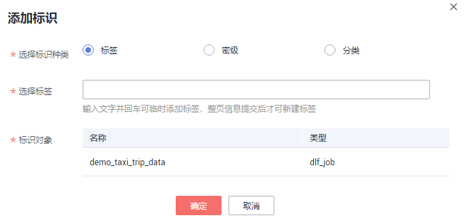
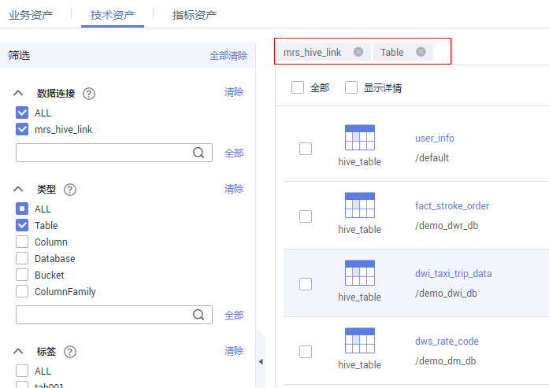
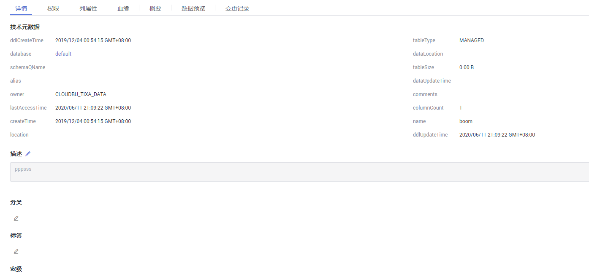

# 标签管理

标签是用来标识数据的业务含义，比如标识某个表是ODS、DWD等。为方便管理技术资产，可以从业务角度定义标签，并与技术资产关联。

## 管理标签

1.  在DGC控制台首页，选择对应工作空间的“数据资产“模块，进入数据资产页面。

    **图 1**  选择数据资产  
    

1.  选择“数据地图  \>  标签管理“。
2.  单击“新建“，新建标签。
    -   **标签名称**：只能包含中文、英文字母、数字和下划线，不能以下划线开头。且长度不能超过100个字符。
    -   **描述**：标签的描述信息，长度不能超过255个字符。

3.  勾选标签，单击“删除“，可删除标签。
4.  单击标签后的“编辑“，可修改标签描述。

## 标识数据：添加标签

1.  在DGC控制台首页，选择对应工作空间的“数据资产“模块，进入数据资产页面。

    **图 2**  选择数据资产  
    

1.  选择“数据地图  \>  数据目录“。
2.  在资产搜索输入框输入需要添加标签的数据的关键字，然后单击“搜索“，搜索结果以列表方式显示。

1.  勾选需要添加标签的资产，单击右上角“标识“。在添加标识对话框中配置标签。

    **图 3**  添加标识  
    

2.  选择标识种类为标签，并配置标签，单击“确定”提交。

    > **说明：** 
    >此处支持全新添加标签，也支持选择已有标签。已有标签来源于[管理标签](#zh-cn_topic_0159221300_section694485119415)。

## 查看详情

1.  在DGC控制台首页，选择对应工作空间的“数据资产“模块，进入数据资产页面。

    **图 4**  选择数据资产  
    

1.  单击相应工作空间的“数据资产“，系统跳转至“数据资产“页面。
2.  选择“数据地图 \> 数据目录”，在“技术资产”页签，选择“数据连接”，类型选择“Table”。筛选出该数据连接下的所有表，参考[图5](#fig66015421425)。

    **图 5**  筛选表  
    

3.  单击相应的表名称，即可跳转至表详情页面，参考[图6](#fig552115388316)。

    表详情页为用户展示表的详情、权限信息、列属性、血缘信息、概要、数据预览和变更记录。

    **图 6**  表详情页  
    

## 数据预览

用户可以通过表的数据预览模块，预览当前表的业务数据。根据列的分类信息，支持对预览的数据进行实时脱敏。

-   数据预览支持的数据源类型：DWS、DLI、Hive、MySQL。
-   列的分类信息支持在新建采集任务时自动设置和在数据分类菜单中手动添加两种方式。其中仅DWS、DLI支持新建采集任务时自动设置分类。

