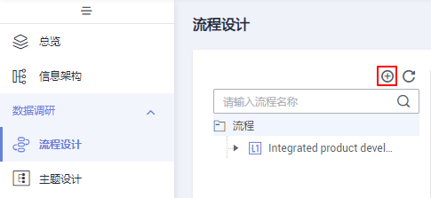
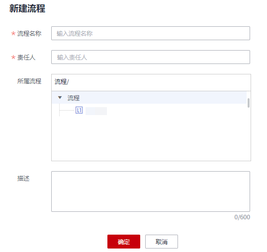
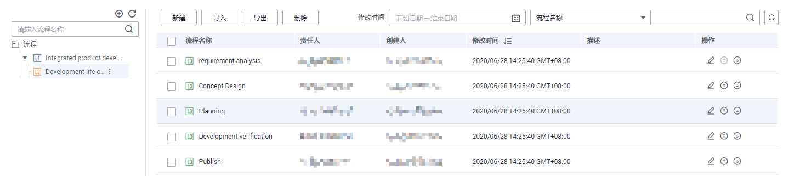
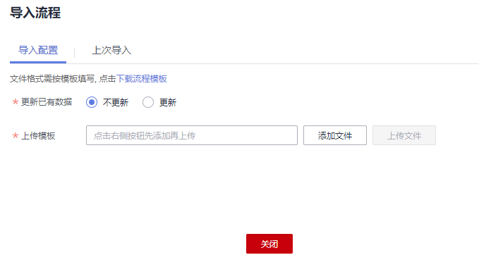

# 流程设计

流程架构基于价值流产生，属于业务架构的流程处理模块，指导并规范BT&IT需求的管理，确保业务需求受理、分析、交付等过程的高效运作；并聚焦高价值需求，实现业务价值最大化，支撑业务运作及目标的达成。

## 新建流程

根据业务需求设计流程，流程支持L1\~L3三层。

1.  在DGC控制台首页，选择对应工作空间的“规范设计“模块，进入规范设计页面。

    **图 1**  选择规范设计  
    

2.  单击左侧导航栏中“流程设计“，进入流程设计页面，在流程树中选中一个流程，单击按钮在所选流程下新建流程。首次新建流程时，可选择在流程的根节点下新建流程。

    **图 2**  流程设计  
    

3.  在弹出对话框中配置如下参数，然后单击“确定”完成流程的创建。

    **图 3**  新建流程  
    

    **表 1**  新建流程参数说明

    
    <table><thead align="left"><tr id="row8137173111105"><th class="cellrowborder" valign="top" width="20.05%" id="mcps1.2.3.1.1">
参数名

    </th>
    <th class="cellrowborder" valign="top" width="79.95%" id="mcps1.2.3.1.2">
说明

    </th>
    </tr>
    </thead>
    <tbody><tr id="row11137831191011"><td class="cellrowborder" valign="top" width="20.05%" headers="mcps1.2.3.1.1 ">
流程名称

    </td>
    <td class="cellrowborder" valign="top" width="79.95%" headers="mcps1.2.3.1.2 ">
流程名称，只能包含中文、英文字母、数字和下划线。

    </td>
    </tr>
    <tr id="row1913719316108"><td class="cellrowborder" valign="top" width="20.05%" headers="mcps1.2.3.1.1 ">
责任人

    </td>
    <td class="cellrowborder" valign="top" width="79.95%" headers="mcps1.2.3.1.2 ">
流程的责任人。只有工作空间管理员或开发者、运维者角色的用户才可以设置为责任人。

    </td>
    </tr>
    <tr id="row83715386107"><td class="cellrowborder" valign="top" width="20.05%" headers="mcps1.2.3.1.1 ">
所属流程

    </td>
    <td class="cellrowborder" valign="top" width="79.95%" headers="mcps1.2.3.1.2 ">
显示所属的流程。

    </td>
    </tr>
    <tr id="row14137184616110"><td class="cellrowborder" valign="top" width="20.05%" headers="mcps1.2.3.1.1 ">
描述

    </td>
    <td class="cellrowborder" valign="top" width="79.95%" headers="mcps1.2.3.1.2 ">
流程的描述信息。

    </td>
    </tr>
    </tbody>
    </table>

4.  依次新建更多的流程或子流程。一般需要设计L1\~L3三层流程。第一层标识为L1层，第二层标识为L2层，第三层标识为L3。

    示例如下：

    **图 4**  流程设计示例  
    

## 导出流程

您可以将规范设计中已创建的流程导出到文件中。

1.  在规范设计控制台，单击左侧导航树中的“流程设计“，进入流程设计页面。
2.  单击流程列表上方的“导出“按钮，等待几秒钟后，页面右上角提示“流程导出成功”，可以查看导出的流程。

    > **说明：** 
    >“主题“或“流程“作为层级联动性质, 导出均默认为全量导出, 不支持筛选。

## 导入流程

1.  在规范设计控制台，单击左侧导航树中的“流程设计“，进入流程设计页面。
2.  单击流程列表上方的“导入“按钮导入流程。
3.  在“导入流程“对话框中，根据页面提示配置如下参数，然后先单击“添加文件”后，再单击“上传文件”。

    **图 5**  导入流程  
    

    **表 2**  导入配置参数说明

    
    <table><thead align="left"><tr id="row19296151215259"><th class="cellrowborder" valign="top" width="20.05%" id="mcps1.2.3.1.1">
参数名

    </th>
    <th class="cellrowborder" valign="top" width="79.95%" id="mcps1.2.3.1.2">
说明

    </th>
    </tr>
    </thead>
    <tbody><tr id="row929719129259"><td class="cellrowborder" valign="top" width="20.05%" headers="mcps1.2.3.1.1 ">
更新已有数据

    </td>
    <td class="cellrowborder" valign="top" width="79.95%" headers="mcps1.2.3.1.2 ">
如果所要导入的流程，在DGC规范设计中已经存在，是否更新已有的流程。支持以下选项：

    <ul id="ul1129714127259"><li><strong id="b7297121219253">不更新</strong>：当流程已存在时，将直接跳过，不处理。</li><li><strong id="b1629711214254">更新</strong>：当流程已存在时，更新已有的流程信息。</li></ul>
    
在导入流程时，只有创建或更新操作，不会删除已有的流程。

    </td>
    </tr>
    <tr id="row18298612112510"><td class="cellrowborder" valign="top" width="20.05%" headers="mcps1.2.3.1.1 ">
上传模板

    </td>
    <td class="cellrowborder" valign="top" width="79.95%" headers="mcps1.2.3.1.2 ">
选择所需导入的流程设计文件。

    
所需导入的流程设计文件，可以通过以下两种方式获得。

    <ul id="ul229811220253"><li><strong id="b16297191262512">下载流程模板并填写模板</strong>
在“导入配置”页签内，单击“下载流程模板”下载模板，然后根据业务需求填写好模板中的相关参数并保存后，先添加再上传，完成模板上传。模板参数的详细描述请参见<a href="#table7300412102511">表3</a>。

    </li><li><strong id="b529813121259">导出的流程</strong>
您可以将某个DGC实例的规范设计中已建立的流程设计信息导出到Excel文件中。导出后的文件可用于导入。导出流程的操作请参见<a href="#section85344063613">导出流程</a>。

    </li></ul>
    </td>
    </tr>
    </tbody>
    </table>

    下载的流程模板参数如[表3](#table7300412102511)所示，其中名称前带“\*”的参数为必填参数，名称前未带“\*”的参数为可选参数。一个流程需要填写一条记录。

    **表 3**  流程导入参数说明

    
    <table><thead align="left"><tr id="row52991412112517"><th class="cellrowborder" valign="top" width="24.33%" id="mcps1.2.3.1.1">
参数名

    </th>
    <th class="cellrowborder" valign="top" width="75.67%" id="mcps1.2.3.1.2">
说明

    </th>
    </tr>
    </thead>
    <tbody><tr id="row182991612132513"><td class="cellrowborder" valign="top" width="24.33%" headers="mcps1.2.3.1.1 ">
上级流程

    </td>
    <td class="cellrowborder" valign="top" width="75.67%" headers="mcps1.2.3.1.2 ">
第一层的流程，其上级流程为空，不用填。

    
非第一层的流程，其上级流程不能为空。上级流程为多级流程时，流程之间以“/”分隔。例如“集成产品开发/开发生命周期”。

    </td>
    </tr>
    <tr id="row5299101211253"><td class="cellrowborder" valign="top" width="24.33%" headers="mcps1.2.3.1.1 ">
*名称

    </td>
    <td class="cellrowborder" valign="top" width="75.67%" headers="mcps1.2.3.1.2 ">
流程名称。

    </td>
    </tr>
    <tr id="row12300512122519"><td class="cellrowborder" valign="top" width="24.33%" headers="mcps1.2.3.1.1 ">
*责任人

    </td>
    <td class="cellrowborder" valign="top" width="75.67%" headers="mcps1.2.3.1.2 ">
流程的责任人。只有工作空间管理员或开发者、运维者角色的用户才可以设置为责任人。

    </td>
    </tr>
    <tr id="row18300101272519"><td class="cellrowborder" valign="top" width="24.33%" headers="mcps1.2.3.1.1 ">
描述

    </td>
    <td class="cellrowborder" valign="top" width="75.67%" headers="mcps1.2.3.1.2 ">
流程的描述信息。

    </td>
    </tr>
    </tbody>
    </table>

4.  导入结果会在“导入流程“对话框的“上次导入“中显示。如果导入结果为“成功”，单击“关闭“完成导入。如果导入失败，您可以在“备注”列查看失败原因，将模板文件修改正确后，再重新上传。

## 删除流程

您可以将无用的流程删除，注意，删除后无法恢复，请谨慎操作。当流程下面存在子流程时，需先删除子流程。

1.  在规范设计控制台，单击左侧导航树中的“流程设计“，进入流程设计页面。
2.  在流程列表中，选中要删除的流程，然后单击上方的“删除“按钮。
3.  在弹出的“删除流程”对话框中，确认删除流程信息正确后，单击“是”删除流程。

