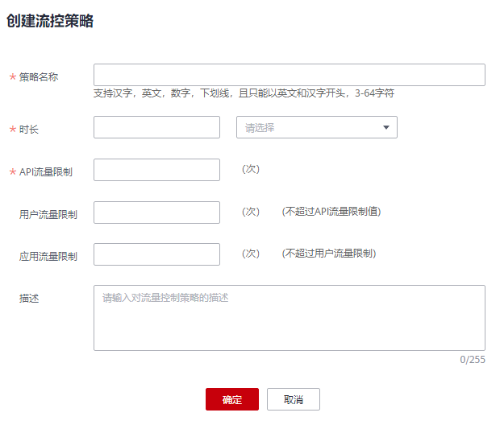

# 流量控制

## 操作场景

流量控制可限制单位时间内API的被调用次数，保护后端服务。

为了提供持续稳定的服务，您可以通过创建流控策略，针对部分API进行流量控制。

流控策略和API本身是相互独立的，只有将流控策略绑定API后，流控策略才对绑定的API生效。

> **说明：**   
>-   每个用户最多创建30个流控策略。  
>-   同一个环境中一个API只能被一个流控策略绑定，一个流控策略可以绑定多个API。  

## 前提条件

需要绑定的API已发布。

## 创建流控策略

1.  [登录DAYU控制台](https://console.huaweicloud.com/dayu/)，找到所需要的DAYU实例，单击实例卡片上的“进入控制台”，进入概览页面。

    选择“空间管理”页签，完成工作空间的创建。

    在工作空间列表中，找到所需要的工作空间。

1.  单击相应工作空间的“数据服务“。

    系统跳转至“数据服务“页面。

1.  单击“运营管理 \> 流控策略”，进入到流量控制信息页面。
2.  单击“创建流控策略”，弹出“创建流控策略”对话框。输入如[表1](#zh-cn_topic_0179716874_table195413315428)所示信息。

    **图 1**  创建流控策略  
    

    **表 1**  流控策略信息

    
    <table><thead align="left"><tr id="zh-cn_topic_0179716874_row45523384220"><th class="cellrowborder" valign="top" width="20%" id="mcps1.2.3.1.1">
信息项

    </th>
    <th class="cellrowborder" valign="top" width="80%" id="mcps1.2.3.1.2">
描述

    </th>
    </tr>
    </thead>
    <tbody><tr id="zh-cn_topic_0179716874_row175619332424"><td class="cellrowborder" valign="top" width="20%" headers="mcps1.2.3.1.1 ">
策略名称

    </td>
    <td class="cellrowborder" valign="top" width="80%" headers="mcps1.2.3.1.2 ">
API流控策略名称。

    </td>
    </tr>
    <tr id="zh-cn_topic_0179716874_row1156183364219"><td class="cellrowborder" valign="top" width="20%" headers="mcps1.2.3.1.1 ">
时长

    </td>
    <td class="cellrowborder" valign="top" width="80%" headers="mcps1.2.3.1.2 ">
流量限制的时长。

    <ul id="zh-cn_topic_0179716874_ul580520385234"><li>与“API流量限制”配合使用，表示单位时间内的单个API请求次数上限。</li><li>与“用户流量限制”配合使用，表示单位时间内的单个用户请求次数上限。</li><li>与“应用流量限制”配合使用，表示单位时间内的单个APP请求次数上限。</li></ul>
    </td>
    </tr>
    <tr id="zh-cn_topic_0179716874_row14879114316433"><td class="cellrowborder" valign="top" width="20%" headers="mcps1.2.3.1.1 ">
API流量限制

    </td>
    <td class="cellrowborder" valign="top" width="80%" headers="mcps1.2.3.1.2 ">
单个API被调用次数上限。

    
与“时长”配合使用，表示单位时间内的单个API请求次数上限。

    </td>
    </tr>
    <tr id="zh-cn_topic_0179716874_row247519275166"><td class="cellrowborder" valign="top" width="20%" headers="mcps1.2.3.1.1 ">
用户流量限制

    </td>
    <td class="cellrowborder" valign="top" width="80%" headers="mcps1.2.3.1.2 ">
单个用户调用API次数上限。

    <ul id="zh-cn_topic_0179716874_ul1091113535268"><li>不超过“API流量限制”。</li><li>与“时长”配合使用，表示单位时间内的单个用户请求次数上限。</li></ul>
    </td>
    </tr>
    <tr id="zh-cn_topic_0179716874_row8159123418166"><td class="cellrowborder" valign="top" width="20%" headers="mcps1.2.3.1.1 ">
应用流量限制

    </td>
    <td class="cellrowborder" valign="top" width="80%" headers="mcps1.2.3.1.2 ">
单个应用调用API次数上限。

    <ul id="zh-cn_topic_0179716874_ul448161162718"><li>不超过“用户流量限制”。</li><li>与“时长”配合使用，表示单位时间内的单个应用请求次数上限。</li></ul>
    </td>
    </tr>
    <tr id="zh-cn_topic_0179716874_row8202182105513"><td class="cellrowborder" valign="top" width="20%" headers="mcps1.2.3.1.1 ">
源IP流量限制

    </td>
    <td class="cellrowborder" valign="top" width="80%" headers="mcps1.2.3.1.2 ">
单个IP地址调用API次数上限。

    <ul id="zh-cn_topic_0179716874_ul15411858125518"><li>不超过“API流量限制”。</li><li>与“时长”配合使用，表示单位时间内的单个IP地址请求次数上限。</li></ul>
    </td>
    </tr>
    <tr id="zh-cn_topic_0179716874_row45611440141619"><td class="cellrowborder" valign="top" width="20%" headers="mcps1.2.3.1.1 ">
描述

    </td>
    <td class="cellrowborder" valign="top" width="80%" headers="mcps1.2.3.1.2 ">
关于控制策略的描述。

    </td>
    </tr>
    </tbody>
    </table>

3.  单击“确定”，完成流量控制策略的创建。

    创建成功后，策略信息页面增加显示新创建的策略，您可以将相关API绑定到该策略，以实现流量控制。

## 绑定API

1.  [登录DAYU控制台](https://console.huaweicloud.com/dayu/)，找到所需要的DAYU实例，单击实例卡片上的“进入控制台”，进入概览页面。

    选择“空间管理”页签，完成工作空间的创建。

    在工作空间列表中，找到所需要的工作空间。

1.  单击相应工作空间的“数据服务“。

    系统跳转至“数据服务“页面。

1.  单击“运营管理 \> 流控策略”，进入到流量控制信息页面。
2.  通过以下任意一种方法，进入“绑定API”页面。
    -   在待绑定的流量控制策略所在行，单击“绑定API”。
    -   单击策略名称，进入策略详情页面。在“绑定的API列表”页签中单击“绑定API”。

3.  选择“API分组”和“API名称”，筛选所需的API。
4.  勾选API，单击“绑定”，完成API绑定策略。

    > **说明：**   
    >在流控策略绑定API后，如果API不需要调用此策略，单击“解除”，解除绑定。如果需要批量解绑API，则勾选待解绑的API，单击“解除”。最多同时解绑1000个API。  

## 删除流控策略

当已创建的流控策略不再提供服务时，可以将此流控策略删除。

1.  [登录DAYU控制台](https://console.huaweicloud.com/dayu/)，找到所需要的DAYU实例，单击实例卡片上的“进入控制台”，进入概览页面。

    选择“空间管理”页签，完成工作空间的创建。

    在工作空间列表中，找到所需要的工作空间。

1.  单击相应工作空间的“数据服务“。

    系统跳转至“数据服务“页面。

1.  单击“运营管理 \> 流控策略”，进入到流量控制信息页面。
2.  在待删除的流控策略所在行，单击“删除”。

    > **说明：**   
    >-   仅在流控策略未绑定任何API时，支持删除，否则请先解绑API。  
    >-   如果需要批量删除流控策略，则勾选待删除的流控策略，单击“删除”。最多同时删除1000个流控策略。  

3.  单击“确定”，完成流控策略的删除。

