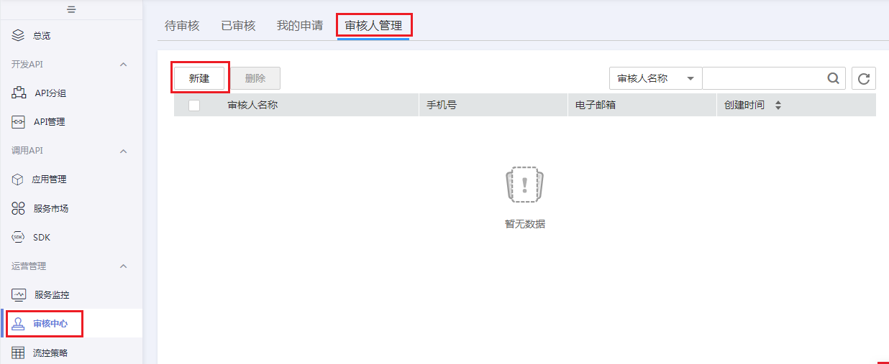

# 添加审核人

如果数据服务模块当前还未添加审核人，请先添加审核人，因为创建API需要提交审核人审核。

1.  [登录DAYU控制台](https://console.huaweicloud.com/dayu/)，找到所需要的DAYU实例，单击实例卡片上的“进入控制台”，进入概览页面。

    选择“空间管理”页签，完成工作空间的创建。

    在工作空间列表中，找到所需要的工作空间。

1.  单击相应工作空间的“数据服务“。

    系统跳转至“数据服务“页面。

1.  单击“总览”进入数据服务页面。
2.  单击左侧导航栏中的“审核中心“，进入相应页面后，选择“审核人管理“页签，然后单击“新建“按钮。

    **图 1**  审核人管理1  
    

3.  选择审核人（IAM中的账号或IAM用户），输入正确的手机号码和电子邮箱，单击“确认“完成审核人的添加。

    **图 2**  新建审核人  
    

4.  根据需要，可以添加多个审核人。

