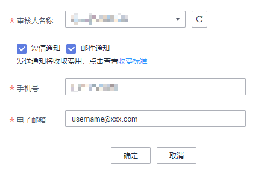

# 添加审核人

在规范设计中，业务流程中的步骤都需要经过审批，因此，需要先添加审核人。只有工作空间管理员角色的用户才具有添加审核人的权限。

## 添加审核人

审核人必须是当前工作空间下具有审核权限的成员，需要先在“DGC首页-空间管理“的工作空间内编辑并添加空间成员。

1.  在DGC控制台首页，选择对应工作空间的“规范设计“模块，进入规范设计页面。

    **图 1**  选择规范设计  
    

2.  在规范设计控制台，单击左侧导航树中的“配置中心“，进入相应页面后，选择“审核人管理“页签。
3.  在“审核人管理“页面，单击“添加“按钮。
4.  在弹出的添加对话框中，选择审核人，输入正确的手机号码和电子邮箱，单击“确定“完成审核人添加。

    审核人必须是当前工作空间下具有审核权限的成员，只有管理员和开发者才具有审核权限。

    > **说明：** 
    >-   审核人不支持手工添加，需要先在“DGC首页-空间管理”的工作空间内编辑并添加空间成员，以便添加审核人时进行选择。
    >-   勾选短信通知或邮件通知，并添加审核人后，DGC将自动在消息通知服务（SMN）中创建对应的主题。
    >    -   主题的显示名格式为：DGC\_主题\_审核人\__**项目**__**名称**_\_**_项目_**_**ID**_-dlg\_ds\__**审核人名称**_。

    **图 2**  添加审核人  
    

5.  根据需要，可以添加多个审核人。

## 管理审核人

进入规范设计的“配置中心 \> 审核人管理“页面，可以对审核人进行管理。

**图 3**  审核人管理  

-   **查找审核人**

    在审核人列表的右上方，输入所要查找的审核人名称，然后单击按钮，即可查找指定的审核人。

-   **删除审核人**

    在审核人列表中，查找所要删除的审核人，然后选中该审核人，再单击“删除“按钮，即可删除指定的审核人。

