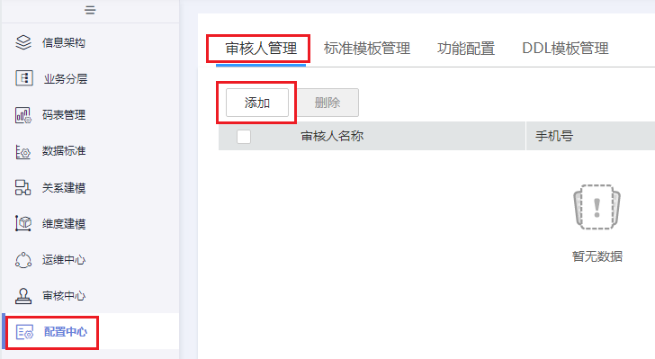
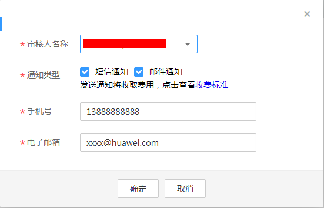
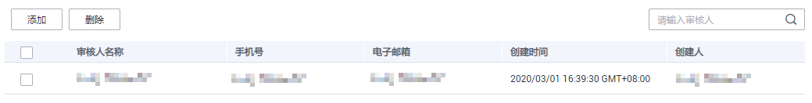

# 添加审核人

在规范设计中，关系建模业务流程中的步骤都需要经过审批，因此，需要先添加审核人。如果您不需要审批流程，也可以参考[配置关系建模业务流程](配置中心.md#zh-cn_topic_0189687297_section121571201465)关闭审核流程，建议开启。

## 添加审核人

1.  [登录DAYU控制台](https://console.huaweicloud.com/dayu/)，找到所需要的DAYU实例，单击实例卡片上的“进入控制台”，进入概览页面。

    选择“空间管理”页签，完成工作空间的创建。

    在工作空间列表中，找到所需要的工作空间。

1.  单击相应工作空间的“规范设计“。
2.  在规范设计页面，单击左侧导航树中的“配置中心“，进入相应页面后，选择“审核人管理“页签，然后单击“添加“按钮。

    **图 1**  添加审核人0  
    

3.  选择审核人，输入正确的手机号码和电子邮箱，单击“确定“完成审核人添加。

    审核人必须是当前工作空间下具有审核权限的成员，只有管理员和开发者才具有审核权限。

    **图 2**  添加审核人1  
    

4.  根据需要，可以添加多个审核人。

## 管理审核人

进入规范设计的“配置中心 \> 审核人管理“页面，可以对审核人进行管理。

**图 3**  审核人管理  

-   **查找审核人**

    在审核人列表的右上方，输入所要查找的审核人名称，然后单击按钮，即可查找指定的审核人。

-   **删除审核人**

    在审核人列表中，查找所要删除的审核人，然后选中该审核人，再单击“删除“按钮，即可删除指定的审核人。

