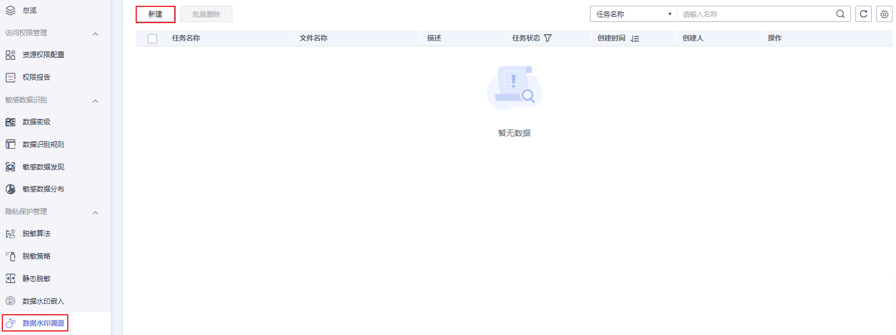
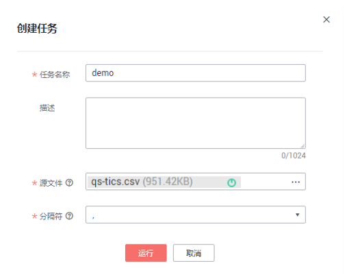
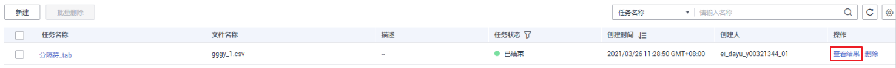
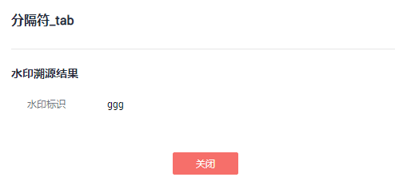
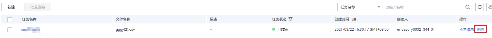

# 溯源数据水印

本章主要介绍如何进行水印溯源。

## 简介

数据溯源主要用来对泄露数据进行快速溯源。通过对泄露数据文件的完整度和水印信息痕迹来检测水印是否存在，快速识别水印标记信息，从而对安全事件精准定位追责。

## 前提条件

-   用户获得泄露的数据文件后，生成字符分隔值（Comma-Separated Values，CSV）格式文件，文件大小不超过20M，并保存到本地。
-   已完成数据水印嵌入任务，请参考[嵌入数据水印](嵌入数据水印.md)。

## 创建数据水印溯源任务

1.  在DGC控制台首页，选择对应工作空间的“数据安全“模块，进入数据安全页面。

    **图 1**  选择数据安全  
    

2.  单击左侧导航树中的“数据水印溯源“，进入数据水印溯源页面，在页面上方单击“新建“。

    **图 2**  创建数据水印溯源任务入口  
    

3.  在弹出的创建任务页面输入信息，参数配置请参考[表1](#table39921691916)。

    **图 3**  创建数据水印溯源任务  
    

    **表 1**  水印溯源任务参数描述

    
    <table><thead align="left"><tr id="row199910681914"><th class="cellrowborder" valign="top" width="15.340000000000002%" id="mcps1.2.3.1.1">
参数名

    </th>
    <th class="cellrowborder" valign="top" width="84.66%" id="mcps1.2.3.1.2">
参数描述

    </th>
    </tr>
    </thead>
    <tbody><tr id="row1299116191911"><td class="cellrowborder" valign="top" width="15.340000000000002%" headers="mcps1.2.3.1.1 ">
任务名称

    </td>
    <td class="cellrowborder" valign="top" width="84.66%" headers="mcps1.2.3.1.2 ">
嵌入水印任务的名称，只能包含英文字母、数字、中文字符、下划线或中划线，且长度为1~64个字符。

    </td>
    </tr>
    <tr id="row1399112611195"><td class="cellrowborder" valign="top" width="15.340000000000002%" headers="mcps1.2.3.1.1 ">
描述

    </td>
    <td class="cellrowborder" valign="top" width="84.66%" headers="mcps1.2.3.1.2 ">
为更好的识别嵌入水印任务，此处加以描述信息。长度不能超过1024个字符。

    </td>
    </tr>
    <tr id="row999213611919"><td class="cellrowborder" valign="top" width="15.340000000000002%" headers="mcps1.2.3.1.1 ">
源文件

    </td>
    <td class="cellrowborder" valign="top" width="84.66%" headers="mcps1.2.3.1.2 ">
源文件仅支持上传CSV文件且文件大小不超过20M。

    </td>
    </tr>
    <tr id="row1299286191917"><td class="cellrowborder" valign="top" width="15.340000000000002%" headers="mcps1.2.3.1.1 ">
字段分隔符

    </td>
    <td class="cellrowborder" valign="top" width="84.66%" headers="mcps1.2.3.1.2 ">
根据上传的CSV文件，下拉选择分隔符，支持四种“,”、“Tab”、“|”、“;”。默认选择“,”。

    </td>
    </tr>
    </tbody>
    </table>

4.  单击“运行“，完成创建数据水印溯源任务。

## 查看溯源结果

1.  在DGC控制台首页，选择对应工作空间的“数据安全“模块，进入数据安全页面。

    **图 4**  选择数据安全  
    

2.  单击左侧导航树中的“数据水印溯源“，进入数据水印溯源页面。
3.  在任务列表中单击“查看结果“，查看溯源信息。

    **图 5**  查看溯源结果  
    

    只有溯源成功的任务会显示溯源信息。

    **图 6**  溯源信息  
    

## 删除数据水印溯源任务

1.  在DGC控制台首页，选择对应工作空间的“数据安全“模块，进入数据安全页面。

    **图 7**  选择数据安全  
    

2.  单击左侧导航树中的“数据水印溯源“，进入数据水印溯源页面。
3.  在页面右侧操作栏中单击“删除“，删除数据水印溯源任务。

    正在执行的任务不能被删除。

    **图 8**  删除数据水印溯源任务  
    

