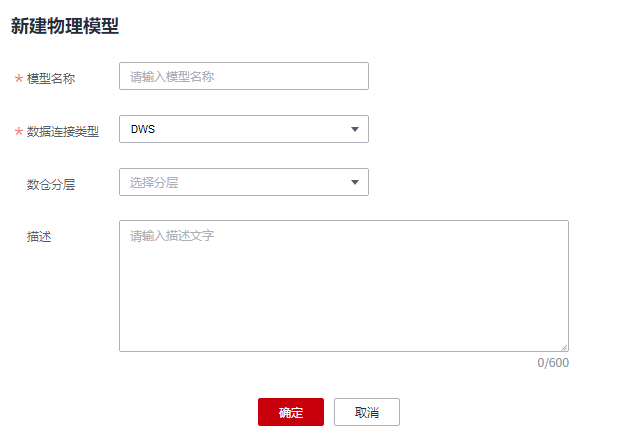
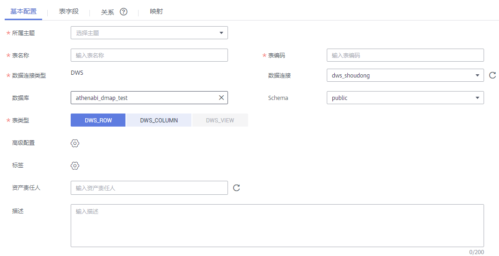
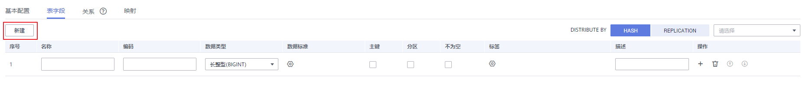
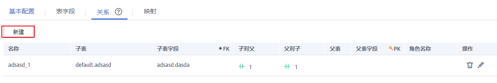
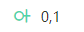
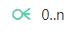
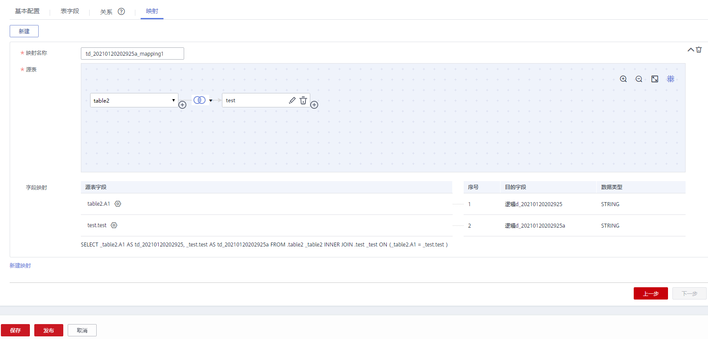
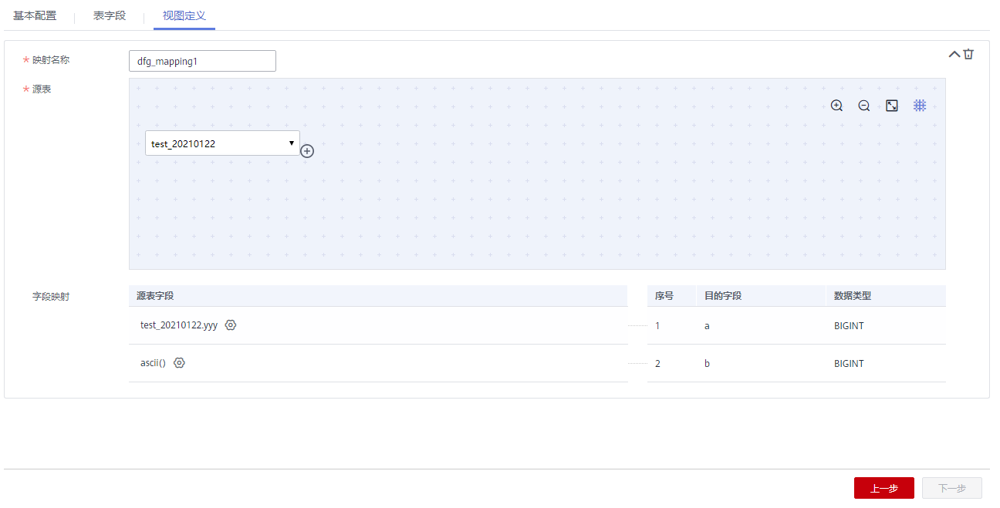
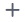
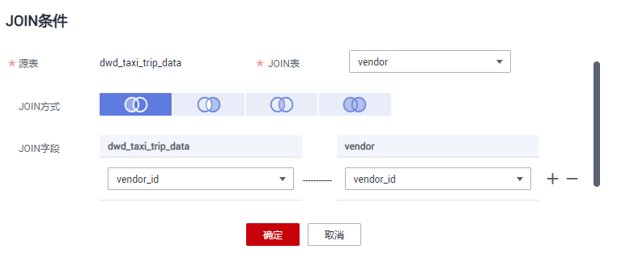

# 物理模型设计

物理模型是指按照一定规则和方法，将逻辑模型中所定义的实体、属性、属性约束、关系等要素转换为数据库软件所能够识别的表关系图\(Table Relationship Diagram\)的一种物理描述。

在关系建模中，您可以新建SDI层和DWI层两个模型，模型最终是通过物理建模进行落地的。除了将逻辑模型转换外为物理模型外，您也可以参考本章节直接新建一个物理模型。

本章节主要介绍以下内容：

-   [物理模型设计时的考虑事项](#section8737323174915)
-   [新建物理模型](#zh-cn_topic_0189641497_section310320118255)
-   [新建表并发布](#zh-cn_topic_0189641497_section5731194174714)

## 物理模型设计时的考虑事项

-   物理模型要确保业务需求及业务规则所要求的功能得到满足，性能得到保障。
-   物理模型要确保数据的一致性及数据的质量。
-   新业务或新功能增加时能够以较少的改动或不改动就能够满足需求的扩展。

## 新建物理模型

1.  在DGC控制台首页，选择对应工作空间的“规范设计“模块，进入规范设计页面。

    **图 1**  选择规范设计  
    

2.  在规范设计控制台，单击左侧导航树中的“关系建模“。
3.  在“关系建模“页面，如果当前未创建过关系模型，系统会弹出“新建分层治理模型“提示框。如果不是首次创建，单击按钮新建模型。

    **图 2**  新建分层治理模型  
    

    **图 3**  关系建模页面  
    

4.  在弹出窗口中配置如下参数，然后单击“确定“。

    **图 4**  新建模型  
    

    **表 1**  参数描述

    
    <table><thead align="left"><tr id="zh-cn_topic_0189641497_row1667010516314"><th class="cellrowborder" valign="top" width="19.96%" id="mcps1.2.3.1.1">
参数名称

    </th>
    <th class="cellrowborder" valign="top" width="80.04%" id="mcps1.2.3.1.2">
说明

    </th>
    </tr>
    </thead>
    <tbody><tr id="zh-cn_topic_0189641497_row76702511632"><td class="cellrowborder" valign="top" width="19.96%" headers="mcps1.2.3.1.1 ">
模型名称

    </td>
    <td class="cellrowborder" valign="top" width="80.04%" headers="mcps1.2.3.1.2 ">
只能包含中文、英文字母、数字和下划线。

    </td>
    </tr>
    <tr id="row58031201618"><td class="cellrowborder" valign="top" width="19.96%" headers="mcps1.2.3.1.1 ">
数据连接类型

    </td>
    <td class="cellrowborder" valign="top" width="80.04%" headers="mcps1.2.3.1.2 ">
下拉选择数据连接类型。

    </td>
    </tr>
    <tr id="zh-cn_topic_0189641497_row773411477438"><td class="cellrowborder" valign="top" width="19.96%" headers="mcps1.2.3.1.1 ">
数仓分层

    </td>
    <td class="cellrowborder" valign="top" width="80.04%" headers="mcps1.2.3.1.2 ">
下拉选择SDI或DWI分层。

    <ul id="ul13218162431711"><li><strong id="dgc_01_0541_b98989152403">SDI</strong>：Source Data Integration，又称贴源数据层。SDI是源系统数据的简单落地。</li><li><strong id="dgc_01_0541_b37772119114">DWI</strong>：Data Warehouse Integration，又称数据整合层。DWI整合多个源系统数据，对源系统进来的数据进行整合、清洗，并基于三范式进行关系建模。</li></ul>
    </td>
    </tr>
    <tr id="zh-cn_topic_0189641497_row7670195110319"><td class="cellrowborder" valign="top" width="19.96%" headers="mcps1.2.3.1.1 ">
描述

    </td>
    <td class="cellrowborder" valign="top" width="80.04%" headers="mcps1.2.3.1.2 ">
描述信息。支持的长度0~600字符。

    </td>
    </tr>
    </tbody>
    </table>

## 新建表并发布

当您完成DLI/POSTGRESQL/DWS/MRS\_HIVE类型的关系模型的创建之后，您就可以在关系模型中新建业务表。

1.  在DGC规范设计控制台，单击左侧导航栏的“关系建模“进入关系建模页面。
2.  选择所需要建表的物理模型，单击进入，然后单击上方“新建“按钮新建一个表。

    **图 5**  入口  
    

3.  在“新建表“页面，根据页面提示完成建表的配置。
    1.  填写基本配置参数。

        **图 6**  表基本配置  
        

        **表 2**  基本配置

        
        <table><thead align="left"><tr id="zh-cn_topic_0189641497_row197762036123115"><th class="cellrowborder" valign="top" width="15.85%" id="mcps1.2.3.1.1">
参数名称

        </th>
        <th class="cellrowborder" valign="top" width="84.15%" id="mcps1.2.3.1.2">
说明

        </th>
        </tr>
        </thead>
        <tbody><tr id="zh-cn_topic_0189641497_row145391351185512"><td class="cellrowborder" valign="top" width="15.85%" headers="mcps1.2.3.1.1 ">
所属主题

        </td>
        <td class="cellrowborder" valign="top" width="84.15%" headers="mcps1.2.3.1.2 ">
单击“选择主题”选择所属的主题信息。

        </td>
        </tr>
        <tr id="row204336210584"><td class="cellrowborder" valign="top" width="15.85%" headers="mcps1.2.3.1.1 ">
表名称

        </td>
        <td class="cellrowborder" valign="top" width="84.15%" headers="mcps1.2.3.1.2 ">
表的名称。只能包含中文、英文字母、数字、左右括号、中划线和下划线，且以中文或英文字母开头。

        </td>
        </tr>
        <tr id="zh-cn_topic_0189641497_row1930014104575"><td class="cellrowborder" valign="top" width="15.85%" headers="mcps1.2.3.1.1 ">
表编码

        </td>
        <td class="cellrowborder" valign="top" width="84.15%" headers="mcps1.2.3.1.2 ">
表的英文名称。只能包含英文字母、数字、下划线、$、{、}，且不能以数字开头。

        </td>
        </tr>
        <tr id="zh-cn_topic_0189641497_row677633619314"><td class="cellrowborder" valign="top" width="15.85%" headers="mcps1.2.3.1.1 ">
数据连接类型

        </td>
        <td class="cellrowborder" valign="top" width="84.15%" headers="mcps1.2.3.1.2 ">
-

        </td>
        </tr>
        <tr id="zh-cn_topic_0189641497_row16670834143220"><td class="cellrowborder" valign="top" width="15.85%" headers="mcps1.2.3.1.1 ">
数据连接

        </td>
        <td class="cellrowborder" valign="top" width="84.15%" headers="mcps1.2.3.1.2 ">
选择所需要的数据连接。同一个关系模型一般建议使用统一的数据连接。

        
如果您还未创建与数据源之间的数据连接，请前往DGC管理中心进行创建，详情请参见<a href="创建数据连接.md">创建数据连接</a>。

        </td>
        </tr>
        <tr id="zh-cn_topic_0189641497_row1136828135512"><td class="cellrowborder" valign="top" width="15.85%" headers="mcps1.2.3.1.1 ">
数据库

        </td>
        <td class="cellrowborder" valign="top" width="84.15%" headers="mcps1.2.3.1.2 ">
选择数据库。

        </td>
        </tr>
        <tr id="zh-cn_topic_0189641497_row3973174235516"><td class="cellrowborder" valign="top" width="15.85%" headers="mcps1.2.3.1.1 ">
队列

        </td>
        <td class="cellrowborder" valign="top" width="84.15%" headers="mcps1.2.3.1.2 ">
DLI队列。该参数仅DLI模型的表有效。

        </td>
        </tr>
        <tr id="row137344483451"><td class="cellrowborder" valign="top" width="15.85%" headers="mcps1.2.3.1.1 ">
Schema

        </td>
        <td class="cellrowborder" valign="top" width="84.15%" headers="mcps1.2.3.1.2 ">
DWS的模式。该参数仅DWS模型的表有效。

        </td>
        </tr>
        <tr id="zh-cn_topic_0189641497_row32031939155512"><td class="cellrowborder" valign="top" width="15.85%" headers="mcps1.2.3.1.1 ">
表类型

        </td>
        <td class="cellrowborder" valign="top" width="84.15%" headers="mcps1.2.3.1.2 ">
DLI模型的表支持以下表类型：<ul id="ul115672284015"><li>Managed：数据存储位置为DLI的表。</li><li>External：数据存储位置为OBS的表。当“表类型”设置为External时，需设置“OBS路径””参数。OBS路径格式如：/bucket_name/filepath。</li></ul>
        

        
DWS模型的表支持以下表类型：

        <ul id="ul44087216447"><li>DWS_ROW：行存表。行存储是指将表按行存储到硬盘分区上。</li><li>DWS_COLUMN：列存表。列存储是指将表按列存储到硬盘分区上。</li><li>DWS_VIEW：视图存表。视图存储是指将表按视图存储到硬盘分区上。</li></ul>
        
MRS_HIVE模型仅支持HIVE_TABLE。

        </td>
        </tr>
        <tr id="zh-cn_topic_0189641497_row5122214175918"><td class="cellrowborder" valign="top" width="15.85%" headers="mcps1.2.3.1.1 ">
数据格式

        </td>
        <td class="cellrowborder" valign="top" width="84.15%" headers="mcps1.2.3.1.2 ">
该参数仅DLI模型的表有效。DLI模型的表支持以下数据格式：

        <ul id="ul1767045894410"><li>Parquet：DLI支持读取不压缩、snappy压缩、gzip压缩的parquet数据。</li><li>CSV：DLI支持读取不压缩、gzip压缩的csv数据。</li><li>ORC：DLI支持读取不压缩、snappy压缩的orc数据。</li><li>JSON：DLI支持读取不压缩、gzip压缩的json数据。</li><li>Carbon：DLI支持读取不压缩的carbon数据。</li><li>Avro：DLI支持读取不压缩的avro数据。</li></ul>
        </td>
        </tr>
        <tr id="zh-cn_topic_0189641497_row57638353551"><td class="cellrowborder" valign="top" width="15.85%" headers="mcps1.2.3.1.1 ">
高级配置

        </td>
        <td class="cellrowborder" valign="top" width="84.15%" headers="mcps1.2.3.1.2 ">
可设置自定义项。

        </td>
        </tr>
        <tr id="zh-cn_topic_0189641497_row1933134645915"><td class="cellrowborder" valign="top" width="15.85%" headers="mcps1.2.3.1.1 ">
标签

        </td>
        <td class="cellrowborder" valign="top" width="84.15%" headers="mcps1.2.3.1.2 ">
标签是用户自定义的标识，它可以帮助用户对数据资产进行分类和搜索。添加标签后，您就可以在DGC数据资产模块中通过标签搜索相关的数据资产。

        
单击按钮可以为表添加标签，在弹出框中可以选择一个或多个已有的标签，或者输入一个新的标签名称后按回车键。您也可以前往DGC数据资产模块的“标签管理”页面添加新的标签，详情请参见<a href="标签管理.md">标签管理</a>，然后再返回此页面，就可以在标签的下拉列表中选择新添加的标签。

        </td>
        </tr>
        <tr id="zh-cn_topic_0189641497_row13813437599"><td class="cellrowborder" valign="top" width="15.85%" headers="mcps1.2.3.1.1 ">
资产责任人

        </td>
        <td class="cellrowborder" valign="top" width="84.15%" headers="mcps1.2.3.1.2 ">
在下拉列表中选择用户。只有工作空间管理员或开发者、运维者角色的用户才可以设置为责任人。

        </td>
        </tr>
        <tr id="zh-cn_topic_0189641497_row1578653953215"><td class="cellrowborder" valign="top" width="15.85%" headers="mcps1.2.3.1.1 ">
描述

        </td>
        <td class="cellrowborder" valign="top" width="84.15%" headers="mcps1.2.3.1.2 ">
描述信息。支持的长度0~200字符。

        </td>
        </tr>
        </tbody>
        </table>

    2.  在“表字段“页面添加所需要的字段。

        **图 7**  添加所需表字段  
        

        **表 3**  表字段参数

        
        <table><thead align="left"><tr id="zh-cn_topic_0171848092_row1732122114214"><th class="cellrowborder" valign="top" width="15.76%" id="mcps1.2.3.1.1">
参数名称

        </th>
        <th class="cellrowborder" valign="top" width="84.24000000000001%" id="mcps1.2.3.1.2">
说明

        </th>
        </tr>
        </thead>
        <tbody><tr id="zh-cn_topic_0171848092_row1332222132111"><td class="cellrowborder" valign="top" width="15.76%" headers="mcps1.2.3.1.1 ">
名称

        </td>
        <td class="cellrowborder" valign="top" width="84.24000000000001%" headers="mcps1.2.3.1.2 ">
只能包含中文、英文字母、数字、左右括号、中划线和下划线，且以中文或英文字母开头。

        </td>
        </tr>
        <tr id="zh-cn_topic_0171848092_row1132216217214"><td class="cellrowborder" valign="top" width="15.76%" headers="mcps1.2.3.1.1 ">
编码

        </td>
        <td class="cellrowborder" valign="top" width="84.24000000000001%" headers="mcps1.2.3.1.2 ">
只能包含英文字母、数字、下划线，且以英文字母开头。

        </td>
        </tr>
        <tr id="zh-cn_topic_0171848092_row7322142172113"><td class="cellrowborder" valign="top" width="15.76%" headers="mcps1.2.3.1.1 ">
数据类型

        </td>
        <td class="cellrowborder" valign="top" width="84.24000000000001%" headers="mcps1.2.3.1.2 ">
设置字段的数据类型。如果在下拉列表中未找到所需要的数据类型，您可以参考<a href="配置中心.md#section06381835171">字段类型管理</a>添加数据类型。

        </td>
        </tr>
        <tr id="row8101540162211"><td class="cellrowborder" valign="top" width="15.76%" headers="mcps1.2.3.1.1 ">
数据标准

        </td>
        <td class="cellrowborder" valign="top" width="84.24000000000001%" headers="mcps1.2.3.1.2 ">
如果您已创建数据标准，单击按钮可以选择一个数据标准与字段相关联。在“配置中心 &gt; 功能配置”页面中的“模型设计业务流程步骤 &gt; 创建质量作业”勾选的情况下，将字段关联数据标准后，表发布上线后，就会自动生成一个质量作业，每个关联了数据标准的字段会生成一个质量规则，基于数据标准对字段进行质量监控，您可以前往DGC数据质量模块的“质量作业”页面进行查看。

        
如果您还未创建数据标准，请参见<a href="新建数据标准.md">新建数据标准</a>进行创建。

        </td>
        </tr>
        <tr id="zh-cn_topic_0171848092_row4322202117216"><td class="cellrowborder" valign="top" width="15.76%" headers="mcps1.2.3.1.1 ">
主键

        </td>
        <td class="cellrowborder" valign="top" width="84.24000000000001%" headers="mcps1.2.3.1.2 ">
选中时为主键。

        </td>
        </tr>
        <tr id="zh-cn_topic_0171848092_row133221321182116"><td class="cellrowborder" valign="top" width="15.76%" headers="mcps1.2.3.1.1 ">
分区

        </td>
        <td class="cellrowborder" valign="top" width="84.24000000000001%" headers="mcps1.2.3.1.2 ">
选中时为分区字段。

        </td>
        </tr>
        <tr id="row115321184595"><td class="cellrowborder" valign="top" width="15.76%" headers="mcps1.2.3.1.1 ">
不为空

        </td>
        <td class="cellrowborder" valign="top" width="84.24000000000001%" headers="mcps1.2.3.1.2 ">
是否限制该字段不为空。

        </td>
        </tr>
        <tr id="row41151946154516"><td class="cellrowborder" valign="top" width="15.76%" headers="mcps1.2.3.1.1 ">
标签

        </td>
        <td class="cellrowborder" valign="top" width="84.24000000000001%" headers="mcps1.2.3.1.2 ">
单击按钮可以为表字段添加标签。

        <ul id="ul67081852103216"><li>在弹出框中可以选择一个或多个已有的标签。如果尚未添加标签，您也可以前往DGC数据资产模块的“标签管理”页面添加新的标签，详情请参见<a href="标签管理.md">标签管理</a>。</li><li>在弹出框中，您也可以输入一个新的标签名称然后按回车键。标签名称只能包含中文、英文字母、数字和下划线，且不能以下划线开头。</li></ul>
        </td>
        </tr>
        <tr id="zh-cn_topic_0171848092_row8322122112116"><td class="cellrowborder" valign="top" width="15.76%" headers="mcps1.2.3.1.1 ">
描述

        </td>
        <td class="cellrowborder" valign="top" width="84.24000000000001%" headers="mcps1.2.3.1.2 ">
描述信息。

        </td>
        </tr>
        </tbody>
        </table>

    3.  （可选）在“关系”页面，单击“新建“新建关系。

        关系是指两个实体之间的逻辑关系，即描述实体与实体是以何种形态关联在一起，或者描述一个实体本身的行为会对另外一个实体产生何种影响。数据模型内实体之间的关系尤为重要，必须要对其准确定义。否则，无法在数据模型中准确描述实际的业务规则，而且很大程度上破坏数据的一致性。

        **图 8**  新建关系（可选）  
        

        **表 4**  新建关系参数说明

        
        <table><thead align="left"><tr id="row14727104641918"><th class="cellrowborder" valign="top" width="16.25%" id="mcps1.2.3.1.1">
参数名称

        </th>
        <th class="cellrowborder" valign="top" width="83.75%" id="mcps1.2.3.1.2">
说明

        </th>
        </tr>
        </thead>
        <tbody><tr id="row1372734617198"><td class="cellrowborder" valign="top" width="16.25%" headers="mcps1.2.3.1.1 ">
名称

        </td>
        <td class="cellrowborder" valign="top" width="83.75%" headers="mcps1.2.3.1.2 ">
每个关系有一个名称来描述关系的功能。

        </td>
        </tr>
        <tr id="row10728134619198"><td class="cellrowborder" valign="top" width="16.25%" headers="mcps1.2.3.1.1 ">
子表

        </td>
        <td class="cellrowborder" valign="top" width="83.75%" headers="mcps1.2.3.1.2 ">
单击该字段可在下拉列表中选择表。单击可设置当前表为子表。

        </td>
        </tr>
        <tr id="row932185162616"><td class="cellrowborder" valign="top" width="16.25%" headers="mcps1.2.3.1.1 ">
子表字段

        </td>
        <td class="cellrowborder" valign="top" width="83.75%" headers="mcps1.2.3.1.2 ">
选择子表的字段。

        </td>
        </tr>
        <tr id="row207281246171913"><td class="cellrowborder" valign="top" width="16.25%" headers="mcps1.2.3.1.1 ">
子对父

        </td>
        <td class="cellrowborder" valign="top" width="83.75%" headers="mcps1.2.3.1.2 ">
：表示每条子表数据在父表中有且只有一条数据与之对应。

        
：表示每条子表数据在父表中最多有一条数据与之对应。

        
：表示每条子表数据在父表中可能有多条数据与之对应。

        
：表示每条子表数据在父表中至少有一条数据与之对应。

        </td>
        </tr>
        <tr id="row107285462198"><td class="cellrowborder" valign="top" width="16.25%" headers="mcps1.2.3.1.1 ">
父对子

        </td>
        <td class="cellrowborder" valign="top" width="83.75%" headers="mcps1.2.3.1.2 ">
：表示每条父表数据在子表中有且只有一条数据与之对应。

        
：表示每条父表数据在子表中最多有一条数据与之对应。

        
：表示每条父表数据在子表中可能有多条数据与之对应。

        
：表示每条父表数据在子表中至少有一条数据与之对应。

        </td>
        </tr>
        <tr id="row3523141332713"><td class="cellrowborder" valign="top" width="16.25%" headers="mcps1.2.3.1.1 ">
父表

        </td>
        <td class="cellrowborder" valign="top" width="83.75%" headers="mcps1.2.3.1.2 ">
选择与所选子表有逻辑关系的表。

        </td>
        </tr>
        <tr id="row19310734102711"><td class="cellrowborder" valign="top" width="16.25%" headers="mcps1.2.3.1.1 ">
父表字段

        </td>
        <td class="cellrowborder" valign="top" width="83.75%" headers="mcps1.2.3.1.2 ">
选择父表的字段。

        </td>
        </tr>
        <tr id="row87472016122713"><td class="cellrowborder" valign="top" width="16.25%" headers="mcps1.2.3.1.1 ">
角色名称

        </td>
        <td class="cellrowborder" valign="top" width="83.75%" headers="mcps1.2.3.1.2 ">
可以自定义一个角色名称，用于标识该关系。

        </td>
        </tr>
        <tr id="row572814611914"><td class="cellrowborder" valign="top" width="16.25%" headers="mcps1.2.3.1.1 ">
操作

        </td>
        <td class="cellrowborder" valign="top" width="83.75%" headers="mcps1.2.3.1.2 ">
单击可删除一条关系。单击可编辑关系。

        </td>
        </tr>
        </tbody>
        </table>

    4.  （可选）在“映射“页面，单击“新建“可以新建一个映射，通过新建映射设计当前表的数据来源。

        -   如果表中的字段数据来源于不同的关系模型，您需要创建多个映射。

            当前支持表数据来源于不同连接类型的关系模型。在每个映射中，您只需要为来源于当前映射的字段设置源字段，其他字段可以不设置。

            例如，假设当前表的前面5个字段和后5个字段数据来源于2个不同的模型，您可以新建如下两个映射：

            -   **map1**：设置“来源“为关系模型A的表table01，在“字段映射“中依次设置第1\~5个字段的源字段为table01中含义相同的相应字段，后5个字段不用设置。
            -   **map2**：设置“来源“为关系模型B的表table02，在“字段映射“中依次设置第6\~10个字段的源字段为table02中含义相同的相应字段，前5个字段不用设置。

        -   如果表中的字段数据来源于同一个关系模型中的多个表，您可以新建一个映射。

            在该映射的“源表“中，您可以将多个表设置Join，然后在“字段映射“区域依次为表中的字段设置源字段，所选择的源字段应与表中的字段代表相同含义，一一对应。

            例如，假设当前表的字段都来源于关系模型d1，第1个字段来源于表vendor，第2个字段来源于表payment\_type，第3个字段来源于表rate，其余字段来源于dwd\_taxi\_trip\_data。

            您可以新建一个映射，如[图9](#fig105495519419)所示，设置表dwd\_taxi\_trip\_data和vendor、payment\_type、rate做Join，然后在字段映射中，依次设置源字段。

        新建映射的参数说明，可以参考[表5](#table14103734154018)。

        **图 9**  配置映射关系  
        

        **表 5**  映射参数

        
        <table><thead align="left"><tr id="row9103103404018"><th class="cellrowborder" valign="top" width="15.76%" id="mcps1.2.3.1.1">
参数名称

        </th>
        <th class="cellrowborder" valign="top" width="84.24000000000001%" id="mcps1.2.3.1.2">
说明

        </th>
        </tr>
        </thead>
        <tbody><tr id="row210314341408"><td class="cellrowborder" valign="top" width="15.76%" headers="mcps1.2.3.1.1 ">
映射名称

        </td>
        <td class="cellrowborder" valign="top" width="84.24000000000001%" headers="mcps1.2.3.1.2 ">
只能包含中文、英文字母、数字和下划线。

        </td>
        </tr>
        <tr id="row31031134124016"><td class="cellrowborder" valign="top" width="15.76%" headers="mcps1.2.3.1.1 ">
来源模型

        </td>
        <td class="cellrowborder" valign="top" width="84.24000000000001%" headers="mcps1.2.3.1.2 ">
在下拉列表中选择一个已创建的关系模型。如果未创建关系模型，请参见<a href="物理模型设计.md">物理模型设计</a>进行创建。

        </td>
        </tr>
        <tr id="row710313411408"><td class="cellrowborder" valign="top" width="15.76%" headers="mcps1.2.3.1.1 ">
源表

        </td>
        <td class="cellrowborder" valign="top" width="84.24000000000001%" headers="mcps1.2.3.1.2 ">
选择数据来源的表，如果数据来源于一个模型中的多个表，可以单击表名后的按钮为该表和其他表之间设置JOIN。

        <ol id="ol143116274386"><li>选择一种“JOIN方式”，“JOIN方式”从左到右依次表示left JOIN、right JOIN、inner JOIN、outer JOIN。</li><li>在“JOIN字段”中设置JOIN条件，JOIN条件一般选择源表和JOIN表中含义相同的字段，单击或按钮增加或删除JOIN条件。JOIN条件之间是and的关系。</li><li>单击“确定”完成设置。</li><li>设置JOIN后，如果想删除JOIN表，单击所需删除的表名后的按钮就可以删除该JOIN表。</li></ol>
        
<b>图1 </b>JOIN条件 

        </td>
        </tr>
        <tr id="row12104133414014"><td class="cellrowborder" valign="top" width="15.76%" headers="mcps1.2.3.1.1 ">
字段映射

        </td>
        <td class="cellrowborder" valign="top" width="84.24000000000001%" headers="mcps1.2.3.1.2 ">
为来源于当前映射的字段，依次选择一个含义相同的源字段。如果表字段来源于多个模型，您需要新建多个映射，每个映射中，您只需要为来源于当前映射的字段设置源字段，其他字段可以不设置。

        </td>
        </tr>
        </tbody>
        </table>

        在映射区域的右上角，单击按钮，可以删除指定的映射，单击可以收起映射区域。

    5.  （可选）新建表的“表类型“为“DWS\_VIEW“时，在“视图定义“页面，单击“新建“可以新建一个视图。

        **图 11**  新建视图  
        

        **表 6**  视图定义参数

        
        <table><thead align="left"><tr id="row186204119237"><th class="cellrowborder" valign="top" width="15.76%" id="mcps1.2.3.1.1">
参数名称

        </th>
        <th class="cellrowborder" valign="top" width="84.24000000000001%" id="mcps1.2.3.1.2">
说明

        </th>
        </tr>
        </thead>
        <tbody><tr id="row1862154192313"><td class="cellrowborder" valign="top" width="15.76%" headers="mcps1.2.3.1.1 ">
映射名称

        </td>
        <td class="cellrowborder" valign="top" width="84.24000000000001%" headers="mcps1.2.3.1.2 ">
只能包含中文、英文字母、数字和下划线。

        </td>
        </tr>
        <tr id="row14621641102313"><td class="cellrowborder" valign="top" width="15.76%" headers="mcps1.2.3.1.1 ">
源表

        </td>
        <td class="cellrowborder" valign="top" width="84.24000000000001%" headers="mcps1.2.3.1.2 ">
选择数据来源的表，如果数据来源于一个模型中的多个表，可以单击表名后的按钮为该表和其他表之间设置JOIN。

        <ol id="ol863134112316"><li>选择一种“JOIN方式”，“JOIN方式”从左到右依次表示left JOIN、right JOIN、inner JOIN、outer JOIN。</li><li>在“JOIN字段”中设置JOIN条件，JOIN条件一般选择源表和JOIN表中含义相同的字段，单击或按钮增加或删除JOIN条件。JOIN条件之间是and的关系。</li><li>单击“确定”完成设置。</li><li>设置JOIN后，如果想删除JOIN表，单击所需删除的表名后的按钮就可以删除该JOIN表。</li></ol>
        
<b>图1 </b>JOIN条件界面 

        </td>
        </tr>
        <tr id="row565184117231"><td class="cellrowborder" valign="top" width="15.76%" headers="mcps1.2.3.1.1 ">
字段映射

        </td>
        <td class="cellrowborder" valign="top" width="84.24000000000001%" headers="mcps1.2.3.1.2 ">
为来源于当前映射的字段，依次选择一个含义相同的源字段。如果表字段来源于多个模型，您需要新建多个映射，每个映射中，您只需要为来源于当前映射的字段设置源字段，其他字段可以不设置。

        </td>
        </tr>
        </tbody>
        </table>

        在映射区域的右上角，单击按钮，可以删除指定的映射，单击可以收起映射区域。

4.  完成表的配置后，单击“发布“，选择审核人，再单击“确认提交“提交审核。
5.  等待审核人员审核。当审核人审批通过后，返回“关系建模“页面可以查看表的“状态“和“同步状态“。

    发布是一个异步操作，您可以单击按钮刷新状态。表发布并通过审核后，系统会依据“配置中心 \> 功能配置”页面中的“模型设计业务流程步骤”进行创建表、同步技术资产、同步业务资产等操作，在表的“同步状态“一列中将显示同步状态。

    -   “同步状态“若均显示成功，则说明表发布成功。鼠标移至“同步状态“中的图标之上，若显示“创建表: 创建成功“说明该表在对应的数据源下已经创建成功。
    -   “同步状态“若显示某一项或某几项失败，可以先刷新状态。如果仍失败，可以单击“更多 \> 发布历史“，然后进入“发布日志“Tab页查看日志。

        请根据错误日志定位失败原因，问题解决后，再单击“发布日志”页面中的“重新同步“再次下发同步命令。如果仍同步失败，请联系技术支持人员协助解决。

