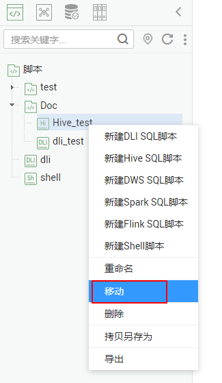
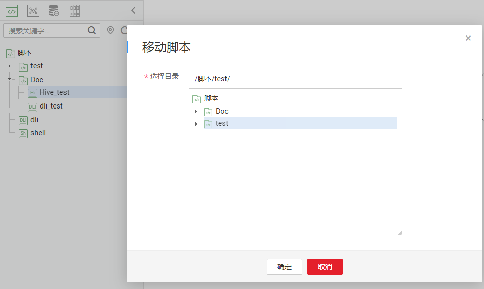

# 移动脚本

您可以通过移动功能把脚本文件从当前目录移动到另一个目录。

本章节主要介绍如何移动一份脚本文件。

## 前提条件

-   您已开发脚本，脚本目录中存在要移动的脚本文件。
-   如何开发脚本，请参见[开发SQL脚本](开发SQL脚本.md)和[开发Shell脚本](开发Shell脚本.md)。

## 操作步骤

1.  登录DGC控制台。选择对应工作空间的“数据开发“模块，进入数据开发页面。

    **图 1**  选择数据开发  
    

2.  在数据开发主界面的左侧导航栏，选择“数据开发  \>  脚本开发“。
3.  在脚本目录中选择需要移动的脚本，右键单击脚本名称，选择“移动“。

    **图 2**  移动  
    

4.  在弹出的“移动脚本“页面，配置如[表1](#zh-cn_topic_0171677202_table133101211151017)所示的参数。

    **图 3**  移动脚本  
    

    **表 1**  移动脚本参数

    
    <table><thead align="left"><tr id="zh-cn_topic_0171677202_row5310151181012"><th class="cellrowborder" valign="top" width="29.310000000000002%" id="mcps1.2.3.1.1">
参数

    </th>
    <th class="cellrowborder" valign="top" width="70.69%" id="mcps1.2.3.1.2">
说明

    </th>
    </tr>
    </thead>
    <tbody><tr id="zh-cn_topic_0171677202_row1431031141019"><td class="cellrowborder" valign="top" width="29.310000000000002%" headers="mcps1.2.3.1.1 ">
选择目录

    </td>
    <td class="cellrowborder" valign="top" width="70.69%" headers="mcps1.2.3.1.2 ">
选择脚本要移动到的目录，父级目录默认为根目录。

    </td>
    </tr>
    </tbody>
    </table>

5.  单击“确定“，移动脚本。

