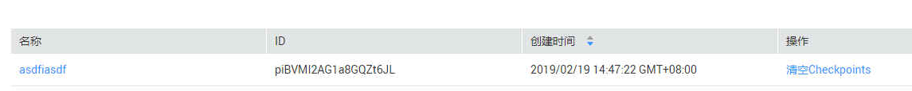

# 管理App

APP表示应用程序标识符。当多个应用程序分别消费同一通道的数据时，为区分不同应用程序的消费检查点，使用APP作为标识。

您可以创建APP，也可进入通道管理页面，查看接入该通道的APP详情。

## 创建App

1.  进入DGC实例的工作空间，单击“数据集成”，进入实时数据接入通道管理模块。
2.  在左侧列表栏中选择“App管理“。

    进入App管理页面，单击“创建App“，输入对应的名称，完成创建。

## 查看App

1.  进入DGC实例的工作空间，单击“数据集成”，进入实时数据接入通道管理模块。
2.  在左侧列表栏中选择“通道管理“。
3.  单击需要查看的通道名称，进入所选通道的管理页面。
4.  单击“Apps“，可查看到接入该通道的所有App。

    可查看接入该通道的App名称，ID和创建时间。

    您也可通过单击“清空Checkpoints“，将App的所有Checkpoints清零。

    > **说明：** 
    >Checkpoint，消费检查点。应用程序消费数据时，记录已消费数据的最新序列号作为检查点。当重新消费数据时，可根据此检查点继续消费。

    **图 1**  查看Apps  
    

