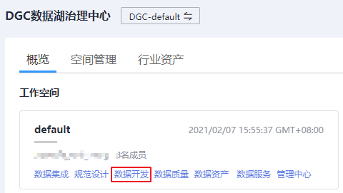

# 管理作业标签

作业标签用于给相同或用途类似的作业打上标签，便于管理作业，并根据标签查询作业。参考本节操作，您可管理作业标签，执行新增、修改和查询操作。

## 配置方法

1.  登录DGC控制台。选择对应工作空间的“数据开发“模块，进入数据开发页面。

    **图 1**  选择数据开发  
    

2.  在数据开发主界面的左侧导航栏，选择“配置管理 \> 配置“。
3.  选择“作业标签“，在“作业标签管理“页面，单击“新建“，配置作业名称，确认后完成新建。

    > **说明：** 
    >作业标签最多支持创建100个。

