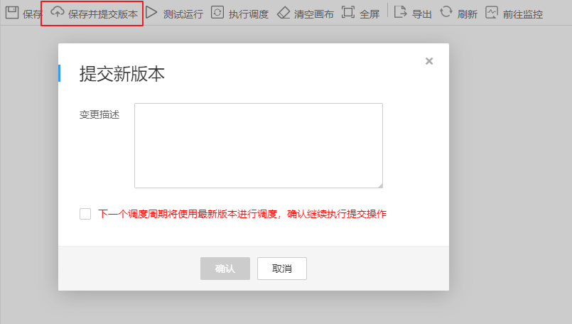
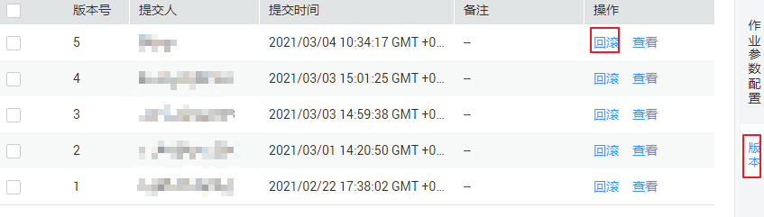
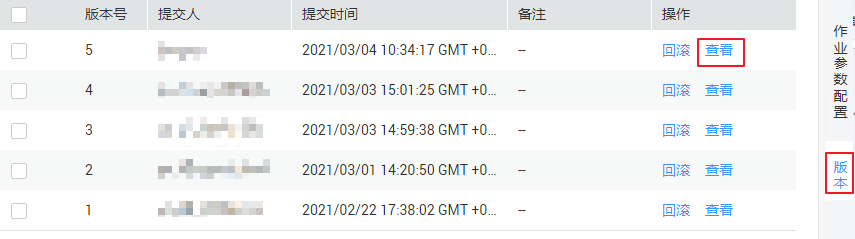
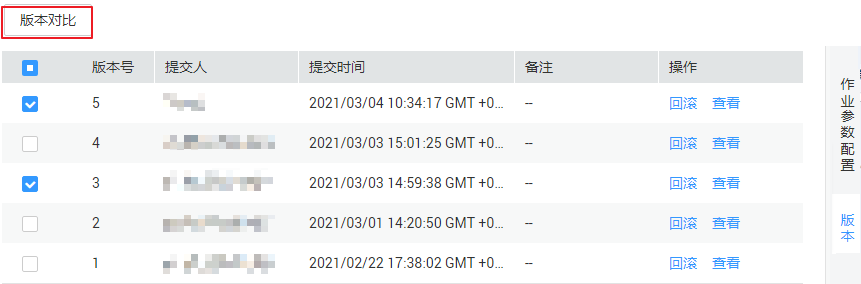

# 管理作业版本

作业提交版本功能，用于区分开发态的作业和正式调度中使用的作业。

在作业编辑页面中，只要您还没有点击“保存并提交版本”，那么开发界面的所有内容均处于开发态，可以随意保存、测试运行，不会影响调度中的作业。

开发态用于调试，提交用于正式的生产环境，两种状态隔离，互不影响。

-   作业开发态下，如需要配置作业依赖的情况，被关联的作业均会读取开发态的配置。
-   作业正式调度中，作业依赖、实例重跑、补数据等场景均是关联最新的已提交版本。

## 版本提交

作业版本提交会使用开发态的最新作业定义去提交，提交成功后，后台会自动用最新提交的版本去覆盖作业定义。

操作如下：

1.  完成[开发作业](开发作业.md)的作业开发任务。
2.  在作业画布上方单击“保存并提交版本“，描述内容长度最多为128个字符，并勾选是否在下个调度周期使用新版本，不勾选则无法点击确认。

    **图 1**  提交新版本  
    

## 版本回滚

用户可以在版本列表中看到已经提交过的版本信息（当前最多保存最近10条版本信息）。点击“回滚”，可以回退到任意一个已提交的版本。

回滚内容包括：

-   作业定义（算子属性、连线等）；
-   作业基本信息、作业调度配置、作业参数、血缘关系中的所有内容；

操作如下：

1.  登录DGC控制台。选择对应工作空间的“数据开发“模块，进入数据开发页面。

    **图 2**  选择数据开发  
    

2.  在数据开发主界面的左侧导航栏，选择“数据开发  \>  作业开发“。
3.  在作业目录中，双击作业名称，进入作业开发页面。
4.  在页面右侧单击“版本“，查看版本提交记录，找到需要回滚的版本单击“回滚“即可。

    **图 3**  版本回滚操作界面  
    

## 版本详情查看

用户可以在版本列表中看到已经提交过的版本信息。

操作如下：

1.  登录DGC控制台。选择对应工作空间的“数据开发“模块，进入数据开发页面。

    **图 4**  选择数据开发  
    

2.  在数据开发主界面的左侧导航栏，选择“数据开发  \>  作业开发“。
3.  在作业目录中，双击作业名称，进入作业开发页面。
4.  在页面右侧单击“版本“，查看版本提交记录，找到需要查看详情的版本单击“查看“即可。

    点击查看，将会打开一个新窗口，展示出该版本的作业定义。查看窗口仅用于展示某个版本的作业属性，以便于用户对比两个不同版本的作业属性差异。查看窗口不可修改任何作业属性，作用仅是对比查看两个作业版本差异。

    **图 5**  版本详情查看  
    

## 版本对比

操作如下：

1.  登录DGC控制台。选择对应工作空间的“数据开发“模块，进入数据开发页面。

    **图 6**  选择数据开发  
    

2.  在数据开发主界面的左侧导航栏，选择“数据开发  \>  作业开发“。
3.  在作业目录中，双击作业名称，进入作业开发页面。
4.  在页面右侧单击“版本“，查看版本提交记录，勾选需要对比的版本单击“版本对比“即可。

    若只勾选一个版本，则比较选中的版本和开发态的作业属性Json。若勾选两个版本，则比较两个版本的作业属性Json。

    **图 7**  对比版本操作界面  
    

