# 管理源数据Schema

源数据Schema，即用户的JSON或CSV数据样例，用于描述JSON或CSV数据格式。DIS可以根据此JSON或CSV数据样例生成Avro schema, 将通道内上传的JSON或CSV数据转换为Parquet或CarbonData格式。

创建源数据Schema有如下三个入口：

-   创建通道同时开启“Schema开关“，创建源数据Schema，参见[图1](#zh-cn_topic_0129708042_fig964297111513)。
-   创建通道时，关闭“Schema开关“。待通道创建成功后，选择“通道管理“页签，单击已创建的通道名称，进入所选通道的管理页面。选择“源数据类型“后的“创建源数据Schema“进行创建，参见[图2](#zh-cn_topic_0129708042_fig18385205720298)。
-   创建通道时，关闭“Schema开关“。待通道创建成功后，选择“通道管理“页签，单击已创建的通道名称，进入所选通道的管理页面。选择“转储任务”页签，单击“添加转储任务”按钮，在弹出的“添加转储任务”页面进行创建，参见[图3](#zh-cn_topic_0129708042_fig433835416203)。

**图 1**  创建Schema1  
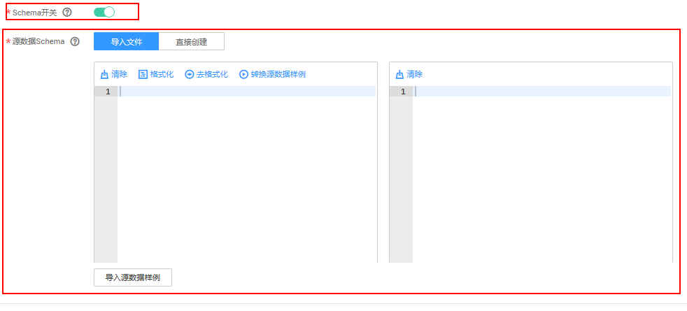

**图 2**  创建Schema2  
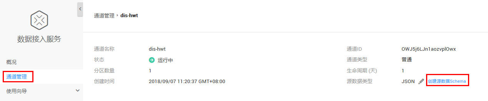

**图 3**  创建Schema3  
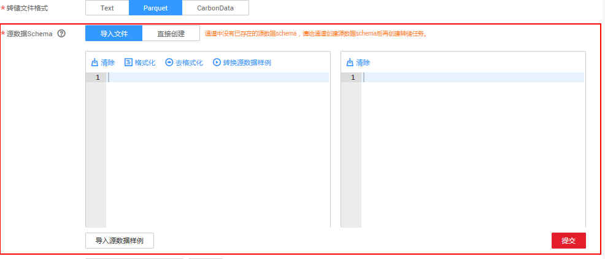

## 创建源数据Schema（导入文件方式）

找到创建源数据Schema入口后，按照如下方法创建源数据Schema：

1.  单击“源数据Schema“后的“导入文件“。
2.  在左侧文本框中输入JSON或者CSV格式的源数据样例，也可单击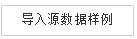导入源数据样例。例如：

    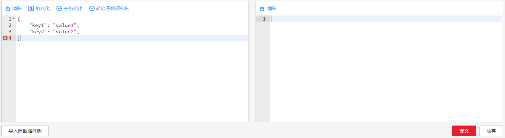

    > **说明：** 
    >导入源数据样例时，仅支持导入“.txt”,“.json”,“.csv”和“.java”的文件格式。

3.  左侧文本框中单击，可在右侧文本框中根据源数据样例生成Avro schema。例如：

    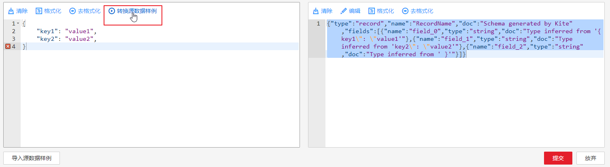

4.  文本框中单击“格式化“和“去格式化“，可格式化解析数据。例如：

    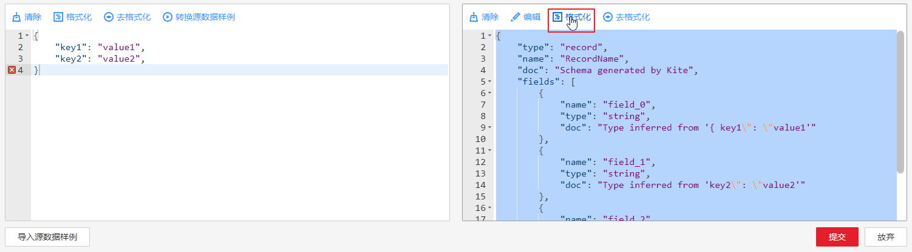

5.  右侧文本框中单击，可修改已生成的Avro schema。例如：

    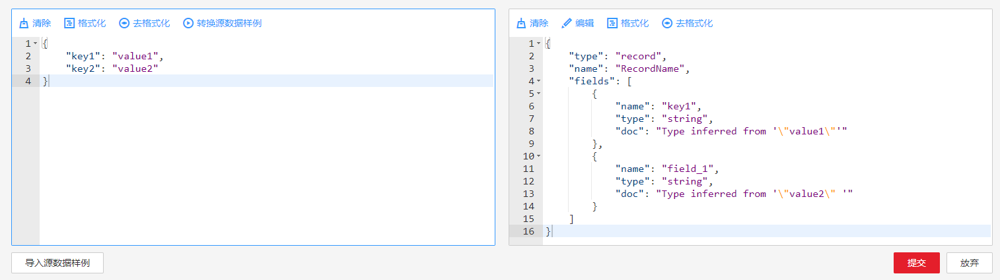

6.  文本框中单击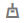，可删除源数据样例。

## 创建源数据Schema（直接创建方式）

找到创建源数据Schema入口后，按照如下方法创建源数据Schema：

1.  单击“源数据Schema“后的“直接创建“。
2.  配置“属性名“和“数据类型“后，单击“添加“，如[图4](#zh-cn_topic_0129708042_fig66823597115)所示，添加根节点。

    **图 4**  直接创建源数据Schema-1  
    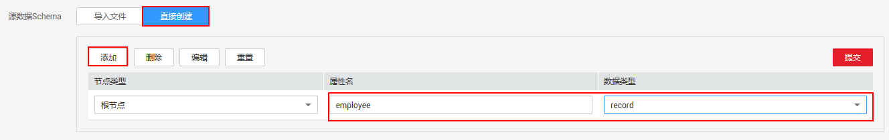

3.  根节点添加完成后，选中已创建的根节点，按照同样的方法，配置“属性名“和“数据类型“，添加子节点。

    **图 5**  直接创建源数据Schema-2  
    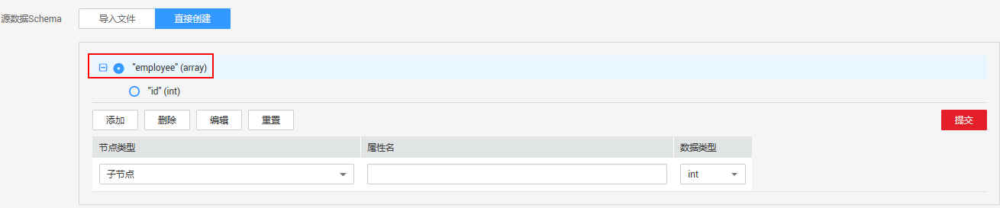

    > **说明：** 
    >-   选中根节点或者子节点前的复选框，单击“删除“  ，可将节点删除。
    >-   选中根节点或者子节点前的复选框，单击“编辑“，可对已创建的节点属性进行编辑。
    >-   单击“重置“，可删除所有节点。

4.  单击“提交“，源数据Schema创建成功。

## 修改源数据Schema

> **说明：** 
>已创建了源数据Schema的通道，若该通道下存在转储任务，则不允许修改已有的源数据Schema。

1.  单击通道名称。进入所选通道的管理页面。
2.  单击“源数据类型“后的“查看已有源数据Schema“。
3.  弹出源数据Schema文本框，单击，修改源数据Schema。

    **图 6**  修改源数据Schema  
    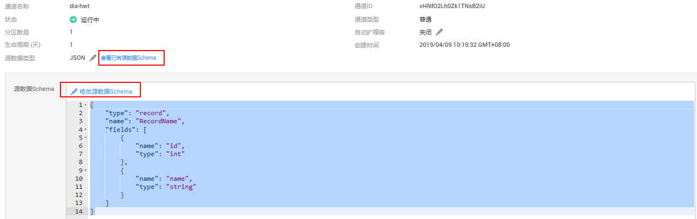

    > **说明：** 
    >当通道中存在转储任务，修改源数据Schema可能导致通道内未转储完成的数据无法被成功转储。

4.  修改完成后，单击“提交“，保存修改结果。单击“放弃“，不对源数据Schema进行修改。

