# 管理维度表

维度表与维度一一对应，通过丰富维度中的属性信息构建形成。维度表的生命周期（包括新建、发布、编辑、下线操作）通过维度进行管理，在维度发布成功后，系统会自动创建并发布对应的维度表。

## 查看维度表发布历史

1.  在规范设计控制台，选择“模型设计 \> 维度建模“，进入维度建模页面。
2.  单击“维度表“页签，进入维度表页面。
3.  在列表中，找到所需要的维度表，在右侧单击“发布历史“，将显示“发布历史“页面。

    **图 1**  维度表页面  
    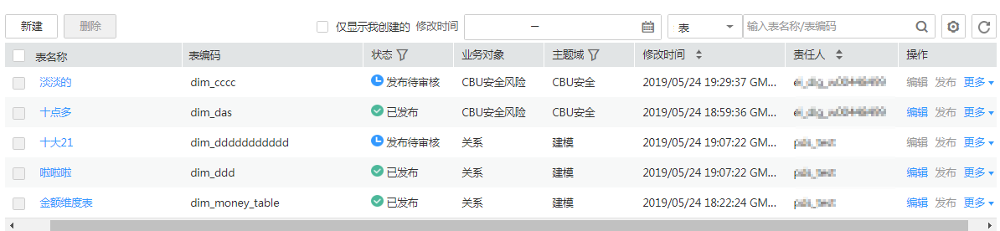

4.  在“发布历史”中，您可以查看维度表的发布历史、版本对比信息以及发布日志。

    如果“发布日志”中有错误日志，说明发布失败。您可以单击“重新同步“进行重试，将表同步到DGC的其他模块中。

## 查看预览SQL

1.  在规范设计控制台，选择“模型设计 \> 维度建模“，进入维度建模页面。
2.  单击“维度表“页签，进入维度表页面。
3.  在维度表列表中，找到所需要的维度表，在右侧单击“预览SQL“，弹出“预览SQL“对话框。

    **图 2**  预览SQL  
    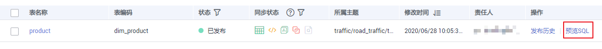

4.  在“预览SQL”中，您可以查看SQL语句，也可以复制SQL。

## 同步维度表

当您新建或编辑维度后，对维度进行发布，如果同步状态中存在失败，可以对维度表手动进行同步。

> **说明：** 
>-   同步时，系统将根据“配置中心 \> 功能配置“页面中的“数据表更新方式“执行相应的同步操作，详情请参见[功能配置](配置中心.md#zh-cn_topic_0189687297_section121571201465)。

1.  在规范设计控制台，选择“模型设计 \> 维度建模“，进入维度建模页面。
2.  单击“维度表“页签，进入维度表页面。
3.  在维度表列表中，勾选需要同步的维度表，单击列表左上方的“同步“按钮，系统弹出“批量同步“对话框。
4.  确认无误后，单击“确认提交“，完成后界面将显示同步结果。

    同步后，您可以在维度表列表中，查看维度表的同步状态。单击列表右上方的刷新按钮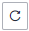，可以刷新状态。

## 维度表关联质量规则

1.  在规范设计控制台，选择“模型设计 \> 维度建模“，进入维度建模页面。
2.  单击“维度表“页签，进入维度表页面。
3.  在维度表列表中，勾选需要关联质量规则的维度表。单击“关联质量规则“。

    **图 3**  关联维度表质量规则  
    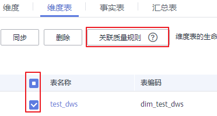

4.  在弹出的页面中配置关联质量规则参数。配置完成单击确定。

    -   **更新已有规则**：若勾选此项，新添加的规则会覆盖旧规则。
    -   **匹配字段**：此参数默认应用于所有字段，依据用户输入的正则表达式对字段进行过滤。
    -   **Where条件**：可依据用户输入的where条件对字段进行过滤。
    -   **生成异常数据**：勾选此项，表示异常数据讲按照配置的参数存储到规定的库中。
    -   **数据库或Schema**：勾选“生成异常数据“时显示此项，表示存储异常数据的数据库或Schema
    -   **表前缀**：勾选“生成异常数据“时显示此项，表示存储异常数据的表的前缀。
    -   **表后缀**：勾选“生成异常数据“时显示此项，表示存储异常数据的表的前缀。
    -   **添加规则**：单击“添加规则”进行设置。例如，添加名称为“字段唯一值”规则，选中该规则后单击“确定“，在“告警条件“中输入告警条件表达式，然后按照此方法添加其他规则后，单击“确定“。
    -   告警条件表达式，由告警参数和逻辑运算符组成。在质量作业运行时，系统将计算出告警条件表达式的结果，并根据表达式的结果是否为真来判断是否触发告警。如果表达式的结果为真则触发质量告警，结果为假则不触发质量告警。在此处的“关联质量规则“对话框中，每个质量规则的“告警参数“以按钮形式列出。

    **图 4**  维度表关联质量规则  
    

## 单个字段关联质量规则

1.  在规范设计控制台，选择“模型设计 \> 维度建模“，进入维度建模页面。
2.  单击“维度表“页签，进入维度表页面。
3.  在维度表列表中，单击需要关联质量规则的维度表名称。
4.  在维度表的详情页的表字段列表中，查找字段并单击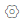，配置单个表字段关联质量规则。

    **图 5**  维度表单个字段关联质量规则  
    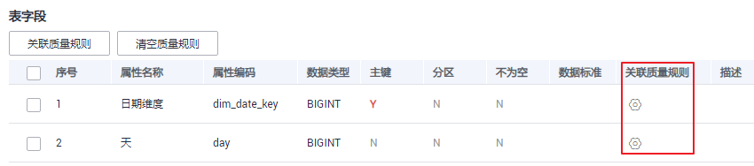

5.  配置完成后，单击“确定“，完成维度表字段关联质量规则。

    -   **更新已有规则**：若勾选此项，新添加的规则会覆盖旧规则。
    -   **添加规则**：单击“添加规则”进行设置。例如，添加名称为“字段唯一值”规则，选中该规则后单击“确定“，在“告警条件“中输入告警条件表达式，然后按照此方法添加其他规则后，单击“确定“。
    -   告警条件表达式，由告警参数和逻辑运算符组成。在质量作业运行时，系统将计算出告警条件表达式的结果，并根据表达式的结果是否为真来判断是否触发告警。如果表达式的结果为真则触发质量告警，结果为假则不触发质量告警。在此处的“关联质量规则“对话框中，每个质量规则的“告警参数“以按钮形式列出。

    **图 6**  添加规则界面  
    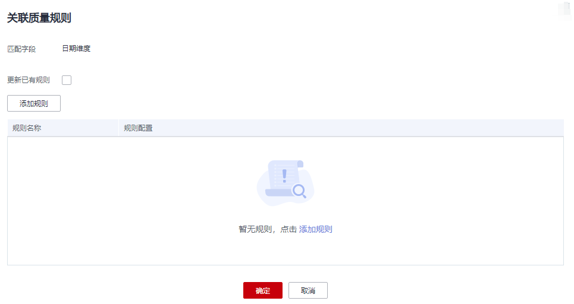

## 表字段批量关联质量规则

1.  在规范设计控制台，选择“模型设计 \> 维度建模“，进入维度建模页面。
2.  单击“维度表“页签，进入维度表页面。
3.  在维度表列表中，单击需要关联质量规则的维度表名称。
4.  在维度表的详情页的表字段列表中，勾选需要关联质量规则的表字段，单击关联质量规则。

    **图 7**  维度表批量字段关联质量规则  
    

5.  在弹出的界面中添加规则，完成规则参数配置。

    -   **更新已有规则**：若勾选此项，新添加的规则会覆盖旧规则。
    -   **添加规则**：单击“添加规则”进行设置。例如，添加名称为“字段唯一值”规则，选中该规则后单击“确定“，在“告警条件“中输入告警条件表达式，然后按照此方法添加其他规则后，单击“确定“。
    -   告警条件表达式，由告警参数和逻辑运算符组成。在质量作业运行时，系统将计算出告警条件表达式的结果，并根据表达式的结果是否为真来判断是否触发告警。如果表达式的结果为真则触发质量告警，结果为假则不触发质量告警。在此处的“关联质量规则“对话框中，每个质量规则的“告警参数“以按钮形式列出。

    **图 8**  规则设置界面  
    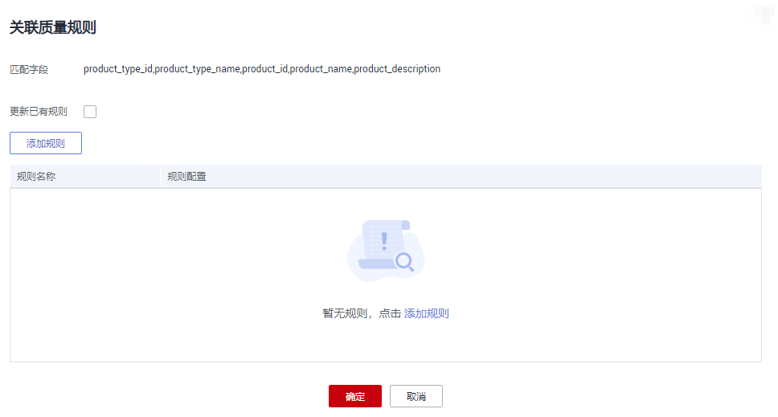

6.  （可选）如需要将质量作业中不符合设定规则的异常数据存储在异常表中，可以打开“异常数据输出配置”开关。

    **图 9**  异常数据输出开关  
    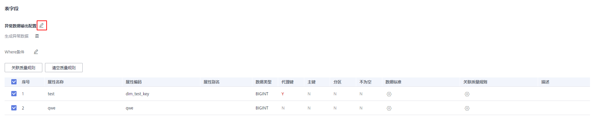

    点击开关，并打开“生成异常数据”按钮，表示异常数据将按照配置的参数存储到规定的库中。

    **图 10**  异常数据输出配置  
    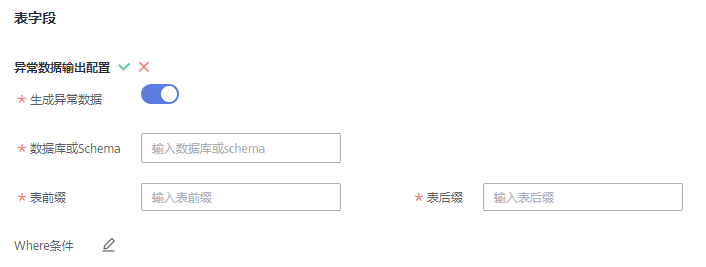

    各参数具体含义如下：

    -   数据库或Schema：表示存储异常数据的数据库或Schema。
    -   表前缀：表示存储异常数据的表的前缀。
    -   表后缀：表示存储异常数据的表的后缀。

    配置完成后点击保存配置。

7.  （可选）质量规则的检查范围默认是全表，如需要精确定位分区查询数据，请填写where条件。

    **图 11**  where条件开关  
    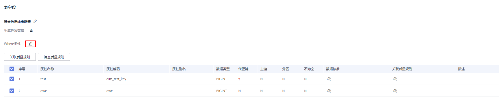

8.  配置完成后，单击“确定“，完成维度表字段批量关联质量规则。

## 删除维度表

如果待删除的维度表处于待发布、已发布或待下线状态，则无法删除。用户可以通过维度管理来删除维度表。

1.  在规范设计控制台，选择“模型设计 \> 维度建模“，进入维度建模页面。
2.  单击“维度表“页签，进入维度表页面。
3.  在维度表列表中，勾选需要删除的维度表，单击列表左上方的“删除“按钮，系统弹出“删除“对话框。

    **图 12**  删除维度表  
    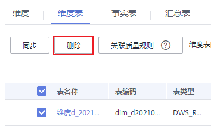

4.  如果确认要删除，单击“是“。

