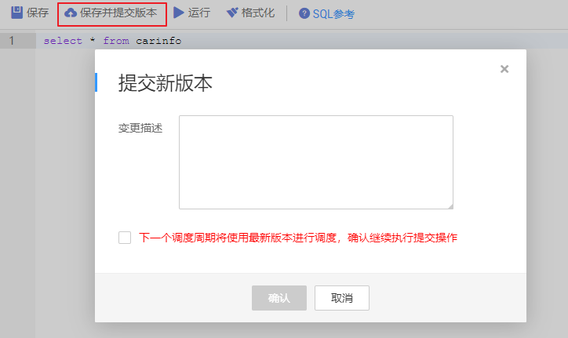
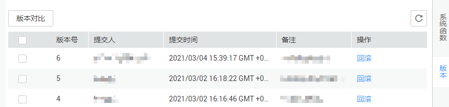
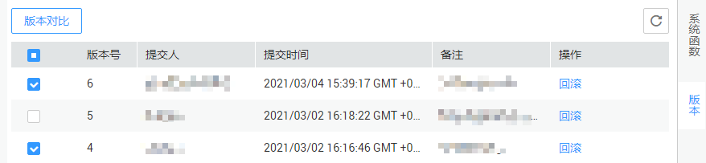

# 管理脚本版本

脚本提交版本功能，用于区分开发态的脚本和正式调度中使用的脚本。

在脚本编辑页面中，只要用户没有点击“保存并提交版本”，那么开发界面的所有内容均处于开发态，可以随意保存、运行，不会影响调度中的脚本。

开发态的脚本用于调试，脚本提交后将用于正式的生产环境，两种状态隔离，互不影响。

-   在开发态下，如果需要配置节点关联脚本，那么被关联的脚本均会读取开发态的配置。
-   在正式调度中，实例重跑、补数据等场景均是关联最新的已提交版本。

## 版本提交

1.  完成[开发SQL脚本](开发SQL脚本.md)或[开发Shell脚本](开发Shell脚本.md)的脚本开发任务。
2.  在脚本编辑器上方单击“保存并提交版本“，描述内容长度最多为128个字符，并勾选是否在下个调度周期使用新版本，不勾选则无法点击确认。

    **图 1**  提交版本  
    

## 版本回滚

提交版本后，可以在版本列表中看到已经提交过的版本信息（当前最多保存最近10条版本信息）。点击“回滚”，可以回退到任意一个已提交的版本。

回滚内容包括：

DLI：数据连接、数据库、资源队列、脚本内容；

DWS：数据连接、数据库、脚本内容；

HIVE：数据连接、数据库、资源队列、脚本内容；

SPARK：数据连接、数据库、脚本内容；

SHELL：主机连接、参数、交互式参数、脚本内容；

RDS：数据连接、数据库、脚本内容；

PRESTO：数据连接、模式、脚本内容；

PYTHON：主机连接、参数、交互式参数、脚本内容；

FLINK：脚本内容；

操作如下：

1.  登录DGC控制台。选择对应工作空间的“数据开发“模块，进入数据开发页面。

    **图 2**  选择数据开发  
    

2.  在数据开发主界面的左侧导航栏，选择“数据开发  \>  脚本开发“。
3.  在脚本目录中，双击脚本名称，进入脚本开发页面。
4.  在页面右侧单击“版本“，查看版本提交记录，找到需要回滚的版本单击“回滚“即可。

    如果当前有开发态的编辑内容没有提交，将会被覆盖。回滚之后需要重新提交才能生效，调度默认使用最新提交的版本进行调度。

    **图 3**  版本回滚  
    

## 版本对比

支持对比两个不同版本的脚本内容。如果只勾选一个版本，则对比该版本和开发态的脚本内容；如果勾选两个版本，则对比选中的两个版本的脚本内容。

操作如下：

1.  在数据开发主界面的左侧导航栏，选择“数据开发  \>  脚本开发“。
2.  在脚本目录中，双击脚本名称，进入脚本开发页面。
3.  在页面右侧单击“版本“，查看版本提交记录，勾选需要对比的版本单击“版本对比“即可。

    单击“版本对比“将会打开新窗口，左右两边分别展示出不同版本的脚本内容。两个版本的不同之处将会被标识出来以便用户查看，左上角有“上一个不同”和“下一个不同”两个按钮，可以直接跳到上一个或者下一个修改的地方。

    **图 4**  对比版本  
    

