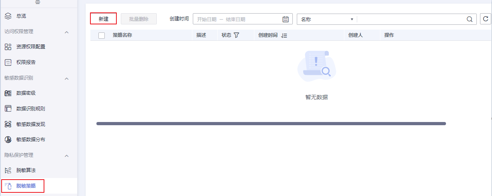
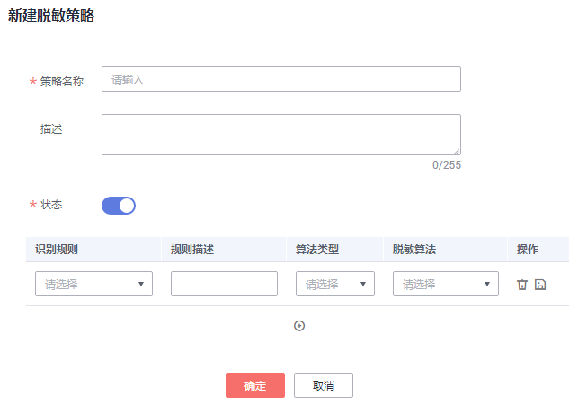
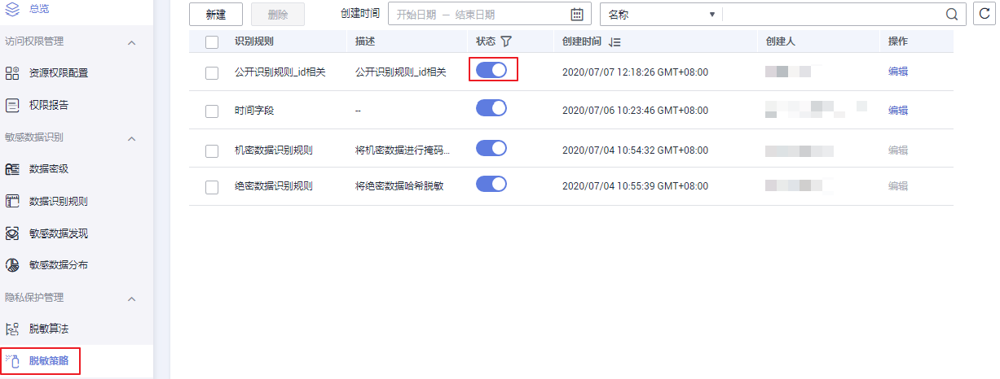
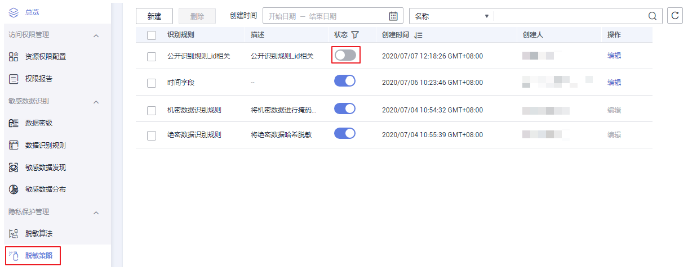
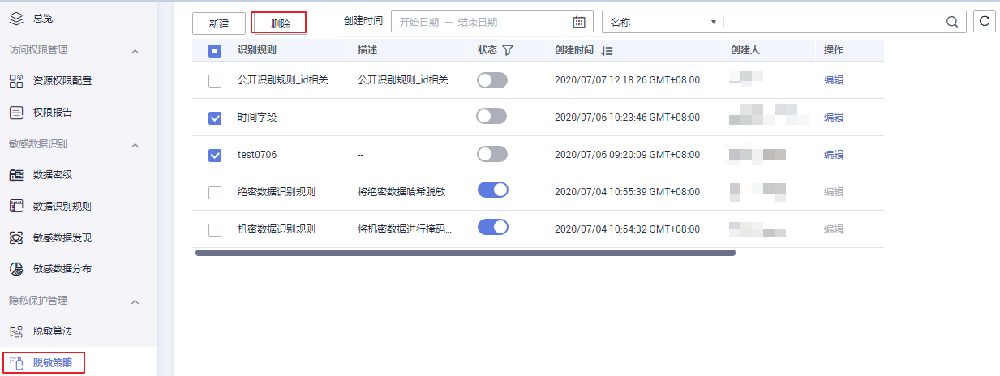

# 管理脱敏策略

本章主要介绍如何创建脱敏策略。

## 简介

实际生产中，会存在数据分析部门需要对数据进行数据分析，数据中存在敏感信息，但又不得不开放权限。此时就可以对敏感数据进行脱敏，在满足业务需要的同时保证了数据的真实性不被泄露。

## 脱敏算法适用场景

**表 1**  算法介绍

<table><thead align="left"><tr id="row117561291175"><th class="cellrowborder" valign="top" width="10.007998400319934%" id="mcps1.2.7.1.1">
算法

</th>
<th class="cellrowborder" valign="top" width="23.325334933013394%" id="mcps1.2.7.1.2">
算法简述

</th>
<th class="cellrowborder" valign="top" width="16.716656668666264%" id="mcps1.2.7.1.3">
典型应用场景

</th>
<th class="cellrowborder" valign="top" width="16.606678664267143%" id="mcps1.2.7.1.4">
应用举例

</th>
<th class="cellrowborder" valign="top" width="16.676664667066586%" id="mcps1.2.7.1.5">
原始数据

</th>
<th class="cellrowborder" valign="top" width="16.666666666666664%" id="mcps1.2.7.1.6">
脱敏后数据

</th>
</tr>
</thead>
<tbody><tr id="row575719991710"><td class="cellrowborder" valign="top" width="10.007998400319934%" headers="mcps1.2.7.1.1 ">
掩码

</td>
<td class="cellrowborder" valign="top" width="23.325334933013394%" headers="mcps1.2.7.1.2 ">
将属性值的部分字符替换为固定的特殊字符。（例如*）

</td>
<td class="cellrowborder" valign="top" width="16.716656668666264%" headers="mcps1.2.7.1.3 ">
结构化、非结构化数据的匿名化均适用针对标识符、准标识符的匿名化。

</td>
<td class="cellrowborder" valign="top" width="16.606678664267143%" headers="mcps1.2.7.1.4 ">
掩码后4位

</td>
<td class="cellrowborder" valign="top" width="16.676664667066586%" headers="mcps1.2.7.1.5 ">
18012345678

</td>
<td class="cellrowborder" valign="top" width="16.666666666666664%" headers="mcps1.2.7.1.6 ">
1801234****

</td>
</tr>
<tr id="row1675729131719"><td class="cellrowborder" valign="top" width="10.007998400319934%" headers="mcps1.2.7.1.1 ">
截断

</td>
<td class="cellrowborder" valign="top" width="23.325334933013394%" headers="mcps1.2.7.1.2 ">
舍弃属性值的后几位信息来保证数据的模糊性。

</td>
<td class="cellrowborder" valign="top" width="16.716656668666264%" headers="mcps1.2.7.1.3 ">
结构化、非结构化数据的匿名化均适用。

针对标识符、准标识符的匿名化。

</td>
<td class="cellrowborder" valign="top" width="16.606678664267143%" headers="mcps1.2.7.1.4 ">
截断后4位

</td>
<td class="cellrowborder" valign="top" width="16.676664667066586%" headers="mcps1.2.7.1.5 ">
18012345678

</td>
<td class="cellrowborder" valign="top" width="16.666666666666664%" headers="mcps1.2.7.1.6 ">
1801234

</td>
</tr>
<tr id="row87583919178"><td class="cellrowborder" valign="top" width="10.007998400319934%" headers="mcps1.2.7.1.1 ">
哈希

</td>
<td class="cellrowborder" valign="top" width="23.325334933013394%" headers="mcps1.2.7.1.2 ">
使用加盐、密钥等哈希函数对数据进行转换。

</td>
<td class="cellrowborder" valign="top" width="16.716656668666264%" headers="mcps1.2.7.1.3 ">
结构化、非结构化数据的匿名化均适用。

</td>
<td class="cellrowborder" valign="top" width="16.606678664267143%" headers="mcps1.2.7.1.4 ">
HMAC-SHA256哈希

</td>
<td class="cellrowborder" valign="top" width="16.676664667066586%" headers="mcps1.2.7.1.5 ">
460031234567890

</td>
<td class="cellrowborder" valign="top" width="16.666666666666664%" headers="mcps1.2.7.1.6 ">
A34329AE133C48C

</td>
</tr>
</tbody>
</table>

> **说明：** 
>隐私保护管理脱敏算法模块提供了19种内置脱敏算法供您选择使用。您在选择算法之前，可以使用我们预先提供的内置算法测试功能，以保证自己选择了合适的算法。

**表 2**  内置算法介绍

<table><thead align="left"><tr id="row2037501131714"><th class="cellrowborder" valign="top" width="21.322132213221323%" id="mcps1.2.4.1.1">
算法名称

</th>
<th class="cellrowborder" valign="top" width="15.48154815481548%" id="mcps1.2.4.1.2">
算法类型

</th>
<th class="cellrowborder" valign="top" width="63.19631963196319%" id="mcps1.2.4.1.3">
算法描述

</th>
</tr>
</thead>
<tbody><tr id="row737512112175"><td class="cellrowborder" valign="top" width="21.322132213221323%" headers="mcps1.2.4.1.1 ">
HMAC-SHA256哈希

</td>
<td class="cellrowborder" valign="top" width="15.48154815481548%" headers="mcps1.2.4.1.2 ">
哈希

</td>
<td class="cellrowborder" valign="top" width="63.19631963196319%" headers="mcps1.2.4.1.3 ">
使用HMAC-SHA256算法进行哈希处理

</td>
</tr>
<tr id="row1537511113171"><td class="cellrowborder" valign="top" width="21.322132213221323%" headers="mcps1.2.4.1.1 ">
SHA-256哈希

</td>
<td class="cellrowborder" valign="top" width="15.48154815481548%" headers="mcps1.2.4.1.2 ">
哈希

</td>
<td class="cellrowborder" valign="top" width="63.19631963196319%" headers="mcps1.2.4.1.3 ">
使用SHA-256算法进行哈希处理

</td>
</tr>
<tr id="row1237511119173"><td class="cellrowborder" valign="top" width="21.322132213221323%" headers="mcps1.2.4.1.1 ">
SHA-1哈希

</td>
<td class="cellrowborder" valign="top" width="15.48154815481548%" headers="mcps1.2.4.1.2 ">
哈希

</td>
<td class="cellrowborder" valign="top" width="63.19631963196319%" headers="mcps1.2.4.1.3 ">
使用SHA-1算法进行哈希处理

</td>
</tr>
<tr id="row8375151116177"><td class="cellrowborder" valign="top" width="21.322132213221323%" headers="mcps1.2.4.1.1 ">
MD5哈希

</td>
<td class="cellrowborder" valign="top" width="15.48154815481548%" headers="mcps1.2.4.1.2 ">
哈希

</td>
<td class="cellrowborder" valign="top" width="63.19631963196319%" headers="mcps1.2.4.1.3 ">
使用MD5算法进行哈希处理

</td>
</tr>
<tr id="row937511114179"><td class="cellrowborder" valign="top" width="21.322132213221323%" headers="mcps1.2.4.1.1 ">
数值类型截断

</td>
<td class="cellrowborder" valign="top" width="15.48154815481548%" headers="mcps1.2.4.1.2 ">
截断

</td>
<td class="cellrowborder" valign="top" width="63.19631963196319%" headers="mcps1.2.4.1.3 ">
截断数值后x位

</td>
</tr>
<tr id="row1137510119176"><td class="cellrowborder" valign="top" width="21.322132213221323%" headers="mcps1.2.4.1.1 ">
日期类型截断

</td>
<td class="cellrowborder" valign="top" width="15.48154815481548%" headers="mcps1.2.4.1.2 ">
截断

</td>
<td class="cellrowborder" valign="top" width="63.19631963196319%" headers="mcps1.2.4.1.3 ">
截断日期指定位置

</td>
</tr>
<tr id="row19375101161713"><td class="cellrowborder" valign="top" width="21.322132213221323%" headers="mcps1.2.4.1.1 ">
身份证号码掩码

</td>
<td class="cellrowborder" valign="top" width="15.48154815481548%" headers="mcps1.2.4.1.2 ">
掩码

</td>
<td class="cellrowborder" valign="top" width="63.19631963196319%" headers="mcps1.2.4.1.3 ">
掩码身份证号

</td>
</tr>
<tr id="row168101012162111"><td class="cellrowborder" valign="top" width="21.322132213221323%" headers="mcps1.2.4.1.1 ">
银行卡号掩码

</td>
<td class="cellrowborder" valign="top" width="15.48154815481548%" headers="mcps1.2.4.1.2 ">
掩码

</td>
<td class="cellrowborder" valign="top" width="63.19631963196319%" headers="mcps1.2.4.1.3 ">
掩码银行卡号

</td>
</tr>
<tr id="row153706213217"><td class="cellrowborder" valign="top" width="21.322132213221323%" headers="mcps1.2.4.1.1 ">
Email掩码

</td>
<td class="cellrowborder" valign="top" width="15.48154815481548%" headers="mcps1.2.4.1.2 ">
掩码

</td>
<td class="cellrowborder" valign="top" width="63.19631963196319%" headers="mcps1.2.4.1.3 ">
掩码Email信息

</td>
</tr>
<tr id="row1211682714214"><td class="cellrowborder" valign="top" width="21.322132213221323%" headers="mcps1.2.4.1.1 ">
移动设备标识掩码

</td>
<td class="cellrowborder" valign="top" width="15.48154815481548%" headers="mcps1.2.4.1.2 ">
掩码

</td>
<td class="cellrowborder" valign="top" width="63.19631963196319%" headers="mcps1.2.4.1.3 ">
对设备码进行掩码，支持IMEI、MEDI、ESN

</td>
</tr>
<tr id="row2131183822116"><td class="cellrowborder" valign="top" width="21.322132213221323%" headers="mcps1.2.4.1.1 ">
IPv6掩码

</td>
<td class="cellrowborder" valign="top" width="15.48154815481548%" headers="mcps1.2.4.1.2 ">
掩码

</td>
<td class="cellrowborder" valign="top" width="63.19631963196319%" headers="mcps1.2.4.1.3 ">
掩码IPv6地址

</td>
</tr>
<tr id="row1999764916212"><td class="cellrowborder" valign="top" width="21.322132213221323%" headers="mcps1.2.4.1.1 ">
IPv4掩码

</td>
<td class="cellrowborder" valign="top" width="15.48154815481548%" headers="mcps1.2.4.1.2 ">
掩码

</td>
<td class="cellrowborder" valign="top" width="63.19631963196319%" headers="mcps1.2.4.1.3 ">
掩码IPv4地址

</td>
</tr>
<tr id="row95401519162311"><td class="cellrowborder" valign="top" width="21.322132213221323%" headers="mcps1.2.4.1.1 ">
MAC地址掩码

</td>
<td class="cellrowborder" valign="top" width="15.48154815481548%" headers="mcps1.2.4.1.2 ">
掩码

</td>
<td class="cellrowborder" valign="top" width="63.19631963196319%" headers="mcps1.2.4.1.3 ">
掩码MAC地址

</td>
</tr>
<tr id="row829210316234"><td class="cellrowborder" valign="top" width="21.322132213221323%" headers="mcps1.2.4.1.1 ">
电话号码掩码

</td>
<td class="cellrowborder" valign="top" width="15.48154815481548%" headers="mcps1.2.4.1.2 ">
掩码

</td>
<td class="cellrowborder" valign="top" width="63.19631963196319%" headers="mcps1.2.4.1.3 ">
掩码电话号码

</td>
</tr>
<tr id="row134391436142316"><td class="cellrowborder" valign="top" width="21.322132213221323%" headers="mcps1.2.4.1.1 ">
日期类型掩码

</td>
<td class="cellrowborder" valign="top" width="15.48154815481548%" headers="mcps1.2.4.1.2 ">
掩码

</td>
<td class="cellrowborder" valign="top" width="63.19631963196319%" headers="mcps1.2.4.1.3 ">
对指定日期格式进行掩码，支持ISO、EUR、USA格式

</td>
</tr>
<tr id="row1139924012238"><td class="cellrowborder" valign="top" width="21.322132213221323%" headers="mcps1.2.4.1.1 ">
掩码自x至y

</td>
<td class="cellrowborder" valign="top" width="15.48154815481548%" headers="mcps1.2.4.1.2 ">
掩码

</td>
<td class="cellrowborder" valign="top" width="63.19631963196319%" headers="mcps1.2.4.1.3 ">
掩码字符串第x至y位字符

</td>
</tr>
<tr id="row19644174316238"><td class="cellrowborder" valign="top" width="21.322132213221323%" headers="mcps1.2.4.1.1 ">
保留自x至y

</td>
<td class="cellrowborder" valign="top" width="15.48154815481548%" headers="mcps1.2.4.1.2 ">
掩码

</td>
<td class="cellrowborder" valign="top" width="63.19631963196319%" headers="mcps1.2.4.1.3 ">
保留字符串第x至y位字符

</td>
</tr>
<tr id="row658110478236"><td class="cellrowborder" valign="top" width="21.322132213221323%" headers="mcps1.2.4.1.1 ">
掩码前n后m

</td>
<td class="cellrowborder" valign="top" width="15.48154815481548%" headers="mcps1.2.4.1.2 ">
掩码

</td>
<td class="cellrowborder" valign="top" width="63.19631963196319%" headers="mcps1.2.4.1.3 ">
掩码字符串前n后m位字符

</td>
</tr>
<tr id="row4511114322418"><td class="cellrowborder" valign="top" width="21.322132213221323%" headers="mcps1.2.4.1.1 ">
保留前n后m

</td>
<td class="cellrowborder" valign="top" width="15.48154815481548%" headers="mcps1.2.4.1.2 ">
掩码

</td>
<td class="cellrowborder" valign="top" width="63.19631963196319%" headers="mcps1.2.4.1.3 ">
保留字符串前n后m位字符

</td>
</tr>
</tbody>
</table>

## 常用脱敏方式

**表 3**  常用脱敏方式及其描述

<table><thead align="left"><tr id="row263714461501"><th class="cellrowborder" valign="top" width="31.52%" id="mcps1.2.3.1.1">
脱敏方式

</th>
<th class="cellrowborder" valign="top" width="68.47999999999999%" id="mcps1.2.3.1.2">
描述

</th>
</tr>
</thead>
<tbody><tr id="row4638446404"><td class="cellrowborder" valign="top" width="31.52%" headers="mcps1.2.3.1.1 ">
Redact

</td>
<td class="cellrowborder" valign="top" width="68.47999999999999%" headers="mcps1.2.3.1.2 ">
用x代替所有字母字符，用n代替所有数字字符。

</td>
</tr>
<tr id="row186381246800"><td class="cellrowborder" valign="top" width="31.52%" headers="mcps1.2.3.1.1 ">
Partial mask：show last 4

</td>
<td class="cellrowborder" valign="top" width="68.47999999999999%" headers="mcps1.2.3.1.2 ">
仅显示最后四个字符,其他用x代替。

</td>
</tr>
<tr id="row1963844616012"><td class="cellrowborder" valign="top" width="31.52%" headers="mcps1.2.3.1.1 ">
Partial mask：show first 4

</td>
<td class="cellrowborder" valign="top" width="68.47999999999999%" headers="mcps1.2.3.1.2 ">
仅显示前四个字符,其他用x代替。

</td>
</tr>
<tr id="row1963815465019"><td class="cellrowborder" valign="top" width="31.52%" headers="mcps1.2.3.1.1 ">
Hash

</td>
<td class="cellrowborder" valign="top" width="68.47999999999999%" headers="mcps1.2.3.1.2 ">
用值的哈希值替换原值。

</td>
</tr>
<tr id="row14638174619014"><td class="cellrowborder" valign="top" width="31.52%" headers="mcps1.2.3.1.1 ">
Nullify

</td>
<td class="cellrowborder" valign="top" width="68.47999999999999%" headers="mcps1.2.3.1.2 ">
用NULL值替换原值。

</td>
</tr>
<tr id="row1763834611015"><td class="cellrowborder" valign="top" width="31.52%" headers="mcps1.2.3.1.1 ">
Unmasked (retain original value)

</td>
<td class="cellrowborder" valign="top" width="68.47999999999999%" headers="mcps1.2.3.1.2 ">
原样显示。

</td>
</tr>
<tr id="row176388461104"><td class="cellrowborder" valign="top" width="31.52%" headers="mcps1.2.3.1.1 ">
Date: show only year

</td>
<td class="cellrowborder" valign="top" width="68.47999999999999%" headers="mcps1.2.3.1.2 ">
仅显示日期字符串的年份部分，并将月份和日期默认为01/01。

</td>
</tr>
</tbody>
</table>

## 前提条件

已定义敏感数据识别规则，未定义请参考[定义识别规则](定义识别规则.md)完成定义。

## 新建脱敏策略

1.  在DGC控制台首页，选择对应工作空间的“数据安全“模块，进入数据安全页面。

    **图 1**  选择数据安全  
    

2.  单击左侧导航树中的“脱敏策略“，进入脱敏策略页面，在页面上方单击“新建“，创建脱敏策略。

    **图 2**  创建脱敏策略  
    

3.  在弹出的新建脱敏页面中填写策略信息，参考[表4](#table029714191274)。

    **表 4**  创建脱敏策略参数配置

    
    <table><thead align="left"><tr id="row4299101915716"><th class="cellrowborder" valign="top" width="18.63%" id="mcps1.2.3.1.1">
参数

    </th>
    <th class="cellrowborder" valign="top" width="81.37%" id="mcps1.2.3.1.2">
参数描述

    </th>
    </tr>
    </thead>
    <tbody><tr id="row17957150185611"><td class="cellrowborder" valign="top" width="18.63%" headers="mcps1.2.3.1.1 ">
策略名称

    </td>
    <td class="cellrowborder" valign="top" width="81.37%" headers="mcps1.2.3.1.2 ">
用户自定义策略名称，只能包含英文字母、数字、“_”，且长度不能超过64个字符。

    </td>
    </tr>
    <tr id="row410053913578"><td class="cellrowborder" valign="top" width="18.63%" headers="mcps1.2.3.1.1 ">
描述

    </td>
    <td class="cellrowborder" valign="top" width="81.37%" headers="mcps1.2.3.1.2 ">
为更好的识别脱敏策略，此处加以描述信息，长度不能超过255个字符。

    </td>
    </tr>
    <tr id="row41361416115819"><td class="cellrowborder" valign="top" width="18.63%" headers="mcps1.2.3.1.1 ">
状态

    </td>
    <td class="cellrowborder" valign="top" width="81.37%" headers="mcps1.2.3.1.2 ">
开启状态表示该策略可供使用。关闭状态表示该策略不能被使用。

    </td>
    </tr>
    <tr id="row132991519971"><td class="cellrowborder" valign="top" width="18.63%" headers="mcps1.2.3.1.1 ">
识别规则

    </td>
    <td class="cellrowborder" valign="top" width="81.37%" headers="mcps1.2.3.1.2 ">
用户下拉选择，已被使用的规则置灰不能被选择。

    <ul id="ul14333975818"><li>脱敏算法：用户下拉选择，有三种算法可供使用，详情请参考<a href="#table11755159111714">表1</a>。</li><li>算法类型：用户下拉选择脱敏算法关联的算法类型，详情请参考<a href="#table19374161110172">表2</a>。</li></ul>
    </td>
    </tr>
    </tbody>
    </table>

4.  单击“确定“，完成新建脱敏策略。

    **图 3**  创建脱敏策略界面  
    

## 编辑脱敏策略

1.  在DGC控制台首页，选择对应工作空间的“数据安全“模块，进入数据安全页面。

    **图 4**  选择数据安全  
    

2.  单击左侧导航树中的“脱敏策略“，进入脱敏策略页面。
3.  单击“编辑“，编辑对应的脱敏策略信息。

    被静态脱敏任务引用的脱敏策略不能进行“编辑“操作。

    **图 5**  编辑脱敏策略  
    

## 启用脱敏策略

1.  在DGC控制台首页，选择对应工作空间的“数据安全“模块，进入数据安全页面。

    **图 6**  选择数据安全  
    

2.  单击左侧导航树中的“脱敏策略“，进入脱敏策略页面。
3.  在策略列表中，单击策略“状态“为，即为启用状态，表示该策略可供使用。

    **图 7**  启用脱敏策略  
    

## 禁用脱敏策略

1.  在DGC控制台首页，选择对应工作空间的“数据安全“模块，进入数据安全页面。

    **图 8**  选择数据安全  
    

2.  单击左侧导航树中的“脱敏策略“，进入脱敏策略页面。
3.  在策略列表中，单击策略“状态“为，即为禁用状态，表示该策略不能被使用。

    被静态脱敏任务引用的脱敏策略不能禁用。

    **图 9**  禁用脱敏策略  
    

## 删除脱敏策略

1.  在DGC控制台首页，选择对应工作空间的“数据安全“模块，进入数据安全页面。

    **图 10**  选择数据安全  
    

2.  单击左侧导航树中的“脱敏策略“，进入脱敏策略页面。
3.  在策略列表中，勾选需要删除的脱敏策略，单击“删除“。

    脱敏策略要先置为禁用状态，再删除。

    **图 11**  删除脱敏策略  
    

    > **说明：** 
    >-   被脱敏任务引用的策略不能被删除。
    >-   删除操作无法撤销，请谨慎操作。

