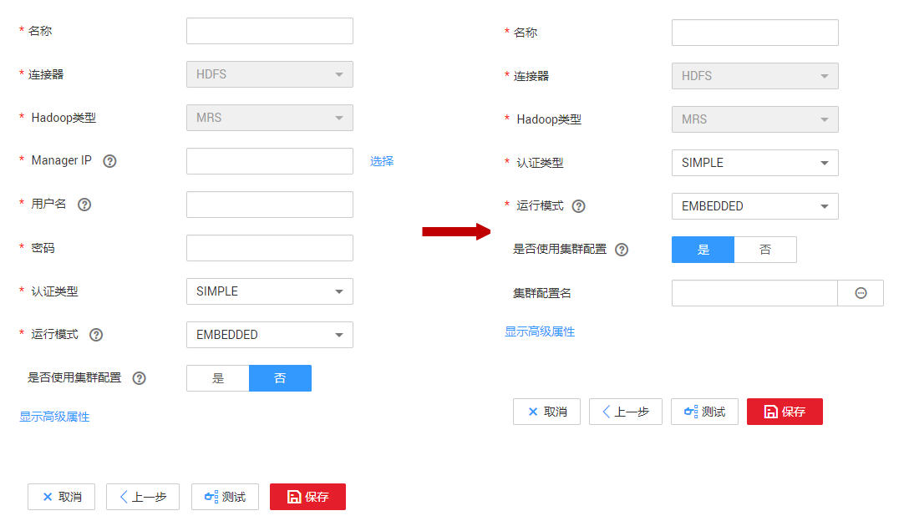
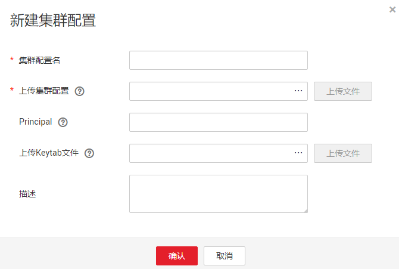
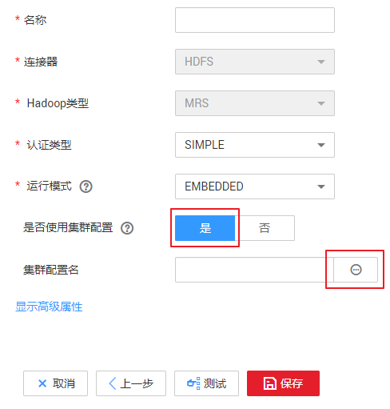

# 管理集群配置

集群配置管理支持新建、编辑或删除Hadoop集群配置。

Hadoop集群配置主要用于新建Hadoop类型连接时，能够简化复杂的连接参数配置，如[图1](#zh-cn_topic_0000001101126424_fig1362921385518)所示。

**图 1**  使用集群配置前后对比  

CDM支持的Hadoop类型连接主要包括以下几类：

-   MRS集群：MRS HDFS，MRS HBase，MRS Hive。
-   FusionInsight集群：FusionInsight HDFS，FusionInsight HBase，FusionInsight Hive。
-   Apache集群：Apache HDFS，Apache HBase，Apache Hive。
-   Hadoop发行版。

## 操作场景

当需要新建Hadoop类型连接时，建议先创建集群配置，以简化复杂的连接参数配置。

## 前提条件

-   已创建集群。
-   已参见[表1](#zh-cn_topic_0000001101126424_table8831038596)获取相应Hadoop集群配置文件和Keytab文件。

## 如何获取集群配置文件和Keytab文件

不同Hadoop类型的集群配置文件和Keytab文件获取方式有所不同，请参见[表1](#zh-cn_topic_0000001101126424_table8831038596)获取相应Hadoop集群配置文件和Keytab文件。

**表 1**  集群配置文件和Keytab文件获取方式

<table><thead align="left"><tr id="zh-cn_topic_0000001101126424_row188443811915"><th class="cellrowborder" valign="top" width="19.189999999999998%" id="mcps1.2.4.1.1">
<strong id="zh-cn_topic_0000001101126424_b922012481168">Hadoop类型连接</strong>

</th>
<th class="cellrowborder" valign="top" width="38.47%" id="mcps1.2.4.1.2">
<strong id="zh-cn_topic_0000001101126424_b42213485611">集群配置文件获取方式</strong>

</th>
<th class="cellrowborder" valign="top" width="42.34%" id="mcps1.2.4.1.3">
<strong id="zh-cn_topic_0000001101126424_b144931616185816">Keytab文件获取方式</strong>

</th>
</tr>
</thead>
<tbody><tr id="zh-cn_topic_0000001101126424_row19841838895"><td class="cellrowborder" valign="top" width="19.189999999999998%" headers="mcps1.2.4.1.1 ">
MRS集群

<ul id="zh-cn_topic_0000001101126424_ul101775439106"><li>MRS HDFS</li><li>MRS HBase</li><li>MRS Hive</li></ul>
</td>
<td class="cellrowborder" valign="top" width="38.47%" headers="mcps1.2.4.1.2 ">
针对MRS 3.x版本集群：

<ol id="zh-cn_topic_0000001101126424_ol1967117451484"><li>登录FusionInsight Manager。</li><li>选择“集群 &gt;  &gt; 待操作的集群名称 &gt; 概览 &gt;  &gt; 更多 &gt;  &gt; 下载客户端”，界面显示“下载集群客户端”对话框。</li><li>对话框中选择“仅配置文件”，平台类型和服务端保持一致，单击确认后进行本地下载。</li><li>获取下载的tar包，此即为FusionInsight集群配置文件。</li></ol>

针对MRS 2.x及之前版本集群：

<ol id="zh-cn_topic_0000001101126424_ol2097774131311"><li>登录MRS管理控制台。</li><li>选择“集群列表 &gt; 现有集群”，单击集群名称进入集群详情页面，单击“组件管理”。</li><li>单击“下载客户端”。“客户端类型”选择“仅配置文件”，“下载路径”选择“服务器端”或“远端主机”，自定义文件保存路径后，单击“确定”开始生成客户端配置文件。</li><li>将生成的配置文件，保存到本地路径。</li></ol>

具体可参见MapReduce服务文档。

</td>
<td class="cellrowborder" valign="top" width="42.34%" headers="mcps1.2.4.1.3 ">
针对MRS 3.x版本集群：

<ol id="zh-cn_topic_0000001101126424_ol88951253517"><li>登录FusionInsight Manager。</li><li>通过“系统 &gt;  &gt; 权限 &gt; 用户”，选择所需用户所在行，点击“更多 &gt;  &gt;下载认证凭据”下载认证凭据文件。</li><li>获取下载的tar包，此即为FusionInsight集群Keytab文件。</li></ol>

针对MRS 2.x及之前版本集群：

<ol id="zh-cn_topic_0000001101126424_ol152475412210"><li>登录MRS服务的Manager，单击“系统设置”。在“权限配置”区域，单击“用户管理”。</li><li>在需导出keytab文件用户所在的行，选择“更多 &gt; 下载认证凭据”下载认证文件，待文件自动生成后指定保存位置，并妥善保管该文件。</li></ol>

具体可参见MapReduce服务文档。

</td>
</tr>
<tr id="zh-cn_topic_0000001101126424_row3841938897"><td class="cellrowborder" valign="top" width="19.189999999999998%" headers="mcps1.2.4.1.1 ">
FusionInsight集群

<ul id="zh-cn_topic_0000001101126424_ul17525185511102"><li>FusionInsight HDFS</li><li>FusionInsight HBase</li><li>FusionInsight Hive</li></ul>
</td>
<td class="cellrowborder" valign="top" width="38.47%" headers="mcps1.2.4.1.2 "><ol id="zh-cn_topic_0000001101126424_ol82261246192712"><li>登录FusionInsight Manager。</li><li>选择“集群 &gt;  &gt; 待操作的集群名称 &gt; 概览 &gt;  &gt; 更多 &gt;  &gt; 下载客户端”，界面显示“下载集群客户端”对话框。</li><li>对话框中选择“仅配置文件”，平台类型和服务端保持一致，单击确认后进行本地下载。</li><li>获取下载的tar包，此即为FusionInsight集群配置文件。</li></ol>

具体可参见FusionInsight文档。

</td>
<td class="cellrowborder" valign="top" width="42.34%" headers="mcps1.2.4.1.3 "><ol id="zh-cn_topic_0000001101126424_ol163561235143112"><li>登录FusionInsight Manager。</li><li>通过“系统 &gt;  &gt; 权限 &gt; 用户”，选择所需用户所在行，点击“更多 &gt;  &gt;下载认证凭据”下载认证凭据文件。</li><li>获取下载的tar包，此即为FusionInsight集群Keytab文件。</li></ol>

具体可参见FusionInsight文档。

</td>
</tr>
<tr id="zh-cn_topic_0000001101126424_row128413381692"><td class="cellrowborder" valign="top" width="19.189999999999998%" headers="mcps1.2.4.1.1 ">
Apache集群

<ul id="zh-cn_topic_0000001101126424_ul199286610117"><li>Apache HDFS</li><li>Apache HBase</li><li>Apache Hive</li></ul>
</td>
<td class="cellrowborder" valign="top" width="38.47%" headers="mcps1.2.4.1.2 ">
Apache集群场景下，此处仅说明需要哪些配置文件与打包原则，各配置文件的具体获取方式请参见对应版本说明文档。

<ul id="zh-cn_topic_0000001101126424_ul1379963802915"><li>HDFS需要将以下文件压缩为无目录格式的zip包：<ul id="zh-cn_topic_0000001101126424_ul3721141524115"><li>hosts</li><li>core-site.xml</li><li>hdfs-site.xml</li><li>yarm-site.xml</li><li>mapred-site.xml</li><li>krb5.conf（可选，安全模式集群使用）</li></ul>
</li><li>HBase需要将以下文件压缩为无目录格式的zip包：<ul id="zh-cn_topic_0000001101126424_ul7244166114316"><li>hosts</li><li>core-site.xml</li><li>hdfs-site.xml</li><li>yarm-site.xml</li><li>mapred-site.xml</li><li>hbase-site.xml</li><li>krb5.conf（可选，安全模式集群使用）</li></ul>
</li><li>Hive需要将以下文件压缩为无目录格式的zip包：<ul id="zh-cn_topic_0000001101126424_ul15294153222911"><li>hosts</li><li>core-site.xml</li><li>hdfs-site.xml</li><li>yarm-site.xml</li><li>mapred-site.xml</li><li>hive-site.xml</li><li>hivemetastore-site.xml</li><li>krb5.conf（可选，安全模式集群使用）</li></ul>
</li></ul>
</td>
<td class="cellrowborder" valign="top" width="42.34%" headers="mcps1.2.4.1.3 ">
Apache集群场景下，此处仅说明认证凭据文件打包原则，认证凭据文件具体获取方式请参见对应版本说明文档。

<ol id="zh-cn_topic_0000001101126424_ol144755414115"><li>将用户的认证凭据文件重命名为user.keytab。</li><li>将user.keytab文件压缩为无目录格式的zip包：user.keytab.zip。</li></ol>
</td>
</tr>
<tr id="zh-cn_topic_0000001101126424_row1884153813919"><td class="cellrowborder" valign="top" width="19.189999999999998%" headers="mcps1.2.4.1.1 ">
Hadoop发行版

</td>
<td class="cellrowborder" valign="top" width="38.47%" headers="mcps1.2.4.1.2 ">
Hadoop发行版场景下，此处仅说明需要哪些配置文件与打包原则，各配置文件的具体获取方式请参见对应版本说明文档。

Hadoop发行版需要将以下文件压缩为无目录格式的zip包：<ul id="zh-cn_topic_0000001101126424_ul149216817415"><li>hosts</li><li>core-site.xml</li><li>hdfs-site.xml</li><li>yarm-site.xml</li><li>mapred-site.xml</li><li>hbase-site.xml</li><li>hive-site.xml</li><li>hivemetastore-site.xml</li><li>krb5.conf（可选，安全模式集群使用）</li></ul>

</td>
<td class="cellrowborder" valign="top" width="42.34%" headers="mcps1.2.4.1.3 ">
Hadoop发行版场景下，此处仅说明认证凭据文件打包原则，认证凭据文件具体获取方式请参见对应版本说明文档。

<ol id="zh-cn_topic_0000001101126424_ol12166554101317"><li>将用户的认证凭据文件重命名为user.keytab。</li><li>将user.keytab文件压缩为无目录格式的zip包：user.keytab.zip。</li></ol>
</td>
</tr>
</tbody>
</table>

> **说明：** 
>-   集群配置文件包含集群的配置参数。如果修改了集群的配置参数，需重新获取获取配置文件。
>-   Keytab文件为认证凭据文件。获取Keytab文件前，需要在集群上至少修改过一次此用户的密码，否则下载获取的keytab文件可能无法使用。另外，修改用户密码后，之前导出的keytab将失效，需要重新导出。
>-   Keytab文件在仅安全模式集群下使用，普通模式集群下无需准备Keytab文件。

## 操作步骤

1.  进入CDM主界面，进入集群管理界面。选择CDM集群后的“作业管理  \>  连接管理  \>   集群配置管理“。
2.  在集群配置管理界面，选择“新建集群配置“，配置参数填写如下：

    **图 2**  新建集群配置  
    

    -   集群配置名：根据连接的数据源类型，用户可自定义便于记忆、区分的集群配置名。
    -   上传集群配置：单击操作框内的“...“以选择本地的集群配置文件，然后通过操作框右侧的“上传文件“进行上传。
    -   Principal：**仅安全模式集群需要填写该参数**。Principal即Kerberos安全模式下的用户名，需要与Keytab文件保持一致。
    -   上传Keytab文件：**仅安全模式集群需要上传该文件**。单击操作框内的“...“以选择本地的Keytab文件，然后通过操作框右侧的“上传文件“进行上传。
    -   描述：用户可添加对此集群配置的描述，用于标识和区分该集群配置。

3.  确认后集群配置新建成功。后续在新建Hadoop类型连接时，认证模式根据实际情况选择，将“是否使用集群配置“选择为“是“，然后选择对应的“集群配置名“， 即可快速完成Hadoop类型连接创建。

    **图 3**  使用集群配置  
    

