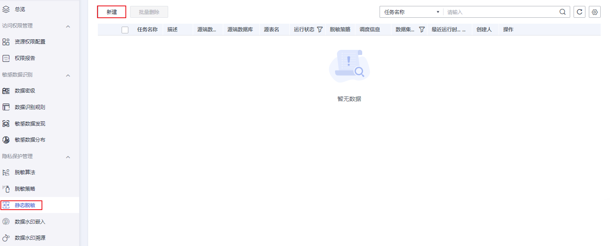
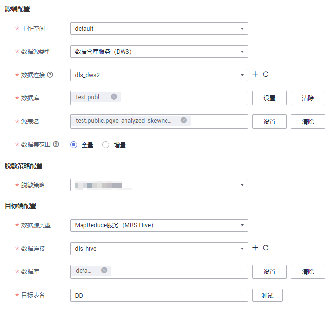
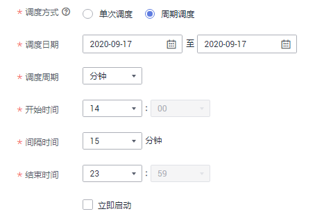
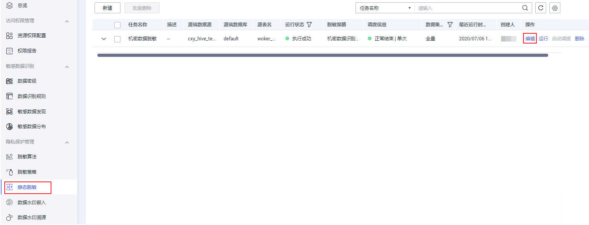
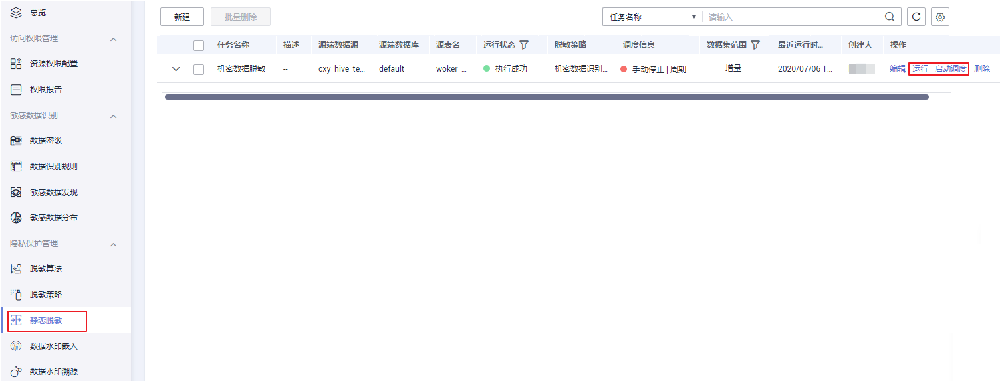
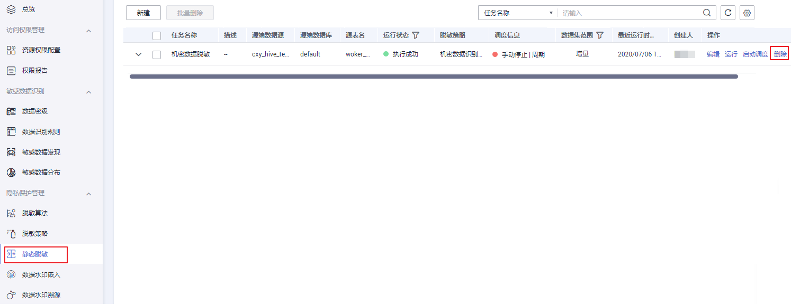

# 管理静态脱敏任务

数据静态脱敏，可以防止隐私数据在未经脱敏的情况下从企业流出。满足企业既要保护隐私数据，同时又保持监管合规，满足企业合规性。敏感数据通过静态脱敏，提供内置高效、丰富的脱敏算法，对原始数据中敏感数据进行掩码、截断、hash，并将脱敏后的数据写入到目标端数据表。而目标表数据可以用来对外提供数据服务，为数据安全使用提供基础保障。本章主要介绍如何创建静态脱敏任务。

## 前提条件

-   完成脱敏策略的创建，请参考[新建脱敏策略](管理脱敏策略.md#section9720164374612)。
-   已创建数据源类型为数据仓库服务（DWS）、MapReduce服务（MRS Hive）且连接方式必须选择“通过代理连接“的数据连接。参考[创建数据连接](创建数据连接.md)。

## 约束与限制

-   MapReduce服务（MRS Hive）所在的MRS集群必须安装Spark组件。
-   计算引擎限制参考[表1](#table17911125772311)。

    **表 1**  计算引擎使用限制

    
    <table><thead align="left"><tr id="row159111057192313"><th class="cellrowborder" valign="top" width="30.853085308530854%" id="mcps1.2.4.1.1">
源端数据源类型

    </th>
    <th class="cellrowborder" valign="top" width="30.483048304830483%" id="mcps1.2.4.1.2">
目的端数据源类型

    </th>
    <th class="cellrowborder" valign="top" width="38.66386638663866%" id="mcps1.2.4.1.3">
计算引擎

    </th>
    </tr>
    </thead>
    <tbody><tr id="row691218579235"><td class="cellrowborder" valign="top" width="30.853085308530854%" headers="mcps1.2.4.1.1 ">
数据仓库服务（DWS）

    </td>
    <td class="cellrowborder" valign="top" width="30.483048304830483%" headers="mcps1.2.4.1.2 ">
数据仓库服务（DWS）

    </td>
    <td class="cellrowborder" valign="top" width="38.66386638663866%" headers="mcps1.2.4.1.3 ">
将使用用户创建脱敏任务时指定的计算引擎（2.1.0及以上）

    </td>
    </tr>
    <tr id="row1912155715236"><td class="cellrowborder" valign="top" width="30.853085308530854%" headers="mcps1.2.4.1.1 ">
数据仓库服务（DWS）

    </td>
    <td class="cellrowborder" valign="top" width="30.483048304830483%" headers="mcps1.2.4.1.2 ">
MapReduce服务（MRS Hive）

    </td>
    <td class="cellrowborder" valign="top" width="38.66386638663866%" headers="mcps1.2.4.1.3 ">
使用MRS Hive自带的MRS

    </td>
    </tr>
    <tr id="row691210574237"><td class="cellrowborder" valign="top" width="30.853085308530854%" headers="mcps1.2.4.1.1 ">
MapReduce服务（MRS Hive）

    </td>
    <td class="cellrowborder" valign="top" width="30.483048304830483%" headers="mcps1.2.4.1.2 ">
MapReduce服务（MRS Hive）

    </td>
    <td class="cellrowborder" valign="top" width="38.66386638663866%" headers="mcps1.2.4.1.3 ">
使用源端MRS Hive自带的MRS

    </td>
    </tr>
    <tr id="row10372123312314"><td class="cellrowborder" valign="top" width="30.853085308530854%" headers="mcps1.2.4.1.1 ">
MapReduce服务（MRS Hive）

    </td>
    <td class="cellrowborder" valign="top" width="30.483048304830483%" headers="mcps1.2.4.1.2 ">
数据仓库服务（DWS）

    </td>
    <td class="cellrowborder" valign="top" width="38.66386638663866%" headers="mcps1.2.4.1.3 ">
使用源端MRS Hive自带的MRS

    </td>
    </tr>
    </tbody>
    </table>

-   数据仓库服务（DWS）和MapReduce服务（MRS Hive）数据源类型，需选择时间字段类型Timestamp、Date字段类型来确定增量范围。

## 创建静态脱敏任务

1.  在DGC控制台首页，选择对应工作空间的“数据安全“模块，进入数据安全页面。

    **图 1**  选择数据安全  
    

2.  单击左侧导航树中的“静态脱敏“，进入静态脱敏页面，在页面上方单击“新建“，创建静态脱敏任务。

    **图 2**  创建静态脱敏任务  
    

3.  在弹出的创建任务页面中填写基本信息，单击“下一步“，进行脱敏策略配置。

    参数配置参考[表2](#table1763022601914)。

    **图 3**  脱敏策略配置  
    

    脱敏任务策略参数配置说明：

    **表 2**  脱敏任务策略参数配置

    
    <table><thead align="left"><tr id="row2062832641920"><th class="cellrowborder" valign="top" width="22.06%" id="mcps1.2.3.1.1">
参数名

    </th>
    <th class="cellrowborder" valign="top" width="77.94%" id="mcps1.2.3.1.2">
参数描述

    </th>
    </tr>
    </thead>
    <tbody><tr id="row962812671916"><td class="cellrowborder" valign="top" width="22.06%" headers="mcps1.2.3.1.1 ">
任务名称

    </td>
    <td class="cellrowborder" valign="top" width="77.94%" headers="mcps1.2.3.1.2 ">
脱敏任务的名称，只能包含英文字母、数字、中文字符、下划线或中划线，且长度为1~64个字符。

    </td>
    </tr>
    <tr id="row662962612199"><td class="cellrowborder" valign="top" width="22.06%" headers="mcps1.2.3.1.1 ">
描述

    </td>
    <td class="cellrowborder" valign="top" width="77.94%" headers="mcps1.2.3.1.2 ">
为更好的识别脱敏任务，此处加以描述信息。长度不能超过1024个字符。

    </td>
    </tr>
    <tr id="row5274930161514"><td class="cellrowborder" valign="top" width="22.06%" headers="mcps1.2.3.1.1 ">
工作空间

    </td>
    <td class="cellrowborder" valign="top" width="77.94%" headers="mcps1.2.3.1.2 ">
数据所属工作空间。

    </td>
    </tr>
    <tr id="row146293265192"><td class="cellrowborder" valign="top" width="22.06%" headers="mcps1.2.3.1.1 ">
源端数据源类型

    </td>
    <td class="cellrowborder" valign="top" width="77.94%" headers="mcps1.2.3.1.2 ">
目前只支持数据仓库服务（DWS）和MapReduce服务（MRS Hive）。

    </td>
    </tr>
    <tr id="row162942612194"><td class="cellrowborder" valign="top" width="22.06%" headers="mcps1.2.3.1.1 ">
源端数据连接

    </td>
    <td class="cellrowborder" valign="top" width="77.94%" headers="mcps1.2.3.1.2 ">
仅允许选择连接方式为“通过代理连接”的数据连接。

    </td>
    </tr>
    <tr id="row262910261197"><td class="cellrowborder" valign="top" width="22.06%" headers="mcps1.2.3.1.1 ">
源端数据库

    </td>
    <td class="cellrowborder" valign="top" width="77.94%" headers="mcps1.2.3.1.2 ">
下拉选择待脱敏的数据库。

    </td>
    </tr>
    <tr id="row1562972611198"><td class="cellrowborder" valign="top" width="22.06%" headers="mcps1.2.3.1.1 ">
源表名

    </td>
    <td class="cellrowborder" valign="top" width="77.94%" headers="mcps1.2.3.1.2 ">
下拉选择待脱敏的数据表。

    </td>
    </tr>
    <tr id="row4629192619199"><td class="cellrowborder" valign="top" width="22.06%" headers="mcps1.2.3.1.1 ">
源端数据集范围

    </td>
    <td class="cellrowborder" valign="top" width="77.94%" headers="mcps1.2.3.1.2 ">
只有使用时间字段timestamp、Date 来确定增量范围时，才可以选择增量模式。

    </td>
    </tr>
    <tr id="row1162914265196"><td class="cellrowborder" valign="top" width="22.06%" headers="mcps1.2.3.1.1 ">
脱敏策略

    </td>
    <td class="cellrowborder" valign="top" width="77.94%" headers="mcps1.2.3.1.2 ">
下拉选择您预先创建好的脱敏策略。

    </td>
    </tr>
    <tr id="row2063092612198"><td class="cellrowborder" valign="top" width="22.06%" headers="mcps1.2.3.1.1 ">
目标端数据源类型

    </td>
    <td class="cellrowborder" valign="top" width="77.94%" headers="mcps1.2.3.1.2 ">
目前只支持数据仓库服务（DWS）和MapReduce服务（MRS Hive）

    </td>
    </tr>
    <tr id="row1663018269198"><td class="cellrowborder" valign="top" width="22.06%" headers="mcps1.2.3.1.1 ">
目标端数据连接

    </td>
    <td class="cellrowborder" valign="top" width="77.94%" headers="mcps1.2.3.1.2 ">
仅允许选择连接方式为“通过代理连接”的数据连接。

    </td>
    </tr>
    <tr id="row2063072612199"><td class="cellrowborder" valign="top" width="22.06%" headers="mcps1.2.3.1.1 ">
目标端数据库

    </td>
    <td class="cellrowborder" valign="top" width="77.94%" headers="mcps1.2.3.1.2 ">
下拉选择存储已脱敏数据的数据库。

    </td>
    </tr>
    <tr id="row13630152631914"><td class="cellrowborder" valign="top" width="22.06%" headers="mcps1.2.3.1.1 ">
目标表名

    </td>
    <td class="cellrowborder" valign="top" width="77.94%" headers="mcps1.2.3.1.2 ">
用户手动输入，不能与目标端数据库表名重复。

    
当用户输入的表名不存在时会创建该表。

    </td>
    </tr>
    <tr id="row162313816187"><td class="cellrowborder" valign="top" width="22.06%" headers="mcps1.2.3.1.1 ">
计算引擎

    </td>
    <td class="cellrowborder" valign="top" width="77.94%" headers="mcps1.2.3.1.2 ">
源端、目标端数据源类型同为DWS时呈现此参数，需要设置运行脱敏任务的引擎，当前支持MRS3.0.0版本。请确保所要使用的计算引擎对应的MRS集群，已经在管理中心创建了Hive数据连接，否则无法选择使用该计算引擎。

    </td>
    </tr>
    </tbody>
    </table>

4.  单击“下一步“，进行调度信息配置，调度方式选择单次调度直接勾选即可。

    **图 4**  周期调度配置参数  
    

    周期调度参数配置参考[表3](#dgc_01_1013_zh-cn_topic_0141836089_table117064413127)。

    **表 3**  配置周期调度参数

    
    <table><thead align="left"><tr id="dgc_01_1013_zh-cn_topic_0141836089_row5714194151214"><th class="cellrowborder" valign="top" width="27.58%" id="mcps1.2.3.1.1">
参数名

    </th>
    <th class="cellrowborder" valign="top" width="72.42%" id="mcps1.2.3.1.2">
说明

    </th>
    </tr>
    </thead>
    <tbody><tr id="dgc_01_1013_zh-cn_topic_0141836089_row871554191219"><td class="cellrowborder" valign="top" width="27.58%" headers="mcps1.2.3.1.1 ">
调度日期

    </td>
    <td class="cellrowborder" valign="top" width="72.42%" headers="mcps1.2.3.1.2 ">
调度任务的生效时间段。

    </td>
    </tr>
    <tr id="dgc_01_1013_zh-cn_topic_0141836089_row2071644141217"><td class="cellrowborder" valign="top" width="27.58%" headers="mcps1.2.3.1.1 ">
调度周期

    </td>
    <td class="cellrowborder" valign="top" width="72.42%" headers="mcps1.2.3.1.2 ">
选择调度任务的执行周期，并配置相关参数。

    <ul id="dgc_01_1013_zh-cn_topic_0141836089_ul1937815611617"><li>分</li><li>小时</li><li>天
调度时会从每天对应的时间执行。

    </li><li>周
如果周期是“周”或“月”，那么调度时会从对应的星期几或几号执行。

    
例如：选择调度周期是周，调度区间是2020-06-30 15:52:43至2020-08-01 17:20:21，那么06-30是周二，也就是在调度区间内，每周二的15点52分43秒会执行任务。

    </li></ul>
    </td>
    </tr>
    <tr id="dgc_01_1013_zh-cn_topic_0141836089_row3896645121511"><td class="cellrowborder" valign="top" width="27.58%" headers="mcps1.2.3.1.1 ">
立即启动

    </td>
    <td class="cellrowborder" valign="top" width="72.42%" headers="mcps1.2.3.1.2 ">
勾选复选框，则表示立即启动此调度任务。

    </td>
    </tr>
    </tbody>
    </table>

5.  单击“确定“，完成创建静态脱敏任务。

## 编辑静态脱敏任务

1.  在DGC控制台首页，选择对应工作空间的“数据安全“模块，进入数据安全页面。

    **图 5**  选择数据安全  
    

2.  单击左侧导航树中的“静态脱敏“，进入静态脱敏页面。
3.  在任务信息列表中，单击“编辑“，编辑静态脱敏任务。

    任务在运行或调度中时不可编辑。

    **图 6**  编辑静态脱敏任务  
    

## 调度运行静态脱敏任务

1.  在DGC控制台首页，选择对应工作空间的“数据安全“模块，进入数据安全页面。

    **图 7**  选择数据安全  
    

2.  单击左侧导航树中的“静态脱敏“，进入静态脱敏页面。
3.  在任务信息列表中，单击“运行“或“启动调度“，调度运行静态脱敏任务，调度机制请参考[图9](发现敏感数据.md#fig12746186121813)。

    **图 8**  调度运行静态脱敏任务  
    

## 删除静态脱敏任务

1.  在DGC控制台首页，选择对应工作空间的“数据安全“模块，进入数据安全页面。

    **图 9**  选择数据安全  
    

2.  单击左侧导航树中的“静态脱敏“，进入静态脱敏页面。
3.  在任务信息列表中，单击“删除“，删除静态脱敏任务。

    **图 10**  删除静态脱敏任务  
    

    > **说明：** 
    >运行中、调度中的任务无法执行删除操作。

