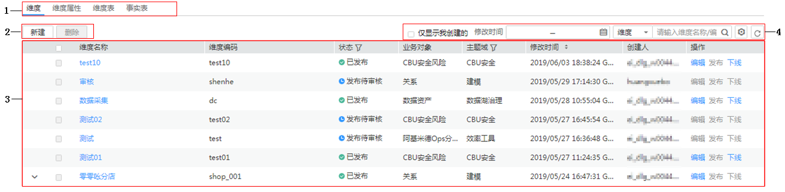
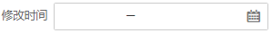
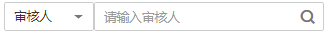

# 维度建模

维度建模包含维度、维度属性、维度表和事实表四种模型。

推荐的操作流程：新建 - 提交发布 - 审核通过 - 提交下线 -审核通过 - 已下线，您可根据实际情况选择操作。

**表 1**  各维度建模过程中的状态及说明

<table><thead align="left"><tr id="zh-cn_topic_0169427297_row115566010174"><th class="cellrowborder" valign="top" width="25.240000000000002%" id="mcps1.2.3.1.1">
状态

</th>
<th class="cellrowborder" valign="top" width="74.76%" id="mcps1.2.3.1.2">
说明

</th>
</tr>
</thead>
<tbody><tr id="zh-cn_topic_0169427297_row85569061713"><td class="cellrowborder" valign="top" width="25.240000000000002%" headers="mcps1.2.3.1.1 ">
“草稿”

</td>
<td class="cellrowborder" valign="top" width="74.76%" headers="mcps1.2.3.1.2 ">
新建信息保存后，该信息的状态为“草稿”，您后续可对其进行编辑、发布。

</td>
</tr>
<tr id="zh-cn_topic_0169427297_row45572012173"><td class="cellrowborder" valign="top" width="25.240000000000002%" headers="mcps1.2.3.1.1 ">
“发布待审核”

</td>
<td class="cellrowborder" valign="top" width="74.76%" headers="mcps1.2.3.1.2 "><ul id="zh-cn_topic_0169427297_ul17172279195"><li>对草稿状态的信息提交发布后，该信息的状态为“发布待审核”，您可在“审核中心”页签对其进行审核、。</li><li>对已发布状态的信息编辑并发布后，生成状态为“发布待审核”的下展信息，您可在“审核中心”页签对其进行审核。对下展信息通过审核后，该下展信息会替换原有的信息，显示状态为“已发布”。</li></ul>
</td>
</tr>
<tr id="zh-cn_topic_0169427297_row18557130181712"><td class="cellrowborder" valign="top" width="25.240000000000002%" headers="mcps1.2.3.1.1 ">
“已发布”

</td>
<td class="cellrowborder" valign="top" width="74.76%" headers="mcps1.2.3.1.2 "><ul id="zh-cn_topic_0169427297_ul482917409191"><li>对发布待审核状态的信息审核通过后该信息的状态为“已发布”。</li></ul>
</td>
</tr>
<tr id="zh-cn_topic_0169427297_row115571406172"><td class="cellrowborder" valign="top" width="25.240000000000002%" headers="mcps1.2.3.1.1 ">
“下线待审核”

</td>
<td class="cellrowborder" valign="top" width="74.76%" headers="mcps1.2.3.1.2 ">
对已发布状态的信息提交下线后，该信息的状态为“下线待审核”，您可在“审核中心”页签对其进行审核。

</td>
</tr>
<tr id="zh-cn_topic_0169427297_row135573001718"><td class="cellrowborder" valign="top" width="25.240000000000002%" headers="mcps1.2.3.1.1 ">
“已下线”

</td>
<td class="cellrowborder" valign="top" width="74.76%" headers="mcps1.2.3.1.2 ">
对下线待审核状态的信息审核通过后该信息的状态为“已下线”，您可删除该信息。

</td>
</tr>
</tbody>
</table>

## 界面说明

**图 1**  维度建模页面  

**表 2**  维度建模表说明

<table><thead align="left"><tr id="zh-cn_topic_0169427297_row9260133515166"><th class="cellrowborder" valign="top" width="20.18%" id="mcps1.2.3.1.1">
序号

</th>
<th class="cellrowborder" valign="top" width="79.82000000000001%" id="mcps1.2.3.1.2">
说明

</th>
</tr>
</thead>
<tbody><tr id="zh-cn_topic_0169427297_row82601835101619"><td class="cellrowborder" valign="top" width="20.18%" headers="mcps1.2.3.1.1 ">
1

</td>
<td class="cellrowborder" valign="top" width="79.82000000000001%" headers="mcps1.2.3.1.2 ">
主要包含维度、维度属性、维度表和事实表四个页签。

</td>
</tr>
<tr id="zh-cn_topic_0169427297_row226010353162"><td class="cellrowborder" valign="top" width="20.18%" headers="mcps1.2.3.1.1 ">
2

</td>
<td class="cellrowborder" valign="top" width="79.82000000000001%" headers="mcps1.2.3.1.2 "><ul id="zh-cn_topic_0169427297_ul13351254349"><li>新建：您可以通过该按钮新建建模信息。</li><li>删除：您可以通过该按钮删除建模信息。</li></ul>
</td>
</tr>
<tr id="zh-cn_topic_0169427297_row12261535151620"><td class="cellrowborder" valign="top" width="20.18%" headers="mcps1.2.3.1.1 ">
3

</td>
<td class="cellrowborder" valign="top" width="79.82000000000001%" headers="mcps1.2.3.1.2 ">
显示维度建模信息。可用过操作列进行编辑、发布、下线、同步表模型等操作。

</td>
</tr>
<tr id="zh-cn_topic_0169427297_row362694953120"><td class="cellrowborder" valign="top" width="20.18%" headers="mcps1.2.3.1.1 ">
4

</td>
<td class="cellrowborder" valign="top" width="79.82000000000001%" headers="mcps1.2.3.1.2 "><ul id="zh-cn_topic_0169427297_ul1875718137355"><li>：勾选该项，表示维度建模表中只显示当前用户创建的信息。</li><li>：通过该按钮过滤出修改时间段内的维度建模信息。</li><li>：通过该按钮查询各表、创建人、审核人的维度建模信息。</li><li>：通过该按钮设置维度建模表的表列项。</li><li>：刷新按钮。</li></ul>
</td>
</tr>
</tbody>
</table>

-   **[维度概览](维度概览.md)**  

-   **[新建维度](新建维度.md)**  

-   **[发布维度表](发布维度表.md)**  

-   **[新建事实表](新建事实表.md)**  

-   **[新建限定分组](新建限定分组.md)**  

-   **[新建时间限定](新建时间限定.md)**  

-   **[新建通用限定](新建通用限定.md)**  

-   **[新建原子指标](新建原子指标.md)**  

-   **[新建复合指标](新建复合指标.md)**  

-   **[新建汇总表](新建汇总表.md)**  

