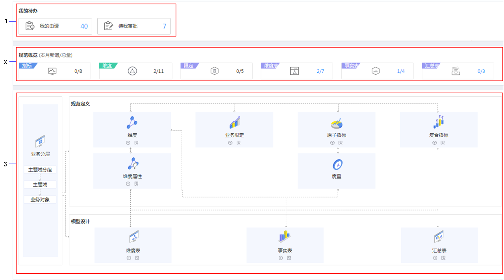

# 维度概览

规范设计概览页面以图表的形式展现规范设计的所有功能信息，使您能够直观的查看所有功能并支持跳转到对应的规范设计模块。

## 入口说明

1.  [登录DAYU控制台](https://console.huaweicloud.com/dayu/)，找到所需要的DAYU实例，单击实例卡片上的“进入控制台”，进入概览页面。

    选择“空间管理”页签，完成工作空间的创建。

    在工作空间列表中，找到所需要的工作空间。

1.  单击相应工作空间的“规范设计“。

    系统跳转至规范设计页面。

2.  单击左侧导航栏中的“维度建模”，进入概览页面。

## 界面说明

**图 1**  概览页面  

<table><thead align="left"><tr id="zh-cn_topic_0169427295_row1962823913115"><th class="cellrowborder" valign="top" width="6.98%" id="mcps1.1.4.1.1">
区域

</th>
<th class="cellrowborder" valign="top" width="13.969999999999999%" id="mcps1.1.4.1.2">
功能

</th>
<th class="cellrowborder" valign="top" width="79.05%" id="mcps1.1.4.1.3">
子类

</th>
</tr>
</thead>
<tbody><tr id="zh-cn_topic_0169427295_row10628133911112"><td class="cellrowborder" rowspan="2" valign="top" width="6.98%" headers="mcps1.1.4.1.1 ">
1

</td>
<td class="cellrowborder" valign="top" width="13.969999999999999%" headers="mcps1.1.4.1.2 ">
我的申请

</td>
<td class="cellrowborder" valign="top" width="79.05%" headers="mcps1.1.4.1.3 ">
显示我申请的总量，通过该按钮进入“我的申请”页面，具体操作请参考<a href="审核中心.md#zh-cn_topic_0172166857_section0591142131018">我的申请</a>。

</td>
</tr>
<tr id="zh-cn_topic_0169427295_row962803915116"><td class="cellrowborder" valign="top" headers="mcps1.1.4.1.1 ">
待我审批

</td>
<td class="cellrowborder" valign="top" headers="mcps1.1.4.1.2 ">
显示需要我审批的总量，通过该按钮进入“待审核”页面。具体操作步骤请参见<a href="审核中心.md#zh-cn_topic_0172166857_section585513412101">待审核</a>。

</td>
</tr>
<tr id="zh-cn_topic_0169427295_row76283391112"><td class="cellrowborder" rowspan="6" valign="top" width="6.98%" headers="mcps1.1.4.1.1 ">
2

</td>
<td class="cellrowborder" valign="top" width="13.969999999999999%" headers="mcps1.1.4.1.2 ">
指标

</td>
<td class="cellrowborder" valign="top" width="79.05%" headers="mcps1.1.4.1.3 ">
显示原子指标和复合指标统计总和。当鼠标在指标图标上，悬浮框显示原子指标和复合指标信息。

<ul id="zh-cn_topic_0169427295_ul7398144513282"><li>原子指标
统计原子指标数，通过汇总的数量进入“原子指标”页面，具体操作请参考<a href="新建原子指标.md">新建原子指标</a>。

</li><li>复合指标
统计复合指标数，通过汇总的数量进入“复合指标”页面，具体操作请参考<a href="新建复合指标.md">新建复合指标</a>。

</li></ul>
</td>
</tr>
<tr id="zh-cn_topic_0169427295_row1388115459167"><td class="cellrowborder" valign="top" headers="mcps1.1.4.1.1 ">
维度

</td>
<td class="cellrowborder" valign="top" headers="mcps1.1.4.1.2 ">
显示维度和维度属性统计总和。当鼠标在指标图标上，悬浮框显示维度和维度属性信息。

<ul id="zh-cn_topic_0169427295_ul10517257115120"><li>维度
统计维度数，通过汇总的数量进入“维度”页面，具体操作请参考<a href="新建维度.md">新建维度</a>。

</li><li>维度表
在新建维度时，维度表就会自动创建，但是并未发布，需要手动发布维度表。进入“维度表”页面，可以查看和管理维度表，具体操作请参考<a href="发布维度表.md">发布维度表</a>。

</li></ul>
</td>
</tr>
<tr id="zh-cn_topic_0169427295_row69120465161"><td class="cellrowborder" valign="top" headers="mcps1.1.4.1.1 ">
限定

</td>
<td class="cellrowborder" valign="top" headers="mcps1.1.4.1.2 ">
显示限定分组、时间分组、通用限定统计总和。当鼠标在指标图标上，悬浮框显示限定分组、时间分组、通用限定的信息。

<ul id="zh-cn_topic_0169427295_ul1444912330556"><li>限定分组
统计限定分组数，通过汇总的数量进入“限定分组”页面，具体操作请参考<a href="新建限定分组.md">新建限定分组</a>。

</li><li>时间限定
统计时间限定数，通过汇总的数量进入“时间限定”页面，具体操作请参考<a href="新建时间限定.md">新建时间限定</a>。

</li><li>通用限定
统计通用限定数，通过汇总的数量进入“通用限定”页面，具体操作请参考<a href="新建通用限定.md">新建通用限定</a>。

</li></ul>
</td>
</tr>
<tr id="zh-cn_topic_0169427295_row16883164714169"><td class="cellrowborder" valign="top" headers="mcps1.1.4.1.1 ">
维度表

</td>
<td class="cellrowborder" valign="top" headers="mcps1.1.4.1.2 ">
统计维度表数，通过汇总的数量进入“维度表”页面，具体操作请参考<a href="发布维度表.md">发布维度表</a>。

</td>
</tr>
<tr id="zh-cn_topic_0169427295_row834175018167"><td class="cellrowborder" valign="top" headers="mcps1.1.4.1.1 ">
事实表

</td>
<td class="cellrowborder" valign="top" headers="mcps1.1.4.1.2 ">
统计事实表数，通过汇总的数量进入“事实表”页面，具体操作请参考<a href="新建事实表.md">新建事实表</a>。

</td>
</tr>
<tr id="zh-cn_topic_0169427295_row5953105012169"><td class="cellrowborder" valign="top" headers="mcps1.1.4.1.1 ">
汇总表

</td>
<td class="cellrowborder" valign="top" headers="mcps1.1.4.1.2 ">
统计汇总表数，通过汇总的数量进入“汇总表”页面，具体操作请参考<a href="新建汇总表.md">新建汇总表</a>。

</td>
</tr>
<tr id="zh-cn_topic_0169427295_row5871951141610"><td class="cellrowborder" rowspan="3" valign="top" width="6.98%" headers="mcps1.1.4.1.1 ">
3

</td>
<td class="cellrowborder" valign="top" width="13.969999999999999%" headers="mcps1.1.4.1.2 ">
业务分层

</td>
<td class="cellrowborder" valign="top" width="79.05%" headers="mcps1.1.4.1.3 ">
包含主题域分组、主题域、业务对象。

通过该按钮进入“业务分类”页面，具体操作请参考<a href="建立业务分层.md">建立业务分层</a>。

</td>
</tr>
<tr id="zh-cn_topic_0169427295_row129804146332"><td class="cellrowborder" valign="top" headers="mcps1.1.4.1.1 ">
规范定义

</td>
<td class="cellrowborder" valign="top" headers="mcps1.1.4.1.2 ">
包含维度、维度属性、业务限定、原子指标、度量、复合指标六种规范定义。

<ul id="zh-cn_topic_0169427295_ul89412178109"><li>通过，进入各规范定义新建页面。</li><li>通过，进入各规范定义页面。</li></ul>
</td>
</tr>
<tr id="zh-cn_topic_0169427295_row7189102210335"><td class="cellrowborder" valign="top" headers="mcps1.1.4.1.1 ">
模型设计

</td>
<td class="cellrowborder" valign="top" headers="mcps1.1.4.1.2 ">
包含维度表、事实表、汇总表三种模型设计。

<ul id="zh-cn_topic_0169427295_ul14871114381316"><li>通过，进入各模型设计新建页面。</li><li>通过，进入各模型列表页面。</li></ul>
</td>
</tr>
</tbody>
</table>

