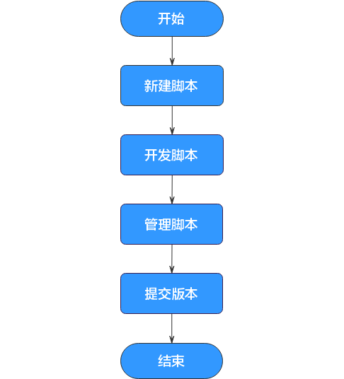

# 脚本开发流程

脚本开发功能提供如下能力：

-   提供在线脚本编辑器，支持多人协作进行SQL、Shell等脚本在线代码开发和调测。
-   支持使用变量和函数。
-   支持脚本的版本管理能力。

脚本开发的使用流程如下：

**图 1**  脚本开发流程  

1.  新建相应类型的脚本。具体请参见[新建脚本](新建脚本.md)。
2.  基于新建的脚本，进行脚本的在线开发、调试和执行。具体请参见[开发脚本](开发脚本.md)。
3.  脚本开发完成后，您可以根据需要，进行脚本管理。具体请参见[管理脚本](管理脚本.md)。
4.  脚本开发、管理完成后，您需要提交脚本版本，脚本提交版本后才能正式地被作业调度运行。具体请参见[管理脚本版本](管理脚本版本.md)。

