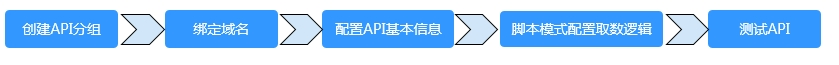
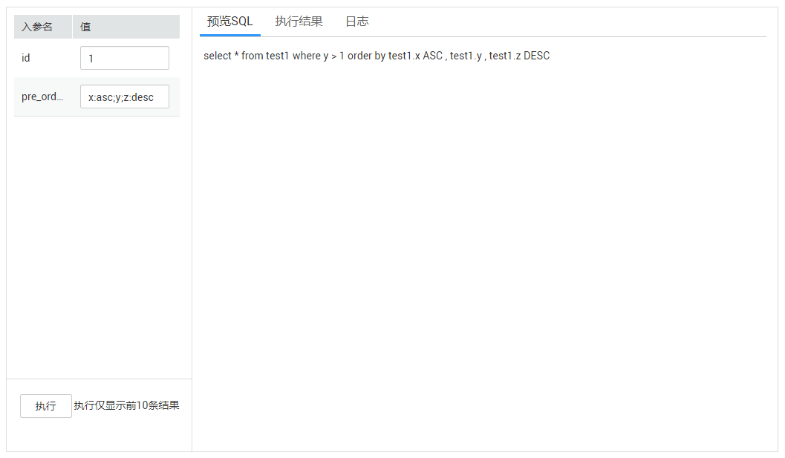

# 脚本模式生成API

本文将为您介绍如何通过脚本模式生成API。

为了满足高阶用户的个性化查询需求，数据服务也提供了自定义SQL的脚本模式，允许您自行编写API的查询SQL，并支持多表关联、复杂查询条件以及聚合函数等能力。

**图 1**  脚本模式生成API流程  

## 配置API基本信息

1.  [登录DAYU控制台](https://console.huaweicloud.com/dayu/)，找到所需要的DAYU实例，单击实例卡片上的“进入控制台”，进入概览页面。

    选择“空间管理”页签，完成工作空间的创建。

    在工作空间列表中，找到所需要的工作空间。

1.  单击相应工作空间的“数据服务“。

    系统跳转至“数据服务“页面。

1.  进入“数据服务 \>  \>  总览  \>  开发API  \>  API管理“页面，单击“新建“，填写API基本信息。

    **表 1**  API基本信息

    
    <table><thead align="left"><tr id="zh-cn_topic_0180012633_zh-cn_topic_0180012632_row5944624142115"><th class="cellrowborder" valign="top" width="17.72%" id="mcps1.2.3.1.1">
配置

    </th>
    <th class="cellrowborder" valign="top" width="82.28%" id="mcps1.2.3.1.2">
说明

    </th>
    </tr>
    </thead>
    <tbody><tr id="zh-cn_topic_0180012633_zh-cn_topic_0180012632_row8944132412212"><td class="cellrowborder" valign="top" width="17.72%" headers="mcps1.2.3.1.1 ">
API名称

    </td>
    <td class="cellrowborder" valign="top" width="82.28%" headers="mcps1.2.3.1.2 ">
支持中文、英文、数字、下划线，且只能以英文或中文开头，3-64个字符。

    </td>
    </tr>
    <tr id="zh-cn_topic_0180012633_zh-cn_topic_0180012632_row159441924202111"><td class="cellrowborder" valign="top" width="17.72%" headers="mcps1.2.3.1.1 ">
API分组

    </td>
    <td class="cellrowborder" valign="top" width="82.28%" headers="mcps1.2.3.1.2 ">
一个特定功能或场景的API集合，是数据服务中API的最小组织单元，也是API网关中的最小管理单元。

    
您可单击“新建”进行新建，也可选择<a href="向导模式生成API.md#zh-cn_topic_0180012632_section18624154416414">管理API分组</a>已创建的API分组。

    </td>
    </tr>
    <tr id="zh-cn_topic_0180012633_zh-cn_topic_0180012632_row19944122419211"><td class="cellrowborder" valign="top" width="17.72%" headers="mcps1.2.3.1.1 ">
请求Path

    </td>
    <td class="cellrowborder" valign="top" width="82.28%" headers="mcps1.2.3.1.2 ">
资源路径，也即API访问路径。

    
示例：/v2/{project_id}/streams

    </td>
    </tr>
    <tr id="zh-cn_topic_0180012633_zh-cn_topic_0180012632_row5944724132111"><td class="cellrowborder" valign="top" width="17.72%" headers="mcps1.2.3.1.1 ">
参数协议

    </td>
    <td class="cellrowborder" valign="top" width="82.28%" headers="mcps1.2.3.1.2 ">
用于传输请求的协议，支持HTTP和HTTPS协议。

    </td>
    </tr>
    <tr id="zh-cn_topic_0180012633_zh-cn_topic_0180012632_row4944624182114"><td class="cellrowborder" valign="top" width="17.72%" headers="mcps1.2.3.1.1 ">
请求方法

    </td>
    <td class="cellrowborder" valign="top" width="82.28%" headers="mcps1.2.3.1.2 ">
HTTP请求方法（也称为操作或动词），它告诉服务你正在请求什么类型的操作。

    
GET：请求服务器返回指定资源。

    
POST：请求服务器新增资源或执行特殊操作。

    </td>
    </tr>
    <tr id="zh-cn_topic_0180012633_zh-cn_topic_0180012632_row894416245216"><td class="cellrowborder" valign="top" width="17.72%" headers="mcps1.2.3.1.1 ">
描述

    </td>
    <td class="cellrowborder" valign="top" width="82.28%" headers="mcps1.2.3.1.2 ">
对API进行简要描述。

    </td>
    </tr>
    <tr id="zh-cn_topic_0180012633_zh-cn_topic_0180012632_row14789201319239"><td class="cellrowborder" valign="top" width="17.72%" headers="mcps1.2.3.1.1 ">
负责人

    </td>
    <td class="cellrowborder" valign="top" width="82.28%" headers="mcps1.2.3.1.2 ">
拥有API的审核权限。

    
单击“新建”，进入“审核中心 &gt; 审核人管理”页面，新建审核人。

    </td>
    </tr>
    <tr id="zh-cn_topic_0180012633_zh-cn_topic_0180012632_row1451110214238"><td class="cellrowborder" valign="top" width="17.72%" headers="mcps1.2.3.1.1 ">
是否公开

    </td>
    <td class="cellrowborder" valign="top" width="82.28%" headers="mcps1.2.3.1.2 ">
勾选，则发布的API将在服务市场公开售卖。

    </td>
    </tr>
    <tr id="zh-cn_topic_0180012633_zh-cn_topic_0180012632_row19497130152315"><td class="cellrowborder" valign="top" width="17.72%" headers="mcps1.2.3.1.1 ">
入参定义

    </td>
    <td class="cellrowborder" valign="top" width="82.28%" headers="mcps1.2.3.1.2 ">
配置API请求中的参数，包含资源路径中的动态参数，请求URI中的查询参数和Header参数。

    
以配置资源路径中的动态参数为例进行说明，例如资源路径（请求Path）设置为：

    
/v2/{project_id}/streams，资源路径中的{project_id}为动态参数，需要在此进行配置。

    <ol id="zh-cn_topic_0180012633_zh-cn_topic_0180012632_ol15807165012339"><li>单击“添加”，参数名配置为project_id。</li><li>参数位置选择PATH。</li><li>类型设置为STRING</li><li>选择性配置示例值和描述。</li></ol>
    </td>
    </tr>
    </tbody>
    </table>

2.  配置好API基本信息后，单击“下一步“，即可进入API取数逻辑页面。

## 配置取数逻辑

“取数方式“选择“脚本方式“：

1.  选择数据源，数据连接，数据库，队列，获取到需要配置的表。

    > **说明：**   
    >您需提前在数据集成中配置好数据源，按照脚本编辑提示要求输入SQL语句。  

2.  编写API查询SQL。

    在脚本编辑页面，按照脚本编辑提示要求输入SQL语句。

    > **说明：**   
    >-   SELECT查询的字段即为API返回参数  
    >-   WHERE条件中的参数为API请求参数，参数格式为$\{参数名\}  

3.  添加排序参数。

    在排序参数列表中，设置排序字段是否可选，排序方式和描述。

    单击，将入参和排序参数添加为SQL语句的API请求参数。

    > **说明：**   
    >添加排序参数前，请确保sql是语句正确。  

    **图 2**  添加排序参数  
    

4.  编辑请求参数信息

    编写好API查询SQL后，单击“测试SQL“，在数据库字段页签内绑定http入参。参见[配置取数逻辑](向导模式生成API.md#zh-cn_topic_0180012632_section294754991217)中的[6](向导模式生成API.md#zh-cn_topic_0180012632_li313513211613)配置pre\_order\_by参数。

    **图 3**  配置pre\_order\_by  
    

    > **须知：**   
    >pre\_order\_by是非必填参数，当未配置pre\_order\_by参数值时，则选取非可选排序字段作为排序的依据。  

## API测试

完成API参数的配置并保存后，单击左下角的“开始测试“，即可进入API测试环节。  填写参数值，单击“开始测试“，即可在线发送API请求，在右侧可以看到API请求详情及返回内容。如果测试失败，请仔细查看错误提示并做相应的修改重新测试。 配置过程中需要注意正常返回示例的设置。

完成API测试之后，单击“确定“，即成功生成了一个数据API。

