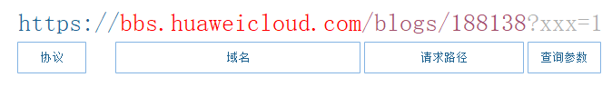

# 脚本模式生成API<a name="dgc_01_0306"></a>

本文将为您介绍如何通过脚本模式生成API。

为了满足高阶用户的个性化查询需求，数据服务也提供了自定义SQL的脚本模式，允许您自行编写API的查询SQL，并支持多表关联、复杂查询条件以及聚合函数等能力。

## 配置API基本信息<a name="zh-cn_topic_0180012633_section062261417391"></a>

1.  在DGC控制台首页，选择对应工作空间的“数据服务“模块，进入数据服务页面。

    **图 1**  选择数据服务<a name="dgc_01_0305_dgc_01_0313_dgc_01_0009_fig1540042925813"></a>  
    


1.  在左侧导航选择服务版本（例如：专享版），进入总览页。
2.  进入“API管理“页面，单击“新建“，填写API基本信息。

    **表 1**  API基本信息

    <a name="dgc_01_0305_zh-cn_topic_0180012632_table8943152418215"></a>
    <table><thead align="left"><tr id="dgc_01_0305_zh-cn_topic_0180012632_row5944624142115"><th class="cellrowborder" valign="top" width="17.72%" id="mcps1.2.3.1.1"><p id="dgc_01_0305_zh-cn_topic_0180012632_p14944024102112"><a name="dgc_01_0305_zh-cn_topic_0180012632_p14944024102112"></a><a name="dgc_01_0305_zh-cn_topic_0180012632_p14944024102112"></a>配置</p>
    </th>
    <th class="cellrowborder" valign="top" width="82.28%" id="mcps1.2.3.1.2"><p id="dgc_01_0305_zh-cn_topic_0180012632_p1994412244215"><a name="dgc_01_0305_zh-cn_topic_0180012632_p1994412244215"></a><a name="dgc_01_0305_zh-cn_topic_0180012632_p1994412244215"></a>说明</p>
    </th>
    </tr>
    </thead>
    <tbody><tr id="dgc_01_0305_zh-cn_topic_0180012632_row8944132412212"><td class="cellrowborder" valign="top" width="17.72%" headers="mcps1.2.3.1.1 "><p id="dgc_01_0305_zh-cn_topic_0180012632_p14944324122114"><a name="dgc_01_0305_zh-cn_topic_0180012632_p14944324122114"></a><a name="dgc_01_0305_zh-cn_topic_0180012632_p14944324122114"></a>API名称</p>
    </td>
    <td class="cellrowborder" valign="top" width="82.28%" headers="mcps1.2.3.1.2 "><p id="dgc_01_0305_zh-cn_topic_0180012632_p2094432432115"><a name="dgc_01_0305_zh-cn_topic_0180012632_p2094432432115"></a><a name="dgc_01_0305_zh-cn_topic_0180012632_p2094432432115"></a>支持中文、英文、数字、下划线，且只能以英文或中文开头，3-64个字符。</p>
    </td>
    </tr>
    <tr id="dgc_01_0305_zh-cn_topic_0180012632_row159441924202111"><td class="cellrowborder" valign="top" width="17.72%" headers="mcps1.2.3.1.1 "><p id="dgc_01_0305_zh-cn_topic_0180012632_p139441124162110"><a name="dgc_01_0305_zh-cn_topic_0180012632_p139441124162110"></a><a name="dgc_01_0305_zh-cn_topic_0180012632_p139441124162110"></a>API目录</p>
    </td>
    <td class="cellrowborder" valign="top" width="82.28%" headers="mcps1.2.3.1.2 "><p id="dgc_01_0305_zh-cn_topic_0180012632_p1794417249211"><a name="dgc_01_0305_zh-cn_topic_0180012632_p1794417249211"></a><a name="dgc_01_0305_zh-cn_topic_0180012632_p1794417249211"></a>一个特定功能或场景的API集合，类似文件夹，是数据服务中API的最小组织单元，也是API网关中的最小管理单元。</p>
    <p id="dgc_01_0305_zh-cn_topic_0180012632_p0237181018261"><a name="dgc_01_0305_zh-cn_topic_0180012632_p0237181018261"></a><a name="dgc_01_0305_zh-cn_topic_0180012632_p0237181018261"></a>您可单击<span class="uicontrol" id="dgc_01_0305_zh-cn_topic_0180012632_uicontrol179511519182615"><a name="dgc_01_0305_zh-cn_topic_0180012632_uicontrol179511519182615"></a><a name="dgc_01_0305_zh-cn_topic_0180012632_uicontrol179511519182615"></a>“新建”</span>进行新建，也可选择<a href="配置模式生成API.md#zh-cn_topic_0180012632_section18624154416414">新建API目录</a>已创建的API分组。</p>
    </td>
    </tr>
    <tr id="dgc_01_0305_zh-cn_topic_0180012632_row19944122419211"><td class="cellrowborder" valign="top" width="17.72%" headers="mcps1.2.3.1.1 "><p id="dgc_01_0305_zh-cn_topic_0180012632_p09441624182110"><a name="dgc_01_0305_zh-cn_topic_0180012632_p09441624182110"></a><a name="dgc_01_0305_zh-cn_topic_0180012632_p09441624182110"></a>请求Path</p>
    </td>
    <td class="cellrowborder" valign="top" width="82.28%" headers="mcps1.2.3.1.2 "><p id="dgc_01_0305_p181510159221"><a name="dgc_01_0305_p181510159221"></a><a name="dgc_01_0305_p181510159221"></a>API访问路径，例如：/v2/{project_id}/streams。</p>
    <p id="dgc_01_0305_p1018725172211"><a name="dgc_01_0305_p1018725172211"></a><a name="dgc_01_0305_p1018725172211"></a>请求Path即完整的url中，域名之后、查询参数之前的部分，如<a href="#dgc_01_0305_fig12437742151811">图2</a>中的“/blogs/188138”。</p>
    <div class="fignone" id="dgc_01_0305_fig12437742151811"><a name="dgc_01_0305_fig12437742151811"></a><a name="dgc_01_0305_fig12437742151811"></a><span class="figcap"><b>图1 </b>统一资源定位符url说明</span><br><a name="dgc_01_0305_image18444131031716"></a><a name="dgc_01_0305_image18444131031716"></a><span></span></div>
    <p id="dgc_01_0305_p127834621618"><a name="dgc_01_0305_p127834621618"></a><a name="dgc_01_0305_p127834621618"></a>在请求路径中，可以使用大括号{}标识路径中的参数作为通配符。如“/blogs/{blog_id}”表示/blogs后可以携带任何参数，例如“/blogs/188138”和“/blogs/0”均会匹配至/blogs/{blog_id}，由此API统一处理。</p>
    <p id="dgc_01_0305_p1378164611166"><a name="dgc_01_0305_p1378164611166"></a><a name="dgc_01_0305_p1378164611166"></a>此外，相同域名下，不允许重复的请求路径出现。路径参数作为通配符时，名称不具备唯一性，例如“/blogs/{blog_id}”和“/blogs/{xxxx}”，会被视作相同路径。</p>
    </td>
    </tr>
    <tr id="dgc_01_0305_zh-cn_topic_0180012632_row5944724132111"><td class="cellrowborder" valign="top" width="17.72%" headers="mcps1.2.3.1.1 "><p id="dgc_01_0305_zh-cn_topic_0180012632_p1894482414216"><a name="dgc_01_0305_zh-cn_topic_0180012632_p1894482414216"></a><a name="dgc_01_0305_zh-cn_topic_0180012632_p1894482414216"></a>参数协议</p>
    </td>
    <td class="cellrowborder" valign="top" width="82.28%" headers="mcps1.2.3.1.2 "><p id="dgc_01_0305_zh-cn_topic_0180012632_p594432412116"><a name="dgc_01_0305_zh-cn_topic_0180012632_p594432412116"></a><a name="dgc_01_0305_zh-cn_topic_0180012632_p594432412116"></a>用于传输请求的协议，支持HTTP和HTTPS协议。</p>
    <a name="dgc_01_0305_ul4812711122715"></a><a name="dgc_01_0305_ul4812711122715"></a><ul id="dgc_01_0305_ul4812711122715"><li>HTTP属于基础的网络传输协议，无状态、无连接、简单、快速、灵活、使用明文传输，在使用上较为便捷，但是安全性欠佳。</li><li>HTTPS是在HTTP协议上进行了SSL或TLS加密校验的协议，能够有效验证身份以及保护数据完整性。相对的，访问HTTPS的API，需要配置相关的SSL证书或跳过SSL校验，否则将无法访问。</li></ul>
    </td>
    </tr>
    <tr id="dgc_01_0305_zh-cn_topic_0180012632_row4944624182114"><td class="cellrowborder" valign="top" width="17.72%" headers="mcps1.2.3.1.1 "><p id="dgc_01_0305_zh-cn_topic_0180012632_p1294432416216"><a name="dgc_01_0305_zh-cn_topic_0180012632_p1294432416216"></a><a name="dgc_01_0305_zh-cn_topic_0180012632_p1294432416216"></a>请求方法</p>
    </td>
    <td class="cellrowborder" valign="top" width="82.28%" headers="mcps1.2.3.1.2 "><p id="dgc_01_0305_zh-cn_topic_0180012632_zh-cn_topic_0121682347_p46347563325"><a name="dgc_01_0305_zh-cn_topic_0180012632_zh-cn_topic_0121682347_p46347563325"></a><a name="dgc_01_0305_zh-cn_topic_0180012632_zh-cn_topic_0121682347_p46347563325"></a>HTTP请求方法（也称为操作或动词），表示请求什么类型的操作，包含GET、POST等，遵循resultful风格。</p>
    <a name="dgc_01_0305_ul11795164411287"></a><a name="dgc_01_0305_ul11795164411287"></a><ul id="dgc_01_0305_ul11795164411287"><li>GET：请求服务器返回指定资源，推荐使用GET请求。</li><li>POST：请求服务器新增资源或执行特殊操作，仅在注册API时使用。POST请求当前不支持body体，而是直接透传。</li></ul>
    </td>
    </tr>
    <tr id="dgc_01_0305_zh-cn_topic_0180012632_row894416245216"><td class="cellrowborder" valign="top" width="17.72%" headers="mcps1.2.3.1.1 "><p id="dgc_01_0305_zh-cn_topic_0180012632_p39447244210"><a name="dgc_01_0305_zh-cn_topic_0180012632_p39447244210"></a><a name="dgc_01_0305_zh-cn_topic_0180012632_p39447244210"></a>描述</p>
    </td>
    <td class="cellrowborder" valign="top" width="82.28%" headers="mcps1.2.3.1.2 "><p id="dgc_01_0305_zh-cn_topic_0180012632_p1794482452113"><a name="dgc_01_0305_zh-cn_topic_0180012632_p1794482452113"></a><a name="dgc_01_0305_zh-cn_topic_0180012632_p1794482452113"></a>对API进行简要描述。</p>
    </td>
    </tr>
    <tr id="dgc_01_0305_row385843612229"><td class="cellrowborder" valign="top" width="17.72%" headers="mcps1.2.3.1.1 "><p id="dgc_01_0305_p68593365220"><a name="dgc_01_0305_p68593365220"></a><a name="dgc_01_0305_p68593365220"></a>标签</p>
    </td>
    <td class="cellrowborder" valign="top" width="82.28%" headers="mcps1.2.3.1.2 "><p id="dgc_01_0305_p9859436102213"><a name="dgc_01_0305_p9859436102213"></a><a name="dgc_01_0305_p9859436102213"></a>对API设置标签。用于标记当前API的属性，创建后可以通过标签快速检索定位API。单个API最多可设置20个标签。</p>
    </td>
    </tr>
    <tr id="dgc_01_0305_zh-cn_topic_0180012632_row14789201319239"><td class="cellrowborder" valign="top" width="17.72%" headers="mcps1.2.3.1.1 "><p id="dgc_01_0305_zh-cn_topic_0180012632_p479016137235"><a name="dgc_01_0305_zh-cn_topic_0180012632_p479016137235"></a><a name="dgc_01_0305_zh-cn_topic_0180012632_p479016137235"></a>审核人</p>
    </td>
    <td class="cellrowborder" valign="top" width="82.28%" headers="mcps1.2.3.1.2 "><p id="dgc_01_0305_zh-cn_topic_0180012632_p879091315236"><a name="dgc_01_0305_zh-cn_topic_0180012632_p879091315236"></a><a name="dgc_01_0305_zh-cn_topic_0180012632_p879091315236"></a>拥有API的审核权限。</p>
    <p id="dgc_01_0305_zh-cn_topic_0180012632_p1560823194914"><a name="dgc_01_0305_zh-cn_topic_0180012632_p1560823194914"></a><a name="dgc_01_0305_zh-cn_topic_0180012632_p1560823194914"></a>单击<span class="uicontrol" id="dgc_01_0305_zh-cn_topic_0180012632_uicontrol59411231144917"><a name="dgc_01_0305_zh-cn_topic_0180012632_uicontrol59411231144917"></a><a name="dgc_01_0305_zh-cn_topic_0180012632_uicontrol59411231144917"></a>“新建”</span>，进入<span class="menucascade" id="dgc_01_0305_zh-cn_topic_0180012632_menucascade4679476507"><a name="dgc_01_0305_zh-cn_topic_0180012632_menucascade4679476507"></a><a name="dgc_01_0305_zh-cn_topic_0180012632_menucascade4679476507"></a>“<span class="uicontrol" id="dgc_01_0305_zh-cn_topic_0180012632_uicontrol8679147205019"><a name="dgc_01_0305_zh-cn_topic_0180012632_uicontrol8679147205019"></a><a name="dgc_01_0305_zh-cn_topic_0180012632_uicontrol8679147205019"></a>审核中心</span> &gt; <span class="uicontrol" id="dgc_01_0305_zh-cn_topic_0180012632_uicontrol3431311175015"><a name="dgc_01_0305_zh-cn_topic_0180012632_uicontrol3431311175015"></a><a name="dgc_01_0305_zh-cn_topic_0180012632_uicontrol3431311175015"></a>审核人管理</span>”</span>页面，新建审核人。</p>
    </td>
    </tr>
    <tr id="dgc_01_0305_zh-cn_topic_0180012632_row1128545124219"><td class="cellrowborder" valign="top" width="17.72%" headers="mcps1.2.3.1.1 "><p id="dgc_01_0305_zh-cn_topic_0180012632_p0129145184217"><a name="dgc_01_0305_zh-cn_topic_0180012632_p0129145184217"></a><a name="dgc_01_0305_zh-cn_topic_0180012632_p0129145184217"></a>安全认证</p>
    </td>
    <td class="cellrowborder" valign="top" width="82.28%" headers="mcps1.2.3.1.2 "><p id="dgc_01_0305_zh-cn_topic_0180012632_p83993263315"><a name="dgc_01_0305_zh-cn_topic_0180012632_p83993263315"></a><a name="dgc_01_0305_zh-cn_topic_0180012632_p83993263315"></a>API认证方式：</p>
    <a name="dgc_01_0305_zh-cn_topic_0180012632_ul1239910233312"></a><a name="dgc_01_0305_zh-cn_topic_0180012632_ul1239910233312"></a><ul id="dgc_01_0305_zh-cn_topic_0180012632_ul1239910233312"><li>APP认证：表示由API网关服务负责接口请求的安全认证，安全级别最高。</li><li>IAM认证：表示借助IAM服务进行安全认证，安全级别中等。</li><li>无认证：属于无防护的模式，无需认证即可访问，安全级别低，不推荐使用。</li></ul>
    </td>
    </tr>
    <tr id="dgc_01_0305_row5776121204916"><td class="cellrowborder" valign="top" width="17.72%" headers="mcps1.2.3.1.1 "><p id="dgc_01_0305_p7777111274915"><a name="dgc_01_0305_p7777111274915"></a><a name="dgc_01_0305_p7777111274915"></a>服务目录可见性</p>
    </td>
    <td class="cellrowborder" valign="top" width="82.28%" headers="mcps1.2.3.1.2 "><p id="dgc_01_0305_p1177716123493"><a name="dgc_01_0305_p1177716123493"></a><a name="dgc_01_0305_p1177716123493"></a>发布后，所选范围内的用户均可以在服务目录中看到此API。</p>
    <a name="dgc_01_0305_ul1261051712476"></a><a name="dgc_01_0305_ul1261051712476"></a><ul id="dgc_01_0305_ul1261051712476"><li>当前工作空间可见</li><li>当前项目可见</li><li>当前租户可见</li></ul>
    </td>
    </tr>
    <tr id="dgc_01_0305_zh-cn_topic_0180012632_row124091155194218"><td class="cellrowborder" valign="top" width="17.72%" headers="mcps1.2.3.1.1 "><p id="dgc_01_0305_zh-cn_topic_0180012632_p1941013554422"><a name="dgc_01_0305_zh-cn_topic_0180012632_p1941013554422"></a><a name="dgc_01_0305_zh-cn_topic_0180012632_p1941013554422"></a>访问日志</p>
    </td>
    <td class="cellrowborder" valign="top" width="82.28%" headers="mcps1.2.3.1.2 "><p id="dgc_01_0305_zh-cn_topic_0180012632_p241013552428"><a name="dgc_01_0305_zh-cn_topic_0180012632_p241013552428"></a><a name="dgc_01_0305_zh-cn_topic_0180012632_p241013552428"></a>勾选，则此API的查询结果将会产生记录并被保留7天，可以在访问日志处进行查看。</p>
    </td>
    </tr>
    <tr id="dgc_01_0305_row14181050122214"><td class="cellrowborder" valign="top" width="17.72%" headers="mcps1.2.3.1.1 "><p id="dgc_01_0305_p14779121017198"><a name="dgc_01_0305_p14779121017198"></a><a name="dgc_01_0305_p14779121017198"></a>最低保留期限</p>
    </td>
    <td class="cellrowborder" valign="top" width="82.28%" headers="mcps1.2.3.1.2 "><p id="dgc_01_0305_p2779171051910"><a name="dgc_01_0305_p2779171051910"></a><a name="dgc_01_0305_p2779171051910"></a>API解绑前预留的最低期限。 API进行停用/下线/取消授权时, 会通知已授权用户, 并为用户预留至少X小时, 直到所有授权用户均完成解除或处理，或者到达截止时间, API才会停用/下线/取消授权。0表示不设限制。</p>
    </td>
    </tr>
    <tr id="dgc_01_0305_zh-cn_topic_0180012632_row19497130152315"><td class="cellrowborder" valign="top" width="17.72%" headers="mcps1.2.3.1.1 "><p id="dgc_01_0305_zh-cn_topic_0180012632_p9497330112317"><a name="dgc_01_0305_zh-cn_topic_0180012632_p9497330112317"></a><a name="dgc_01_0305_zh-cn_topic_0180012632_p9497330112317"></a>入参定义</p>
    </td>
    <td class="cellrowborder" valign="top" width="82.28%" headers="mcps1.2.3.1.2 "><p id="dgc_01_0305_zh-cn_topic_0180012632_p194971030182316"><a name="dgc_01_0305_zh-cn_topic_0180012632_p194971030182316"></a><a name="dgc_01_0305_zh-cn_topic_0180012632_p194971030182316"></a>配置API请求中的参数，包含资源路径中的动态参数，请求URI中的查询参数和Header参数。</p>
    <p id="dgc_01_0305_p9224193383012"><a name="dgc_01_0305_p9224193383012"></a><a name="dgc_01_0305_p9224193383012"></a>添加入参定义时，如果参数设定为必填，则API在访问时，必须传入指定参数；如果非必填，则在API访问时，未传入的参数，会使用默认值进行代替。</p>
    <p id="dgc_01_0305_p1347545456"><a name="dgc_01_0305_p1347545456"></a><a name="dgc_01_0305_p1347545456"></a>参数大小限制如下：</p>
    <a name="dgc_01_0305_ul511616244462"></a><a name="dgc_01_0305_ul511616244462"></a><ul id="dgc_01_0305_ul511616244462"><li>query+path，url最大32KB</li><li>header，最大128KB</li><li>body， 最大128KB</li></ul>
    <p id="dgc_01_0305_zh-cn_topic_0180012632_p595114163011"><a name="dgc_01_0305_zh-cn_topic_0180012632_p595114163011"></a><a name="dgc_01_0305_zh-cn_topic_0180012632_p595114163011"></a>以配置资源路径中的动态参数为例进行说明，例如资源路径（请求Path）设置为：</p>
    <p id="dgc_01_0305_zh-cn_topic_0180012632_p375510579322"><a name="dgc_01_0305_zh-cn_topic_0180012632_p375510579322"></a><a name="dgc_01_0305_zh-cn_topic_0180012632_p375510579322"></a>/v2/{project_id}/streams，资源路径中的{project_id}为动态参数，需要在此进行配置。</p>
    <a name="dgc_01_0305_zh-cn_topic_0180012632_ol15807165012339"></a><a name="dgc_01_0305_zh-cn_topic_0180012632_ol15807165012339"></a><ol id="dgc_01_0305_zh-cn_topic_0180012632_ol15807165012339"><li>单击<span class="uicontrol" id="dgc_01_0305_zh-cn_topic_0180012632_uicontrol598818352341"><a name="dgc_01_0305_zh-cn_topic_0180012632_uicontrol598818352341"></a><a name="dgc_01_0305_zh-cn_topic_0180012632_uicontrol598818352341"></a>“添加”</span>，参数名配置为project_id。</li><li>参数位置选择PATH。</li><li>类型设置为STRING。</li><li>选择性配置示例值和描述。</li></ol>
    </td>
    </tr>
    </tbody>
    </table>

3.  配置好API基本信息后，单击“下一步“，即可进入API取数逻辑页面。

## 配置取数逻辑<a name="zh-cn_topic_0180012633_section294754991217"></a>

“取数方式“选择“脚本方式“：

1.  选择数据源、数据连接、数据库和队列，获取到需要配置的表。

    > **说明：** 
    >数据服务仅支持部分数据源，详情请参见[DGC支持的数据源](DGC支持的数据源.md)。您需提前在DGC管理中心中配置好数据源，按照脚本编辑提示要求输入SQL语句。

2.  编写API查询SQL。

    在脚本编辑页面，按照脚本编辑提示要求输入SQL语句。

    > **说明：** 
    >-   SELECT查询的字段即为API返回参数
    >-   WHERE条件中的参数为API请求参数，参数格式为$\{参数名\}

3.  选择分页方式。
    -   默认分页是指在创建API时输入了SQL，数据服务会自动基于SQL外层包装分页逻辑。例如输入的SQL脚本为：

        ```
        SELECT * FROM tableName
        ```

        数据服务在处理调试或者调用时，将自动在用户SQL外层包装分页逻辑，从而变成以下脚本：

        ```
        SELECT * FROM (SELECT * FROM tableName) LIMIT {pageSize} OFFSET {offsetValue}
        ```

        其中pageNum、offsetValue为调试或者调用时传入参数的值。如果未定义pageNum参数的话，数据服务将默认给API设置一个pageNum参数；offsetValue是调试或者调用时传入参数pageSize的值计算得到，如果用户未定义pageSize参数的话，数据服务将默认给API设置一个pageSize参数。

    -   自定义分页是指用户在创建API时，数据服务将不对用户SQL进行处理，分页逻辑完全由用户定义。如果用户需要创建分页的API的话，则可以在写SQL时加入分页逻辑。例如：

        ```
        SELECT * FROM tableName LIMIT {pageSize} OFFSET {offsetValue}
        ```

4.  添加排序参数。

    在排序参数列表中，设置排序字段是否可选，排序方式和描述。

    单击，将入参和排序参数添加为SQL语句的API请求参数。

    > **说明：** 
    >添加排序参数前，请确保SQL语句正确。

5.  编辑请求参数信息

    编写好API查询SQL后，单击“测试SQL“，在数据库字段页签内绑定HTTP入参。参见[配置取数逻辑](配置模式生成API.md#zh-cn_topic_0180012632_section294754991217)中的[6](配置模式生成API.md#zh-cn_topic_0180012632_li313513211613)配置pre\_order\_by参数。

    > **说明：** 
    >pre\_order\_by是非必填参数，当未配置pre\_order\_by参数值时，则选取非可选排序字段作为排序的依据。


## 测试API<a name="zh-cn_topic_0180012633_section4309151185512"></a>

完成API参数的配置并保存后，单击左下角的“开始测试“，可进入API测试环节。

填写参数值，单击“开始测试“，即可在线发送API请求，在右侧可以看到API请求详情及返回内容。如果测试失败，请仔细查看错误提示并做相应的修改重新测试。 配置过程中需要注意正常返回示例的设置。

完成API测试之后，单击“确定“，即成功生成了一个数据API。

## 修改API<a name="section144814229434"></a>

生成API后，如果您需要修改API内容，可在“开发API \> API目录”或“开发API \> API管理”处选择对应API，点击“编辑”按钮进行修改API的相关操作。

> **说明：** 
>仅当API处于已创建、已驳回、已下线、已停用的情况下才能进行API修改。

