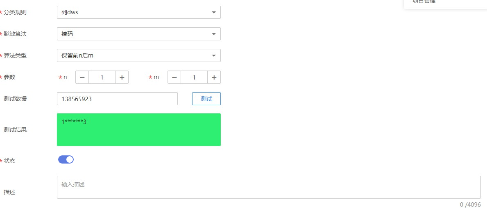

# 脱敏策略

本节介绍如何创建数据脱敏策略，并在数据资产中进行脱敏查询。

## 前提条件

-   数据分类规则已创建，数据分类规则的创建请参见[数据分类](数据分类.md)。
-   数据连接，数据表已创建成功。

## 创建脱敏策略

1.  在DGC控制台首页，选择对应工作空间的“数据资产“模块，进入数据资产页面。

    **图 1**  选择数据资产  
    

1.  选择“数据安全  \>  脱敏策略“，在“脱敏策略“页面中，单击“新建“。
2.  绑定分类规则，配置脱敏算法并适配对应的算法类型。脱敏算法包含掩码，截断和哈希。每种脱敏算法对应多种算法类型，请根据产品界面进行选择，这里不再赘述。配置完成后单击“确定”。

    > **说明：** 
    >已被绑定脱敏算法的分类规则不支持被重复绑定。

    **图 2**  新建脱敏  
    

3.  适配脱敏算法后，支持用户在线进行测试。输入测试数据，单击“测试“，在测试结果文本框中进行验证。
4.  开启或关闭状态，只有启用状态下的脱敏策略才可生效。

## 查看数据脱敏效果

1.  在DGC控制台首页，选择对应工作空间的“数据资产“模块，进入数据资产页面。

    **图 3**  选择数据资产  
    

1.  选择“数据地图  \>  数据目录“。
2.  在资产搜索结果列表，搜索脱敏后的数据表，进入数据表详情页面。
3.  单击“数据预览“，查看数据脱敏后的效果。

