# 自定义SparkStreaming作业<a name="dgc_01_0253"></a>

## 获取DIS Spark Streaming Demo<a name="zh-cn_topic_0120206088_section16275191815595"></a>

1.  在[https://dis-publish.obs-website.cn-north-1.myhuaweicloud.com/](https://dis-publish.obs-website.cn-north-1.myhuaweicloud.com/)中下载“dis-spark-streaming-_X.X.X_.zip”压缩包。
2.  解压“dis-spark-streaming-_X.X.X_.zip”压缩包，解压之后获得以下目录：
    -   “dis-spark-streaming-demo”目录包含一个Maven工程样例。


## 编写SparkStreaming作业<a name="zh-cn_topic_0120206088_section4634938618440"></a>

以IntelliJ IDEA社区版为例，说明如何编写SparkStreaming作业。请先确保在IDEA上已经正确配置好

-   JDK 1.8+
-   Scala-sdk-2.11
-   Maven 3.3.\*

1.  打开IntelliJIDEA，选择“File  \>  Open“。选择解压至本地的dis-spark-streaming-demo目录，双击pom.xml。

    

2.  当弹出如下对话框，请选择“Open as Project“，作为工程打开。

    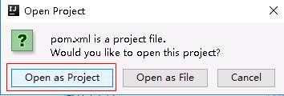

3.  单击“New Window“，在新窗口打开此工程。

    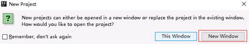

4.  在新打开的IDEA窗口中，单击“File  \>  Settings“。

    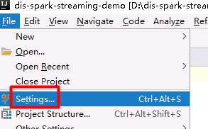

5.  在搜索框搜索maven，找到maven的配置，请确保Maven home directory\(Maven安装路径\)，User settings file \(settings.xml文件位置\)和Local repository\(本地仓库地址\)配置正确。

    > **说明：** 
    >若不正确，请修改，否则[2](准备DIS-Spark-Streaming的相关环境.md#zh-cn_topic_0120206049_li58387279)中安装的SDK无法找到。

    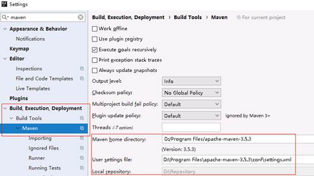

6.  打开DISSparkStreamingExample文件，如果IDEA提示“No Scala SDK in module”，请单击旁边的“Setup Scala SDK”，会显示Scala SDK列表\(如果没有可以创建一个并关联scala路径\)，选择2.11版本的即可。

    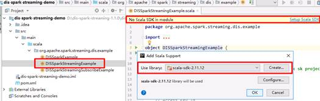

7.  在pom.xml上单击右键，选择“Maven  \>  Reimport“，重新引入maven依赖库。

    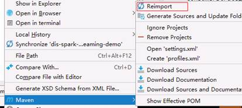

8.  此时IDEA打开的DISSparkStreamingExample文件内没有错误即表示开发环境配置成功，此文件的逻辑是读取DIS通道中的数据并统计每个单词出现次数。

    1.  DISSparkStreamingExample是一个使用Assign模式的样例，不具备停止再启动时从上一次停止位置开始的能力。使用到的SDK构造方法如下：

    ```
    ConsumerStrategies.Assign[String, String](streamName, params, startingOffsets)
    ```

    -   streamName为DIS通道名称。
    -   params为参数Map集合，至少包括endpoint（DIS网关地址）,region（区域），ak（用户ak）,sk（用户sk）,projectId（用户项目ID）。
    -   startingOffsets为读取DIS数据的起始位置，LATEST表示从最新的数据开始读取；EARLIEST表示从最旧的数据开始读取；如果要指定每个分区的精确起始位置，则可以写为json字符串，例如\{"0":23,"1":-1,"2":-2\}表示第0分区起始位置是23，第1分区从最新数据的位置开始，第2分区从最老数据的位置开始，如果有分区没有指定位置，则默认从最新数据位置开始。

    1.  DISSparkStreamingSubscribeExample是一个使用Subscribe模式的样例，具备停止再启动时从上一次停止位置开始的能力。使用到的SDK构造方法如下：

    ```
    ConsumerStrategies.Subscribe[String, String](Array(streamName), params)
    ```

    -   streamName为DIS通道名称
    -   params为参数Map集合，至少包括endpoint（DIS网关地址）,region（区域），ak（用户ak）,sk（用户sk）,projectId（用户项目ID），group.id（app名称，表示某一个消费组）；还可以包含auto.offset.reset，参数含义同Assign模式下的startingOffsets；另外一个参数enable.auto.commit，设置为true会自动每隔5000ms\(可通过设置auto.commit.interval.ms修改\)提交一次offset，设置为false则不自动提交，用户可以手动调用commitAsync提交，参见示例代码中如下部分

    ```
    stream.foreachRDD { rdd =>
          val offsetRanges = rdd.asInstanceOf[HasOffsetRanges].offsetRanges
          // commit offset to DIS async.
          stream.asInstanceOf[CanCommitOffsets].commitAsync(offsetRanges)
    }
    ```


## 验证sparkStreaming作业<a name="zh-cn_topic_0120206088_section3507133718434"></a>

实际场景中，SparkStreaming作业需要提交在Spark集群上运行，但本次验证只介绍在本地IDE上测试，目的是了解sdk基本使用方法。测试完成后用户可自行创建集群（如MRS集群）并提交作业验证。

1.  参考[按需计费方式购买实时数据接入通道](实时数据接入快速入门.md#section12577139103116)申请开通DIS通道，并持续上传数据到新创建的DIS通道。本次范例上传的内容为hello world。
2.  打开pom.xml文件，选择<scope\>provided</scope\>这一行，并按**Ctrl+/**注释掉此行并保存。

    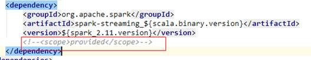

3.  右键单击pom.xml，选择“Maven  \>  Reimport“，重新引入依赖包。

    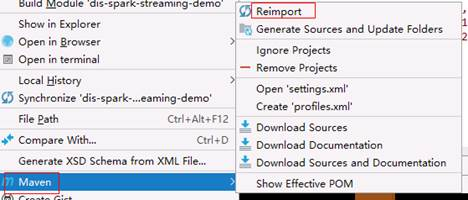

4.  在DISSparkStreamingExample文件内任意地方，右键选择“Create 'DISSparkStreamingExample'“。

    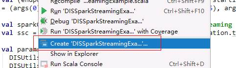

5.  在打开的配置页面中，“VM options“中输入**-Dspark.master=local\[\*\]**，表示用local模式运行spark作业；“Program arguments“中输入运行参数，格式为 ：

    ```
    DIS网关地址Region名称AK SK ProjectID 通道名称起始位置Streaming批次时间
     
    如在华北-北京1测试，则参数示例为
    https://dis.${region}.myhuaweicloud.com ${region} YOU_AK YOU_SK YOU_PROJECTID YOU_STREAM_NAME latest 10
    ```

    参数顺序与含义在示例代码中有，可以参考。

    

    最终IDEA的配置如下图所示，确认无误后单击“OK“关闭此窗口。

    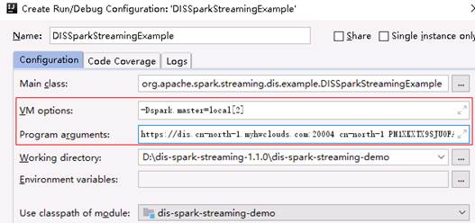

6.  在DISSparkStreamingExample文件内任意地方，右键选择“Run 'DISSparkStreamingExample'“，即可启动作业。

    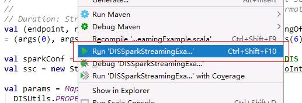

7.  启动过程中会报一个hadoop binary path的错误，这个可以忽略。

    ```
    18/08/28 10:26:10 ERROR Shell: Failed to locate the winutils binary in the hadoop binary path
    java.io.IOException: Could not locate executable null\bin\winutils.exe in the Hadoop binaries.
    ```

8.  如果没有其他错误，则作业会每隔duration运行一个批次，从DIS读取此批次内的数据并输出结果，示例如下：

    ```
    -------------------------------------------
    Time: 1535423650000 ms
    -------------------------------------------
    (hello,30)
    (world.,30)
    ```

9.  在本地运行作业验证无误之后，请把pom.xml中的<scope\>provided</scope\>解除注释\(防止以后打包会把spark依赖也打进来\)，然后停止数据上传程序。

