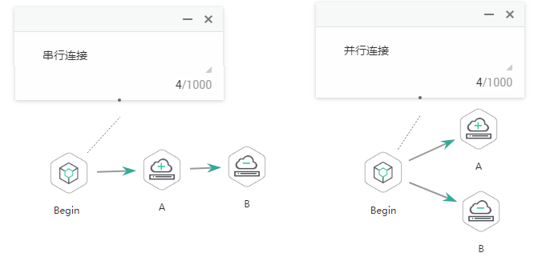

# 节点概述

节点定义对数据执行的操作。数据开发模块提供数据集成、计算&分析、数据库操作、资源管理等类型的节点，用户根据业务模型选择所需的节点。

-   节点的参数支持使用EL表达式，EL表达式的使用方法详见[表达式概述](表达式概述.md)。
-   节点间的连接方式支持串行和并行。

    串行连接：按顺序逐个执行节点，当A节点执行完成后，再执行B节点。

    并行连接：A节点和B节点同时执行。

    **图 1**  连接示意图  
    

