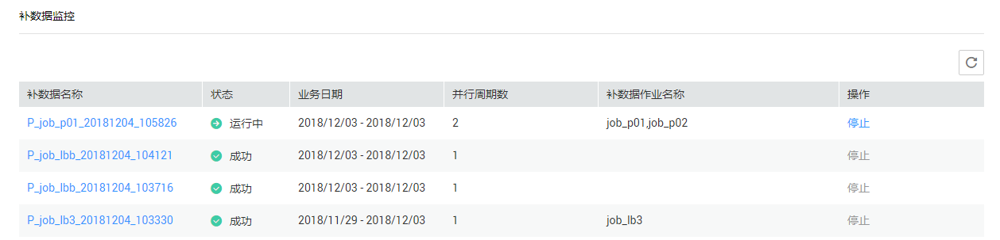
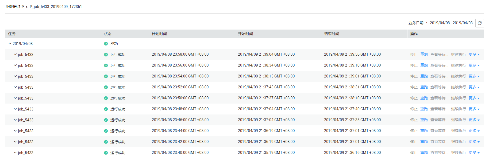

# 补数据监控

在数据开发模块控制台的左侧导航栏，选择“运维调度  \>  补数据监控“，进入补数据的任务监控页面。

用户可以在[图1](#zh-cn_topic_0143127873_fig316344214819)的页面中，查看补数据的任务状态、业务日期、并行周期数、补数据作业名称，以及停止运行中的任务。

**图 1**  补数据监控主页  

在[图1](#zh-cn_topic_0143127873_fig316344214819)的页面中，单击补数据名称，进入[图2](#zh-cn_topic_0143127873_fig1671611314100)的页面。在此页面，用户可以查看补数据的任务执行情况，以及手动干预实例和节点的执行（如需了解更多，请参见[批作业监控：补数据](批作业监控.md#zh-cn_topic_0159100548_section1819004120344)  ）。

**图 2**  补数据监控详情  

> **说明：** 
>-   支持计划时间，开始时间，结束时间的排序，注意三者之间，同一时间只有其中一个当前排序有效。
>-   排序按钮点击顺序为：点击1下为升序，点击2下为降序，点击3下取消排序。

