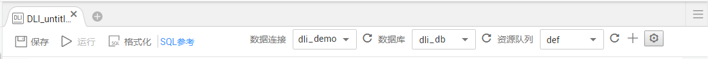
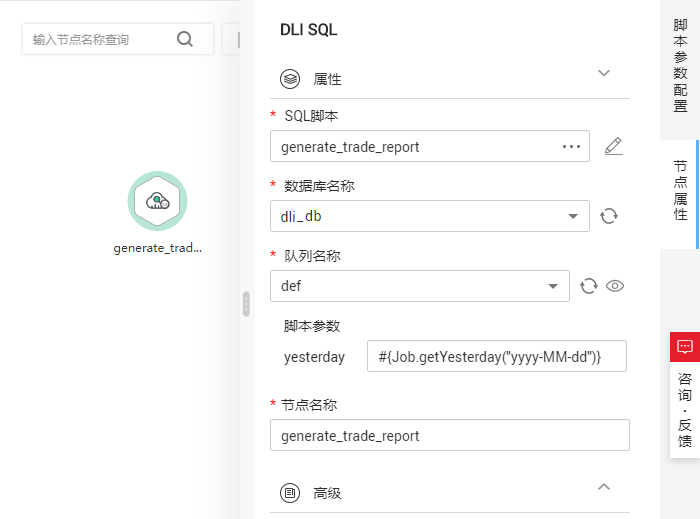

# 表达式使用示例<a name="dgc_01_0502"></a>

通过本示例，用户可以了解数据开发模块 EL表达式的如下应用：

-   如何在数据开发模块的SQL脚本中使用变量？
-   作业如何传递参数给SQL脚本变量？
-   在参数中如何使用EL表达式？

## 背景信息<a name="zh-cn_topic_0133127285_section16580152815418"></a>

使用数据开发模块的作业编排和作业调度功能，每日通过统计交易明细表，生成日交易统计报表。

本示例涉及的数据表如下所示：

-   trade\_log：记录每一笔交易数据。
-   trade\_report：根据trade\_log统计产生，记录每日交易汇总。

## 前提条件<a name="zh-cn_topic_0133127285_section128686719404"></a>

-   已建立DLI的数据连接，以“dli\_demo“数据连接为例。

    如未建立，请参考[创建数据连接](创建数据连接.md)进行操作。

-   已在DLI中创建数据库，以“dli\_db“数据库为例。

    如未创建，请参考[新建数据库](新建数据库.md)进行操作。

-   已在“dli\_db“数据库中创建数据表trade\_log和trade\_report。

    如未创建，请参考[新建数据表](新建数据表.md)进行操作。


## 操作步骤<a name="zh-cn_topic_0133127285_section1971618201419"></a>

1.  <a name="zh-cn_topic_0133127285_li659355023719"></a>新建和开发SQL脚本。
    1.  在数据开发模块控制台的左侧导航栏，选择“数据开发  \>  脚本开发“。
    2.  进入右侧区域页面，选择“新建SQL脚本  \>  DLI“。
    3.  进入SQL脚本开发页面，在脚本属性栏选择“数据连接“、“数据库“、“资源队列“。

        **图 1**  脚本属性<a name="zh-cn_topic_0133127285_fig121751607420"></a>  
        

    4.  <a name="zh-cn_topic_0133127285_li1224033195516"></a>在脚本编辑器中输入以下SQL语句。

        ```
        INSERT OVERWRITE TABLE trade_report
        SELECT
          sum(trade_count),
          '${yesterday}'
        FROM
          trade_log
        where
          date_format(trade_time, 'yyyy-MM-dd') = '${yesterday}'
        ```

    5.  单击，将脚本的名称设置为“generate\_trade\_report“。

2.  新建和开发作业。
    1.  在数据开发模块控制台的左侧导航栏，选择“数据开发  \>  作业开发“。
    2.  进入右侧区域页面，单击“新建作业“，新建一个名称为“job“的空作业。

        **图 2**  新建作业02<a name="zh-cn_topic_0133127285_fig1464616621115"></a>  
        

    3.  进入作业开发页面，将DLI SQL节点拖至画布中，单击其图标并配置“节点属性“。

        **图 3**  节点属性<a name="zh-cn_topic_0133127285_fig3988916133912"></a>  
        

        关键属性说明：

        -   SQL脚本：关联[1](#zh-cn_topic_0133127285_li659355023719)中开发完成的SQL脚本“generate\_trade\_report“。
        -   数据库名称：自动填写SQL脚本“generate\_trade\_report“中选择的数据库。
        -   队列名称：自动填写SQL脚本“generate\_trade\_report“中选择的资源队列。
        -   脚本参数：显示SQL脚本“generate\_trade\_report“中的参数“yesterday“，输入以下EL表达式作为其参数值。

            ```
            #{Job.getYesterday("yyyy-MM-dd")}
            ```

            EL表达式说明：Job为作业对象，通过getYesterday方法获取作业计划执行时间前一天的时间，时间格式为yyyy-MM-dd。

            假设作业计划执行时间为2018/9/26 01:00:00，这个表达式计算结果是2018-09-25，该计算结果将替换[SQL脚本](#zh-cn_topic_0133127285_li1224033195516)中的$\{yesterday\}参数。替换后的SQL内容如下：

            ```
            INSERT OVERWRITE TABLE trade_report
            SELECT
              sum(trade_count),
              '2018-09-25'
            FROM
              trade_log
            where
              date_format(trade_time, 'yyyy-MM-dd') = '2018-09-25'
            ```

    4.  单击，测试运行作业。
    5.  作业测试无问题后，单击，保存作业配置。


## 更多案例<a name="section1232012306537"></a>

EL表达式在数据开发过程中被广泛应用，您可以参考[最佳实践](https://support.huaweicloud.com/bestpractice-dgc/dgc_05_0100.html)查看更多应用EL表达式的进阶实践。

