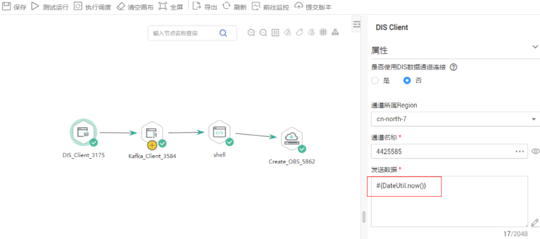
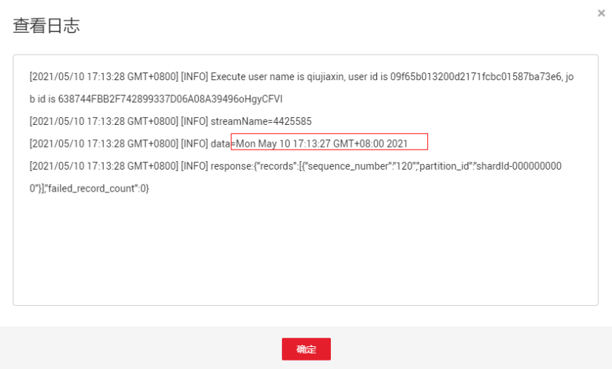
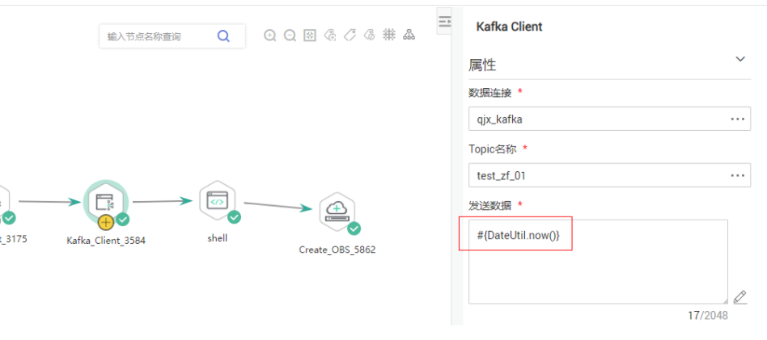
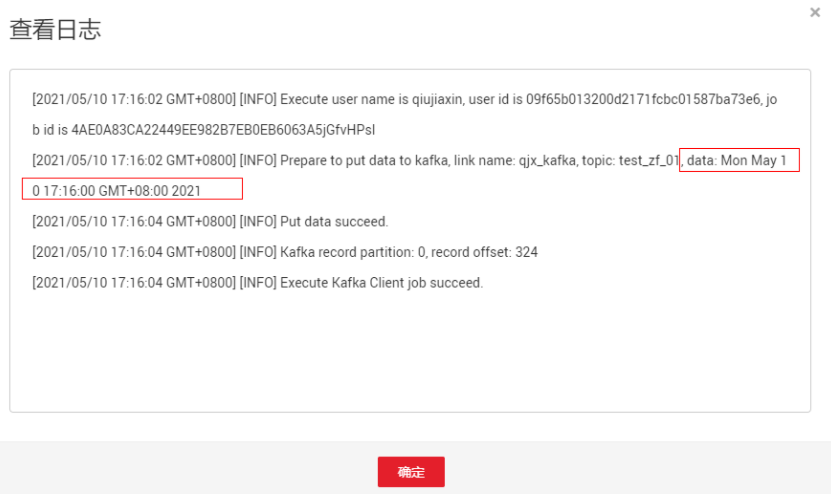
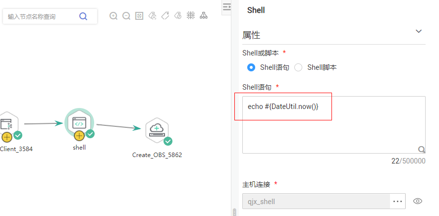
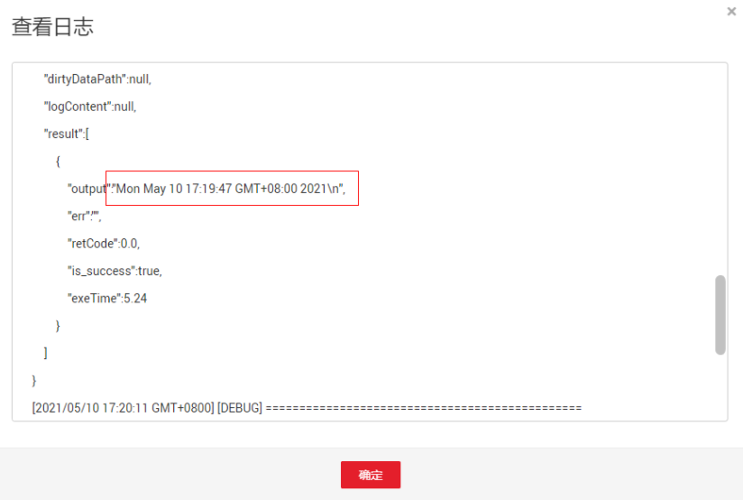
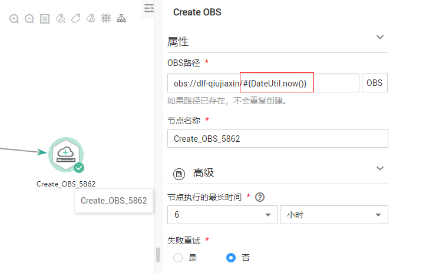
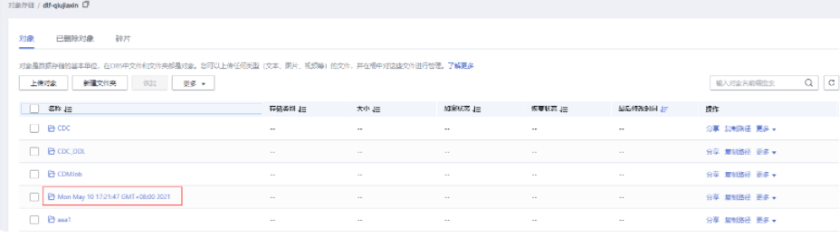

# 表达式概述<a name="dgc_01_0494"></a>

数据开发模块作业中的节点参数可以使用表达式语言（Expression Language，简称EL），根据运行环境动态生成参数值。可以根据Pipeline输入参数、上游节点输出等决定是否执行此节点。数据开发模块 EL表达式使用简单的算术和逻辑计算，引用内嵌对象，包括作业对象和一些工具类对象。

作业对象：提供了获取作业中上一个节点的输出消息、作业调度计划时间、作业执行时间等属性和方法。

工具类对象：提供了一系列字符串、时间、JSON操作方法，例如从一个字符串中截取一个子字符串、时间格式化等。

## 语法<a name="zh-cn_topic_0132846495_section451814342016"></a>

表达式的语法：

```
#{expr}
```

其中，“expr“指的是表达式。“\#“和“\{\}“是数据开发模块 EL中通用的操作符，这两个操作符允许您通过数据开发模块内嵌对象访问作业属性。

## 举例<a name="zh-cn_topic_0132846495_section115961325182019"></a>

在Rest Client节点的参数“URL参数“中使用EL表达式“tableName=\#\{JSONUtil.path\(Job.getNodeOutput\("get\_cluster"\),"tables\[0\].table\_name"\)\}“，如[图1](#zh-cn_topic_0132846495_fig132317717489)所示。

表达式说明如下：

1.  获取作业中“get\_cluster“节点的执行结果（“Job.getNodeOutput\("get\_cluster"\)“），执行结果是一个JSON字符串。
2.  通过JSON路径（“tables\[0\].table\_name“），获取JSON字符串中字段的值。

**图 1**  表达式示例<a name="zh-cn_topic_0132846495_fig132317717489"></a>  


EL表达式在数据开发过程中被广泛应用，您可以参考[最佳实践](https://support.huaweicloud.com/bestpractice-dgc/dgc_05_0100.html)查看更多应用EL表达式的进阶实践。

## 调试方法介绍<a name="section94321551181"></a>

下面为您介绍几种EL表达式的调试方法，能够在调试过程中方便地看到替换结果。

后文以\#\{DateUtil.now\(\)\}表达式为例进行介绍。

1.  使用DIS Client节点。
    -   前提：您需要具备DIS 通道。
    -   方法：选择DIS Client节点，将EL表达式直接写在要发送的数据中，点击测试运行，然后在节点上右键查看日志，日志中会把EL表达式的值打印出来。

        

        

2.  使用Kafka Client节点。
    -   前提：您需要具备MRS集群，且集群有Kafka组件。
    -   方法：选择Kafka Client节点，将EL表达式直接写在要发送的数据中，点击测试运行，然后在节点上右键查看日志，日志中会把EL表达式的值打印出来。

        

        

3.  使用Shell节点。
    -   前提：您需要具备ECS弹性云服务器。
    -   方法：创建一个主机连接，将EL表达式直接echo出来，测试运行之后查看日志，日志中会打印出EL表达式的值。

        

        

4.  使用Create OBS节点。

    如果上述方法均不可用，则可以通过Create OBS去创建一个OBS目录，目录名称就是EL表达式的值，需要去OBS界面查看创建出来的目录名称。

    

    


