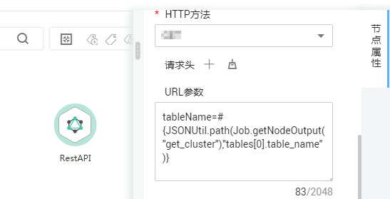

# 表达式概述<a name="dayu_01_0494"></a>

DLF作业中的节点参数可以使用表达式语言（Expression Language，简称EL），根据运行环境动态生成参数值。DLF EL表达式使用简单的算术和逻辑计算，引用内嵌对象，包括作业对象和一些工具类对象。

作业对象：提供了获取作业中上一个节点的输出消息、作业调度计划时间、作业执行时间等属性和方法。

工具类对象：提供了一系列字符串、时间、JSON操作方法，例如从一个字符串中截取一个子字符串、时间格式化等。

## 语法<a name="zh-cn_topic_0132846495_section451814342016"></a>

表达式的语法：

```
#{expr}
```

其中，“expr“指的是表达式。“\#“和“\{\}“是DLF EL中通用的操作符，这两个操作符允许您通过DLF内嵌对象访问作业属性。

## 举例<a name="zh-cn_topic_0132846495_section115961325182019"></a>

在Rest Client节点的参数“URL参数“中使用EL表达式“tableName=\#\{JSONUtil.path\(Job.getNodeOutput\("get\_cluster"\),"tables\[0\].table\_name"\)\}“，如[图1](#zh-cn_topic_0132846495_fig132317717489)所示。

表达式说明如下：

1.  获取作业中“get\_cluster“节点的执行结果（“Job.getNodeOutput\("get\_cluster"\)“），执行结果是一个JSON字符串。
2.  通过JSON路径（“tables\[0\].table\_name“），获取JSON字符串中字段的值。

**图 1**  表达式示例<a name="zh-cn_topic_0132846495_fig132317717489"></a>  


