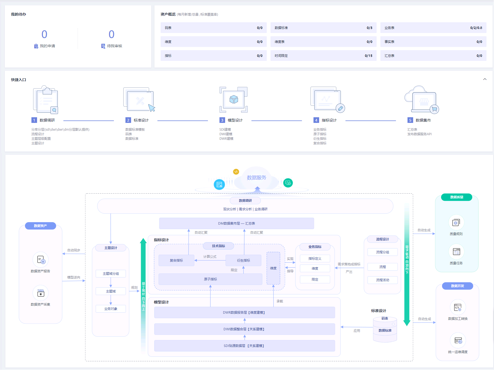
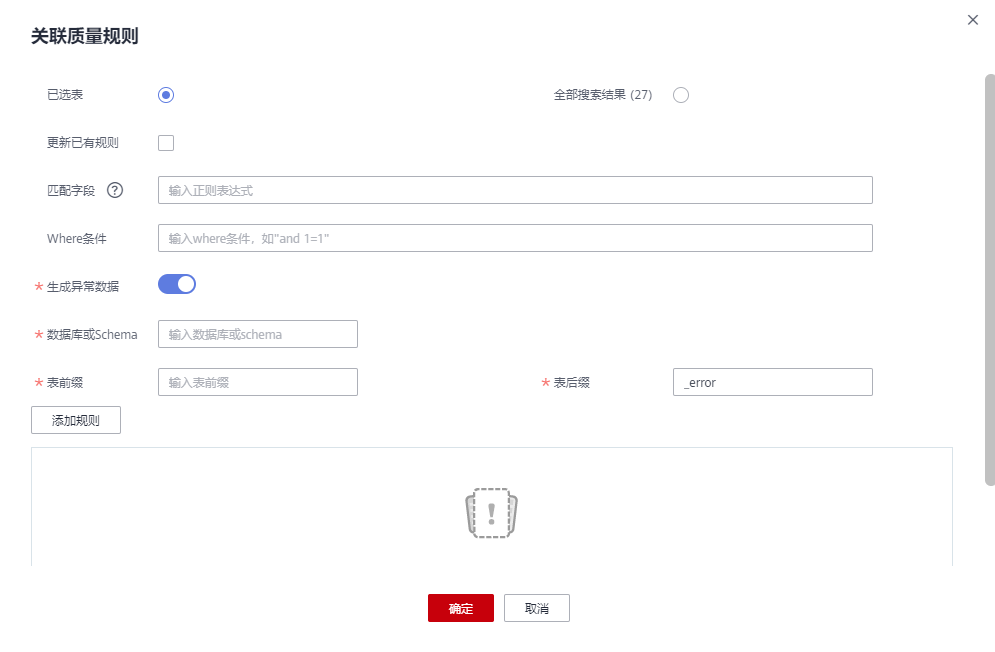

# 规范设计概述

## 规范设计简介

DGC规范设计以关系建模、维度建模理论支撑，实现规范化、可视化、标准化数据模型开发，定位于数据治理流程设计落地阶段，输出成果用于指导开发人员实践落地数据治理方法论。

规范设计作为数据治理的一个核心模块，承担数据治理过程中的数据加工并业务化的功能。规范设计主要包括数据调研、标准设计、模型设计和指标设计四个部分。规范设计支持DLI、POSTGRESQL、DWS、MRS\_Hive数据连接类型。

DGC规范设计致力于：

-   构建统一的数据分类体系，用于目录化管理所有业务数据，便于数据的归类、查找、评价和使用。
-   构建统一的数据标准体系，基于国家或行业标准，用于标准化每一行数据，每一个字段的具体取值，提升数据质量和易用性。
-   构建统一的数据模型体系，通过规范定义和数据建模，自顶向下构建企业数据分层体系，沉淀企业数据公共层和主题库，便于数据的流通、共享、创造、创新，提升数据使用效率，极大的减少数据冗余、混乱、隔离、不一致以及谬误等。

## 模型设计方法概述

根据业务需求抽取信息的主要特征，模拟和抽象出一个能够反映业务信息（对象）之间关联关系的模型，即数据模型。数据模型也是可视化的展现企业内部信息如何组织的蓝图。数据模型应满足三方面要求：能比较真实地模拟业务（场景）；容易为人所理解；便于在IT系统中实现。

在DGC规范设计的数据建模过程中，用到的建模方法主要有以下两种：

-   **关系建模**

    关系建模是用实体关系（Entity Relationship，ER）模型描述企业业务，它在范式理论上符合3NF，出发点是整合数据，将各个系统中的数据以整个企业角度按主题进行相似性组合和合并，并进行一致性处理，为数据分析决策服务，但是并不能直接用于分析决策。

    用户在关系建模过程中，可以从以下三个层次去设计关系模型，这三个层次是逐层递进的，先设计概念模型，再进一步细化设计出逻辑模型，最后设计物理模型。

    -   **概念模型**：是从用户的视角，主要从业务流程、活动中涉及的主要业务数据出发，抽象出关键的业务实体，并描述这些实体间的关系。
    -   **逻辑模型**：是概念模型的进一步细化，通过实体、属性和关系勾勒出企业的业务信息蓝图，是IT和业务人员沟通的桥梁。逻辑数据模型是一组规范化的逻辑表结构，逻辑数据模型是根据业务规则确定的，关于业务对象、业务对象的数据项及业务对象之间关系的基本蓝图。
    -   **物理模型**：是在逻辑数据模型的基础上，考虑各种具体的技术实现因素，进行数据库体系结构设计，真正实现数据在数据库中的存放，例如：所选的数据仓库是DWS或MRS\_Hive。

-   **维度建模**

    维度建模是从分析决策的需求出发构建模型，它主要是为分析需求服务，因此它重点关注用户如何更快速地完成需求分析，同时具有较好的大规模复杂查询的响应性能。

    多维模型是由数字型度量值组成的一张事实表连接到一组包含描述属性的多张维度表，事实表与维度表通过主/外键实现关联。

    典型的维度模型有星形模型，以及在一些特殊场景下使用的雪花模型。

    在DGC规范设计中，维度建模是以维度建模理论为基础，构建总线矩阵、抽象出事实和维度，构建维度模型和事实模型，同时对报表需求进行抽象整理出相关指标体系，构建出汇总模型。

## 规范设计总览

在DGC控制台首页，选择对应工作空间的“规范设计“模块，进入规范设计页面，查看“总览“，如[图1](#fig149291523152610)所示。

**图 1**  规范涉及总览  

-   **我的待办**
    -   显示“我的申请“和“待我审核“的数量。
    -   单击每一项上面统计数量将分别跳转到“我的申请“和“待我审核“页面。

-   **资产概览**
    -   显示规范设计中所有对象的每月新增数量、总量以及标准覆盖率。
    -   单击每个对象名称后的统计数量将跳转的该对象的管理页面。

-   **快捷入口**

    显示规范设计数据治理方法的整体流程。单击流程下的具体操作，可以跳转到对应的界面。

-   **规范设计流程**
    -   显示规范设计流程以及与DGC其他模块间的交互关系。关于规范设计流程的详细描述，请参见[数据规范使用流程](数据规范使用流程.md)。
    -   将鼠标移至流程图上的对象名称之上，页面上将显示对象的描述信息。
    -   对于DGC已支持的对象，单击对象名称，可跳转至该对象的管理页面。

## 规范设信息架构

信息架构是以结构化的方式描述在业务运作和管理决策中所需要的各类信息及其关系的一套整体组件规范。在规范设计的“信息架构”页面，可以查看和管理所有的表，包括业务表、维度表、事实表、汇总表等资源。

在DGC控制台首页，选择对应工作空间的“规范设计“模块，进入规范设计页面，查看“信息架构“。

在信息架构页面，可以执行以下操作：

-   **搜索**

    在“信息架构”列表右上方，单击“高级搜索”，设置表名、类型、数据源等筛选条件，然后单击“搜索”可以查找指定的表，单击“表名称”，可以进入表的详情页面，查看表的详细信息。

-   **新建**

    单击“新建”，可以新建业务表-逻辑模型、业务表-物理模型、事实表和汇总表。创建的过程可以参见[物理模型设计](物理模型设计.md)、[新建事实表](新建事实表.md)、[新建汇总表](新建汇总表.md)。

-   **导入**

    单击“更多 \> 导入”，当前仅支持导入业务表。下载表导入模板，填写模板后，先添加再上传，上传成功后，然后单击“关闭”。有关导入业务表的更多信息，请参见[导入导出表](导入导出表.md)。

-   **导出**

    单击“更多 \> 导出”，可以导出业务表-物理模型或DDL。有关导出的更多信息，请参见[导出表或DDL](导入导出表.md#section1911133213143)。

-   **同步**

    单击“更多 \> 同步”，可以同步表到数据资产，作为技术资产；同步逻辑模型到数据资产，作为业务资产。

-   **修改主题**

    单击“更多 \> 修改主题”，可以将选中的表更改到其它主题。

-   **删除**

    单击“更多 \> 删除”，可以删除数据表，其中待发布，已发布和待下线状态的数据表不可被删除。且数据被引用的数据表不可被删除。

-   **下线**

    单击“更多 \> 下线”，可以下线已发布且不带下展的数据表。数据被引用的数据表不支持下线。

    > **说明：** 
    >“带下展”，指待发布后又重新编辑的数据。

-   **发布**

    单击“发布”，可发布数据表。待发布、待下线、已发布（不带下展）状态的数据表不支持发布。

-   **关联质量规则**

    单击“关联质量规则“，配置下图所示的相关参数，完成质量规则的关联。有关关联质量规则的更多信息，您也可以参考[关联质量规则](关联质量规则.md)。

    **图 2**  关联质量规则  
    

    生成异常数据：勾选此项，表示异常数据将按照配置的参数存储到规定的库中。

