# 规范设计示例

DGC规范设计以关系建模、维度建模理论支撑，实现规范化、可视化、标准化数据模型开发，定位于数据治理流程设计落地阶段，输出成果用于指导开发人员实践落地数据治理方法论。

本章节操作场景如下：

-   对MRS HIVE数据湖中的出租车出行数据进行数据模型设计。
-   数据库demo\_sdi\_db中已具备出租车出行原始数据表sdi\_taxi\_trip\_data。
-   原始数据表sdi\_taxi\_trip\_data的数据字段介绍如下：

    数据说明如下：

    **表 1**  出租车行程数据

    
    <table><thead align="left"><tr id="zh-cn_topic_0262779321_row1892515812584"><th class="cellrowborder" valign="top" width="10.718599033816423%" id="mcps1.2.4.1.1">
序号

    </th>
    <th class="cellrowborder" valign="top" width="43.34239130434782%" id="mcps1.2.4.1.2">
字段名称

    </th>
    <th class="cellrowborder" valign="top" width="45.93900966183575%" id="mcps1.2.4.1.3">
字段描述

    </th>
    </tr>
    </thead>
    <tbody><tr id="zh-cn_topic_0262779321_row2925115825815"><td class="cellrowborder" valign="top" width="10.718599033816423%" headers="mcps1.2.4.1.1 ">
1

    </td>
    <td class="cellrowborder" valign="top" width="43.34239130434782%" headers="mcps1.2.4.1.2 ">
VendorID

    </td>
    <td class="cellrowborder" valign="top" width="45.93900966183575%" headers="mcps1.2.4.1.3 ">
供应商编号

    
取值如下：

    
1=A Company

    
2=B Company

    </td>
    </tr>
    <tr id="zh-cn_topic_0262779321_row19925458155810"><td class="cellrowborder" valign="top" width="10.718599033816423%" headers="mcps1.2.4.1.1 ">
2

    </td>
    <td class="cellrowborder" valign="top" width="43.34239130434782%" headers="mcps1.2.4.1.2 ">
tpep_pickup_datetime

    </td>
    <td class="cellrowborder" valign="top" width="45.93900966183575%" headers="mcps1.2.4.1.3 ">
上车时间

    </td>
    </tr>
    <tr id="zh-cn_topic_0262779321_row19925175825818"><td class="cellrowborder" valign="top" width="10.718599033816423%" headers="mcps1.2.4.1.1 ">
3

    </td>
    <td class="cellrowborder" valign="top" width="43.34239130434782%" headers="mcps1.2.4.1.2 ">
tpep_dropoff_datetime

    </td>
    <td class="cellrowborder" valign="top" width="45.93900966183575%" headers="mcps1.2.4.1.3 ">
下车时间

    </td>
    </tr>
    <tr id="zh-cn_topic_0262779321_row189257584585"><td class="cellrowborder" valign="top" width="10.718599033816423%" headers="mcps1.2.4.1.1 ">
4

    </td>
    <td class="cellrowborder" valign="top" width="43.34239130434782%" headers="mcps1.2.4.1.2 ">
passenger_count

    </td>
    <td class="cellrowborder" valign="top" width="45.93900966183575%" headers="mcps1.2.4.1.3 ">
乘客人数

    </td>
    </tr>
    <tr id="zh-cn_topic_0262779321_row1925258185818"><td class="cellrowborder" valign="top" width="10.718599033816423%" headers="mcps1.2.4.1.1 ">
5

    </td>
    <td class="cellrowborder" valign="top" width="43.34239130434782%" headers="mcps1.2.4.1.2 ">
trip_distance

    </td>
    <td class="cellrowborder" valign="top" width="45.93900966183575%" headers="mcps1.2.4.1.3 ">
行驶距离

    </td>
    </tr>
    <tr id="zh-cn_topic_0262779321_row09251758155813"><td class="cellrowborder" valign="top" width="10.718599033816423%" headers="mcps1.2.4.1.1 ">
6

    </td>
    <td class="cellrowborder" valign="top" width="43.34239130434782%" headers="mcps1.2.4.1.2 ">
ratecodeid

    </td>
    <td class="cellrowborder" valign="top" width="45.93900966183575%" headers="mcps1.2.4.1.3 ">
费率代码

    
取值如下：

    
1=Standard rate

    
2=JFK

    
3=Newark

    
4=Nassau or Westchester

    
5=Negotiated fare

    
6=Group ride

    </td>
    </tr>
    <tr id="zh-cn_topic_0262779321_row10925558115819"><td class="cellrowborder" valign="top" width="10.718599033816423%" headers="mcps1.2.4.1.1 ">
7

    </td>
    <td class="cellrowborder" valign="top" width="43.34239130434782%" headers="mcps1.2.4.1.2 ">
store_fwd_flag

    </td>
    <td class="cellrowborder" valign="top" width="45.93900966183575%" headers="mcps1.2.4.1.3 ">
存储转发标识

    </td>
    </tr>
    <tr id="zh-cn_topic_0262779321_row2925135875816"><td class="cellrowborder" valign="top" width="10.718599033816423%" headers="mcps1.2.4.1.1 ">
8

    </td>
    <td class="cellrowborder" valign="top" width="43.34239130434782%" headers="mcps1.2.4.1.2 ">
PULocationID

    </td>
    <td class="cellrowborder" valign="top" width="45.93900966183575%" headers="mcps1.2.4.1.3 ">
上车地点

    </td>
    </tr>
    <tr id="zh-cn_topic_0262779321_row19925058135811"><td class="cellrowborder" valign="top" width="10.718599033816423%" headers="mcps1.2.4.1.1 ">
9

    </td>
    <td class="cellrowborder" valign="top" width="43.34239130434782%" headers="mcps1.2.4.1.2 ">
DOLocationID

    </td>
    <td class="cellrowborder" valign="top" width="45.93900966183575%" headers="mcps1.2.4.1.3 ">
下车地点

    </td>
    </tr>
    <tr id="zh-cn_topic_0262779321_row18925195815584"><td class="cellrowborder" valign="top" width="10.718599033816423%" headers="mcps1.2.4.1.1 ">
10

    </td>
    <td class="cellrowborder" valign="top" width="43.34239130434782%" headers="mcps1.2.4.1.2 ">
payment_type

    </td>
    <td class="cellrowborder" valign="top" width="45.93900966183575%" headers="mcps1.2.4.1.3 ">
付款方式代码

    
取值如下：

    
1=Credit card

    
2=Cash

    
3=No charge

    
4=Dispute

    
5=Unknown

    
6=Voided trip

    </td>
    </tr>
    <tr id="zh-cn_topic_0262779321_row109265581580"><td class="cellrowborder" valign="top" width="10.718599033816423%" headers="mcps1.2.4.1.1 ">
11

    </td>
    <td class="cellrowborder" valign="top" width="43.34239130434782%" headers="mcps1.2.4.1.2 ">
fare_amount

    </td>
    <td class="cellrowborder" valign="top" width="45.93900966183575%" headers="mcps1.2.4.1.3 ">
车费

    </td>
    </tr>
    <tr id="zh-cn_topic_0262779321_row109261458105810"><td class="cellrowborder" valign="top" width="10.718599033816423%" headers="mcps1.2.4.1.1 ">
12

    </td>
    <td class="cellrowborder" valign="top" width="43.34239130434782%" headers="mcps1.2.4.1.2 ">
extra

    </td>
    <td class="cellrowborder" valign="top" width="45.93900966183575%" headers="mcps1.2.4.1.3 ">
加收

    </td>
    </tr>
    <tr id="zh-cn_topic_0262779321_row16926105885816"><td class="cellrowborder" valign="top" width="10.718599033816423%" headers="mcps1.2.4.1.1 ">
13

    </td>
    <td class="cellrowborder" valign="top" width="43.34239130434782%" headers="mcps1.2.4.1.2 ">
mta_tax

    </td>
    <td class="cellrowborder" valign="top" width="45.93900966183575%" headers="mcps1.2.4.1.3 ">
MTA税

    </td>
    </tr>
    <tr id="zh-cn_topic_0262779321_row39261658195810"><td class="cellrowborder" valign="top" width="10.718599033816423%" headers="mcps1.2.4.1.1 ">
14

    </td>
    <td class="cellrowborder" valign="top" width="43.34239130434782%" headers="mcps1.2.4.1.2 ">
tip_amount

    </td>
    <td class="cellrowborder" valign="top" width="45.93900966183575%" headers="mcps1.2.4.1.3 ">
手续费

    </td>
    </tr>
    <tr id="zh-cn_topic_0262779321_row392611585587"><td class="cellrowborder" valign="top" width="10.718599033816423%" headers="mcps1.2.4.1.1 ">
15

    </td>
    <td class="cellrowborder" valign="top" width="43.34239130434782%" headers="mcps1.2.4.1.2 ">
tolls_amount

    </td>
    <td class="cellrowborder" valign="top" width="45.93900966183575%" headers="mcps1.2.4.1.3 ">
通行费

    </td>
    </tr>
    <tr id="zh-cn_topic_0262779321_row1692615810581"><td class="cellrowborder" valign="top" width="10.718599033816423%" headers="mcps1.2.4.1.1 ">
16

    </td>
    <td class="cellrowborder" valign="top" width="43.34239130434782%" headers="mcps1.2.4.1.2 ">
improvement_surcharge

    </td>
    <td class="cellrowborder" valign="top" width="45.93900966183575%" headers="mcps1.2.4.1.3 ">
改善附加费

    </td>
    </tr>
    <tr id="zh-cn_topic_0262779321_row1192665835816"><td class="cellrowborder" valign="top" width="10.718599033816423%" headers="mcps1.2.4.1.1 ">
17

    </td>
    <td class="cellrowborder" valign="top" width="43.34239130434782%" headers="mcps1.2.4.1.2 ">
total_amount

    </td>
    <td class="cellrowborder" valign="top" width="45.93900966183575%" headers="mcps1.2.4.1.3 ">
总车费

    </td>
    </tr>
    </tbody>
    </table>

规范设计的流程如下：

1.  **准备工作**：
    -   **[添加审核人](#section545333619504)**：在规范设计中，业务流程中的步骤都需要经过审批，因此，需要先添加审核人。只有工作空间管理员角色的用户才具有添加审核人的权限。
    -   **[管理配置中心](#section83068019428)**：规范设计中提供了丰富的自定义选项，统一通过配置中心提供，您需要根据自己的业务需要进行自定义配置。

2.  **数据调研**：基于现有业务数据、行业现状进行数据调查、需求梳理、业务调研，输出企业业务流程以及数据主题划分。
    -   **[主题设计](#zh-cn_topic_0222298525_section21581824122814)**：通过分层架构表达对数据的分类和定义，帮助厘清数据资产，明确业务领域和业务对象的关联关系。
    -   **流程设计**：本例暂不涉及。流程设计是针对流程的一个结构化的整体框架，描述了企业流程的分类、层级以及边界、范围、输入/输出关系等，反映了企业的商业模式及业务特点。

3.  **标准设计**：新建码表&数据标准。
    -   **[新建码表并发布](#section142244103311)**：通常只包括一系列允许的值和附加文本描述，与数据标准关联用于生成值域校验质量监控。
    -   **[新建数据标准并发布](#section139902116499)**：用于描述公司层面需共同遵守的属性层数据含义和业务规则。其描述了公司层面对某个数据的共同理解，这些理解一旦确定下来，就应作为企业层面的标准在企业内被共同遵守。

4.  **模型设计：**应用关系建模和维度建模的方法，进行分层建模。
    -   **[关系建模：新建SDI层和DWI层两个模型](#zh-cn_topic_0222298525_section945153616402)**。
        -   **SDI**：Source Data Integration，又称贴源数据层。SDI是源系统数据的简单落地。
        -   **DWI**：Data Warehouse Integration，又称数据整合层。DWI整合多个源系统数据，对源系统进来的数据进行整合、清洗，并基于三范式进行关系建模。

    -   **[维度建模：在DWR层新建并发布维度](#section265510426117)&[维度建模：在DWR层新建并发布事实表](#section665784223319)。**
        -   **DWR**：Data Warehouse Report，又称数据报告层。DWR基于多维模型，和DWI层数据粒度保持一致。
        -   **维度**：维度是用于观察和分析业务数据的视角，支撑对数据进行汇聚、钻取、切片分析，用于SQL中的GROUP BY条件。
        -   **事实表**：归属于某个业务过程的事实逻辑表，可以丰富具体业务过程所对应事务的详细信息。

5.  **[指标设计：新建并发布技术指标](#section1222433193512)**：新建业务指标（本例不涉及）和技术指标，技术指标又分为原子指标、衍生指标和复合指标。
    -   **指标**：指标一般由指标名称和指标数值两部分组成，指标名称及其涵义体现了指标质的规定性和量的规定性两个方面的特点，指标数值反映了指标在具体时间、地点、条件下的数量表现。

        业务指标用于指导技术指标，而技术指标是对业务指标的具体实现。

    -   **原子指标**：原子指标中的度量和属性来源于多维模型中的维度表和事实表，与多维模型所属的业务对象保持一致，与多维模型中的最细数据粒度保持一致。

        原子指标中仅含有唯一度量，所含其它所有与该度量、该业务对象相关的属性，旨在用于支撑指标的敏捷自助消费。

    -   **衍生指标**：是原子指标通过添加限定、维度卷积而成，限定、维度均来源于原子指标关联表的属性。
    -   **复合指标**：由一个或多个衍生指标叠加计算而成，其中的维度、限定均继承于衍生指标。

        注意，不能脱离衍生指标、维度和限定的范围，去产生新的维度和限定。

6.  **[维度建模：在DM层新建并发布汇总表](#section829585916339)**。
    -   **DM \(Data Mart\)**：又称数据集市。DM面向展现层，数据有多级汇总。
    -   **汇总表**：汇总表是由一个特定的分析对象（如会员）及其相关的统计指标组成的。组成一个汇总逻辑表的统计指标都具有相同的统计粒度（如会员），汇总逻辑表面向用户提供了以统计粒度（如会员）为主题的所有统计数据（如会员主题集市）。

## 添加审核人

在规范设计中，数据建模流程中的步骤都需要经过审批，因此，需要先添加审核人。DAYU Administrator角色或该工作空间管理员，具备对应的添加审核人的权限。

1.  在DGC控制台首页，选择对应工作空间的“规范设计“模块，进入规范设计页面。

    **图 1**  选择规范设计  
    

2.  在规范设计控制台，单击左侧导航树中的“配置中心“，进入相应页面后，选择“审核人管理“页签，然后单击“添加“按钮。
3.  选择审核人（工作空间管理员或开发者），输入正确的电子邮箱和手机号，单击“确定“完成审核人添加。

    您也可以添加自己当前帐号为审核人，在后续提交审批的相关操作中，支持进行“自助审批“。

    **图 2**  添加审核人  
    

4.  根据需要，可以添加多个审核人。

## 管理配置中心

规范设计中提供了丰富的自定义选项，统一通过配置中心提供，您可有根据自己的业务需要进行自定义配置。

1.  在规范设计控制台，单击左侧菜单栏的“配置中心“，进入配置中心页面。
2.  进入“功能配置“页签，按照您的需求，进行自定义设置。

    **图 3**  功能配置  
    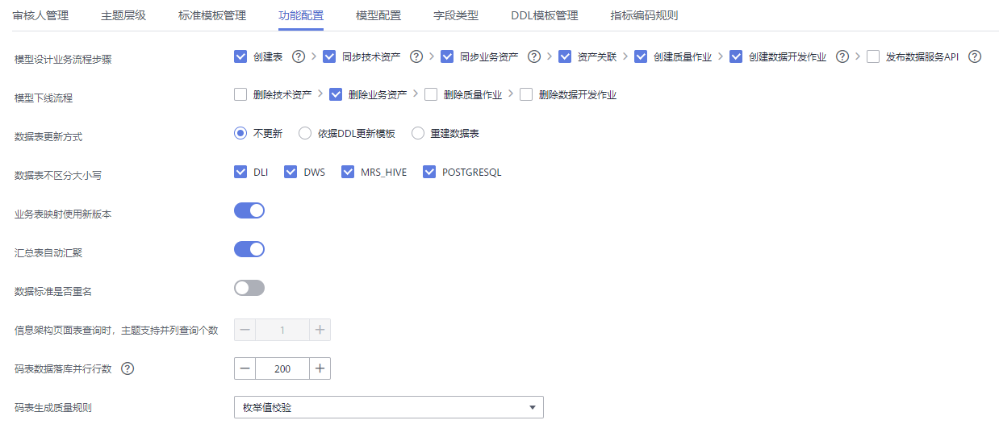

3.  单击“确定“完成配置。

## 主题设计

在本示例中，主题设计如[表2](#zh-cn_topic_0262779636_table356815710199)所示，说明如下：

-   新建1个主题域分组：城市交通。
-   在主题域分组“城市交通“下，新建4个主题域：行程记录、集团、时空、公共维度。
-   在主题域“行程记录“下，新建4个业务对象：原始记录、标准记录、行程事实、记录统计。
-   在主题域“集团“下，新建1个业务对象：供应商。
-   在主题域“时空”下，新建1个业务对象：时间。
-   在主题域“公共维度“下，新建1个业务对象：公共维度。

**表 2**  主题设计信息

<table><thead align="left"><tr id="zh-cn_topic_0262779636_row365447171918"><th class="cellrowborder" valign="top" width="17.11171117111711%" id="mcps1.2.7.1.1">
*主题域分组名称（L1）

</th>
<th class="cellrowborder" valign="top" width="16.931693169316933%" id="mcps1.2.7.1.2">
*主题域分组编码（L1）

</th>
<th class="cellrowborder" valign="top" width="12.221222122212222%" id="mcps1.2.7.1.3">
主题域名称（L2）

</th>
<th class="cellrowborder" valign="top" width="18.631863186318633%" id="mcps1.2.7.1.4">
主题域编码（L2）

</th>
<th class="cellrowborder" valign="top" width="15.36153615361536%" id="mcps1.2.7.1.5">
业务对象名称（L3）

</th>
<th class="cellrowborder" valign="top" width="19.74197419741974%" id="mcps1.2.7.1.6">
业务对象编码（L3）

</th>
</tr>
</thead>
<tbody><tr id="zh-cn_topic_0262779636_row765411741913"><td class="cellrowborder" valign="top" width="17.11171117111711%" headers="mcps1.2.7.1.1 ">
城市交通

</td>
<td class="cellrowborder" valign="top" width="16.931693169316933%" headers="mcps1.2.7.1.2 ">
city_traffic

</td>
<td class="cellrowborder" valign="top" width="12.221222122212222%" headers="mcps1.2.7.1.3 ">
行程记录

</td>
<td class="cellrowborder" valign="top" width="18.631863186318633%" headers="mcps1.2.7.1.4 ">
stroke_reminder

</td>
<td class="cellrowborder" valign="top" width="15.36153615361536%" headers="mcps1.2.7.1.5 ">
原始记录

</td>
<td class="cellrowborder" valign="top" width="19.74197419741974%" headers="mcps1.2.7.1.6 ">
origin_stroke

</td>
</tr>
<tr id="zh-cn_topic_0262779636_row1565416710194"><td class="cellrowborder" valign="top" width="17.11171117111711%" headers="mcps1.2.7.1.1 ">
城市交通

</td>
<td class="cellrowborder" valign="top" width="16.931693169316933%" headers="mcps1.2.7.1.2 ">
city_traffic

</td>
<td class="cellrowborder" valign="top" width="12.221222122212222%" headers="mcps1.2.7.1.3 ">
行程记录

</td>
<td class="cellrowborder" valign="top" width="18.631863186318633%" headers="mcps1.2.7.1.4 ">
stroke_reminder

</td>
<td class="cellrowborder" valign="top" width="15.36153615361536%" headers="mcps1.2.7.1.5 ">
标准记录

</td>
<td class="cellrowborder" valign="top" width="19.74197419741974%" headers="mcps1.2.7.1.6 ">
stand_stroke

</td>
</tr>
<tr id="zh-cn_topic_0262779636_row15654471194"><td class="cellrowborder" valign="top" width="17.11171117111711%" headers="mcps1.2.7.1.1 ">
城市交通

</td>
<td class="cellrowborder" valign="top" width="16.931693169316933%" headers="mcps1.2.7.1.2 ">
city_traffic

</td>
<td class="cellrowborder" valign="top" width="12.221222122212222%" headers="mcps1.2.7.1.3 ">
行程记录

</td>
<td class="cellrowborder" valign="top" width="18.631863186318633%" headers="mcps1.2.7.1.4 ">
stroke_reminder

</td>
<td class="cellrowborder" valign="top" width="15.36153615361536%" headers="mcps1.2.7.1.5 ">
行程事实

</td>
<td class="cellrowborder" valign="top" width="19.74197419741974%" headers="mcps1.2.7.1.6 ">
stroke_fact

</td>
</tr>
<tr id="zh-cn_topic_0262779636_row1655147141918"><td class="cellrowborder" valign="top" width="17.11171117111711%" headers="mcps1.2.7.1.1 ">
城市交通

</td>
<td class="cellrowborder" valign="top" width="16.931693169316933%" headers="mcps1.2.7.1.2 ">
city_traffic

</td>
<td class="cellrowborder" valign="top" width="12.221222122212222%" headers="mcps1.2.7.1.3 ">
行程记录

</td>
<td class="cellrowborder" valign="top" width="18.631863186318633%" headers="mcps1.2.7.1.4 ">
stroke_reminder

</td>
<td class="cellrowborder" valign="top" width="15.36153615361536%" headers="mcps1.2.7.1.5 ">
记录统计

</td>
<td class="cellrowborder" valign="top" width="19.74197419741974%" headers="mcps1.2.7.1.6 ">
stroke_statistic

</td>
</tr>
<tr id="zh-cn_topic_0262779636_row66551773191"><td class="cellrowborder" valign="top" width="17.11171117111711%" headers="mcps1.2.7.1.1 ">
城市交通

</td>
<td class="cellrowborder" valign="top" width="16.931693169316933%" headers="mcps1.2.7.1.2 ">
city_traffic

</td>
<td class="cellrowborder" valign="top" width="12.221222122212222%" headers="mcps1.2.7.1.3 ">
集团

</td>
<td class="cellrowborder" valign="top" width="18.631863186318633%" headers="mcps1.2.7.1.4 ">
people

</td>
<td class="cellrowborder" valign="top" width="15.36153615361536%" headers="mcps1.2.7.1.5 ">
供应商

</td>
<td class="cellrowborder" valign="top" width="19.74197419741974%" headers="mcps1.2.7.1.6 ">
vendor

</td>
</tr>
<tr id="zh-cn_topic_0262779636_row06556791916"><td class="cellrowborder" valign="top" width="17.11171117111711%" headers="mcps1.2.7.1.1 ">
城市交通

</td>
<td class="cellrowborder" valign="top" width="16.931693169316933%" headers="mcps1.2.7.1.2 ">
city_traffic

</td>
<td class="cellrowborder" valign="top" width="12.221222122212222%" headers="mcps1.2.7.1.3 ">
时空

</td>
<td class="cellrowborder" valign="top" width="18.631863186318633%" headers="mcps1.2.7.1.4 ">
time_location

</td>
<td class="cellrowborder" valign="top" width="15.36153615361536%" headers="mcps1.2.7.1.5 ">
时间

</td>
<td class="cellrowborder" valign="top" width="19.74197419741974%" headers="mcps1.2.7.1.6 ">
date

</td>
</tr>
<tr id="zh-cn_topic_0262779636_row1065557141919"><td class="cellrowborder" valign="top" width="17.11171117111711%" headers="mcps1.2.7.1.1 ">
城市交通

</td>
<td class="cellrowborder" valign="top" width="16.931693169316933%" headers="mcps1.2.7.1.2 ">
city_traffic

</td>
<td class="cellrowborder" valign="top" width="12.221222122212222%" headers="mcps1.2.7.1.3 ">
公共维度

</td>
<td class="cellrowborder" valign="top" width="18.631863186318633%" headers="mcps1.2.7.1.4 ">
public_dimension

</td>
<td class="cellrowborder" valign="top" width="15.36153615361536%" headers="mcps1.2.7.1.5 ">
公共维度

</td>
<td class="cellrowborder" valign="top" width="19.74197419741974%" headers="mcps1.2.7.1.6 ">
public_dimension

</td>
</tr>
</tbody>
</table>

**操作步骤如下：**

1.  登录DGC控制台。找到已创建的DGC实例，单击实例卡片上的“进入控制台“。
2.  在工作空间概览列表中，找到所需要的工作空间，单击“规范设计“，进入规范设计控制台。
3.  在规范设计控制台，单击左侧菜单栏的“配置中心”。选择“ 主题层级”，使用默认的3层层级。

    L1-L7表示主题层级，默认3层，最大7层，最少2层，最后一层是业务对象，其他层级名称可编辑修改。配置中心配置的层级数，将在“主题设计”模块生效。

    **图 4**  配置主题层级  
    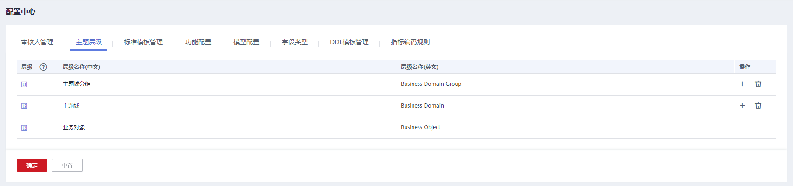

4.  在规范设计控制台，单击左侧菜单栏的“主题设计“，进入相应页面后，单击“新建“创建L1层主题，即主题域分组。

    **图 5**  新建L1层主题  
    

    在弹出窗口中，按[图5](#zh-cn_topic_0262779636_fig184368895516)所示填写参数，然后单击“确定“完成主题域分组的创建。

5.  在L1层主题“城市交通“下，依次新建4个L2层主题，即主题域：行程记录、集团、时空、公共维度。

    以主题域“行程记录”为例，新建主题域的步骤如下，其他主题域也请参照以下步骤进行添加：

    1.  选中已创建的L1层主题“城市交通”。单击右键，选择“新建”。或者在右侧文本框内，单击“新建”。

        **图 6**  创建L2层主题  
        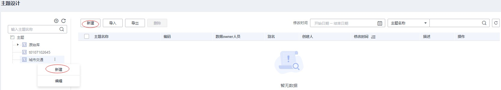

    2.  在弹出窗口中，“名称“和“编码“请参照[表2](#zh-cn_topic_0262779636_table356815710199)中的“主题域名称“和“主题域编码“进行填写，其他参数可根据实际情况进行填写，配置完成后单击“确定“完成主题域的新建。

6.  新建业务对象。

    -   在主题域“行程记录“下，新建4个业务对象：原始记录、标准记录、行程事实、记录统计。
    -   在主题域“集团“下，新建1个业务对象：供应商。
    -   在主题域“时空”下，新建1个业务对象：时间。
    -   在主题域“公共维度“下，新建1个业务对象：公共维度。

    以在主题域“行程记录”下新建业务对象“原始记录“为例，新建业务对象的步骤如下，其他业务对象也请参照以下步骤进行添加：

    1.  选中已创建的L2层主题“行程记录”。单击右键，选择“新建”。或者在右侧文本框内，单击“新建”。
    2.  在弹出窗口中，“名称“和“编码“请参照[表2](#zh-cn_topic_0262779636_table356815710199)中的“业务对象名称“和“业务对象编码“进行填写，其他参数可根据实际情况进行填写，配置完成后单击“确定“完成业务对象新建。

## 新建码表并发布

在本示例中，您需要新建如[表3](#zh-cn_topic_0262779636_table156812733610)所示的3个码表：

**表 3**  码表

<table><thead align="left"><tr id="zh-cn_topic_0262779636_row1873967163617"><th class="cellrowborder" valign="top" width="10.16%" id="mcps1.2.9.1.1">
目录

</th>
<th class="cellrowborder" valign="top" width="10.040000000000001%" id="mcps1.2.9.1.2">
*表名称

</th>
<th class="cellrowborder" valign="top" width="14.69%" id="mcps1.2.9.1.3">
*表编码

</th>
<th class="cellrowborder" valign="top" width="7.46%" id="mcps1.2.9.1.4">
表描述

</th>
<th class="cellrowborder" valign="top" width="13.3%" id="mcps1.2.9.1.5">
*字段名称

</th>
<th class="cellrowborder" valign="top" width="20.32%" id="mcps1.2.9.1.6">
*字段编码

</th>
<th class="cellrowborder" valign="top" width="14.57%" id="mcps1.2.9.1.7">
*字段数据类型

</th>
<th class="cellrowborder" valign="top" width="9.46%" id="mcps1.2.9.1.8">
字段描述

</th>
</tr>
</thead>
<tbody><tr id="zh-cn_topic_0262779636_row167399763613"><td class="cellrowborder" valign="top" width="10.16%" headers="mcps1.2.9.1.1 ">
付款方式

</td>
<td class="cellrowborder" valign="top" width="10.040000000000001%" headers="mcps1.2.9.1.2 ">
付款方式

</td>
<td class="cellrowborder" valign="top" width="14.69%" headers="mcps1.2.9.1.3 ">
payment_type

</td>
<td class="cellrowborder" valign="top" width="7.46%" headers="mcps1.2.9.1.4 ">
无

</td>
<td class="cellrowborder" valign="top" width="13.3%" headers="mcps1.2.9.1.5 ">
付款方式编码

</td>
<td class="cellrowborder" valign="top" width="20.32%" headers="mcps1.2.9.1.6 ">
payment_type_id

</td>
<td class="cellrowborder" valign="top" width="14.57%" headers="mcps1.2.9.1.7 ">
BIGINT

</td>
<td class="cellrowborder" valign="top" width="9.46%" headers="mcps1.2.9.1.8 ">
无

</td>
</tr>
<tr id="zh-cn_topic_0262779636_row1673916714367"><td class="cellrowborder" valign="top" width="10.16%" headers="mcps1.2.9.1.1 ">
付款方式

</td>
<td class="cellrowborder" valign="top" width="10.040000000000001%" headers="mcps1.2.9.1.2 ">
付款方式

</td>
<td class="cellrowborder" valign="top" width="14.69%" headers="mcps1.2.9.1.3 ">
payment_type

</td>
<td class="cellrowborder" valign="top" width="7.46%" headers="mcps1.2.9.1.4 ">
无

</td>
<td class="cellrowborder" valign="top" width="13.3%" headers="mcps1.2.9.1.5 ">
付款方式值

</td>
<td class="cellrowborder" valign="top" width="20.32%" headers="mcps1.2.9.1.6 ">
payment_type_value

</td>
<td class="cellrowborder" valign="top" width="14.57%" headers="mcps1.2.9.1.7 ">
STRING

</td>
<td class="cellrowborder" valign="top" width="9.46%" headers="mcps1.2.9.1.8 ">
无

</td>
</tr>
<tr id="zh-cn_topic_0262779636_row073918783616"><td class="cellrowborder" valign="top" width="10.16%" headers="mcps1.2.9.1.1 ">
供应商

</td>
<td class="cellrowborder" valign="top" width="10.040000000000001%" headers="mcps1.2.9.1.2 ">
供应商

</td>
<td class="cellrowborder" valign="top" width="14.69%" headers="mcps1.2.9.1.3 ">
vendor

</td>
<td class="cellrowborder" valign="top" width="7.46%" headers="mcps1.2.9.1.4 ">
无

</td>
<td class="cellrowborder" valign="top" width="13.3%" headers="mcps1.2.9.1.5 ">
供应商id

</td>
<td class="cellrowborder" valign="top" width="20.32%" headers="mcps1.2.9.1.6 ">
vendor_id

</td>
<td class="cellrowborder" valign="top" width="14.57%" headers="mcps1.2.9.1.7 ">
BIGINT

</td>
<td class="cellrowborder" valign="top" width="9.46%" headers="mcps1.2.9.1.8 ">
无

</td>
</tr>
<tr id="zh-cn_topic_0262779636_row107391972368"><td class="cellrowborder" valign="top" width="10.16%" headers="mcps1.2.9.1.1 ">
供应商

</td>
<td class="cellrowborder" valign="top" width="10.040000000000001%" headers="mcps1.2.9.1.2 ">
供应商

</td>
<td class="cellrowborder" valign="top" width="14.69%" headers="mcps1.2.9.1.3 ">
vendor

</td>
<td class="cellrowborder" valign="top" width="7.46%" headers="mcps1.2.9.1.4 ">
无

</td>
<td class="cellrowborder" valign="top" width="13.3%" headers="mcps1.2.9.1.5 ">
供应商

</td>
<td class="cellrowborder" valign="top" width="20.32%" headers="mcps1.2.9.1.6 ">
vendor_value

</td>
<td class="cellrowborder" valign="top" width="14.57%" headers="mcps1.2.9.1.7 ">
STRING

</td>
<td class="cellrowborder" valign="top" width="9.46%" headers="mcps1.2.9.1.8 ">
无

</td>
</tr>
<tr id="zh-cn_topic_0262779636_row17403793619"><td class="cellrowborder" valign="top" width="10.16%" headers="mcps1.2.9.1.1 ">
费率

</td>
<td class="cellrowborder" valign="top" width="10.040000000000001%" headers="mcps1.2.9.1.2 ">
费率代码

</td>
<td class="cellrowborder" valign="top" width="14.69%" headers="mcps1.2.9.1.3 ">
rate_code

</td>
<td class="cellrowborder" valign="top" width="7.46%" headers="mcps1.2.9.1.4 ">
无

</td>
<td class="cellrowborder" valign="top" width="13.3%" headers="mcps1.2.9.1.5 ">
费率id

</td>
<td class="cellrowborder" valign="top" width="20.32%" headers="mcps1.2.9.1.6 ">
rate_code_id

</td>
<td class="cellrowborder" valign="top" width="14.57%" headers="mcps1.2.9.1.7 ">
BIGINT

</td>
<td class="cellrowborder" valign="top" width="9.46%" headers="mcps1.2.9.1.8 ">
无

</td>
</tr>
<tr id="zh-cn_topic_0262779636_row207400783613"><td class="cellrowborder" valign="top" width="10.16%" headers="mcps1.2.9.1.1 ">
费率

</td>
<td class="cellrowborder" valign="top" width="10.040000000000001%" headers="mcps1.2.9.1.2 ">
费率代码

</td>
<td class="cellrowborder" valign="top" width="14.69%" headers="mcps1.2.9.1.3 ">
rate_code

</td>
<td class="cellrowborder" valign="top" width="7.46%" headers="mcps1.2.9.1.4 ">
无

</td>
<td class="cellrowborder" valign="top" width="13.3%" headers="mcps1.2.9.1.5 ">
费率说明

</td>
<td class="cellrowborder" valign="top" width="20.32%" headers="mcps1.2.9.1.6 ">
rate_code_value

</td>
<td class="cellrowborder" valign="top" width="14.57%" headers="mcps1.2.9.1.7 ">
STRING

</td>
<td class="cellrowborder" valign="top" width="9.46%" headers="mcps1.2.9.1.8 ">
无

</td>
</tr>
</tbody>
</table>

操作步骤如下：

1.  在规范设计控制台，单击左侧导航树中的“码表管理“，进入码表管理页面。
2.  新建3个码表目录：付款方式、供应商、费率。

    以新建“付款方式“目录为例，新建目录步骤如下，其他目录也请参照以下步骤进行新建。

    1.  在码表管理页面，单击码表目录树中上方的新建目录。

        **图 7**  码表目录树  
        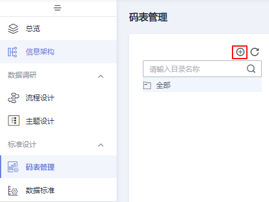

    2.  在弹出框中，输入目录名称，选择目录，然后单击“确定“。

        **图 8**  新建码表目录  
        

3.  新建3个码表：付款方式、供应商、费率代码。

    以新建“付款方式“码表为例，新建码表步骤如下，其他码表也请参照以下步骤完成新建：

    1.  在码表管理页面，在码表目录树中选择一个目录，然后在右侧单击“新建“按钮。

        **图 9**  码表管理  
        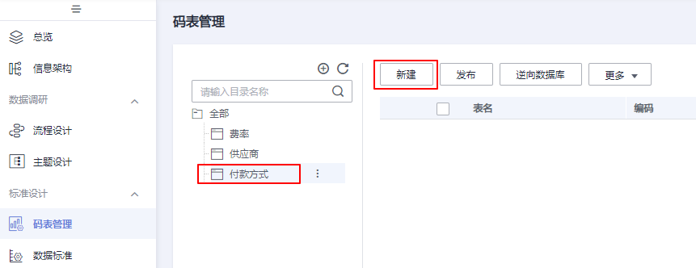

    2.  在新建码表页面中，请参考[表3](#zh-cn_topic_0262779636_table156812733610)配置参数，然后单击“保存“。

        **图 10**  新建码表  
        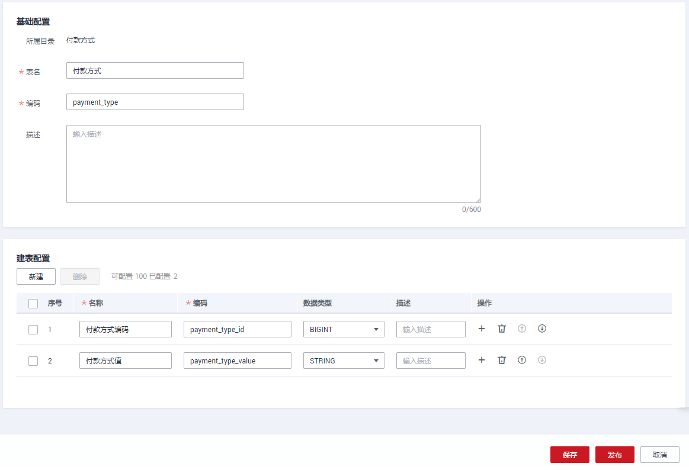

    3.  参考步骤[3.a](#zh-cn_topic_0262779636_li16645139502)\~[3.b](#zh-cn_topic_0262779636_li8669185316506)，在供应商目录下创建供应商码表，在费率目录下创建费率码表。

        **图 11**  供应商码表  
        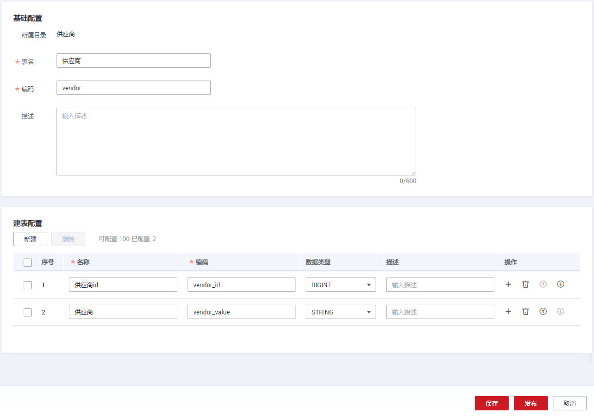

        **图 12**  费率码表  
        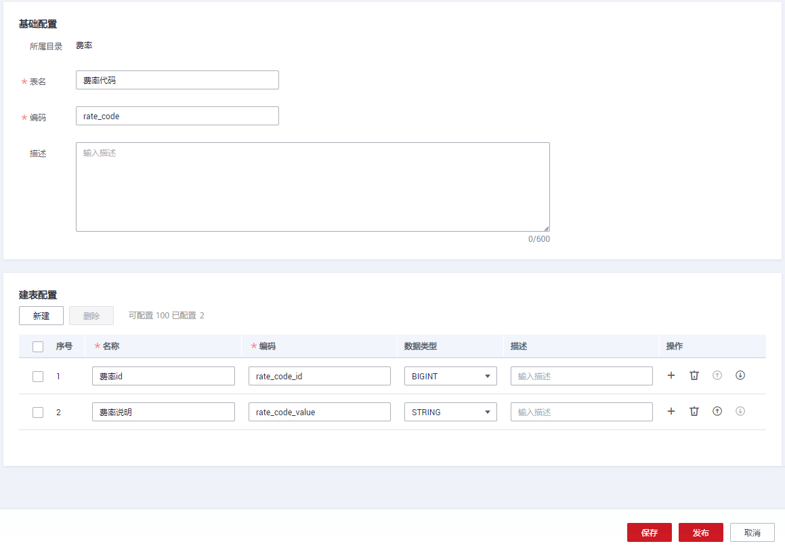

4.  分别为付款方式、供应商、费率3个码表填写数值。

    在“码表管理“页面，找到码表“付款方式“，然后在该码表所在行选择“更多 \> 填写数值“。在填写数值页面，依次单击“新建“添加如[表4](#zh-cn_topic_0262779636_table16482204445819)所示的数值。

    **表 4**  付款方式码表的数值

    
    <table><thead align="left"><tr id="zh-cn_topic_0262779636_row355514455810"><th class="cellrowborder" valign="top" width="41.14%" id="mcps1.2.3.1.1">
付款方式编码

    
payment_type_id

    </th>
    <th class="cellrowborder" valign="top" width="58.86%" id="mcps1.2.3.1.2">
付款方式值

    
payment_type_value

    </th>
    </tr>
    </thead>
    <tbody><tr id="zh-cn_topic_0262779636_row175551344105810"><td class="cellrowborder" valign="top" width="41.14%" headers="mcps1.2.3.1.1 ">
1

    </td>
    <td class="cellrowborder" valign="top" width="58.86%" headers="mcps1.2.3.1.2 ">
Credit card

    </td>
    </tr>
    <tr id="zh-cn_topic_0262779636_row955534425814"><td class="cellrowborder" valign="top" width="41.14%" headers="mcps1.2.3.1.1 ">
2

    </td>
    <td class="cellrowborder" valign="top" width="58.86%" headers="mcps1.2.3.1.2 ">
Cash

    </td>
    </tr>
    <tr id="zh-cn_topic_0262779636_row8555444185812"><td class="cellrowborder" valign="top" width="41.14%" headers="mcps1.2.3.1.1 ">
3

    </td>
    <td class="cellrowborder" valign="top" width="58.86%" headers="mcps1.2.3.1.2 ">
No charge

    </td>
    </tr>
    <tr id="zh-cn_topic_0262779636_row175551644145817"><td class="cellrowborder" valign="top" width="41.14%" headers="mcps1.2.3.1.1 ">
4

    </td>
    <td class="cellrowborder" valign="top" width="58.86%" headers="mcps1.2.3.1.2 ">
Dispute

    </td>
    </tr>
    <tr id="zh-cn_topic_0262779636_row955574418582"><td class="cellrowborder" valign="top" width="41.14%" headers="mcps1.2.3.1.1 ">
5

    </td>
    <td class="cellrowborder" valign="top" width="58.86%" headers="mcps1.2.3.1.2 ">
Unknown

    </td>
    </tr>
    <tr id="zh-cn_topic_0262779636_row1255554419581"><td class="cellrowborder" valign="top" width="41.14%" headers="mcps1.2.3.1.1 ">
6

    </td>
    <td class="cellrowborder" valign="top" width="58.86%" headers="mcps1.2.3.1.2 ">
Voided trip

    </td>
    </tr>
    </tbody>
    </table>

    返回“码表管理“页面，找到码表“供应商“，然后在该码表所在行选择“更多 \> 填写数值“。在填写数值页面，依次单击“新建“添加如[表5](#zh-cn_topic_0262779636_table139471353195913)所示的数值。

    **表 5**  供应商码表的数值

    
    <table><thead align="left"><tr id="zh-cn_topic_0262779636_row316854145920"><th class="cellrowborder" valign="top" width="41.27%" id="mcps1.2.3.1.1">
供应商id

    
vendor_id

    </th>
    <th class="cellrowborder" valign="top" width="58.730000000000004%" id="mcps1.2.3.1.2">
供应商

    
vendor_value

    </th>
    </tr>
    </thead>
    <tbody><tr id="zh-cn_topic_0262779636_row1716854145910"><td class="cellrowborder" valign="top" width="41.27%" headers="mcps1.2.3.1.1 ">
1

    </td>
    <td class="cellrowborder" valign="top" width="58.730000000000004%" headers="mcps1.2.3.1.2 ">
A Company

    </td>
    </tr>
    <tr id="zh-cn_topic_0262779636_row1416125405917"><td class="cellrowborder" valign="top" width="41.27%" headers="mcps1.2.3.1.1 ">
2

    </td>
    <td class="cellrowborder" valign="top" width="58.730000000000004%" headers="mcps1.2.3.1.2 ">
B Company

    </td>
    </tr>
    </tbody>
    </table>

    返回“码表管理“页面，找到码表“费率代码“，然后在该码表所在行选择“更多 \> 填写数值“。在填写数值页面，依次单击“新建“添加如[表6](#zh-cn_topic_0262779636_table14783193912011)所示的数值。

    **表 6**  费率码表的数值

    
    <table><thead align="left"><tr id="zh-cn_topic_0262779636_row78532398017"><th class="cellrowborder" valign="top" width="41.4%" id="mcps1.2.3.1.1">
费率id

    
rate_code_id

    </th>
    <th class="cellrowborder" valign="top" width="58.599999999999994%" id="mcps1.2.3.1.2">
费率说明

    
rate_code_value

    </th>
    </tr>
    </thead>
    <tbody><tr id="zh-cn_topic_0262779636_row1985323910014"><td class="cellrowborder" valign="top" width="41.4%" headers="mcps1.2.3.1.1 ">
1

    </td>
    <td class="cellrowborder" valign="top" width="58.599999999999994%" headers="mcps1.2.3.1.2 ">
Standard rate

    </td>
    </tr>
    <tr id="zh-cn_topic_0262779636_row88531392018"><td class="cellrowborder" valign="top" width="41.4%" headers="mcps1.2.3.1.1 ">
2

    </td>
    <td class="cellrowborder" valign="top" width="58.599999999999994%" headers="mcps1.2.3.1.2 ">
JFK

    </td>
    </tr>
    <tr id="zh-cn_topic_0262779636_row17853839702"><td class="cellrowborder" valign="top" width="41.4%" headers="mcps1.2.3.1.1 ">
3

    </td>
    <td class="cellrowborder" valign="top" width="58.599999999999994%" headers="mcps1.2.3.1.2 ">
Newark

    </td>
    </tr>
    <tr id="zh-cn_topic_0262779636_row6853939701"><td class="cellrowborder" valign="top" width="41.4%" headers="mcps1.2.3.1.1 ">
4

    </td>
    <td class="cellrowborder" valign="top" width="58.599999999999994%" headers="mcps1.2.3.1.2 ">
Nassau or Westchester

    </td>
    </tr>
    <tr id="zh-cn_topic_0262779636_row8853153916019"><td class="cellrowborder" valign="top" width="41.4%" headers="mcps1.2.3.1.1 ">
5

    </td>
    <td class="cellrowborder" valign="top" width="58.599999999999994%" headers="mcps1.2.3.1.2 ">
Negotiated fare

    </td>
    </tr>
    <tr id="zh-cn_topic_0262779636_row17853839604"><td class="cellrowborder" valign="top" width="41.4%" headers="mcps1.2.3.1.1 ">
6

    </td>
    <td class="cellrowborder" valign="top" width="58.599999999999994%" headers="mcps1.2.3.1.2 ">
Group ride

    </td>
    </tr>
    </tbody>
    </table>

5.  返回码表管理页面后，在码表列表中，选中刚才新建的3个码表，然后单击“发布“发布码表。
6.  在“批量发布“对话框中选择审核人，再单击“确认提交“，等待审核人员审核通过后，码表发布成功。如果当前帐号具备审核人权限，也可以勾选“自助审批“，直接提交即可以审核通过。

## 新建数据标准并发布

1.  在规范设计控制台，单击左侧导航树中的“数据标准“，进入数据标准页面。
2.  首次进入“数据标准”页面，需要定制模板，定制的模板后续可以在配置中心进行更改。本示例需要额外勾选“引用码表”，如图所示。

    **图 13**  新建数据标准目录  
    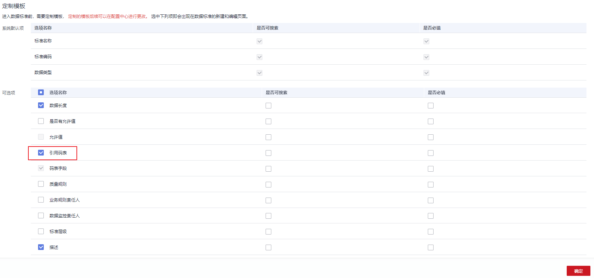

3.  请参考以下步骤，分别新建3个数据标准的目录：付款方式、供应商、费率。

    在数据标准页面的目录树上方，单击新建目录，然后在弹出框中输入目录名称“付款方式”并选择目录，单击“确定“完成目录的新建。

    **图 14**  新建数据标准目录  
    

4.  请参考以下步骤，分别新建3个数据标准：付款方式、供应商、费率。

    1.  在数据标准页面的目录树中，选中所需要的目录，然后在右侧页面中单击“新建“。
    2.  在新建数据标准页面中，3个数据标准可分别参考如下配置，配置完成后单击“保存“。在本示例中，数据标准模板只选取了几个参数，您可以参考[配置中心](https://support.huaweicloud.com/usermanual-dgc/dgc_01_0621.html)的“标准模板管理“定制数据标准模板。

    **图 15**  数据标准-付款方式  
    

    **图 16**  数据标准-供应商  
    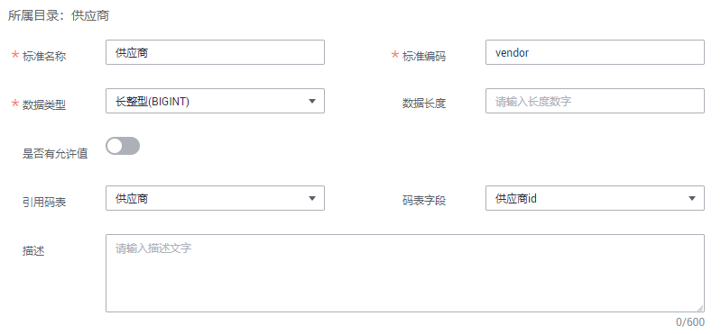

    **图 17**  数据标准-费率代码  
    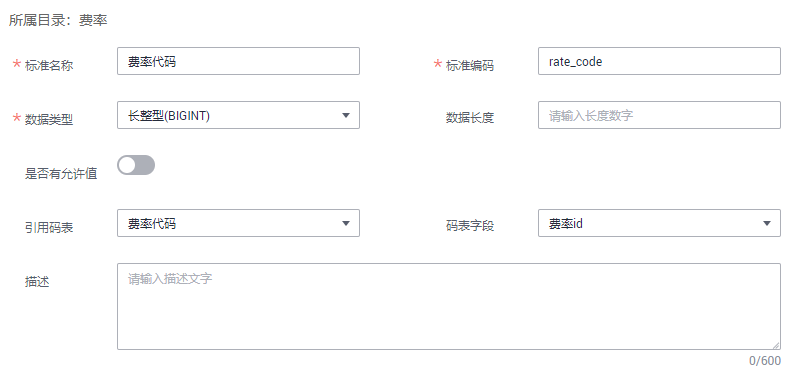

5.  返回数据标准页面后，在列表中勾选刚才新建的3个数据标准，然后单击“发布“发布数据标准。
6.  在“批量发布“对话框中选择审核人，再单击“确认提交“，等待审核人员审核通过后，数据标准发布成功。如果当前帐号具备审核人权限，也可以勾选“自助审批“，直接提交即可以审核通过。

## 关系建模：新建SDI层和DWI层两个模型

在关系建模中，分别新建SDI层和DWI层两个关系模型，并通过逆向数据库导入原始数据表到SDI层的关系模型中，在DWI层模型中新建一个“标准出行数据”的标准化的业务表。

1.  在规范设计控制台，单击左侧导航树中的“关系建模“。
    -   如果当前未创建过关系模型，系统会弹出“新建分层治理模型“提示框。您可以新建一个SDI层关系模型，命名为“sdi“，再新建一个DWI层关系模型，命名为“dwi“。单击“确定”即可。

        **图 18**  “新建分层治理模型”提示框  
        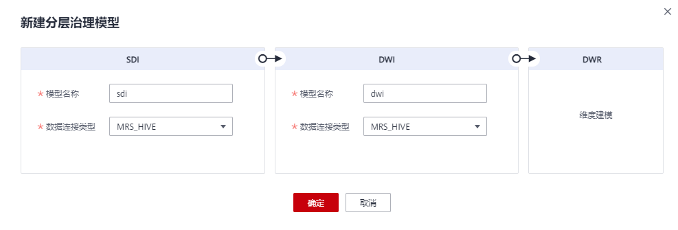

    -   如果不是首次创建，单击新建物理模型，如下图所示。

        **图 19**  关系建模页面  
        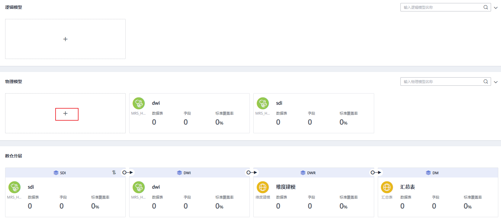

        1.  先新建一个SDI层关系模型，命名为“sdi“。在物理模型页签中，单击，新建模型，配置如下参数，单击“确定“。

            **图 20**  新建SDI物理模型  
            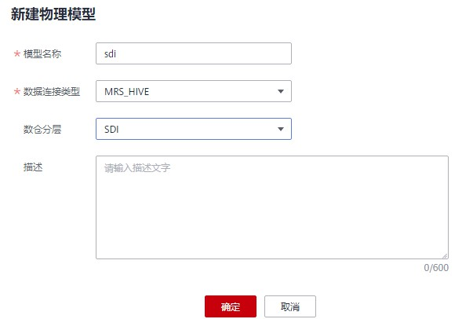

        2.  再新建一个DWI层关系模型，命名为“dwi“。在物理模型页签中，单击，新建模型，配置如下参数，单击“确定“。

            **图 21**  新建DWI模型  
            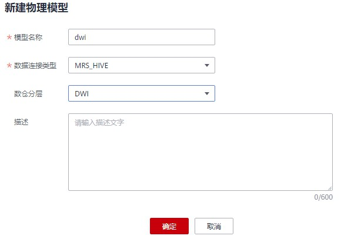

2.  在“数仓分层”页签中，单击新建的SDI关系模型，展开，选中业务对象“城市交通 \> 行程记录 \> 原始记录“，单击“逆向数据库“，通过逆向数据库，导入原始表。

    **图 22**  模型目录  
    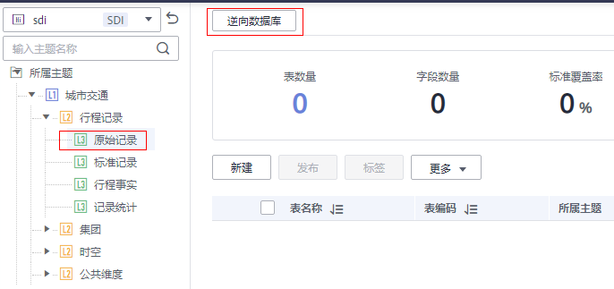

    在“逆向数据库“窗口中，配置如下所示参数，然后单击“确定“。在本示例中选择贴源层数据库demo\_sdi\_db中的原始数据表。

    **图 23**  逆向数据库  
    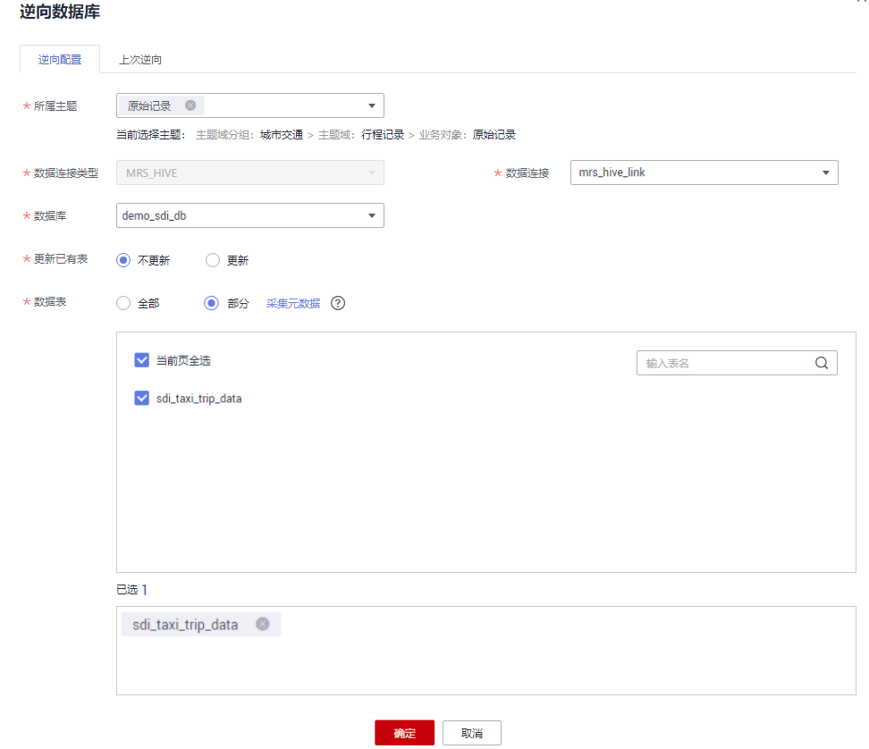

    逆向数据库成功后，单击“关闭“。您可以在列表中查看导入的表：

    **图 24**  查看表  
    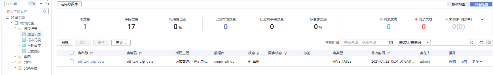

3.  请参照以下步骤，新建一个“标准出行数据”的标准化的业务表。
    1.  在“数仓分层”页签中，单击新建的DWI关系模型，展开，选中DWI模型中的业务对象“城市交通 \> 行程记录 \> 原始记录“，然后在右侧列表上方单击“新建“按钮，进入新建表页面。
    2.  在新建表的“基本配置“标签页中，配置如下：

        **图 25**  行程数据表基本配置  
        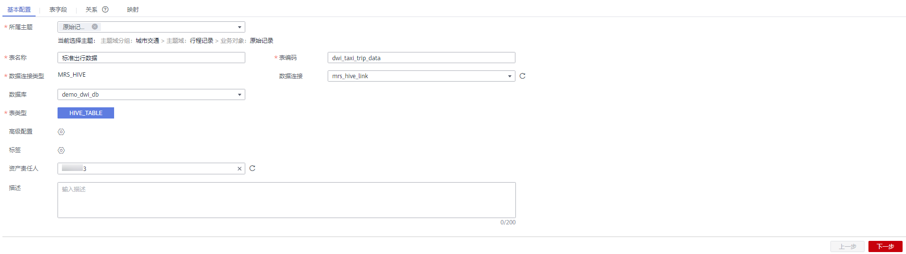

    3.  进入“表字段“标签页，单击“新建“，在标准出行数据表中，依次添加如[表7](#table929218193298)所示的字段，并单击字段供应商编号、费率代码、付款方式的“数据标准“列中的按钮，分别关联数据标准“供应商“、“费率代码“和“付款方式“。添加完成后如[图26](#zh-cn_topic_0222298525_fig1948138204112)所示。

        **表 7**  标准出行数据表字段

        
        <table><thead align="left"><tr id="row368241962915"><th class="cellrowborder" valign="top" width="6.469353064693529%" id="mcps1.2.10.1.1">
序号

        </th>
        <th class="cellrowborder" valign="top" width="9.129087091290868%" id="mcps1.2.10.1.2">
名称

        </th>
        <th class="cellrowborder" valign="top" width="26.14738526147385%" id="mcps1.2.10.1.3">
编码

        </th>
        <th class="cellrowborder" valign="top" width="18.098190180981895%" id="mcps1.2.10.1.4">
数据类型

        </th>
        <th class="cellrowborder" valign="top" width="7.95920407959204%" id="mcps1.2.10.1.5">
数据标准

        </th>
        <th class="cellrowborder" valign="top" width="8.799120087991199%" id="mcps1.2.10.1.6">
主键

        </th>
        <th class="cellrowborder" valign="top" width="8.329167083291669%" id="mcps1.2.10.1.7">
分区

        </th>
        <th class="cellrowborder" valign="top" width="8.519148085191478%" id="mcps1.2.10.1.8">
不为空

        </th>
        <th class="cellrowborder" valign="top" width="6.549345065493449%" id="mcps1.2.10.1.9">
标签

        </th>
        </tr>
        </thead>
        <tbody><tr id="row1868212198297"><td class="cellrowborder" valign="top" width="6.469353064693529%" headers="mcps1.2.10.1.1 ">
1

        </td>
        <td class="cellrowborder" valign="top" width="9.129087091290868%" headers="mcps1.2.10.1.2 ">
供应商编号

        </td>
        <td class="cellrowborder" valign="top" width="26.14738526147385%" headers="mcps1.2.10.1.3 ">
vendor_id

        </td>
        <td class="cellrowborder" valign="top" width="18.098190180981895%" headers="mcps1.2.10.1.4 ">
长整型(BIGINT)

        </td>
        <td class="cellrowborder" valign="top" width="7.95920407959204%" headers="mcps1.2.10.1.5 ">
供应商

        </td>
        <td class="cellrowborder" valign="top" width="8.799120087991199%" headers="mcps1.2.10.1.6 ">
不勾选

        </td>
        <td class="cellrowborder" valign="top" width="8.329167083291669%" headers="mcps1.2.10.1.7 ">
不勾选

        </td>
        <td class="cellrowborder" valign="top" width="8.519148085191478%" headers="mcps1.2.10.1.8 ">
勾选

        </td>
        <td class="cellrowborder" valign="top" width="6.549345065493449%" headers="mcps1.2.10.1.9 ">

        
-

        </td>
        </tr>
        <tr id="row868218193298"><td class="cellrowborder" valign="top" width="6.469353064693529%" headers="mcps1.2.10.1.1 ">
2

        </td>
        <td class="cellrowborder" valign="top" width="9.129087091290868%" headers="mcps1.2.10.1.2 ">
上车时间

        </td>
        <td class="cellrowborder" valign="top" width="26.14738526147385%" headers="mcps1.2.10.1.3 ">
tpep_pickup_datetime

        </td>
        <td class="cellrowborder" valign="top" width="18.098190180981895%" headers="mcps1.2.10.1.4 ">
时间戳类型(TIMESTAMP)

        </td>
        <td class="cellrowborder" valign="top" width="7.95920407959204%" headers="mcps1.2.10.1.5 ">
-

        </td>
        <td class="cellrowborder" valign="top" width="8.799120087991199%" headers="mcps1.2.10.1.6 ">
不勾选

        </td>
        <td class="cellrowborder" valign="top" width="8.329167083291669%" headers="mcps1.2.10.1.7 ">
不勾选

        </td>
        <td class="cellrowborder" valign="top" width="8.519148085191478%" headers="mcps1.2.10.1.8 ">
勾选

        </td>
        <td class="cellrowborder" valign="top" width="6.549345065493449%" headers="mcps1.2.10.1.9 ">

        
-

        </td>
        </tr>
        <tr id="row5682151922918"><td class="cellrowborder" valign="top" width="6.469353064693529%" headers="mcps1.2.10.1.1 ">
3

        </td>
        <td class="cellrowborder" valign="top" width="9.129087091290868%" headers="mcps1.2.10.1.2 ">
下车时间

        </td>
        <td class="cellrowborder" valign="top" width="26.14738526147385%" headers="mcps1.2.10.1.3 ">
tpep_dropoff_datetime

        </td>
        <td class="cellrowborder" valign="top" width="18.098190180981895%" headers="mcps1.2.10.1.4 ">
时间戳类型(TIMESTAMP)

        </td>
        <td class="cellrowborder" valign="top" width="7.95920407959204%" headers="mcps1.2.10.1.5 ">
-

        </td>
        <td class="cellrowborder" valign="top" width="8.799120087991199%" headers="mcps1.2.10.1.6 ">
不勾选

        </td>
        <td class="cellrowborder" valign="top" width="8.329167083291669%" headers="mcps1.2.10.1.7 ">
不勾选

        </td>
        <td class="cellrowborder" valign="top" width="8.519148085191478%" headers="mcps1.2.10.1.8 ">
勾选

        </td>
        <td class="cellrowborder" valign="top" width="6.549345065493449%" headers="mcps1.2.10.1.9 ">

        
-

        </td>
        </tr>
        <tr id="row868221912297"><td class="cellrowborder" valign="top" width="6.469353064693529%" headers="mcps1.2.10.1.1 ">
4

        </td>
        <td class="cellrowborder" valign="top" width="9.129087091290868%" headers="mcps1.2.10.1.2 ">
乘客人数

        </td>
        <td class="cellrowborder" valign="top" width="26.14738526147385%" headers="mcps1.2.10.1.3 ">
passenger_count

        </td>
        <td class="cellrowborder" valign="top" width="18.098190180981895%" headers="mcps1.2.10.1.4 ">
字符类型(STRING)

        </td>
        <td class="cellrowborder" valign="top" width="7.95920407959204%" headers="mcps1.2.10.1.5 ">
-

        </td>
        <td class="cellrowborder" valign="top" width="8.799120087991199%" headers="mcps1.2.10.1.6 ">
不勾选

        </td>
        <td class="cellrowborder" valign="top" width="8.329167083291669%" headers="mcps1.2.10.1.7 ">
不勾选

        </td>
        <td class="cellrowborder" valign="top" width="8.519148085191478%" headers="mcps1.2.10.1.8 ">
勾选

        </td>
        <td class="cellrowborder" valign="top" width="6.549345065493449%" headers="mcps1.2.10.1.9 ">

        
-

        </td>
        </tr>
        <tr id="row126831119112913"><td class="cellrowborder" valign="top" width="6.469353064693529%" headers="mcps1.2.10.1.1 ">
5

        </td>
        <td class="cellrowborder" valign="top" width="9.129087091290868%" headers="mcps1.2.10.1.2 ">
行驶距离

        </td>
        <td class="cellrowborder" valign="top" width="26.14738526147385%" headers="mcps1.2.10.1.3 ">
trip_distance

        </td>
        <td class="cellrowborder" valign="top" width="18.098190180981895%" headers="mcps1.2.10.1.4 ">
高精度(DECIMAL)(10,2)

        </td>
        <td class="cellrowborder" valign="top" width="7.95920407959204%" headers="mcps1.2.10.1.5 ">
-

        </td>
        <td class="cellrowborder" valign="top" width="8.799120087991199%" headers="mcps1.2.10.1.6 ">
不勾选

        </td>
        <td class="cellrowborder" valign="top" width="8.329167083291669%" headers="mcps1.2.10.1.7 ">
不勾选

        </td>
        <td class="cellrowborder" valign="top" width="8.519148085191478%" headers="mcps1.2.10.1.8 ">
勾选

        </td>
        <td class="cellrowborder" valign="top" width="6.549345065493449%" headers="mcps1.2.10.1.9 ">

        
-

        </td>
        </tr>
        <tr id="row15683919122916"><td class="cellrowborder" valign="top" width="6.469353064693529%" headers="mcps1.2.10.1.1 ">
6

        </td>
        <td class="cellrowborder" valign="top" width="9.129087091290868%" headers="mcps1.2.10.1.2 ">
费率代码

        </td>
        <td class="cellrowborder" valign="top" width="26.14738526147385%" headers="mcps1.2.10.1.3 ">
rate_code_id

        </td>
        <td class="cellrowborder" valign="top" width="18.098190180981895%" headers="mcps1.2.10.1.4 ">
长整型(BIGINT)

        </td>
        <td class="cellrowborder" valign="top" width="7.95920407959204%" headers="mcps1.2.10.1.5 ">
费率代码

        </td>
        <td class="cellrowborder" valign="top" width="8.799120087991199%" headers="mcps1.2.10.1.6 ">
不勾选

        </td>
        <td class="cellrowborder" valign="top" width="8.329167083291669%" headers="mcps1.2.10.1.7 ">
不勾选

        </td>
        <td class="cellrowborder" valign="top" width="8.519148085191478%" headers="mcps1.2.10.1.8 ">
勾选

        </td>
        <td class="cellrowborder" valign="top" width="6.549345065493449%" headers="mcps1.2.10.1.9 ">

        
-

        </td>
        </tr>
        <tr id="row1368341912293"><td class="cellrowborder" valign="top" width="6.469353064693529%" headers="mcps1.2.10.1.1 ">
7

        </td>
        <td class="cellrowborder" valign="top" width="9.129087091290868%" headers="mcps1.2.10.1.2 ">
存储转发标识

        </td>
        <td class="cellrowborder" valign="top" width="26.14738526147385%" headers="mcps1.2.10.1.3 ">
store_fwd_flag

        </td>
        <td class="cellrowborder" valign="top" width="18.098190180981895%" headers="mcps1.2.10.1.4 ">
字符类型(STRING)

        </td>
        <td class="cellrowborder" valign="top" width="7.95920407959204%" headers="mcps1.2.10.1.5 ">
-

        </td>
        <td class="cellrowborder" valign="top" width="8.799120087991199%" headers="mcps1.2.10.1.6 ">
不勾选

        </td>
        <td class="cellrowborder" valign="top" width="8.329167083291669%" headers="mcps1.2.10.1.7 ">
不勾选

        </td>
        <td class="cellrowborder" valign="top" width="8.519148085191478%" headers="mcps1.2.10.1.8 ">
勾选

        </td>
        <td class="cellrowborder" valign="top" width="6.549345065493449%" headers="mcps1.2.10.1.9 ">

        
-

        </td>
        </tr>
        <tr id="row3683121912295"><td class="cellrowborder" valign="top" width="6.469353064693529%" headers="mcps1.2.10.1.1 ">
8

        </td>
        <td class="cellrowborder" valign="top" width="9.129087091290868%" headers="mcps1.2.10.1.2 ">
上车地点

        </td>
        <td class="cellrowborder" valign="top" width="26.14738526147385%" headers="mcps1.2.10.1.3 ">
pu_location_id

        </td>
        <td class="cellrowborder" valign="top" width="18.098190180981895%" headers="mcps1.2.10.1.4 ">
字符类型(STRING)

        </td>
        <td class="cellrowborder" valign="top" width="7.95920407959204%" headers="mcps1.2.10.1.5 ">
-

        </td>
        <td class="cellrowborder" valign="top" width="8.799120087991199%" headers="mcps1.2.10.1.6 ">
不勾选

        </td>
        <td class="cellrowborder" valign="top" width="8.329167083291669%" headers="mcps1.2.10.1.7 ">
不勾选

        </td>
        <td class="cellrowborder" valign="top" width="8.519148085191478%" headers="mcps1.2.10.1.8 ">
勾选

        </td>
        <td class="cellrowborder" valign="top" width="6.549345065493449%" headers="mcps1.2.10.1.9 ">

        
-

        </td>
        </tr>
        <tr id="row136831319102910"><td class="cellrowborder" valign="top" width="6.469353064693529%" headers="mcps1.2.10.1.1 ">
9

        </td>
        <td class="cellrowborder" valign="top" width="9.129087091290868%" headers="mcps1.2.10.1.2 ">
下车地点

        </td>
        <td class="cellrowborder" valign="top" width="26.14738526147385%" headers="mcps1.2.10.1.3 ">
do_location_id

        </td>
        <td class="cellrowborder" valign="top" width="18.098190180981895%" headers="mcps1.2.10.1.4 ">
字符类型(STRING)

        </td>
        <td class="cellrowborder" valign="top" width="7.95920407959204%" headers="mcps1.2.10.1.5 ">
-

        </td>
        <td class="cellrowborder" valign="top" width="8.799120087991199%" headers="mcps1.2.10.1.6 ">
不勾选

        </td>
        <td class="cellrowborder" valign="top" width="8.329167083291669%" headers="mcps1.2.10.1.7 ">
不勾选

        </td>
        <td class="cellrowborder" valign="top" width="8.519148085191478%" headers="mcps1.2.10.1.8 ">
勾选

        </td>
        <td class="cellrowborder" valign="top" width="6.549345065493449%" headers="mcps1.2.10.1.9 ">

        
-

        </td>
        </tr>
        <tr id="row17683519172911"><td class="cellrowborder" valign="top" width="6.469353064693529%" headers="mcps1.2.10.1.1 ">
10

        </td>
        <td class="cellrowborder" valign="top" width="9.129087091290868%" headers="mcps1.2.10.1.2 ">
付款方式代码

        </td>
        <td class="cellrowborder" valign="top" width="26.14738526147385%" headers="mcps1.2.10.1.3 ">
payment_type

        </td>
        <td class="cellrowborder" valign="top" width="18.098190180981895%" headers="mcps1.2.10.1.4 ">
长整型(BIGINT)

        </td>
        <td class="cellrowborder" valign="top" width="7.95920407959204%" headers="mcps1.2.10.1.5 ">
付款方式

        </td>
        <td class="cellrowborder" valign="top" width="8.799120087991199%" headers="mcps1.2.10.1.6 ">
不勾选

        </td>
        <td class="cellrowborder" valign="top" width="8.329167083291669%" headers="mcps1.2.10.1.7 ">
不勾选

        </td>
        <td class="cellrowborder" valign="top" width="8.519148085191478%" headers="mcps1.2.10.1.8 ">
勾选

        </td>
        <td class="cellrowborder" valign="top" width="6.549345065493449%" headers="mcps1.2.10.1.9 ">

        
-

        </td>
        </tr>
        <tr id="row5684719152916"><td class="cellrowborder" valign="top" width="6.469353064693529%" headers="mcps1.2.10.1.1 ">
11

        </td>
        <td class="cellrowborder" valign="top" width="9.129087091290868%" headers="mcps1.2.10.1.2 ">
车费

        </td>
        <td class="cellrowborder" valign="top" width="26.14738526147385%" headers="mcps1.2.10.1.3 ">
fare_amount

        </td>
        <td class="cellrowborder" valign="top" width="18.098190180981895%" headers="mcps1.2.10.1.4 ">
高精度(DECIMAL)(10,2)

        </td>
        <td class="cellrowborder" valign="top" width="7.95920407959204%" headers="mcps1.2.10.1.5 ">
-

        </td>
        <td class="cellrowborder" valign="top" width="8.799120087991199%" headers="mcps1.2.10.1.6 ">
不勾选

        </td>
        <td class="cellrowborder" valign="top" width="8.329167083291669%" headers="mcps1.2.10.1.7 ">
不勾选

        </td>
        <td class="cellrowborder" valign="top" width="8.519148085191478%" headers="mcps1.2.10.1.8 ">
勾选

        </td>
        <td class="cellrowborder" valign="top" width="6.549345065493449%" headers="mcps1.2.10.1.9 ">

        
-

        </td>
        </tr>
        <tr id="row46841819122912"><td class="cellrowborder" valign="top" width="6.469353064693529%" headers="mcps1.2.10.1.1 ">
12

        </td>
        <td class="cellrowborder" valign="top" width="9.129087091290868%" headers="mcps1.2.10.1.2 ">
加收

        </td>
        <td class="cellrowborder" valign="top" width="26.14738526147385%" headers="mcps1.2.10.1.3 ">
extra

        </td>
        <td class="cellrowborder" valign="top" width="18.098190180981895%" headers="mcps1.2.10.1.4 ">
高精度(DECIMAL)(10,2)

        </td>
        <td class="cellrowborder" valign="top" width="7.95920407959204%" headers="mcps1.2.10.1.5 ">
-

        </td>
        <td class="cellrowborder" valign="top" width="8.799120087991199%" headers="mcps1.2.10.1.6 ">
不勾选

        </td>
        <td class="cellrowborder" valign="top" width="8.329167083291669%" headers="mcps1.2.10.1.7 ">
不勾选

        </td>
        <td class="cellrowborder" valign="top" width="8.519148085191478%" headers="mcps1.2.10.1.8 ">
勾选

        </td>
        <td class="cellrowborder" valign="top" width="6.549345065493449%" headers="mcps1.2.10.1.9 ">

        
-

        </td>
        </tr>
        <tr id="row968411914291"><td class="cellrowborder" valign="top" width="6.469353064693529%" headers="mcps1.2.10.1.1 ">
13

        </td>
        <td class="cellrowborder" valign="top" width="9.129087091290868%" headers="mcps1.2.10.1.2 ">
MTA税

        </td>
        <td class="cellrowborder" valign="top" width="26.14738526147385%" headers="mcps1.2.10.1.3 ">
mta_tax

        </td>
        <td class="cellrowborder" valign="top" width="18.098190180981895%" headers="mcps1.2.10.1.4 ">
高精度(DECIMAL)(10,2)

        </td>
        <td class="cellrowborder" valign="top" width="7.95920407959204%" headers="mcps1.2.10.1.5 ">
-

        </td>
        <td class="cellrowborder" valign="top" width="8.799120087991199%" headers="mcps1.2.10.1.6 ">
不勾选

        </td>
        <td class="cellrowborder" valign="top" width="8.329167083291669%" headers="mcps1.2.10.1.7 ">
不勾选

        </td>
        <td class="cellrowborder" valign="top" width="8.519148085191478%" headers="mcps1.2.10.1.8 ">
勾选

        </td>
        <td class="cellrowborder" valign="top" width="6.549345065493449%" headers="mcps1.2.10.1.9 ">

        
-

        </td>
        </tr>
        <tr id="row136841119152917"><td class="cellrowborder" valign="top" width="6.469353064693529%" headers="mcps1.2.10.1.1 ">
14

        </td>
        <td class="cellrowborder" valign="top" width="9.129087091290868%" headers="mcps1.2.10.1.2 ">
手续费

        </td>
        <td class="cellrowborder" valign="top" width="26.14738526147385%" headers="mcps1.2.10.1.3 ">
tip_amount

        </td>
        <td class="cellrowborder" valign="top" width="18.098190180981895%" headers="mcps1.2.10.1.4 ">
高精度(DECIMAL)(10,2)

        </td>
        <td class="cellrowborder" valign="top" width="7.95920407959204%" headers="mcps1.2.10.1.5 ">
-

        </td>
        <td class="cellrowborder" valign="top" width="8.799120087991199%" headers="mcps1.2.10.1.6 ">
不勾选

        </td>
        <td class="cellrowborder" valign="top" width="8.329167083291669%" headers="mcps1.2.10.1.7 ">
不勾选

        </td>
        <td class="cellrowborder" valign="top" width="8.519148085191478%" headers="mcps1.2.10.1.8 ">
勾选

        </td>
        <td class="cellrowborder" valign="top" width="6.549345065493449%" headers="mcps1.2.10.1.9 ">

        
-

        </td>
        </tr>
        <tr id="row0684101932910"><td class="cellrowborder" valign="top" width="6.469353064693529%" headers="mcps1.2.10.1.1 ">
15

        </td>
        <td class="cellrowborder" valign="top" width="9.129087091290868%" headers="mcps1.2.10.1.2 ">
通行费

        </td>
        <td class="cellrowborder" valign="top" width="26.14738526147385%" headers="mcps1.2.10.1.3 ">
tolls_amount

        </td>
        <td class="cellrowborder" valign="top" width="18.098190180981895%" headers="mcps1.2.10.1.4 ">
高精度(DECIMAL)(10,2)

        </td>
        <td class="cellrowborder" valign="top" width="7.95920407959204%" headers="mcps1.2.10.1.5 ">
-

        </td>
        <td class="cellrowborder" valign="top" width="8.799120087991199%" headers="mcps1.2.10.1.6 ">
不勾选

        </td>
        <td class="cellrowborder" valign="top" width="8.329167083291669%" headers="mcps1.2.10.1.7 ">
不勾选

        </td>
        <td class="cellrowborder" valign="top" width="8.519148085191478%" headers="mcps1.2.10.1.8 ">
勾选

        </td>
        <td class="cellrowborder" valign="top" width="6.549345065493449%" headers="mcps1.2.10.1.9 ">

        
-

        </td>
        </tr>
        <tr id="row1568491982914"><td class="cellrowborder" valign="top" width="6.469353064693529%" headers="mcps1.2.10.1.1 ">
16

        </td>
        <td class="cellrowborder" valign="top" width="9.129087091290868%" headers="mcps1.2.10.1.2 ">
改善附加费

        </td>
        <td class="cellrowborder" valign="top" width="26.14738526147385%" headers="mcps1.2.10.1.3 ">
improvement_surcharge

        </td>
        <td class="cellrowborder" valign="top" width="18.098190180981895%" headers="mcps1.2.10.1.4 ">
高精度(DECIMAL)(10,2)

        </td>
        <td class="cellrowborder" valign="top" width="7.95920407959204%" headers="mcps1.2.10.1.5 ">
-

        </td>
        <td class="cellrowborder" valign="top" width="8.799120087991199%" headers="mcps1.2.10.1.6 ">
不勾选

        </td>
        <td class="cellrowborder" valign="top" width="8.329167083291669%" headers="mcps1.2.10.1.7 ">
不勾选

        </td>
        <td class="cellrowborder" valign="top" width="8.519148085191478%" headers="mcps1.2.10.1.8 ">
勾选

        </td>
        <td class="cellrowborder" valign="top" width="6.549345065493449%" headers="mcps1.2.10.1.9 ">

        
-

        </td>
        </tr>
        <tr id="row4684161982911"><td class="cellrowborder" valign="top" width="6.469353064693529%" headers="mcps1.2.10.1.1 ">
17

        </td>
        <td class="cellrowborder" valign="top" width="9.129087091290868%" headers="mcps1.2.10.1.2 ">
总车费

        </td>
        <td class="cellrowborder" valign="top" width="26.14738526147385%" headers="mcps1.2.10.1.3 ">
total_amount

        </td>
        <td class="cellrowborder" valign="top" width="18.098190180981895%" headers="mcps1.2.10.1.4 ">
高精度(DECIMAL)(10,2)

        </td>
        <td class="cellrowborder" valign="top" width="7.95920407959204%" headers="mcps1.2.10.1.5 ">
-

        </td>
        <td class="cellrowborder" valign="top" width="8.799120087991199%" headers="mcps1.2.10.1.6 ">
不勾选

        </td>
        <td class="cellrowborder" valign="top" width="8.329167083291669%" headers="mcps1.2.10.1.7 ">
不勾选

        </td>
        <td class="cellrowborder" valign="top" width="8.519148085191478%" headers="mcps1.2.10.1.8 ">
勾选

        </td>
        <td class="cellrowborder" valign="top" width="6.549345065493449%" headers="mcps1.2.10.1.9 ">
-

        </td>
        </tr>
        </tbody>
        </table>

        **图 26**  行程数据表字段  
        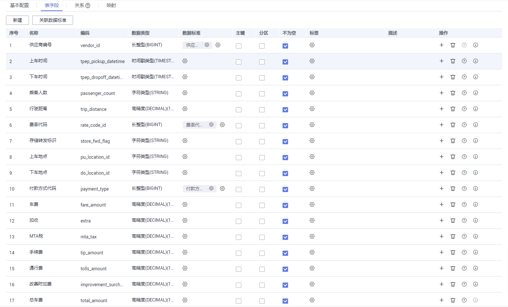

        对于标准出行数据表中的字段，您可以执行以下操作。

        -   **关联数据标准**

            在新建表或编辑表时，进入“表字段“标签页，在字段所在行的“数据标准“列，单击按钮可以选择一个数据标准与字段相关联。将字段关联数据标准后，表发布上线后，就会自动生成一个质量作业，每个关联了数据标准的字段会生成一个质量规则，基于数据标准对字段进行质量监控，您可以前往DGC数据质量模块的“质量作业“页面进行查看。有关关联数据标准的更多信息，请参见[物理模型设计](https://support.huaweicloud.com/usermanual-dgc/dgc_01_0606.html)中的“新建表并发布“。

        -   **添加标签**

            标签是用户自定义的标识。添加标签后，您就可以在DGC数据资产模块中通过标签搜索相关的数据资产。

            在新建表或编辑表时，进入“表字段“标签页，在字段所在行的“标签“列，单击按钮可以添加标签，在弹出框中，您可以输入新的标签名称后按回车，也可以在下拉列表中选择已有标签。

        -   **关联质量规则**

            完成表的新建后，您可以在表中为字段关联质量规则，完成关联后，当表发布成功后，就会在DGC数据质量中自动创建质量作业，如果当前表已经发布，则系统会自动更新质量作业。有关关联质量规则的更多信息，请参见[关联质量规则](https://support.huaweicloud.com/usermanual-dgc/dgc_01_0636.html)。

    4.  接下来，进入“映射“标签页，通过新建映射设计表的数据来源。

        -   如果表中的字段数据来源于不同的关系模型，您需要创建多个映射。在每个映射中，您只需要为来源于当前映射的字段设置源字段，其他字段可以不设置。
        -   如果表中的字段数据来源于同一个关系模型中的多个表，您可以新建一个映射。在该映射的“源表“中，您可以将多个表设置Join，然后再为表中的字段设置源字段。

        本示例只需要新建一个映射。单击“新建“，新建一个映射，如[图27](#zh-cn_topic_0222298525_fig2672153020255)。

        -   **映射名称**：新建映射时会自动生成，您也可以修改。
        -   **来源模型**：本示例选择“sdi”。
        -   **源表**：本示例选择原始数据表“sdi\_taxi\_trip\_data”，标准出行数据表的数据均来源于该原始数据表。

            **图 27**  新建映射  
            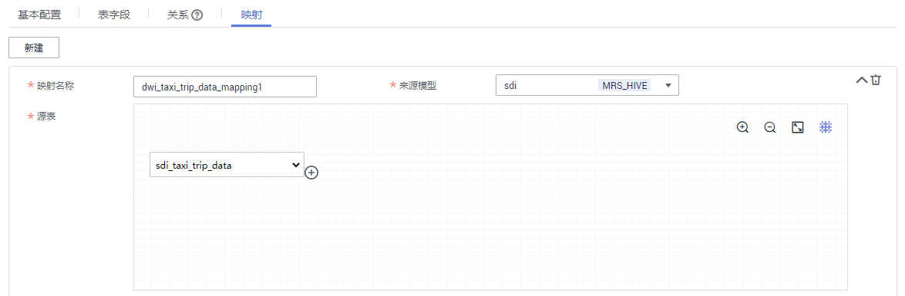

        -   **字段映射**：

            在“字段映射“区域，依次为表中的字段设置源字段，所选择的源字段应与表中的字段代表相同含义，一一对应。如[图28](#zh-cn_topic_0222298525_fig1344103811414)所示，在字段映射的底部，会显示生成的SQL语句，可供参考。

            > **说明：** 
            >-   如果在“规范设计 \> 配置中心 \> 功能配置“页面中开启了“模型设计业务流程步骤 \> 创建数据开发作业”（默认为关闭），发布表时，系统支持根据表的映射信息，在数据开发中自动创建一个ETL作业，每一个映射会生成一个ETL节点，作业名称以“_数据库名称\_表编码_”开头。当前该功能处于内测阶段，仅支持DLI-\>DLI和DLI-\>DWS两种映射的作业创建。
            >    已创建的ETL作业可以进入“数据开发 \> 作业开发“页面查看。ETL作业默认每天0点启动调度。
            >-   在本示例中，不支持自动创建ETL作业，映射信息仅为数据开发提供数据的ETL流向。在做数据开发的过程中，可以参考此处的映射关系编写SQL脚本。

            **图 28**  字段映射  
            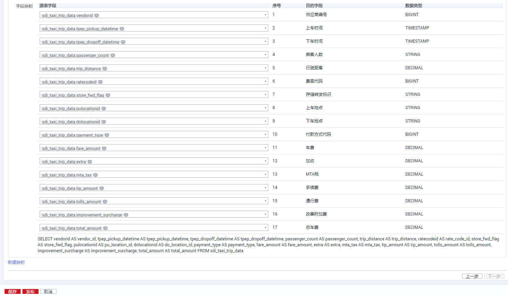

    5.  完成映射的配置后，出租车行程数据表配置完成，单击“保存“。

4.  模型创建好之后，勾选已创建的模型，选择“更多 \> 导出“，然后在弹出框中选中“表“并单击“确定“，可以将整个模型导出。参考同样的方法导出模型“sdi”。导出后的模型，可以作为备份，今后可用于模型导入。

    **图 29**  导出模型  
    

5.  发布表模型。
    1.  发布[2](#zh-cn_topic_0222298525_li167674202477)中通过逆向数据库导入SDI模型的原始表，发布后，就可以通过DGC对原始表进行管理和监控。

        返回关系建模页面，在模型目录选择“sdi”模型，然后在右侧的列表中，勾选表sdi\_taxi\_trip\_data，再单击“发布“，然后在弹出框中选择审核人，单击“确认提交“，等待审核人员审核通过后，“sdi”模型发布成功。如果当前帐号具备审核人权限，也可以勾选“自助审批“，直接提交即可以审核通过。

    2.  发布DWI模型中的表。

        返回关系建模页面，在模型目录中选择“dwi”模型，然后在右侧的列表中，勾选表“标准出行数据”，再单击“发布“，然后在弹出框中选择审核人，单击“确认提交“，等待审核人员审核通过后，“dwi”模型发布成功。如果当前帐号具备审核人权限，也可以勾选“自助审批“，直接提交即可以审核通过。

6.  当表模型发布成功后，进入规范设计的“关系建模“页面可以查看表的“状态“和“同步状态“。

    发布是一个异步操作，您可以单击按钮刷新状态。表发布并通过审核后，系统会依据“配置中心 \> 功能配置”页面中的“模型设计业务流程步骤”进行创建表、同步技术资产、同步业务资产等操作，在表的“同步状态“一列中将显示同步状态。

    -   “同步状态“若均显示成功，则说明表发布成功。鼠标移至“同步状态“中的图标之上，若显示“创建表: 创建成功“说明该表在对应的数据源下已经创建成功。
    -   “同步状态“若显示某一项或某几项失败，可以先刷新状态。如果仍失败，可以选择操作列的“更多 \> 发布历史“，然后进入“发布日志“标签页查看日志。

        请根据错误日志定位失败原因，问题解决后，再返回“关系建模“页面，在列表中勾选需同步的表，然后选择“更多 \> 同步“尝试重新同步。如果仍同步失败，请联系技术支持人员协助解决。

    **图 30**  查看表状态  
    

    在列表中单击表名，可以查看表的详情，其中“数据源“显示了表的位置。

    **图 31**  表详情  
    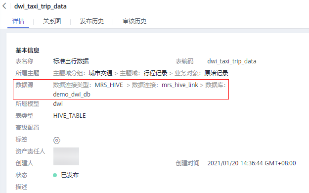

## 维度建模：在DWR层新建并发布维度

在维度建模中，在DWR数据报告层中新建3个码表维度（供应商、费率代码和付款方式）和1个层级维度（日期维度）。

1.  在规范设计控制台，单击左侧导航树中的“维度建模“，进入维度建模页面。
2.  新建3个码表维度：供应商、费率代码和付款方式。
    1.  在“维度建模“页面进入“维度“标签页，在主题树中选中“城市交通 \> 集团 \> 供应商”，然后单击“新建“新建供应商维度。

        **图 32**  维度建模  
        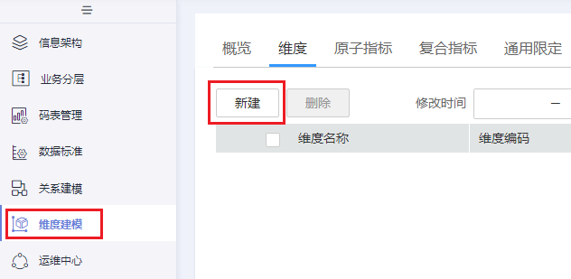

    2.  在新建维度页面，如下图所示配置参数，然后单击“保存“完成维度的新建。

        **图 33**  新建维度  
        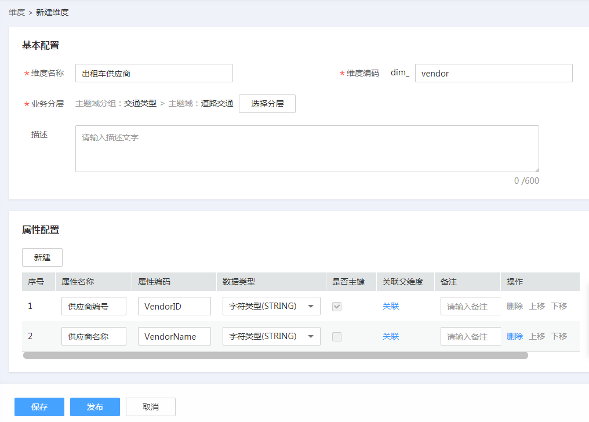

    3.  在“维度建模“页面进入“维度“标签页，在主题树中选中“城市交通 \> 公共维度 \> 公共维度”，然后单击“新建“新建费率代码维度。在新建维度页面，配置如下，配置完成后单击“保存“。

        **图 34**  费率代码维度  
        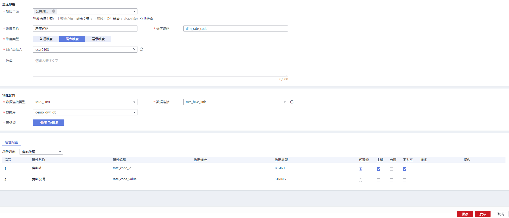

    4.  在“维度建模“页面进入“维度“标签页，在主题树中选中“城市交通 \> 公共维度 \> 公共维度”，然后单击“新建“新建付款方式维度。在新建维度页面，维度配置如下，配置完成后单击“保存“。

        **图 35**  付款方式维度  
        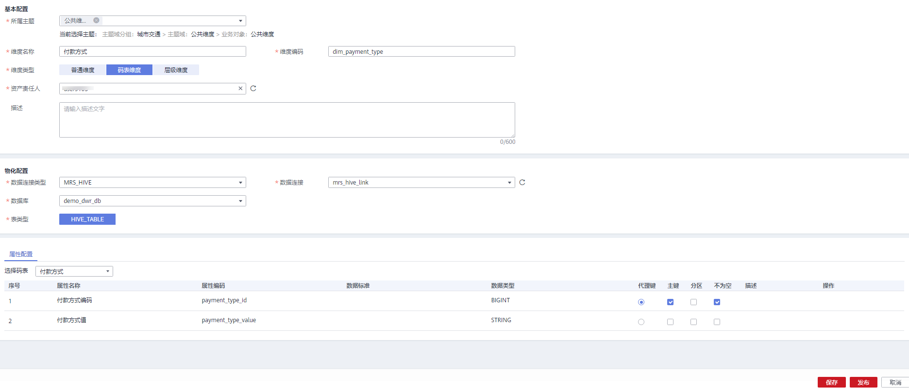

3.  新建一个层级维度“日期维度“。
    1.  在“维度建模“页面进入“维度“标签页，在主题树中选中“城市交通 \> 时空 \> 时间”，然后单击“新建“新建日期维度。
    2.  基本配置和物化配置如下：

        **图 36**  日期维度  
        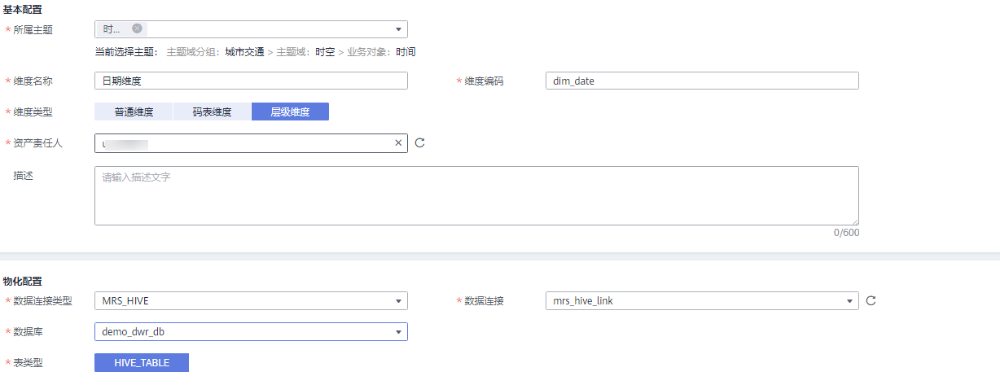

    3.  属性配置如下：

        **表 8**  属性配置

        
        <table><thead align="left"><tr id="zh-cn_topic_0262779636_row176311917471"><th class="cellrowborder" valign="top" width="7.91%" id="mcps1.2.10.1.1">
序号

        </th>
        <th class="cellrowborder" valign="top" width="11.04%" id="mcps1.2.10.1.2">
属性名称

        </th>
        <th class="cellrowborder" valign="top" width="15.55%" id="mcps1.2.10.1.3">
属性编码

        </th>
        <th class="cellrowborder" valign="top" width="10.290000000000001%" id="mcps1.2.10.1.4">
数据标准

        </th>
        <th class="cellrowborder" valign="top" width="13.55%" id="mcps1.2.10.1.5">
数据类型

        </th>
        <th class="cellrowborder" valign="top" width="7.5200000000000005%" id="mcps1.2.10.1.6">
代理键

        </th>
        <th class="cellrowborder" valign="top" width="11.379999999999999%" id="mcps1.2.10.1.7">
主键

        </th>
        <th class="cellrowborder" valign="top" width="11.379999999999999%" id="mcps1.2.10.1.8">
分区

        </th>
        <th class="cellrowborder" valign="top" width="11.379999999999999%" id="mcps1.2.10.1.9">
不为空

        </th>
        </tr>
        </thead>
        <tbody><tr id="zh-cn_topic_0262779636_row1764161912475"><td class="cellrowborder" valign="top" width="7.91%" headers="mcps1.2.10.1.1 ">
1

        </td>
        <td class="cellrowborder" valign="top" width="11.04%" headers="mcps1.2.10.1.2 ">
日期维度

        </td>
        <td class="cellrowborder" valign="top" width="15.55%" headers="mcps1.2.10.1.3 ">
dim_date_key

        </td>
        <td class="cellrowborder" valign="top" width="10.290000000000001%" headers="mcps1.2.10.1.4 ">
-

        </td>
        <td class="cellrowborder" valign="top" width="13.55%" headers="mcps1.2.10.1.5 ">
TIMESTAMP

        </td>
        <td class="cellrowborder" valign="top" width="7.5200000000000005%" headers="mcps1.2.10.1.6 ">
选中

        </td>
        <td class="cellrowborder" valign="top" width="11.379999999999999%" headers="mcps1.2.10.1.7 ">
选中

        </td>
        <td class="cellrowborder" valign="top" width="11.379999999999999%" headers="mcps1.2.10.1.8 ">
不勾选

        </td>
        <td class="cellrowborder" valign="top" width="11.379999999999999%" headers="mcps1.2.10.1.9 ">
勾选

        </td>
        </tr>
        <tr id="zh-cn_topic_0262779636_row106481994717"><td class="cellrowborder" valign="top" width="7.91%" headers="mcps1.2.10.1.1 ">
2

        </td>
        <td class="cellrowborder" valign="top" width="11.04%" headers="mcps1.2.10.1.2 ">
分

        </td>
        <td class="cellrowborder" valign="top" width="15.55%" headers="mcps1.2.10.1.3 ">
minute

        </td>
        <td class="cellrowborder" valign="top" width="10.290000000000001%" headers="mcps1.2.10.1.4 ">
-

        </td>
        <td class="cellrowborder" valign="top" width="13.55%" headers="mcps1.2.10.1.5 ">
BIGINT

        </td>
        <td class="cellrowborder" valign="top" width="7.5200000000000005%" headers="mcps1.2.10.1.6 ">
不选

        </td>
        <td class="cellrowborder" valign="top" width="11.379999999999999%" headers="mcps1.2.10.1.7 ">
不选

        </td>
        <td class="cellrowborder" valign="top" width="11.379999999999999%" headers="mcps1.2.10.1.8 ">
不勾选

        </td>
        <td class="cellrowborder" valign="top" width="11.379999999999999%" headers="mcps1.2.10.1.9 ">
不勾选

        </td>
        </tr>
        <tr id="zh-cn_topic_0262779636_row664121920478"><td class="cellrowborder" valign="top" width="7.91%" headers="mcps1.2.10.1.1 ">
3

        </td>
        <td class="cellrowborder" valign="top" width="11.04%" headers="mcps1.2.10.1.2 ">
时

        </td>
        <td class="cellrowborder" valign="top" width="15.55%" headers="mcps1.2.10.1.3 ">
hour

        </td>
        <td class="cellrowborder" valign="top" width="10.290000000000001%" headers="mcps1.2.10.1.4 ">
-

        </td>
        <td class="cellrowborder" valign="top" width="13.55%" headers="mcps1.2.10.1.5 ">
BIGINT

        </td>
        <td class="cellrowborder" valign="top" width="7.5200000000000005%" headers="mcps1.2.10.1.6 ">
不选

        </td>
        <td class="cellrowborder" valign="top" width="11.379999999999999%" headers="mcps1.2.10.1.7 ">
不选

        </td>
        <td class="cellrowborder" valign="top" width="11.379999999999999%" headers="mcps1.2.10.1.8 ">
不勾选

        </td>
        <td class="cellrowborder" valign="top" width="11.379999999999999%" headers="mcps1.2.10.1.9 ">
不勾选

        </td>
        </tr>
        <tr id="zh-cn_topic_0262779636_row364131916478"><td class="cellrowborder" valign="top" width="7.91%" headers="mcps1.2.10.1.1 ">
4

        </td>
        <td class="cellrowborder" valign="top" width="11.04%" headers="mcps1.2.10.1.2 ">
日id

        </td>
        <td class="cellrowborder" valign="top" width="15.55%" headers="mcps1.2.10.1.3 ">
day_id

        </td>
        <td class="cellrowborder" valign="top" width="10.290000000000001%" headers="mcps1.2.10.1.4 ">
-

        </td>
        <td class="cellrowborder" valign="top" width="13.55%" headers="mcps1.2.10.1.5 ">
BIGINT

        </td>
        <td class="cellrowborder" valign="top" width="7.5200000000000005%" headers="mcps1.2.10.1.6 ">
不选

        </td>
        <td class="cellrowborder" valign="top" width="11.379999999999999%" headers="mcps1.2.10.1.7 ">
不选

        </td>
        <td class="cellrowborder" valign="top" width="11.379999999999999%" headers="mcps1.2.10.1.8 ">
不勾选

        </td>
        <td class="cellrowborder" valign="top" width="11.379999999999999%" headers="mcps1.2.10.1.9 ">
不勾选

        </td>
        </tr>
        <tr id="zh-cn_topic_0262779636_row6641192473"><td class="cellrowborder" valign="top" width="7.91%" headers="mcps1.2.10.1.1 ">
5

        </td>
        <td class="cellrowborder" valign="top" width="11.04%" headers="mcps1.2.10.1.2 ">
日

        </td>
        <td class="cellrowborder" valign="top" width="15.55%" headers="mcps1.2.10.1.3 ">
day

        </td>
        <td class="cellrowborder" valign="top" width="10.290000000000001%" headers="mcps1.2.10.1.4 ">
-

        </td>
        <td class="cellrowborder" valign="top" width="13.55%" headers="mcps1.2.10.1.5 ">
STRING

        </td>
        <td class="cellrowborder" valign="top" width="7.5200000000000005%" headers="mcps1.2.10.1.6 ">
不选

        </td>
        <td class="cellrowborder" valign="top" width="11.379999999999999%" headers="mcps1.2.10.1.7 ">
不选

        </td>
        <td class="cellrowborder" valign="top" width="11.379999999999999%" headers="mcps1.2.10.1.8 ">
不勾选

        </td>
        <td class="cellrowborder" valign="top" width="11.379999999999999%" headers="mcps1.2.10.1.9 ">
不勾选

        </td>
        </tr>
        <tr id="zh-cn_topic_0262779636_row864161915477"><td class="cellrowborder" valign="top" width="7.91%" headers="mcps1.2.10.1.1 ">
6

        </td>
        <td class="cellrowborder" valign="top" width="11.04%" headers="mcps1.2.10.1.2 ">
月id

        </td>
        <td class="cellrowborder" valign="top" width="15.55%" headers="mcps1.2.10.1.3 ">
month_id

        </td>
        <td class="cellrowborder" valign="top" width="10.290000000000001%" headers="mcps1.2.10.1.4 ">
-

        </td>
        <td class="cellrowborder" valign="top" width="13.55%" headers="mcps1.2.10.1.5 ">
BIGINT

        </td>
        <td class="cellrowborder" valign="top" width="7.5200000000000005%" headers="mcps1.2.10.1.6 ">
不选

        </td>
        <td class="cellrowborder" valign="top" width="11.379999999999999%" headers="mcps1.2.10.1.7 ">
不选

        </td>
        <td class="cellrowborder" valign="top" width="11.379999999999999%" headers="mcps1.2.10.1.8 ">
不勾选

        </td>
        <td class="cellrowborder" valign="top" width="11.379999999999999%" headers="mcps1.2.10.1.9 ">
不勾选

        </td>
        </tr>
        <tr id="zh-cn_topic_0262779636_row46481919471"><td class="cellrowborder" valign="top" width="7.91%" headers="mcps1.2.10.1.1 ">
7

        </td>
        <td class="cellrowborder" valign="top" width="11.04%" headers="mcps1.2.10.1.2 ">
月

        </td>
        <td class="cellrowborder" valign="top" width="15.55%" headers="mcps1.2.10.1.3 ">
month

        </td>
        <td class="cellrowborder" valign="top" width="10.290000000000001%" headers="mcps1.2.10.1.4 ">
-

        </td>
        <td class="cellrowborder" valign="top" width="13.55%" headers="mcps1.2.10.1.5 ">
STRING

        </td>
        <td class="cellrowborder" valign="top" width="7.5200000000000005%" headers="mcps1.2.10.1.6 ">
不选

        </td>
        <td class="cellrowborder" valign="top" width="11.379999999999999%" headers="mcps1.2.10.1.7 ">
不选

        </td>
        <td class="cellrowborder" valign="top" width="11.379999999999999%" headers="mcps1.2.10.1.8 ">
不勾选

        </td>
        <td class="cellrowborder" valign="top" width="11.379999999999999%" headers="mcps1.2.10.1.9 ">
不勾选

        </td>
        </tr>
        <tr id="zh-cn_topic_0262779636_row46421917477"><td class="cellrowborder" valign="top" width="7.91%" headers="mcps1.2.10.1.1 ">
8

        </td>
        <td class="cellrowborder" valign="top" width="11.04%" headers="mcps1.2.10.1.2 ">
年id

        </td>
        <td class="cellrowborder" valign="top" width="15.55%" headers="mcps1.2.10.1.3 ">
year_id

        </td>
        <td class="cellrowborder" valign="top" width="10.290000000000001%" headers="mcps1.2.10.1.4 ">
-

        </td>
        <td class="cellrowborder" valign="top" width="13.55%" headers="mcps1.2.10.1.5 ">
BIGINT

        </td>
        <td class="cellrowborder" valign="top" width="7.5200000000000005%" headers="mcps1.2.10.1.6 ">
不选

        </td>
        <td class="cellrowborder" valign="top" width="11.379999999999999%" headers="mcps1.2.10.1.7 ">
不选

        </td>
        <td class="cellrowborder" valign="top" width="11.379999999999999%" headers="mcps1.2.10.1.8 ">
不勾选

        </td>
        <td class="cellrowborder" valign="top" width="11.379999999999999%" headers="mcps1.2.10.1.9 ">
不勾选

        </td>
        </tr>
        <tr id="zh-cn_topic_0262779636_row166481974719"><td class="cellrowborder" valign="top" width="7.91%" headers="mcps1.2.10.1.1 ">
9

        </td>
        <td class="cellrowborder" valign="top" width="11.04%" headers="mcps1.2.10.1.2 ">
时间

        </td>
        <td class="cellrowborder" valign="top" width="15.55%" headers="mcps1.2.10.1.3 ">
real_time

        </td>
        <td class="cellrowborder" valign="top" width="10.290000000000001%" headers="mcps1.2.10.1.4 ">
-

        </td>
        <td class="cellrowborder" valign="top" width="13.55%" headers="mcps1.2.10.1.5 ">
TIMESTAMP

        </td>
        <td class="cellrowborder" valign="top" width="7.5200000000000005%" headers="mcps1.2.10.1.6 ">
不选

        </td>
        <td class="cellrowborder" valign="top" width="11.379999999999999%" headers="mcps1.2.10.1.7 ">
不选

        </td>
        <td class="cellrowborder" valign="top" width="11.379999999999999%" headers="mcps1.2.10.1.8 ">
不勾选

        </td>
        <td class="cellrowborder" valign="top" width="11.379999999999999%" headers="mcps1.2.10.1.9 ">
不勾选

        </td>
        </tr>
        <tr id="zh-cn_topic_0262779636_row1065141917477"><td class="cellrowborder" valign="top" width="7.91%" headers="mcps1.2.10.1.1 ">
10

        </td>
        <td class="cellrowborder" valign="top" width="11.04%" headers="mcps1.2.10.1.2 ">
年

        </td>
        <td class="cellrowborder" valign="top" width="15.55%" headers="mcps1.2.10.1.3 ">
year

        </td>
        <td class="cellrowborder" valign="top" width="10.290000000000001%" headers="mcps1.2.10.1.4 ">
-

        </td>
        <td class="cellrowborder" valign="top" width="13.55%" headers="mcps1.2.10.1.5 ">
BIGINT

        </td>
        <td class="cellrowborder" valign="top" width="7.5200000000000005%" headers="mcps1.2.10.1.6 ">
不选

        </td>
        <td class="cellrowborder" valign="top" width="11.379999999999999%" headers="mcps1.2.10.1.7 ">
不选

        </td>
        <td class="cellrowborder" valign="top" width="11.379999999999999%" headers="mcps1.2.10.1.8 ">
不勾选

        </td>
        <td class="cellrowborder" valign="top" width="11.379999999999999%" headers="mcps1.2.10.1.9 ">
不勾选

        </td>
        </tr>
        <tr id="zh-cn_topic_0262779636_row46551915470"><td class="cellrowborder" valign="top" width="7.91%" headers="mcps1.2.10.1.1 ">
11

        </td>
        <td class="cellrowborder" valign="top" width="11.04%" headers="mcps1.2.10.1.2 ">
分id

        </td>
        <td class="cellrowborder" valign="top" width="15.55%" headers="mcps1.2.10.1.3 ">
minute_id

        </td>
        <td class="cellrowborder" valign="top" width="10.290000000000001%" headers="mcps1.2.10.1.4 ">
-

        </td>
        <td class="cellrowborder" valign="top" width="13.55%" headers="mcps1.2.10.1.5 ">
BIGINT

        </td>
        <td class="cellrowborder" valign="top" width="7.5200000000000005%" headers="mcps1.2.10.1.6 ">
不选

        </td>
        <td class="cellrowborder" valign="top" width="11.379999999999999%" headers="mcps1.2.10.1.7 ">
不选

        </td>
        <td class="cellrowborder" valign="top" width="11.379999999999999%" headers="mcps1.2.10.1.8 ">
不勾选

        </td>
        <td class="cellrowborder" valign="top" width="11.379999999999999%" headers="mcps1.2.10.1.9 ">
不勾选

        </td>
        </tr>
        <tr id="zh-cn_topic_0262779636_row1065111924717"><td class="cellrowborder" valign="top" width="7.91%" headers="mcps1.2.10.1.1 ">
12

        </td>
        <td class="cellrowborder" valign="top" width="11.04%" headers="mcps1.2.10.1.2 ">
时id

        </td>
        <td class="cellrowborder" valign="top" width="15.55%" headers="mcps1.2.10.1.3 ">
hour_id

        </td>
        <td class="cellrowborder" valign="top" width="10.290000000000001%" headers="mcps1.2.10.1.4 ">
-

        </td>
        <td class="cellrowborder" valign="top" width="13.55%" headers="mcps1.2.10.1.5 ">
BIGINT

        </td>
        <td class="cellrowborder" valign="top" width="7.5200000000000005%" headers="mcps1.2.10.1.6 ">
不选

        </td>
        <td class="cellrowborder" valign="top" width="11.379999999999999%" headers="mcps1.2.10.1.7 ">
不选

        </td>
        <td class="cellrowborder" valign="top" width="11.379999999999999%" headers="mcps1.2.10.1.8 ">
不勾选

        </td>
        <td class="cellrowborder" valign="top" width="11.379999999999999%" headers="mcps1.2.10.1.9 ">
不勾选

        </td>
        </tr>
        </tbody>
        </table>

    4.  在层级配置区域，单击“新建“，新建如下2个层级：

        **图 37**  层级1  
        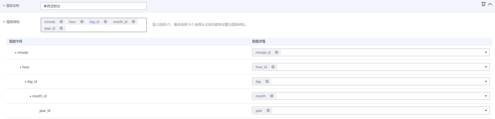

        **图 38**  层级2  
        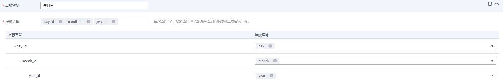

    5.  新建维度页面配置完成后，单击“保存“。

4.  返回维度页面后，在维度列表中，勾选刚才新建的4个维度，再单击“发布“。
5.  在“批量发布“对话框中，选择审核人，单击“确认提交“，等待审核人员审核通过后，维度发布成功。如果当前帐号具备审核人权限，也可以勾选“自助审批“，直接提交即可以审核通过。
6.  完成所有维度的新建和发布，待审核通过后，系统会自动创建与维度相对应的维度表，维度表的名称和编码均与维度相同。在“维度建模”页面，选择“维度表”页签，可以查看建好的维度表。

    在维度表列表中，在“同步状态“一列中可以查看维度表的同步状态。

    -   如果同步状态均显示成功，则说明维度发布成功，维度表在数据库中创建成功。
    -   如果同步状态中存在失败，可单击该维度表所在行的“发布历史“，然后在展开的页面中进入“发布日志”页签查看日志。请根据错误日志定位失败原因，问题解决后，您可以勾选该维度表，再单击列表上方的“同步“按钮尝试重新同步。如果问题仍未能解决，请联系技术支持人员协助处理。

    **图 39**  维度表同步状态  
    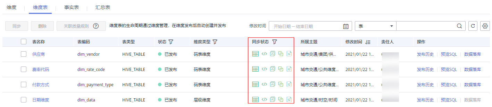

## 维度建模：在DWR层新建并发布事实表

在维度建模中，在DWR数据报告层中新建一个事实表“行程订单“。

1.  在规范设计控制台，单击左侧导航树中的“维度建模“，进入维度建模页面。
2.  单击“事实表“页签，进入事实表页面。在左侧的主题树中选择业务对象“城市交通 \> 行程记录 \> 行程事实“，然后单击“新建“按钮开始新建行程订单表。

    在新建事实表页面的“基本配置“区域，配置如下：

    -   所属主题：主题域分组：城市交通\>主题域：行程记录\>业务对象：行程事实
    -   表名称：行程订单
    -   表编码：fact\_stroke\_order
    -   数据连接类型：MRS\_HIVE
    -   数据连接：mrs\_hive\_link
    -   数据库：demo\_dwr\_db
    -   表类型：HIVE\_TABLE
    -   资产责任人：在下拉列表中选择一个责任人。
    -   描述：无

    在“字段配置“区域，选择 " 新建 \> 维度"，在弹出框中选择维度“费率代码“、“供应商“、“付款方式“、“日期维度“，单击“确定“。再次选择 " 新建 \> 维度"，在弹出框中选择“日期维度“并单击“确定“。然后，在维度字段列表中，调整维度字段的顺序，并修改2个日期维度的信息，如[表9](#zh-cn_topic_0262779636_table16541810165218)所示。

    **表 9**  维度字段

    
    <table><thead align="left"><tr id="zh-cn_topic_0262779636_row11166310135219"><th class="cellrowborder" valign="top" width="5.820000000000001%" id="mcps1.2.12.1.1">
序号

    </th>
    <th class="cellrowborder" valign="top" width="11.100000000000003%" id="mcps1.2.12.1.2">
字段名称

    </th>
    <th class="cellrowborder" valign="top" width="19.080000000000005%" id="mcps1.2.12.1.3">
字段编码

    </th>
    <th class="cellrowborder" valign="top" width="8.41%" id="mcps1.2.12.1.4">
数据类型

    </th>
    <th class="cellrowborder" valign="top" width="8.390000000000002%" id="mcps1.2.12.1.5">
主键

    </th>
    <th class="cellrowborder" valign="top" width="7.200000000000001%" id="mcps1.2.12.1.6">
分区

    </th>
    <th class="cellrowborder" valign="top" width="8.000000000000002%" id="mcps1.2.12.1.7">
不为空

    </th>
    <th class="cellrowborder" valign="top" width="8.000000000000002%" id="mcps1.2.12.1.8">
关联数据标准

    </th>
    <th class="cellrowborder" valign="top" width="8.000000000000002%" id="mcps1.2.12.1.9">
关联维度

    </th>
    <th class="cellrowborder" valign="top" width="8.000000000000002%" id="mcps1.2.12.1.10">
角色

    </th>
    <th class="cellrowborder" valign="top" width="8.000000000000002%" id="mcps1.2.12.1.11">
描述

    </th>
    </tr>
    </thead>
    <tbody><tr id="zh-cn_topic_0262779636_row16166110185210"><td class="cellrowborder" valign="top" width="5.820000000000001%" headers="mcps1.2.12.1.1 ">
1

    </td>
    <td class="cellrowborder" valign="top" width="11.100000000000003%" headers="mcps1.2.12.1.2 ">
费率id

    </td>
    <td class="cellrowborder" valign="top" width="19.080000000000005%" headers="mcps1.2.12.1.3 ">
rate_code_id

    </td>
    <td class="cellrowborder" valign="top" width="8.41%" headers="mcps1.2.12.1.4 ">
BIGINT

    </td>
    <td class="cellrowborder" valign="top" width="8.390000000000002%" headers="mcps1.2.12.1.5 ">
不勾选

    </td>
    <td class="cellrowborder" valign="top" width="7.200000000000001%" headers="mcps1.2.12.1.6 ">
不勾选

    </td>
    <td class="cellrowborder" valign="top" width="8.000000000000002%" headers="mcps1.2.12.1.7 ">
不勾选

    </td>
    <td class="cellrowborder" valign="top" width="8.000000000000002%" headers="mcps1.2.12.1.8 ">
-

    </td>
    <td class="cellrowborder" valign="top" width="8.000000000000002%" headers="mcps1.2.12.1.9 ">
费率代码

    </td>
    <td class="cellrowborder" valign="top" width="8.000000000000002%" headers="mcps1.2.12.1.10 ">
dim_

    </td>
    <td class="cellrowborder" valign="top" width="8.000000000000002%" headers="mcps1.2.12.1.11 ">
-

    </td>
    </tr>
    <tr id="zh-cn_topic_0262779636_row21661210175213"><td class="cellrowborder" valign="top" width="5.820000000000001%" headers="mcps1.2.12.1.1 ">
2

    </td>
    <td class="cellrowborder" valign="top" width="11.100000000000003%" headers="mcps1.2.12.1.2 ">
供应商id

    </td>
    <td class="cellrowborder" valign="top" width="19.080000000000005%" headers="mcps1.2.12.1.3 ">
vendor_id

    </td>
    <td class="cellrowborder" valign="top" width="8.41%" headers="mcps1.2.12.1.4 ">
BIGINT

    </td>
    <td class="cellrowborder" valign="top" width="8.390000000000002%" headers="mcps1.2.12.1.5 ">
不勾选

    </td>
    <td class="cellrowborder" valign="top" width="7.200000000000001%" headers="mcps1.2.12.1.6 ">
不勾选

    </td>
    <td class="cellrowborder" valign="top" width="8.000000000000002%" headers="mcps1.2.12.1.7 ">
不勾选

    </td>
    <td class="cellrowborder" valign="top" width="8.000000000000002%" headers="mcps1.2.12.1.8 ">
-

    </td>
    <td class="cellrowborder" valign="top" width="8.000000000000002%" headers="mcps1.2.12.1.9 ">
供应商

    </td>
    <td class="cellrowborder" valign="top" width="8.000000000000002%" headers="mcps1.2.12.1.10 ">
dim_

    </td>
    <td class="cellrowborder" valign="top" width="8.000000000000002%" headers="mcps1.2.12.1.11 ">
-

    </td>
    </tr>
    <tr id="zh-cn_topic_0262779636_row616714102525"><td class="cellrowborder" valign="top" width="5.820000000000001%" headers="mcps1.2.12.1.1 ">
3

    </td>
    <td class="cellrowborder" valign="top" width="11.100000000000003%" headers="mcps1.2.12.1.2 ">
付款方式编码

    </td>
    <td class="cellrowborder" valign="top" width="19.080000000000005%" headers="mcps1.2.12.1.3 ">
payment_type_id

    </td>
    <td class="cellrowborder" valign="top" width="8.41%" headers="mcps1.2.12.1.4 ">
BIGINT

    </td>
    <td class="cellrowborder" valign="top" width="8.390000000000002%" headers="mcps1.2.12.1.5 ">
不勾选

    </td>
    <td class="cellrowborder" valign="top" width="7.200000000000001%" headers="mcps1.2.12.1.6 ">
不勾选

    </td>
    <td class="cellrowborder" valign="top" width="8.000000000000002%" headers="mcps1.2.12.1.7 ">
不勾选

    </td>
    <td class="cellrowborder" valign="top" width="8.000000000000002%" headers="mcps1.2.12.1.8 ">
-

    </td>
    <td class="cellrowborder" valign="top" width="8.000000000000002%" headers="mcps1.2.12.1.9 ">
付款方式

    </td>
    <td class="cellrowborder" valign="top" width="8.000000000000002%" headers="mcps1.2.12.1.10 ">
dim_

    </td>
    <td class="cellrowborder" valign="top" width="8.000000000000002%" headers="mcps1.2.12.1.11 ">
-

    </td>
    </tr>
    <tr id="zh-cn_topic_0262779636_row1316714109525"><td class="cellrowborder" valign="top" width="5.820000000000001%" headers="mcps1.2.12.1.1 ">
4

    </td>
    <td class="cellrowborder" valign="top" width="11.100000000000003%" headers="mcps1.2.12.1.2 ">
上车时间

    </td>
    <td class="cellrowborder" valign="top" width="19.080000000000005%" headers="mcps1.2.12.1.3 ">
dim_pickup_date_key

    </td>
    <td class="cellrowborder" valign="top" width="8.41%" headers="mcps1.2.12.1.4 ">
TIMESTAMP

    </td>
    <td class="cellrowborder" valign="top" width="8.390000000000002%" headers="mcps1.2.12.1.5 ">
不勾选

    </td>
    <td class="cellrowborder" valign="top" width="7.200000000000001%" headers="mcps1.2.12.1.6 ">
不勾选

    </td>
    <td class="cellrowborder" valign="top" width="8.000000000000002%" headers="mcps1.2.12.1.7 ">
不勾选

    </td>
    <td class="cellrowborder" valign="top" width="8.000000000000002%" headers="mcps1.2.12.1.8 ">
-

    </td>
    <td class="cellrowborder" valign="top" width="8.000000000000002%" headers="mcps1.2.12.1.9 ">
日期维度

    </td>
    <td class="cellrowborder" valign="top" width="8.000000000000002%" headers="mcps1.2.12.1.10 ">
dim_pickup

    </td>
    <td class="cellrowborder" valign="top" width="8.000000000000002%" headers="mcps1.2.12.1.11 ">
日期层维表

    </td>
    </tr>
    <tr id="zh-cn_topic_0262779636_row1416781016525"><td class="cellrowborder" valign="top" width="5.820000000000001%" headers="mcps1.2.12.1.1 ">
5

    </td>
    <td class="cellrowborder" valign="top" width="11.100000000000003%" headers="mcps1.2.12.1.2 ">
下车时间

    </td>
    <td class="cellrowborder" valign="top" width="19.080000000000005%" headers="mcps1.2.12.1.3 ">
dim_dropoff_date_key

    </td>
    <td class="cellrowborder" valign="top" width="8.41%" headers="mcps1.2.12.1.4 ">
TIMESTAMP

    </td>
    <td class="cellrowborder" valign="top" width="8.390000000000002%" headers="mcps1.2.12.1.5 ">
不勾选

    </td>
    <td class="cellrowborder" valign="top" width="7.200000000000001%" headers="mcps1.2.12.1.6 ">
不勾选

    </td>
    <td class="cellrowborder" valign="top" width="8.000000000000002%" headers="mcps1.2.12.1.7 ">
不勾选

    </td>
    <td class="cellrowborder" valign="top" width="8.000000000000002%" headers="mcps1.2.12.1.8 ">
-

    </td>
    <td class="cellrowborder" valign="top" width="8.000000000000002%" headers="mcps1.2.12.1.9 ">
日期维度

    </td>
    <td class="cellrowborder" valign="top" width="8.000000000000002%" headers="mcps1.2.12.1.10 ">
dim_dropoff

    </td>
    <td class="cellrowborder" valign="top" width="8.000000000000002%" headers="mcps1.2.12.1.11 ">
日期层维表

    </td>
    </tr>
    </tbody>
    </table>

    在“字段配置“区域，选择“新建 \> 度量”，依次新建如[表10](#zh-cn_topic_0262779636_table751725421110)所示的字段。

    **表 10**  度量属性

    
    <table><thead align="left"><tr id="zh-cn_topic_0262779636_row106852547116"><th class="cellrowborder" valign="top" width="6.599340065993401%" id="mcps1.2.9.1.1">
序号

    </th>
    <th class="cellrowborder" valign="top" width="12.288771122887711%" id="mcps1.2.9.1.2">
字段名称

    </th>
    <th class="cellrowborder" valign="top" width="19.52804719528047%" id="mcps1.2.9.1.3">
字段编码

    </th>
    <th class="cellrowborder" valign="top" width="25.327467253274676%" id="mcps1.2.9.1.4">
数据类型

    </th>
    <th class="cellrowborder" valign="top" width="9.059094090590941%" id="mcps1.2.9.1.5">
主键

    </th>
    <th class="cellrowborder" valign="top" width="9.179082091790821%" id="mcps1.2.9.1.6">
分区

    </th>
    <th class="cellrowborder" valign="top" width="9.55904409559044%" id="mcps1.2.9.1.7">
不为空

    </th>
    <th class="cellrowborder" valign="top" width="8.45915408459154%" id="mcps1.2.9.1.8">
关联数据标准

    </th>
    </tr>
    </thead>
    <tbody><tr id="zh-cn_topic_0262779636_row18685175491120"><td class="cellrowborder" valign="top" width="6.599340065993401%" headers="mcps1.2.9.1.1 ">
1

    </td>
    <td class="cellrowborder" valign="top" width="12.288771122887711%" headers="mcps1.2.9.1.2 ">
上车地点

    </td>
    <td class="cellrowborder" valign="top" width="19.52804719528047%" headers="mcps1.2.9.1.3 ">
pu_location_id

    </td>
    <td class="cellrowborder" valign="top" width="25.327467253274676%" headers="mcps1.2.9.1.4 ">
字符类型(STRING)

    </td>
    <td class="cellrowborder" valign="top" width="9.059094090590941%" headers="mcps1.2.9.1.5 ">
不勾选

    </td>
    <td class="cellrowborder" valign="top" width="9.179082091790821%" headers="mcps1.2.9.1.6 ">
不勾选

    </td>
    <td class="cellrowborder" valign="top" width="9.55904409559044%" headers="mcps1.2.9.1.7 ">
不勾选

    </td>
    <td class="cellrowborder" valign="top" width="8.45915408459154%" headers="mcps1.2.9.1.8 ">
-

    </td>
    </tr>
    <tr id="zh-cn_topic_0262779636_row146861254101116"><td class="cellrowborder" valign="top" width="6.599340065993401%" headers="mcps1.2.9.1.1 ">
2

    </td>
    <td class="cellrowborder" valign="top" width="12.288771122887711%" headers="mcps1.2.9.1.2 ">
下车地点

    </td>
    <td class="cellrowborder" valign="top" width="19.52804719528047%" headers="mcps1.2.9.1.3 ">
do_location_id

    </td>
    <td class="cellrowborder" valign="top" width="25.327467253274676%" headers="mcps1.2.9.1.4 ">
字符类型(STRING)

    </td>
    <td class="cellrowborder" valign="top" width="9.059094090590941%" headers="mcps1.2.9.1.5 ">
不勾选

    </td>
    <td class="cellrowborder" valign="top" width="9.179082091790821%" headers="mcps1.2.9.1.6 ">
不勾选

    </td>
    <td class="cellrowborder" valign="top" width="9.55904409559044%" headers="mcps1.2.9.1.7 ">
不勾选

    </td>
    <td class="cellrowborder" valign="top" width="8.45915408459154%" headers="mcps1.2.9.1.8 ">
-

    </td>
    </tr>
    <tr id="zh-cn_topic_0262779636_row16248132218306"><td class="cellrowborder" valign="top" width="6.599340065993401%" headers="mcps1.2.9.1.1 ">
3

    </td>
    <td class="cellrowborder" valign="top" width="12.288771122887711%" headers="mcps1.2.9.1.2 ">
车费

    </td>
    <td class="cellrowborder" valign="top" width="19.52804719528047%" headers="mcps1.2.9.1.3 ">
fare_amount

    </td>
    <td class="cellrowborder" valign="top" width="25.327467253274676%" headers="mcps1.2.9.1.4 ">
高精度(DECIMAL) (10,2)

    </td>
    <td class="cellrowborder" valign="top" width="9.059094090590941%" headers="mcps1.2.9.1.5 ">
不勾选

    </td>
    <td class="cellrowborder" valign="top" width="9.179082091790821%" headers="mcps1.2.9.1.6 ">
不勾选

    </td>
    <td class="cellrowborder" valign="top" width="9.55904409559044%" headers="mcps1.2.9.1.7 ">
不勾选

    </td>
    <td class="cellrowborder" valign="top" width="8.45915408459154%" headers="mcps1.2.9.1.8 ">
-

    </td>
    </tr>
    <tr id="zh-cn_topic_0262779636_row22458222303"><td class="cellrowborder" valign="top" width="6.599340065993401%" headers="mcps1.2.9.1.1 ">
4

    </td>
    <td class="cellrowborder" valign="top" width="12.288771122887711%" headers="mcps1.2.9.1.2 ">
加收

    </td>
    <td class="cellrowborder" valign="top" width="19.52804719528047%" headers="mcps1.2.9.1.3 ">
extra

    </td>
    <td class="cellrowborder" valign="top" width="25.327467253274676%" headers="mcps1.2.9.1.4 ">
高精度(DECIMAL) (10,2)

    </td>
    <td class="cellrowborder" valign="top" width="9.059094090590941%" headers="mcps1.2.9.1.5 ">
不勾选

    </td>
    <td class="cellrowborder" valign="top" width="9.179082091790821%" headers="mcps1.2.9.1.6 ">
不勾选

    </td>
    <td class="cellrowborder" valign="top" width="9.55904409559044%" headers="mcps1.2.9.1.7 ">
不勾选

    </td>
    <td class="cellrowborder" valign="top" width="8.45915408459154%" headers="mcps1.2.9.1.8 ">
-

    </td>
    </tr>
    <tr id="zh-cn_topic_0262779636_row724292253010"><td class="cellrowborder" valign="top" width="6.599340065993401%" headers="mcps1.2.9.1.1 ">
5

    </td>
    <td class="cellrowborder" valign="top" width="12.288771122887711%" headers="mcps1.2.9.1.2 ">
MTA税

    </td>
    <td class="cellrowborder" valign="top" width="19.52804719528047%" headers="mcps1.2.9.1.3 ">
mta_tax

    </td>
    <td class="cellrowborder" valign="top" width="25.327467253274676%" headers="mcps1.2.9.1.4 ">
高精度(DECIMAL) (10,2)

    </td>
    <td class="cellrowborder" valign="top" width="9.059094090590941%" headers="mcps1.2.9.1.5 ">
不勾选

    </td>
    <td class="cellrowborder" valign="top" width="9.179082091790821%" headers="mcps1.2.9.1.6 ">
不勾选

    </td>
    <td class="cellrowborder" valign="top" width="9.55904409559044%" headers="mcps1.2.9.1.7 ">
不勾选

    </td>
    <td class="cellrowborder" valign="top" width="8.45915408459154%" headers="mcps1.2.9.1.8 ">
-

    </td>
    </tr>
    <tr id="zh-cn_topic_0262779636_row15240022133010"><td class="cellrowborder" valign="top" width="6.599340065993401%" headers="mcps1.2.9.1.1 ">
6

    </td>
    <td class="cellrowborder" valign="top" width="12.288771122887711%" headers="mcps1.2.9.1.2 ">
手续费

    </td>
    <td class="cellrowborder" valign="top" width="19.52804719528047%" headers="mcps1.2.9.1.3 ">
tip_amount

    </td>
    <td class="cellrowborder" valign="top" width="25.327467253274676%" headers="mcps1.2.9.1.4 ">
高精度(DECIMAL) (10,2)

    </td>
    <td class="cellrowborder" valign="top" width="9.059094090590941%" headers="mcps1.2.9.1.5 ">
不勾选

    </td>
    <td class="cellrowborder" valign="top" width="9.179082091790821%" headers="mcps1.2.9.1.6 ">
不勾选

    </td>
    <td class="cellrowborder" valign="top" width="9.55904409559044%" headers="mcps1.2.9.1.7 ">
不勾选

    </td>
    <td class="cellrowborder" valign="top" width="8.45915408459154%" headers="mcps1.2.9.1.8 ">
-

    </td>
    </tr>
    <tr id="zh-cn_topic_0262779636_row223782213016"><td class="cellrowborder" valign="top" width="6.599340065993401%" headers="mcps1.2.9.1.1 ">
7

    </td>
    <td class="cellrowborder" valign="top" width="12.288771122887711%" headers="mcps1.2.9.1.2 ">
通行费

    </td>
    <td class="cellrowborder" valign="top" width="19.52804719528047%" headers="mcps1.2.9.1.3 ">
tolls_amount

    </td>
    <td class="cellrowborder" valign="top" width="25.327467253274676%" headers="mcps1.2.9.1.4 ">
高精度(DECIMAL) (10,2)

    </td>
    <td class="cellrowborder" valign="top" width="9.059094090590941%" headers="mcps1.2.9.1.5 ">
不勾选

    </td>
    <td class="cellrowborder" valign="top" width="9.179082091790821%" headers="mcps1.2.9.1.6 ">
不勾选

    </td>
    <td class="cellrowborder" valign="top" width="9.55904409559044%" headers="mcps1.2.9.1.7 ">
不勾选

    </td>
    <td class="cellrowborder" valign="top" width="8.45915408459154%" headers="mcps1.2.9.1.8 ">
-

    </td>
    </tr>
    <tr id="zh-cn_topic_0262779636_row0234112213018"><td class="cellrowborder" valign="top" width="6.599340065993401%" headers="mcps1.2.9.1.1 ">
8

    </td>
    <td class="cellrowborder" valign="top" width="12.288771122887711%" headers="mcps1.2.9.1.2 ">
改善附加费

    </td>
    <td class="cellrowborder" valign="top" width="19.52804719528047%" headers="mcps1.2.9.1.3 ">
improvement_surcharge

    </td>
    <td class="cellrowborder" valign="top" width="25.327467253274676%" headers="mcps1.2.9.1.4 ">
高精度(DECIMAL) (10,2)

    </td>
    <td class="cellrowborder" valign="top" width="9.059094090590941%" headers="mcps1.2.9.1.5 ">
不勾选

    </td>
    <td class="cellrowborder" valign="top" width="9.179082091790821%" headers="mcps1.2.9.1.6 ">
不勾选

    </td>
    <td class="cellrowborder" valign="top" width="9.55904409559044%" headers="mcps1.2.9.1.7 ">
不勾选

    </td>
    <td class="cellrowborder" valign="top" width="8.45915408459154%" headers="mcps1.2.9.1.8 ">
-

    </td>
    </tr>
    <tr id="zh-cn_topic_0262779636_row12231182214304"><td class="cellrowborder" valign="top" width="6.599340065993401%" headers="mcps1.2.9.1.1 ">
9

    </td>
    <td class="cellrowborder" valign="top" width="12.288771122887711%" headers="mcps1.2.9.1.2 ">
总车费

    </td>
    <td class="cellrowborder" valign="top" width="19.52804719528047%" headers="mcps1.2.9.1.3 ">
total_amount

    </td>
    <td class="cellrowborder" valign="top" width="25.327467253274676%" headers="mcps1.2.9.1.4 ">
高精度(DECIMAL) (10,2)

    </td>
    <td class="cellrowborder" valign="top" width="9.059094090590941%" headers="mcps1.2.9.1.5 ">
不勾选

    </td>
    <td class="cellrowborder" valign="top" width="9.179082091790821%" headers="mcps1.2.9.1.6 ">
不勾选

    </td>
    <td class="cellrowborder" valign="top" width="9.55904409559044%" headers="mcps1.2.9.1.7 ">
不勾选

    </td>
    <td class="cellrowborder" valign="top" width="8.45915408459154%" headers="mcps1.2.9.1.8 ">
-

    </td>
    </tr>
    </tbody>
    </table>

3.  新建事实表页面配置完成后，单击“发布“提交审核。
4.  在弹出框中选择审核人，单击“确认提交“，等待审核人员审核通过后，事实表发布成功。如果当前帐号具备审核人权限，也可以勾选“自助审批“，直接提交即可以审核通过。
5.  返回“维度建模 \> 事实表“页面，在列表中找到刚发布的事实表，在“同步状态“一列中可以查看事实表的同步状态。
    -   如果同步状态均显示成功，则说明事实表发布成功，事实表在数据库中已创建成功。
    -   如果同步状态中存在失败，可单击该事实表所在行的“更多 \> 发布历史“，然后在展开的页面中进入“发布日志”页签查看日志。请根据错误日志定位失败原因，问题解决后，您可以在事实表页面勾选该事实表，再单击列表上方的“更多 \> 同步“尝试重新同步。如果问题仍未能解决，请联系技术支持人员协助处理。

## 指标设计：新建并发布技术指标

1.  在规范设计控制台，单击左侧导航树中的“技术指标“，进入技术指标页面。
2.  新建一个原子指标“总车费“，用于统计总车费。
    1.  在技术指标页面，进入“原子指标“标签页，然后单击“新建“按钮。
    2.  在新建原子指标页面配置如下，配置完成后单击“发布“。

        **图 40**  原子指标  
        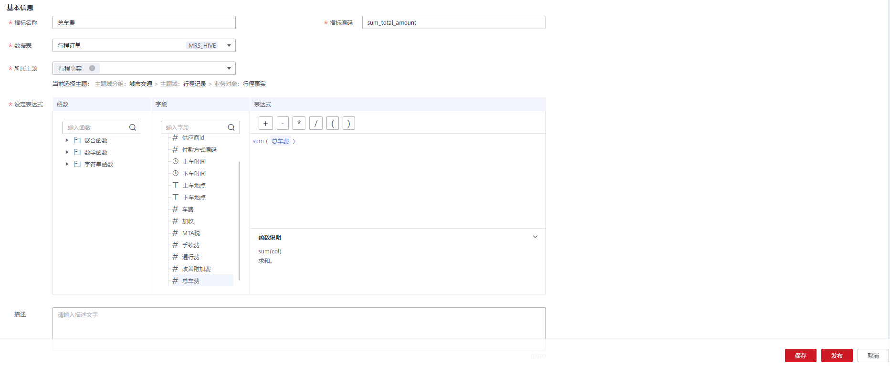

    3.  等待审核人审核通过。审核通过后，原子指标就创建好了。

3.  当原子指标通过审核后，新建以下3个衍生指标。
    -   总车费\(付款方式\)：基于付款方式维度统计总车费

        在技术指标页面，进入“衍生指标“标签页，然后单击“新建“按钮，在新建衍生指标页面，配置如下。配置完成后，单击“试运行“，并在弹出窗口中单击“执行“，如果运行通过单击“保存“。

        **图 41**  总车费（付款方式）  
        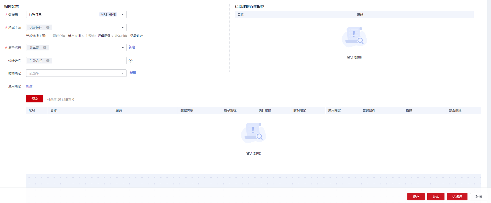

    -   总车费\(费率代码\)：基于费率代码维度统计总车费

        在技术指标页面，进入“衍生指标“标签页，然后单击“新建“按钮，在新建衍生指标页面，配置如下。配置完成后，单击“试运行“，并在弹出窗口中单击“执行“，如果运行通过单击“保存“。

        **图 42**  总车费\(费率代码\)  
        .png "总车费(费率代码)")

    -   截止当日\_总车费\(供应商,行程订单.下车时间\)：基于供应商维度统计总车费

        在技术指标页面，进入“衍生指标“标签页，然后单击“新建“按钮，在新建衍生指标页面，配置如下。配置完成后，单击“试运行“，并在弹出窗口中单击“执行“，如果运行通过单击“保存“。

        **图 43**  总车费\(供应商\)  
        .png "总车费(供应商)")

4.  返回技术指标页面的“衍生指标“标签页后，勾选建好的3个衍生指标，单击“发布“，在弹出框中选择审核人，单击“确认提交“，等待审核人员审核通过后，事实表发布成功。如果当前帐号具备审核人权限，也可以勾选“自助审批“，直接提交即可以审核通过。

## 维度建模：在DM层新建并发布汇总表

在DM数据集市层，新建3个汇总表：付款方式统计汇总表、费率统计汇总表、供应商统计汇总表。

1.  在规范设计控制台，单击左侧导航树中的“维度建模“，进入维度建模页面。
2.  单击“汇总表“页签，进入汇总表页面。
3.  新建3个汇总表：付款方式统计汇总表、费率统计汇总表、供应商统计汇总表。
    1.  在“汇总表“页面，在主题树中选中“城市交通 \> 行程记录 \> 记录统计”，然后单击“新建“新建付款方式统计汇总表。在新建汇总表页面，配置如下，配置完成后单击“保存“。

        在新建汇总表页面，基本配置如下：

        **图 44**  付款方式统计汇总  
        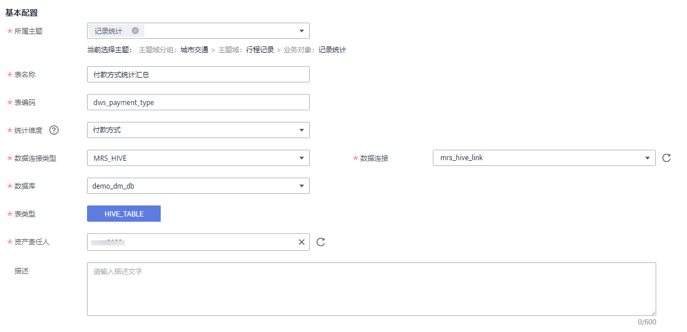

        在“时间分区“区域，输入字段编码以及选择数据类型。当表发布成功后，在往表里写数据时，将根据该时间分区字段进行分区。

        **图 45**  时间分区配置  
        

        在“指标配置”区域，单击“添加“，添加衍生指标“总车费\(付款方式\)“。此处只能添加与所指定的“统计维度“相关联的并且已发布的衍生指标或复合指标。

        **图 46**  指标配置  
        

        完成上述配置后，单击“保存“。

    2.  在“汇总表“页面，在主题树中选中“城市交通 \> 行程记录 \> 记录统计”，然后单击“新建“新建费率统计汇总表。在新建汇总表页面，配置如下，配置完成后单击“保存“。

        -   基本配置
            -   所属主题：主题域分组：城市交通\>主题域：行程记录\>业务对象：记录统计
            -   表名称：费率统计汇总
            -   表编码：dws\_rate\_code
            -   统计维度：费率代码
            -   数据连接类型：MRS\_HIVE
            -   数据连接：mrs\_hive\_link
            -   数据库：demo\_dm\_db
            -   资产责任人：在下拉列表中选择一个责任人。
            -   描述：无

        -   时间分区
            -   字段编码：dtime
            -   数据类型：时间戳类型\(TIMESTAMP\)

        -   指标配置：单击“添加“，添加衍生指标“总车费\(费率代码\)“。

        **图 47**  费率统计汇总-基本配置  
        

        **图 48**  费率统计汇总-指标配置  
        

    3.  在“汇总表“页面，在主题树中选中“城市交通 \> 行程记录 \> 记录统计”，然后单击“新建“新建供应商统计汇总表。在新建汇总表页面，配置如下，配置完成后单击“保存“。

        -   基本配置
            -   所属主题：主题域分组：城市交通\>主题域：行程记录\>业务对象：记录统计
            -   表名称：供应商统计汇总
            -   表编码：dws\_vendor
            -   统计维度：供应商,行程订单.下车时间
            -   数据连接类型：MRS\_HIVE
            -   数据连接：mrs\_hive\_link
            -   数据库：demo\_dm\_db
            -   资产责任人：在下拉列表中选择一个责任人。
            -   描述：无

        -   时间分区
            -   字段编码：dtime
            -   数据类型：时间戳类型\(TIMESTAMP\)

        -   指标配置：单击“添加“，添加衍生指标“总车费\(供应商,行程订单.下车时间\)“。

        **图 49**  供应商统计汇总-基本配置  
        

        **图 50**  供应商统计汇总-指标配置  
        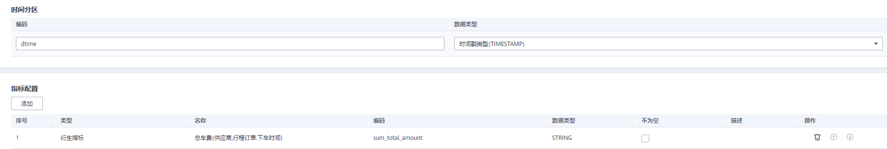

4.  返回维度建模页面的“汇总表“标签页后，勾选建好的3个汇总表，单击“发布“。
5.  在弹出框中选择审核人，单击“确认提交“，等待审核人员审核通过后，汇总表会自动创建。如果当前帐号具备审核人权限，也可以勾选“自助审批“，直接提交即可以审核通过。
6.  返回“维度建模 \> 汇总表“页面，在列表中找到刚发布的汇总表，在“同步状态“一列中可以查看汇总表的同步状态。
    -   如果同步状态均显示成功，则说明汇总表发布成功，汇总表在数据库中已创建成功。
    -   如果同步状态中存在失败，可单击该汇总表所在行的“更多 \> 发布历史“，然后在展开的页面中进入“发布日志”页签查看日志。请根据错误日志定位失败原因，问题解决后，您可以在汇总表页面勾选该汇总表，再单击列表上方的“更多 \> 同步“尝试重新同步。如果问题仍未能解决，请联系技术支持人员协助处理。

