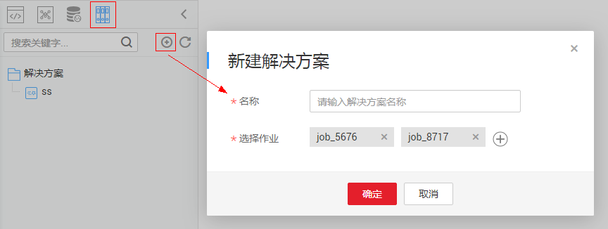
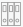

# 解决方案

## 背景信息

解决方案定位于为用户提供便捷的、系统的方式管理作业，更好地实现业务需求和目标。每个解决方案可以包含一个或多个业务相关的作业，一个作业可以被多个解决方案复用。

数据开发模块目前支持处理以下几种方式的解决方案。

-   [新建解决方案](#zh-cn_topic_0143658504_section751119493161)
-   [编辑解决方案](#zh-cn_topic_0143658504_section99951423113619)
-   [导出解决方案](#zh-cn_topic_0143658504_section8480105617166)
-   [导入解决方案](#zh-cn_topic_0143658504_section478513261118)
-   [升级解决方案](#zh-cn_topic_0143658504_section49091847183618)
-   [删除解决方案](#zh-cn_topic_0143658504_section14542122131713)

## 新建解决方案

在数据开发模块的开发页面，新建一个解决方案，设置解决方案名称并选择业务相关的作业。

**图 1**  新建解决方案  

1.  登录DGC控制台。选择对应工作空间的“数据开发“模块，进入数据开发页面。

    **图 2**  选择数据开发  
    

2.  在数据开发主界面的左侧导航栏，选择“数据开发  \>  脚本开发“或“数据开发  \>  作业开发“。
3.  在左侧目录上方，单击解决方案图标，显示解决方案目录。
4.  单击解决方案目录上方的，弹出“新建解决方案“页面，配置如[表1](#zh-cn_topic_0143658504_table2057118573564)所示的参数。

    **表 1**  解决方案参数

    
    <table><thead align="left"><tr id="zh-cn_topic_0143658504_row195717577567"><th class="cellrowborder" valign="top" width="35.61%" id="mcps1.2.3.1.1">
参数

    </th>
    <th class="cellrowborder" valign="top" width="64.39%" id="mcps1.2.3.1.2">
说明

    </th>
    </tr>
    </thead>
    <tbody><tr id="zh-cn_topic_0143658504_row1457175712565"><td class="cellrowborder" valign="top" width="35.61%" headers="mcps1.2.3.1.1 ">
名称

    </td>
    <td class="cellrowborder" valign="top" width="64.39%" headers="mcps1.2.3.1.2 ">
自定义解决方案的名称。

    </td>
    </tr>
    <tr id="zh-cn_topic_0143658504_row5571185713565"><td class="cellrowborder" valign="top" width="35.61%" headers="mcps1.2.3.1.1 ">
选择作业

    </td>
    <td class="cellrowborder" valign="top" width="64.39%" headers="mcps1.2.3.1.2 ">
选择解决方案包含的作业。

    </td>
    </tr>
    </tbody>
    </table>

5.  单击“确定“，新建的解决方案将在左侧目录中显示。

## 编辑解决方案

在解决方案目录中，右键单击解决方案名称，选择“编辑“，修改如[表1](#zh-cn_topic_0143658504_table2057118573564)所示的参数。

## 导出解决方案

在解决方案目录中，右键单击解决方案名称，选择“导出“，导出zip格式的解决方案文件至本地。

## 导入解决方案

导入解决方案功能依赖于OBS服务，如无OBS服务，可从本地导入。

在解决方案目录中，右键单击根目录“解决方案“，选择“导入解决方案“，导入已上传到OBS或者本地的解决方案文件。

## 升级解决方案

在解决方案目录中，右键单击解决方案名称，选择“升级“，导入已上传到OBS中的解决方案文件。升级解决方案时，会停止其中正在运行的作业，系统将依据用户配置的升级重启策略，判断是否在升级完成后重新启动作业。

## 删除解决方案

在解决方案目录中，右键单击解决方案名称，选择“删除“，删除解决方案。删除的解决方案不可恢复，请谨慎操作。

