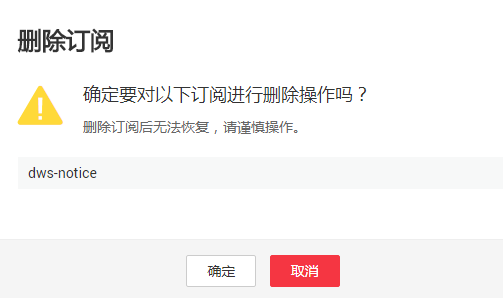

# 订阅事件通知

用户通过订阅DIS的事件通知，这样便能在特定通道或转储任务发生管理、监控或安全事件时收到通知消息。

## 创建订阅

1.  [登录DGC控制台](https://console.huaweicloud.com/dgc/)，找到所需要的DGC实例，单击实例卡片上的“进入控制台”，进入概览页面。

    选择“空间管理”页签，完成工作空间的创建。

    在工作空间列表中，找到所需要的工作空间。

2.  单击相应工作空间的“数据集成“。

    系统跳转至数据集成页面。

3.  在左侧列表栏中选择“实时数据接入通道管理 \> 通道管理”。
4.  单击“事件管理 \> 订阅”，然后创建订阅。
5.  在“订阅设置“区域，设置订阅基本信息及事件过滤。

    “订阅事件列表“区域显示系统根据订阅设置筛选出的事件。

    **表 1**  订阅参数

    
    <table><thead align="left"><tr id="zh-cn_topic_0130822401_zh-cn_topic_0107811181_row4704172711114"><th class="cellrowborder" valign="top" width="26%" id="mcps1.2.3.1.1">
参数名

    </th>
    <th class="cellrowborder" valign="top" width="74%" id="mcps1.2.3.1.2">
参数解释

    </th>
    </tr>
    </thead>
    <tbody><tr id="zh-cn_topic_0130822401_zh-cn_topic_0107811181_row127045270117"><td class="cellrowborder" valign="top" width="26%" headers="mcps1.2.3.1.1 ">
启用消息通知

    </td>
    <td class="cellrowborder" valign="top" width="74%" headers="mcps1.2.3.1.2 ">
设置是否开启事件订阅。

    
表示开启事件订阅，表示关闭事件订阅，默认为关闭状态。关闭后停止发送已订阅事件的通知消息，不会删除该订阅。

    </td>
    </tr>
    <tr id="zh-cn_topic_0130822401_zh-cn_topic_0107811181_row137055276114"><td class="cellrowborder" valign="top" width="26%" headers="mcps1.2.3.1.1 ">
订阅名称

    </td>
    <td class="cellrowborder" valign="top" width="74%" headers="mcps1.2.3.1.2 ">
设置订阅事件的名称。

    <ul id="zh-cn_topic_0130822401_zh-cn_topic_0107811181_ul386613493427"><li>名称只能包含大写字母、小写字母、数字、-和_，且必须由大写字母、小写字母或数字开头。</li><li>名称长度为1～64字符。</li></ul>
    </td>
    </tr>
    <tr id="zh-cn_topic_0130822401_row18587316418"><td class="cellrowborder" valign="top" width="26%" headers="mcps1.2.3.1.1 ">
订阅通道

    </td>
    <td class="cellrowborder" valign="top" width="74%" headers="mcps1.2.3.1.2 ">
设置是否开启订阅指定通道的告警功能。

    
表示开启订阅指定通道告警功能，表示关闭订阅指定通道告警功能，默认为关闭状态。

    
开启后，配置通道名称，可以订阅指定通道的告警，避免接收其它通道不必要的告警。

    </td>
    </tr>
    <tr id="zh-cn_topic_0130822401_row070562921120"><td class="cellrowborder" valign="top" width="26%" headers="mcps1.2.3.1.1 ">
订阅类型

    </td>
    <td class="cellrowborder" valign="top" width="74%" headers="mcps1.2.3.1.2 ">
支持SMN通知和DIS通道。

    
 说明： 
<ul id="zh-cn_topic_0130822401_ul1327572511618"><li>当“订阅类型”设置为“SMN通知”，请参见<a href="#zh-cn_topic_0130822401_zh-cn_topic_0107811181_li89041225162317">7</a>选择消息通知主题。</li><li>当“订阅类型”设置为“DIS通道”，请参见<a href="#zh-cn_topic_0130822401_li2688657181213">6</a>选择通道。</li></ul>
    

    </td>
    </tr>
    </tbody>
    </table>

6.  在“通道名称“中，选择合适的DIS通道。
7.  在“SMN主题“下拉框中，选择合适的消息通知主题。

    用户可以根据需要，通过以下操作新建消息通知主题。

    1.  单击“去创建SMN主题“，系统将跳转到消息通知服务的“主题“页面，用户可通过单击页面右上方的“创建主题“来新建主题，具体请参见《消息通知服务用户指南》中的“创建主题“章节。
    2.  在创建的主题行，单击“更多  \>  设置主题策略“，“可发布消息的服务“处勾选“DIS“，使消息通知服务发布DIS消息。
    3.  在创建的主题行，单击“添加订阅“，向该主题添加订阅，具体请参见《消息通知服务用户指南》中的“添加订阅“章节。

8.  单击“提交“，完成创建订阅。

## 修改订阅

1.  在“事件管理“页面中单击“订阅“  。
2.  在指定订阅名称所在行的“操作“列，单击“更多  \>  修改“。
3.  在“订阅设置“页面，选择要更改的参数项进行修改。具体修改方法参见创建订阅中的[5](#zh-cn_topic_0130822401_zh-cn_topic_0107811181_li18772435125416)～[8](#zh-cn_topic_0130822401_zh-cn_topic_0107811181_li164751612342)。

## 删除订阅

1.  在“事件管理“页面中单击“订阅“  。
2.  在指定订阅名称所在行的“操作“列，单击“更多  \>  删除“，弹出确认删除对话框，如[图1](#zh-cn_topic_0130822401_zh-cn_topic_0107811181_fig69271911204)所示。

    **图 1**  确认删除  
    

3.  单击“确定“，删除该订阅。

