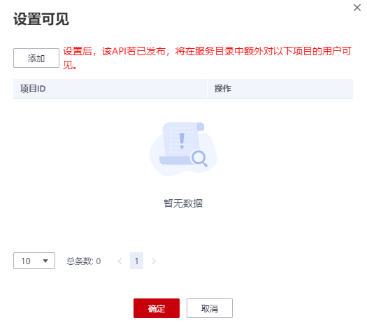

# 设置API可见

## 操作场景

当需要修改API的在服务目录中的可见范围时，可以通过“设置可见”功能或编辑API中的“服务目录可见性”参数进行设置。

## 前提条件

已创建API。

## 通过“设置可见”功能修改API可见范围

1.  在DGC控制台首页，选择对应工作空间的“数据服务“模块，进入数据服务页面。

    **图 1**  选择数据服务  
    

1.  在左侧导航栏选择服务版本（例如：专享版），进入总览页。
2.  进入“开发API  \>  API目录“或“开发API  \>  API管理“页面，在待修改的API所在行，选择“更多  \>  设置可见“。
3.  在弹出的窗口中点击添加，填写项目ID并确认，即可设置此API在服务目录中额外对以该项目下的用户可见。

    项目ID的获取方式请参见[（可选）获取认证信息](https://support.huaweicloud.com/prepare-dgc/dgc_01_0006.html)。

    **图 2**  设置可见  
    

## 通过“服务目录可见性”参数修改API可见范围

1.  在DGC控制台首页，选择对应工作空间的“数据服务“模块，进入数据服务页面。

    **图 3**  选择数据服务  
    

1.  在左侧导航栏选择服务版本（例如：专享版），进入总览页。
2.  进入“开发API  \>  API目录“或“开发API  \>  API管理“页面，在API列表操作列中，选择“编辑”。注意，仅当API处于已创建、已驳回、已下线、已停用的情况下才能进行API修改。
3.  在基本配置处，修改“服务目录可见性”参数的取值，可以选择为“当前工作空间可见”、“当前项目可见”或“当前租户可见”。然后保存修改。
4.  修改完成后，重新恢复或发布API，即可修改此API在服务目录中的可见范围。

