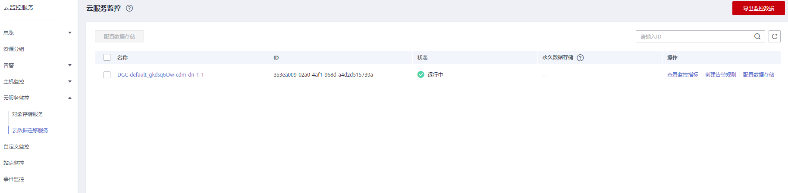

# 设置告警规则

## 操作场景

通过设置CDM集群告警规则，用户可自定义监控目标与通知策略，及时了解CDM集群运行状况，从而起到预警作用。

设置CDM集群的告警规则包括设置告警规则名称、监控对象、监控指标、告警阈值、监控周期和是否发送通知等参数。本节介绍了设置CDM集群告警规则的具体方法。

## 操作步骤

1.  进入CDM主界面，选择“集群管理“，选择集群操作列中的“更多  \>  查看监控指标“。
2.  点击监控指标页面左上角的返回按钮，进入云监控服务的界面，选择“云数据迁移服务”服务监控项对应操作列的“创建告警规则“。

    **图 1**  “云数据迁移服务”服务监控项  
    

3.  根据界面提示设置CDM集群的告警规则。
4.  设置完成后，单击“确定“。当符合规则的告警产生时，系统会自动进行通知。

    > **说明：** 
    >更多关于CDM集群监控规则的信息，请参见[云监控用户指南](https://support.huaweicloud.com/usermanual-ces/ces_01_0068.html)。

