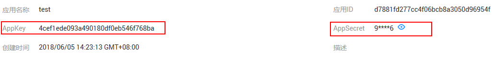

# 调用API

## 调用前准备

API调用者实现一个API的调用，需要完成以下工作：

1.  获取API

    获取API：从服务市场获取API。

2.  [创建应用并获取授权](#zh-cn_topic_0179716875_section266103219405)

    对于使用APP认证的API，需要在数据服务中创建一个应用，以生成应用ID和密钥对（AppKey、AppSecret）。将创建的应用绑定API后，才可以使用APP认证调用API。您需要联系API提供者，提供您的应用信息，获得授权。在API调用过程中，把密钥对替换SDK中的密钥对，数据服务根据密钥对进行身份核对，完成鉴权。关于使用APP认证的方法，具体请参考《数据服务SDK参考》。

3.  调用API

    API调用者完成以上准备工作后，可以参考[调用API](#zh-cn_topic_0179716875_section13147154512613)进行调用。

## 创建应用并获取授权

**创建应用**

1.  [登录DAYU控制台](https://console.huaweicloud.com/dayu/)，找到所需要的DAYU实例，单击实例卡片上的“进入控制台”，进入概览页面。

    选择“空间管理”页签，完成工作空间的创建。

    在工作空间列表中，找到所需要的工作空间。

1.  单击相应工作空间的“数据服务“。

    系统跳转至“数据服务“页面。

2.  单击“调用API \> 应用管理”，进入到应用管理页面。单击“新建”，弹出“新建应用”对话框。填写如[表1](#zh-cn_topic_0179716875_table195413315428)所示信息。

    **表 1**  应用信息

    
    <table><thead align="left"><tr id="zh-cn_topic_0179716875_row45523384220"><th class="cellrowborder" valign="top" width="20%" id="mcps1.2.3.1.1">
信息项

    </th>
    <th class="cellrowborder" valign="top" width="80%" id="mcps1.2.3.1.2">
描述

    </th>
    </tr>
    </thead>
    <tbody><tr id="zh-cn_topic_0179716875_row1156183364219"><td class="cellrowborder" valign="top" width="20%" headers="mcps1.2.3.1.1 ">
应用名称

    </td>
    <td class="cellrowborder" valign="top" width="80%" headers="mcps1.2.3.1.2 ">
应用名称。

    </td>
    </tr>
    <tr id="zh-cn_topic_0179716875_row14879114316433"><td class="cellrowborder" valign="top" width="20%" headers="mcps1.2.3.1.1 ">
描述

    </td>
    <td class="cellrowborder" valign="top" width="80%" headers="mcps1.2.3.1.2 ">
对应用的介绍。

    </td>
    </tr>
    </tbody>
    </table>

3.  单击“确定”，创建应用。

    创建应用成功后，在“应用管理”页面的列表中显示新创建的应用和应用ID。

4.  单击_应用名称_，进入应用详情页面，查看AppKey和AppSecret。

    **图 1**  应用详情  
    

## 将API授权给应用

1.  [登录DAYU控制台](https://console.huaweicloud.com/dayu/)，找到所需要的DAYU实例，单击实例卡片上的“进入控制台”，进入概览页面。

    选择“空间管理”页签，完成工作空间的创建。

    在工作空间列表中，找到所需要的工作空间。

1.  单击相应工作空间的“数据服务“。

    系统跳转至“数据服务“页面。

1.  通过以下任意一种方式，将API授权给应用。

    主动授权：

    1.  单击“开发API \> API管理”，进入到API管理页面。
    2.  在待绑定应用的API所在行，单击“查看授权”，进入API完整信息界面。

        在“授权信息“页签中，单击“添加授权“。

    3.  设置授权的截止时间，勾选应用名称，单击“确认授权”，完成API的授权。

    申请授权：

    1.  单击“调用API  \>  服务市场“，进入服务市场主页面。
    2.  单击待绑定应用的API名称，进入API完整信息页面。
    3.  在“调用信息”页面，单击“申请权限“。
    4.  设置使用截止时间并选择应用名称，单击“确认“。
    5.  申请后，需要等待审核中心审核，方可授权成功。

2.  授权成功后，可以在应用管理详情页面查看已绑定的API。

    > **说明：**   
    >-   如果已绑定API列表中包含无需绑定的API，在此API所在行的操作列，单击“解绑”，将无需绑定的API删除。  
    >-   如果需要调试已绑定的API，单击“测试”，进入调试页面。  
    >-   如果需要对已绑定的API延长授权时间，单击“续约”。  

## 调用API

数据服务提供APP认证方式，API调用者通过APP认证方式调用API。

使用APP认证时，需要通过SDK访问。

其中SDK访问提供了基于Java、Go、Python、JavaScript、C\#、PHP、C++、C、Android等多种语言的SDK包。

关于API的调用详情，请参考《数据服务SDK参考》。

