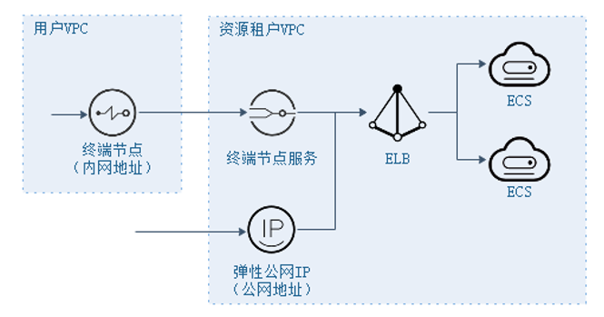
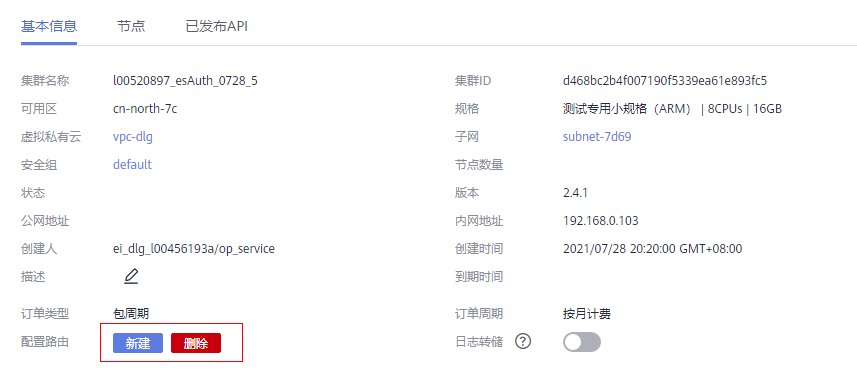
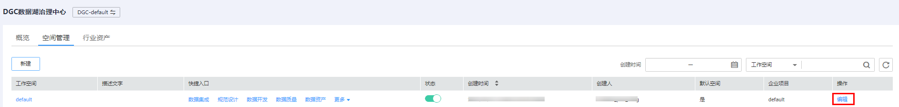
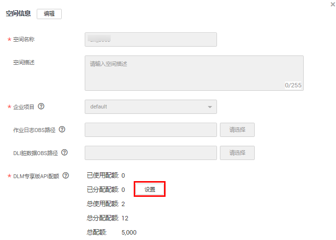
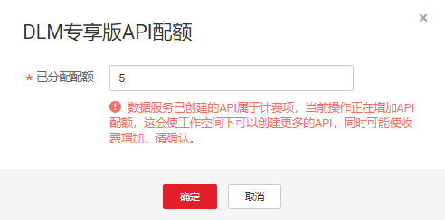

# 购买专享版集群

如果您对服务的性能需求不大，可使用共享版数据服务，直接进行[新建审核人](新建审核人.md)，而无需单独购买专享版实例。

本小节指导您顺利购买专享版实例，实例创建完成后，才能在数据服务专享版创建API并对外提供服务。

## 网络环境准备

如[图1](#fig139441053486)所示，专享版集群创建后，资源位于资源租户区，由ELB统一对集群节点进行负载均衡。

用户可以通过两种途径访问集群：

-   内网地址：内网地址为用户VPC内的终端节点IP地址。
-   外网地址（可选）：外网地址为绑定在ELB上的EIP地址。EIP仅在创建数据服务集群时，勾选开启公网入口，才会具备。

**图 1**  专享版集群网络架构说明  

因此，为了保证创建的专享版集群能够被用户访问，创建中需要注意如下网络配置：

-   VPC

    虚拟私有云。专享版实例需要配置虚拟私有云（VPC），在同一VPC中的资源（如ECS），可以使用专享版实例的私有地址调用API。

    在购买时专享版实例时，建议配置和您其他关联业务相同VPC，确保网络安全的同时，方便网络配置。

-   弹性公网IP

    专享版实例的API如果要允许外部调用，则需要购买一个弹性公网IP，并在购买时绑定给实例，作为实例的公网入口。

-   安全组

    安全组类似防火墙，控制谁能访问实例的指定端口，以及控制实例的通信数据流向指定的目的地址。安全组入方向规则建议按需开放地址与端口，这样可以最大程度保护实例的网络安全。

    专享版实例绑定的安全组有如下要求：

    -   入方向：如果需要从公网调用API，或从其他安全组内资源调用API，则需要为专享版实例绑定的安全组的入方向放开80（HTTP）、443（HTTPS）两个端口。
    -   出方向：如果后端服务部署在公网，或者其他安全组内，则需要为专享版实例绑定的安全组的出方向放开后端服务地址与API调用监听端口。
    -   如果API的前后端服务与专享版实例绑定了相同的安全组、相同的虚拟私有云，则无需专门为专享版实例开放上述端口。

-   路由配置

    在物理机纳管场景下，如果物理机纳管网段与集群网段不一致，需要配置路由。

    进入集群“基本信息”页面，可以增加或删除路由，如下图所示。

    

    > **说明：** 
    >如果数据服务集群无路由配置功能，可联系相关支撑人员修改配置项dlm.instance.route.action.support 启用此功能。

## 操作步骤

购买数据服务专享集群增量包，系统会按照您所选规格自动创建一个数据服务专享集群。

1.  单击已开通实例卡片上的“购买增量包“。
2.  进入购买DGC增量包页面，参见[表1](#table10831131913425)进行配置。

    **表 1**  购买数据服务专享版实例参数说明

    
    <table><thead align="left"><tr id="row1783261918421"><th class="cellrowborder" valign="top" width="20.32%" id="mcps1.2.3.1.1">
参数项

    </th>
    <th class="cellrowborder" valign="top" width="79.67999999999999%" id="mcps1.2.3.1.2">
说明

    </th>
    </tr>
    </thead>
    <tbody><tr id="row164831055184319"><td class="cellrowborder" valign="top" width="20.32%" headers="mcps1.2.3.1.1 ">
增量包类型

    </td>
    <td class="cellrowborder" valign="top" width="79.67999999999999%" headers="mcps1.2.3.1.2 ">
选择数据服务专享集群增量包。

    </td>
    </tr>
    <tr id="row198321619164219"><td class="cellrowborder" valign="top" width="20.32%" headers="mcps1.2.3.1.1 ">
计费模式

    </td>
    <td class="cellrowborder" valign="top" width="79.67999999999999%" headers="mcps1.2.3.1.2 ">
实例收费方式，当前支持“包年包月”。

    </td>
    </tr>
    <tr id="row119025165479"><td class="cellrowborder" valign="top" width="20.32%" headers="mcps1.2.3.1.1 ">
工作空间

    </td>
    <td class="cellrowborder" valign="top" width="79.67999999999999%" headers="mcps1.2.3.1.2 ">
选择需要使用数据服务专享集群增量包的工作空间。例如在DGC实例test的A工作空间中按需购买数据服务专享集群的增量包，这里工作空间选择A。购买成功后，即可通过A工作空间查看到已经创建的数据服务专享集群。

    </td>
    </tr>
    <tr id="row13832219174219"><td class="cellrowborder" valign="top" width="20.32%" headers="mcps1.2.3.1.1 ">
可用区

    </td>
    <td class="cellrowborder" valign="top" width="79.67999999999999%" headers="mcps1.2.3.1.2 ">
第一次购买DGC实例或批增量包时，可用区无要求。

    
再次购买DGC实例或增量包时，是否将资源放在同一可用区内，主要取决于您对容灾能力和网络时延的要求。<ul id="zh-cn_topic_0000001080051952_ul194154918423"><li>如果您的应用需要较高的容灾能力，建议您将资源部署在同一区域的不同可用区内。</li><li>如果您的应用要求实例之间的网络延时较低，则建议您将资源创建在同一可用区内。</li></ul>
    

    
详情请参见<a href="https://support.huaweicloud.com/dgc_faq/dgc_03_0052.html" target="_blank" rel="noopener noreferrer">什么是可用区</a>。

    </td>
    </tr>
    <tr id="row11165112920512"><td class="cellrowborder" valign="top" width="20.32%" headers="mcps1.2.3.1.1 ">
集群名称

    </td>
    <td class="cellrowborder" valign="top" width="79.67999999999999%" headers="mcps1.2.3.1.2 ">
-

    </td>
    </tr>
    <tr id="row203621727172717"><td class="cellrowborder" valign="top" width="20.32%" headers="mcps1.2.3.1.1 ">
集群描述

    </td>
    <td class="cellrowborder" valign="top" width="79.67999999999999%" headers="mcps1.2.3.1.2 ">
可以自定义对当前数据服务专享版集群的描述。

    </td>
    </tr>
    <tr id="row1948819393277"><td class="cellrowborder" valign="top" width="20.32%" headers="mcps1.2.3.1.1 ">
版本

    </td>
    <td class="cellrowborder" valign="top" width="79.67999999999999%" headers="mcps1.2.3.1.2 ">
当前数据服务专享版的集群版本。

    </td>
    </tr>
    <tr id="row8832191910422"><td class="cellrowborder" valign="top" width="20.32%" headers="mcps1.2.3.1.1 ">
集群规格

    </td>
    <td class="cellrowborder" valign="top" width="79.67999999999999%" headers="mcps1.2.3.1.2 ">
不同实例规格，对API请求的并发支持能力不同。

    </td>
    </tr>
    <tr id="row19332175711103"><td class="cellrowborder" valign="top" width="20.32%" headers="mcps1.2.3.1.1 ">
公网入口

    </td>
    <td class="cellrowborder" valign="top" width="79.67999999999999%" headers="mcps1.2.3.1.2 ">
开启“公网入口”，即允许外部服务通过公网地址，调用专享版实例创建的API。

    </td>
    </tr>
    <tr id="row150775417109"><td class="cellrowborder" valign="top" width="20.32%" headers="mcps1.2.3.1.1 ">
带宽大小

    </td>
    <td class="cellrowborder" valign="top" width="79.67999999999999%" headers="mcps1.2.3.1.2 ">
可配置公网带宽范围。

    </td>
    </tr>
    <tr id="row1817756184411"><td class="cellrowborder" valign="top" width="20.32%" headers="mcps1.2.3.1.1 ">
虚拟私有云/子网

    </td>
    <td class="cellrowborder" valign="top" width="79.67999999999999%" headers="mcps1.2.3.1.2 ">
指为实例绑定到一个虚拟私有云，并为其分配子网。

    
在相同虚拟私有云中的云服务资源（如ECS），可以使用数据服务专享版实例的私有地址调用API。

    
建议将专享版实例和您的其他关联业务配置一个相同的虚拟私有云，确保网络安全的同时，方便网络配置。

    </td>
    </tr>
    <tr id="row1948886184411"><td class="cellrowborder" valign="top" width="20.32%" headers="mcps1.2.3.1.1 ">
安全组

    </td>
    <td class="cellrowborder" valign="top" width="79.67999999999999%" headers="mcps1.2.3.1.2 ">
安全组用于设置端口访问规则，定义哪些端口允许被外部访问，以及允许访问外部哪些地址与端口。

    
例如，后端服务部署在外部网络，则需要设置相应的安全组规则，允许访问后端服务的地址及其监听端口。

    
 说明： 

如果开启公网入口，安全组入方向需要放开80（HTTP）和443（HTTPS）端口的访问权限。

    

    </td>
    </tr>
    <tr id="row10303103632812"><td class="cellrowborder" valign="top" width="20.32%" headers="mcps1.2.3.1.1 ">
企业项目

    </td>
    <td class="cellrowborder" valign="top" width="79.67999999999999%" headers="mcps1.2.3.1.2 ">
DGC专享版集群关联的企业项目。企业项目管理是一种按企业项目管理云资源的方式，具体请参见《<a href="https://support.huaweicloud.com/usermanual-em/em_am_0006.html" target="_blank" rel="noopener noreferrer">企业管理用户指南</a>》。。

    </td>
    </tr>
    <tr id="row124829351894"><td class="cellrowborder" valign="top" width="20.32%" headers="mcps1.2.3.1.1 ">
节点数量

    </td>
    <td class="cellrowborder" valign="top" width="79.67999999999999%" headers="mcps1.2.3.1.2 ">
-

    </td>
    </tr>
    <tr id="row37911634142817"><td class="cellrowborder" valign="top" width="20.32%" headers="mcps1.2.3.1.1 ">
购买时长

    </td>
    <td class="cellrowborder" valign="top" width="79.67999999999999%" headers="mcps1.2.3.1.2 ">
-

    </td>
    </tr>
    </tbody>
    </table>

3.  单击“立即购买”，确认规格后提交。

## 设置API分配配额

专享版集群创建成功后，需要设置API分配配额，当分配配额之后，才能创建相应的API，配额设置参考如下步骤。

1.  在DGC“空间管理“页签中，单击工作空间操作列“编辑“链接。

    **图 2**  编辑空间管理  
    

2.  在“空间信息“中，单击“设置“按钮对已分配配额进行配置。

    **图 3**  设置已分配配额  
    

    > **说明：** 
    >数据服务已创建的API属于计费项，当前操作正在增加API配额，这会使工作空间下可以创建更多的API，同时可能使收费增加，请确认。

3.  设置专享版API已分配配额。

    **图 4**  设置配额  
    

    > **说明：** 
    >已分配配额不能小于已使用配额，不能大于总配额-总分配配额+已分配配额。

