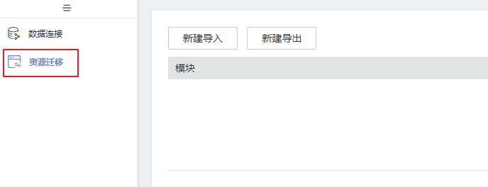
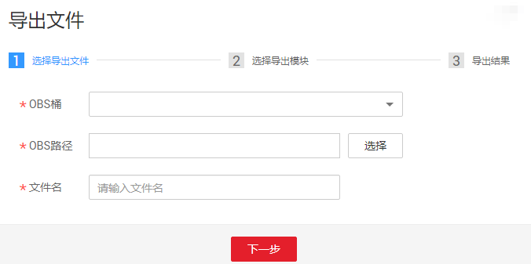
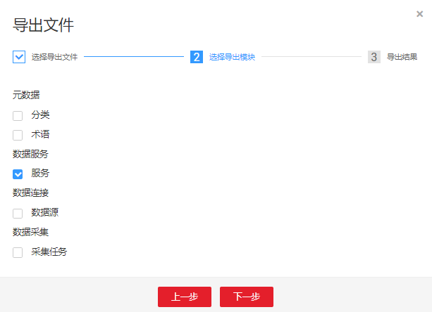
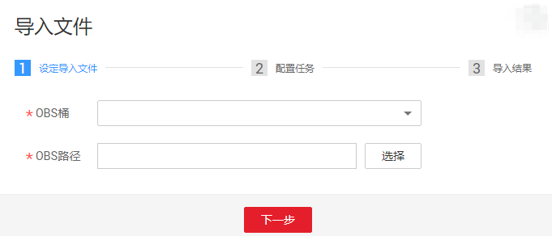
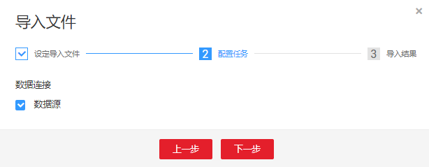
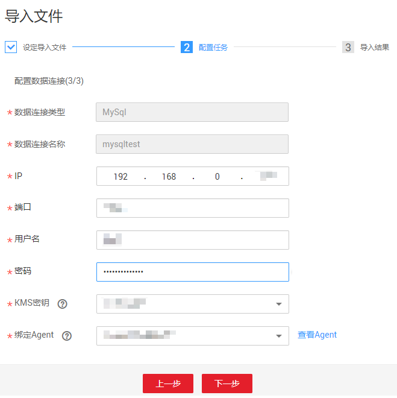

# 资源迁移

当您需要将工作空间A已创建好的规则迁移至工作空间B，可使用数据湖治理中心DGC的资源迁移功能，对资源进行导入导出。

支持迁移的资源包含数据服务、元数据分类、元数据标签、元数据采集任务和数据连接。

## 前提条件

-   资源导入导出功能依赖于OBS服务；如无OBS，支持从本地导入导出。
-   系统中存在可迁移的资源，参见[创建数据连接](创建数据连接.md)创建数据连接，[标签管理](标签管理.md)对元数据进行分类和标签的添加，[任务管理](任务管理.md)完成采集任务的创建和[发布API](发布API.md)中发布的API。

## 约束条件

-   名称相同的采集任务不支持被重复迁移。
-   名称相同的分类和标签不支持被重复迁移。
-   导入导出的资源以json格式存储。
-   由于安全原因，导出连接时没有导出连接密码，需要在导入时自行输入。

## 导出资源

1.  在DGC控制台首页，选择对应工作空间的“管理中心“模块，进入管理中心页面。

    **图 1**  选择管理中心  
    

2.  在管理中心页面，单击“资源迁移”，进入资源迁移页面。

    **图 2**  资源迁移  
    

3.  单击“新建导出“，配置文件存储位置和文件名称。

    如无OBS，仅需设置导出文件名即可。

    **图 3**  选择导出文件  
    

4.  单击“下一步“，勾选导出的模块。

    **图 4**  勾选导出的模块  
    

5.  单击“下一步“，等待导出完成，资源包导出到[3](#li7215285277)所设置的存储位置。

    如无OBS，导出完成后可在资源迁移模块的对应迁移任务行中，单击“下载“获取导出的资源包。

    **图 5**  导出完成  
    

    导出资源耗时1分钟仍未显示结果则表示导出失败，请重试或联系售后人员提供技术支持。

## 导入资源

1.  在DGC控制台首页，选择对应工作空间的“管理中心“模块，进入管理中心页面。

    **图 6**  选择管理中心  
    

1.  在管理中心页面，单击“资源迁移”，进入资源迁移页面。

    **图 7**  资源迁移  
    

1.  单击“新建导入“，配置待导入的资源存储路径。

    如无OBS，需要从本地路径选择待上传的资源包。

    **图 8**  配置待导入的资源存储路径  
    

2.  单击“下一步“，勾选导入的资源类型。

    **图 9**  勾选导入的资源类型  
    

3.  单击“下一步“，配置数据连接。配置的数据连接个数由数据源的数量决定，有多少数据源就要配置多少个数据连接，每个连接都需要输入密码。

    **图 10**  配置数据连接  
    

4.  单击“下一步“，等待导入完成。

    **图 11**  导入完成  
    

    导入资源耗时1分钟仍未显示结果则表示导入失败，请重试或联系售后人员提供技术支持。

