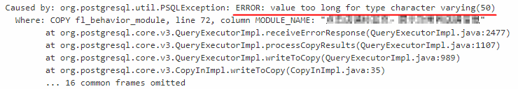
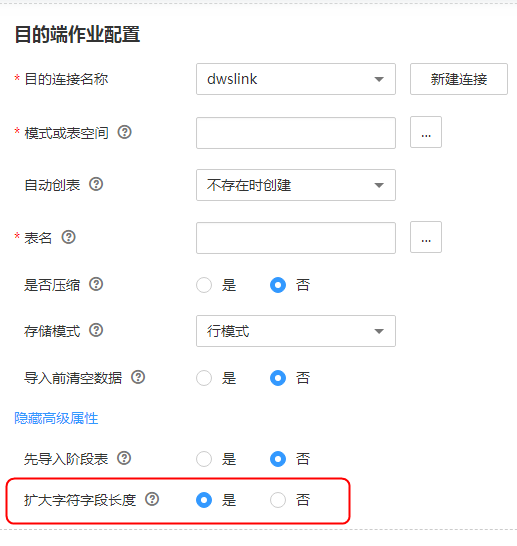

# 迁移到DWS时出现value too long for type character varying怎么处理？

## 问题描述

在使用CDM迁移数据到数据仓库服务（DWS）或者FusionInsight LibrA时，如果迁移作业失败，且执行日志中出现“value too long for type character varying“错误提示，如[图1](#zh-cn_topic_0112723379_fig1212717551629)所示。

**图 1**  日志信息  

## 原因分析

这种情况一般是在迁移到DWS时数据有中文，且创建作业时选择了目的端自动建表的情况下。原因是DWS的varchar类型是按字节计算长度，一个中文字符在UTF-8编码下可能要占3个字节。当中文字符的字节超过DWS的varchar的长度时，就会出现错误：value too long for type character varying。

## 解决方法

这个问题，可以通过将目的端作业参数“扩大字符字段长度“选择“是“来解决，选择此选项后，再创建目的表时会自动将varchar类型的字段长度扩大3倍。

编辑CDM的表/文件迁移作业，目的端作业配置下“自动创表“选择“不存在时创建“，则高级属性下面会出现参数“扩大字符字段长度“，配置该参数为“是“即可，如[图2](#zh-cn_topic_0112723379_fig4363452123517)所示。

**图 2**  扩大字符字段长度  

