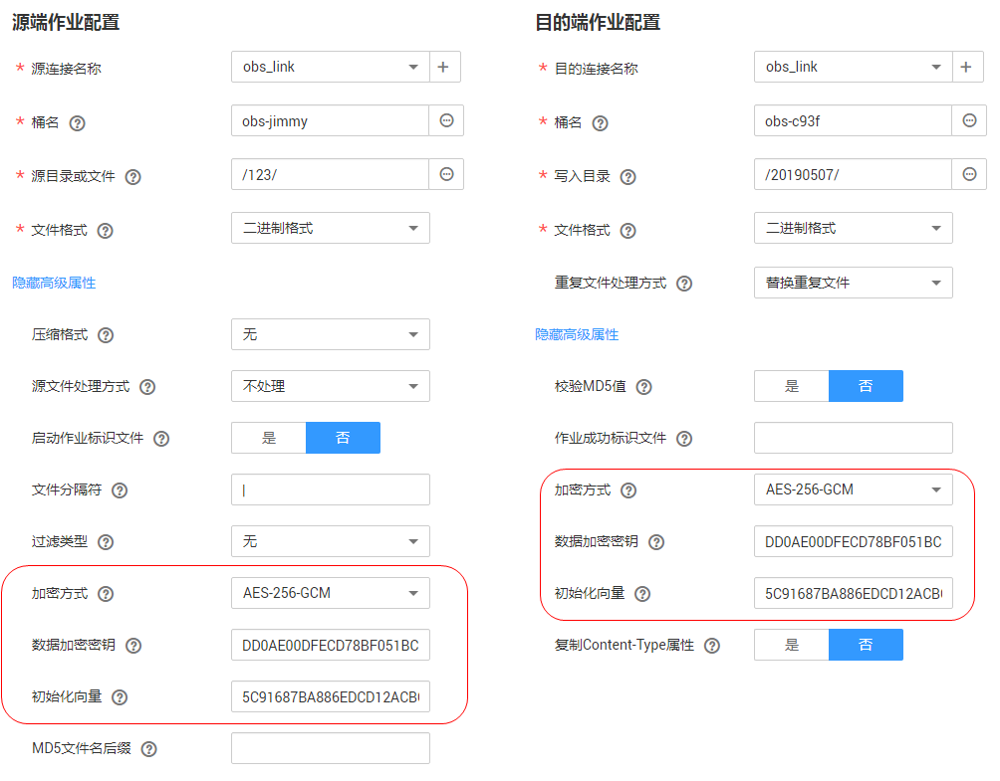
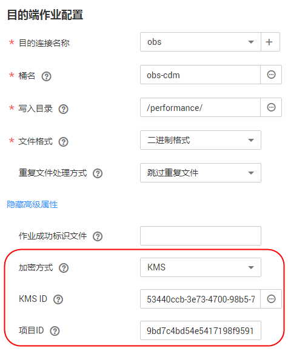

# 迁移文件时加解密

在迁移文件到文件系统时，CDM支持对文件加解密，目前支持以下加密方式：

-   [AES-256-GCM加密](#zh-cn_topic_0108275362_section17832638131012)
-   [KMS加密](#zh-cn_topic_0108275362_section9481412161214)

## AES-256-GCM加密

目前只支持AES-256-GCM（NoPadding）。该加密算法在目的端为加密，在源端为解密，支持的源端与目的端数据源如下。

-   源端支持的数据源：OBS、FTP、SFTP、NAS、SFS、HDFS（使用二进制格式传输时支持）、HTTP（适用于OBS共享文件的下载场景）。
-   目的端支持的数据源：OBS、FTP、SFTP、NAS、SFS、HDFS（使用二进制格式传输时支持）。

下面以导入文件到OBS时加密，然后从OBS导出加密文件时解密为例，介绍AES-256-GCM加解密的使用方法。其它数据源的使用方法一样。

**图 1**  AES-256-GCM加解密  

-   **加密**

    创建CDM导入文件到OBS的作业时，目的端数据源选择OBS后，在“目的端作业配置“的“高级属性“中，配置如下参数。

    1.  加密方式：选择“AES-256-GCM“。
    2.  数据加密密钥：用户自定义密钥，密钥由长度64的十六进制数组成，不区分大小写但必须64位，例如“DD0AE00DFECD78BF051BCFDA25BD4E320DB0A7AC75A1F3FC3D3C56A457DCDC1B“。
    3.  初始化向量：用户自定义初始化向量，初始化向量由长度32的十六进制数组成，不区分大小写但必须32位，例如“5C91687BA886EDCD12ACBC3FF19A3C3F“。

    这样在CDM导入文件到OBS时，目的端OBS上的文件便是经过AES-256-GCM算法加密后的文件。

-   **解密**

    创建从OBS导出文件的CDM作业时，源端数据源选择OBS后，在“源端作业配置“的“高级属性“中，配置如下参数。

    1.  加密方式：选择“AES-256-GCM“。
    2.  数据加密密钥：这里的密钥必须与[加密](#zh-cn_topic_0108275362_li5742105310192)时配置的密钥一致，否则解密出来的数据会错误，且系统不会提示异常。
    3.  初始化向量：这里的初始化向量必须与[加密](#zh-cn_topic_0108275362_li5742105310192)时配置的初始化向量一致，否则解密出来的数据会错误，且系统不会提示异常。

    这样CDM从OBS导出加密过的文件时，写入目的端的文件便是解密后的明文文件。

## KMS加密

CDM目前只支持导入文件到OBS时使用KMS加密，表/文件迁移和整库迁移都支持，在“目的端作业配置“的“高级属性“中配置，如[图2](#zh-cn_topic_0108275362_fig12537122918465)所示。

KMS密钥需要先在数据加密服务创建，具体操作请参见《数据加密服务用户指南》。

**图 2**  使用KMS加密  

当启用KMS加密功能后，用户上传对象时，数据会加密成密文存储在OBS。用户从OBS下载加密对象时，存储的密文会先在OBS服务端解密为明文，再提供给用户。

> **说明：**   
>-   如果选择使用KMS加密，则无法[使用MD5校验一致性](MD5校验文件一致性.md#dayu_01_0103)。  
>-   如果这里使用其它项目的KMS ID，则需要修改“项目ID“参数，修改为KMS ID所属的项目ID；如果KMS ID与CDM在同一个项目下，“项目ID“参数保持默认即可。  
>-   使用KMS加密后，OBS上对象的加密状态不可以修改。  
>-   使用中的KMS密钥不可以删除，如果删除将导致加密对象不能下载。  

