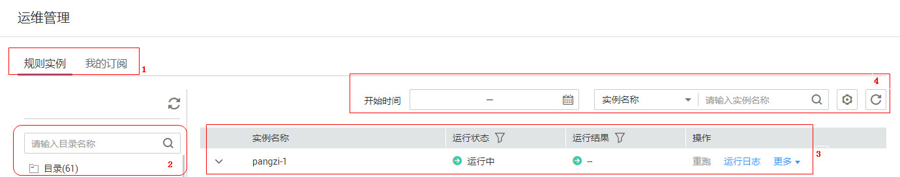

# 运维管理

## 界面说明

介绍“数据质量规则运维管理“页面中的区域和按键功能。

**图 1**  页面区域说明  

**表 1**  数据质量规则运维管理页面

<table><thead align="left"><tr id="zh-cn_topic_0141836102_row481471118149"><th class="cellrowborder" valign="top" width="10.241024102410242%" id="mcps1.2.4.1.1">
序号

</th>
<th class="cellrowborder" valign="top" width="21.602160216021602%" id="mcps1.2.4.1.2">
区域

</th>
<th class="cellrowborder" valign="top" width="68.15681568156815%" id="mcps1.2.4.1.3">
描述

</th>
</tr>
</thead>
<tbody><tr id="zh-cn_topic_0141836102_row17814131118143"><td class="cellrowborder" valign="top" width="10.241024102410242%" headers="mcps1.2.4.1.1 ">
1

</td>
<td class="cellrowborder" valign="top" width="21.602160216021602%" headers="mcps1.2.4.1.2 ">
菜单栏

</td>
<td class="cellrowborder" valign="top" width="68.15681568156815%" headers="mcps1.2.4.1.3 ">
运维管理的菜单栏，包括规则实例和我的订阅。

<ul id="zh-cn_topic_0141836102_ul1320205540"><li>规则实例：展示当前用户的所有规则实例内容。</li><li>我的订阅：展示被当前用户设置订阅的规则实例信息列表。“我的订阅”较“规则实例”增加了“通知状态”信息。该信息展示了规则实例的运行结果是否被成功订阅，例如发送告警邮件</li></ul>
</td>
</tr>
<tr id="zh-cn_topic_0141836102_row3814311171417"><td class="cellrowborder" valign="top" width="10.241024102410242%" headers="mcps1.2.4.1.1 ">
2

</td>
<td class="cellrowborder" valign="top" width="21.602160216021602%" headers="mcps1.2.4.1.2 ">
导航栏

</td>
<td class="cellrowborder" valign="top" width="68.15681568156815%" headers="mcps1.2.4.1.3 ">
左侧导航栏，包括数据质量规则的存储目录。

用户可以根据实际需要对规则进行分目录存放，每级目录旁边的数字代表属于该级目录的规则实例的个数。

</td>
</tr>
<tr id="zh-cn_topic_0141836102_row168141111101411"><td class="cellrowborder" valign="top" width="10.241024102410242%" headers="mcps1.2.4.1.1 ">
3

</td>
<td class="cellrowborder" valign="top" width="21.602160216021602%" headers="mcps1.2.4.1.2 ">
规则实例列表

</td>
<td class="cellrowborder" valign="top" width="68.15681568156815%" headers="mcps1.2.4.1.3 ">
展示实例名称、运行状态、运行结果等信息。

</td>
</tr>
<tr id="zh-cn_topic_0141836102_row1281531171415"><td class="cellrowborder" valign="top" width="10.241024102410242%" headers="mcps1.2.4.1.1 ">
4

</td>
<td class="cellrowborder" valign="top" width="21.602160216021602%" headers="mcps1.2.4.1.2 ">
搜索区域

</td>
<td class="cellrowborder" valign="top" width="68.15681568156815%" headers="mcps1.2.4.1.3 "><ul id="zh-cn_topic_0141836102_ul1140944611217"><li>可以选择性的展示规则实例，例如运行的开始时间和结束时间处于某一时间区间实例。</li><li>根据处理人、创建人、实例名称进行搜索展示规则实例的列表信息，输入内容支持模糊搜索。</li></ul>
</td>
</tr>
</tbody>
</table>

**表 2**  规则实例列表说明

<table><thead align="left"><tr id="zh-cn_topic_0141836102_row133391849888"><th class="cellrowborder" valign="top" width="17.580000000000002%" id="mcps1.2.3.1.1">
菜单/按键

</th>
<th class="cellrowborder" valign="top" width="82.42%" id="mcps1.2.3.1.2">
说明

</th>
</tr>
</thead>
<tbody><tr id="zh-cn_topic_0141836102_row034054916811"><td class="cellrowborder" valign="top" width="17.580000000000002%" headers="mcps1.2.3.1.1 ">
实例名称

</td>
<td class="cellrowborder" valign="top" width="82.42%" headers="mcps1.2.3.1.2 ">
由“规则名称-数字”组成，数字越大，表示该实例创建的时间越近。

</td>
</tr>
<tr id="zh-cn_topic_0141836102_row7340149180"><td class="cellrowborder" valign="top" width="17.580000000000002%" headers="mcps1.2.3.1.1 ">
运行状态

</td>
<td class="cellrowborder" valign="top" width="82.42%" headers="mcps1.2.3.1.2 ">
展示实例运行状态，包含成功，失败和运行中。

</td>
</tr>
<tr id="zh-cn_topic_0141836102_row11340349781"><td class="cellrowborder" valign="top" width="17.580000000000002%" headers="mcps1.2.3.1.1 ">
运行结果

</td>
<td class="cellrowborder" valign="top" width="82.42%" headers="mcps1.2.3.1.2 ">
展示实例运行是否正常结束。

<ul id="zh-cn_topic_0141836102_ul9234195321310"><li>正常：表示实例正常结束，且执行结果符合预期。</li><li>告警：表示实例正常结束，但执行结果不符合预期。</li><li>异常：表示实例未正常结束。</li><li>--：表示实例正在运行中，无执行结果。</li></ul>
</td>
</tr>
<tr id="zh-cn_topic_0141836102_row634014499816"><td class="cellrowborder" valign="top" width="17.580000000000002%" headers="mcps1.2.3.1.1 ">
重跑

</td>
<td class="cellrowborder" valign="top" width="82.42%" headers="mcps1.2.3.1.2 ">
再次运行规则实例。

</td>
</tr>
<tr id="zh-cn_topic_0141836102_row7340349885"><td class="cellrowborder" valign="top" width="17.580000000000002%" headers="mcps1.2.3.1.1 ">
运行日志

</td>
<td class="cellrowborder" valign="top" width="82.42%" headers="mcps1.2.3.1.2 ">
查看规则实例的详细运行日志信息。

</td>
</tr>
<tr id="zh-cn_topic_0141836102_row7542925193617"><td class="cellrowborder" valign="top" width="17.580000000000002%" headers="mcps1.2.3.1.1 ">
更多&gt;处理问题

</td>
<td class="cellrowborder" valign="top" width="82.42%" headers="mcps1.2.3.1.2 ">
对当前规则实例进行进一步处理。支持填写处理意见，关闭问题和移交他人。

如果实例的处理人是当前登录用户则可以对规则实例进行处理操作，包括填写意见和转交给他人处理。

</td>
</tr>
<tr id="zh-cn_topic_0141836102_row19410632113612"><td class="cellrowborder" valign="top" width="17.580000000000002%" headers="mcps1.2.3.1.1 ">
更多&gt;处理日志

</td>
<td class="cellrowborder" valign="top" width="82.42%" headers="mcps1.2.3.1.2 ">
可查看历史处理记录。

</td>
</tr>
<tr id="zh-cn_topic_0141836102_row1534013491989"><td class="cellrowborder" valign="top" width="17.580000000000002%" headers="mcps1.2.3.1.1 ">

</td>
<td class="cellrowborder" valign="top" width="82.42%" headers="mcps1.2.3.1.2 ">
表示可以根据该列属性对展示的内容进行筛选。

</td>
</tr>
<tr id="zh-cn_topic_0141836102_row548219266"><td class="cellrowborder" valign="top" width="17.580000000000002%" headers="mcps1.2.3.1.1 ">

</td>
<td class="cellrowborder" valign="top" width="82.42%" headers="mcps1.2.3.1.2 ">
表示可以根据该列属性的顺序展示列表的内容。

</td>
</tr>
<tr id="zh-cn_topic_0141836102_row1062982412278"><td class="cellrowborder" valign="top" width="17.580000000000002%" headers="mcps1.2.3.1.1 ">

</td>
<td class="cellrowborder" valign="top" width="82.42%" headers="mcps1.2.3.1.2 ">
选择展示不同的属性信息。

</td>
</tr>
<tr id="zh-cn_topic_0141836102_row135408319289"><td class="cellrowborder" valign="top" width="17.580000000000002%" headers="mcps1.2.3.1.1 ">

</td>
<td class="cellrowborder" valign="top" width="82.42%" headers="mcps1.2.3.1.2 ">
单击下拉箭头可查看该实例所属规则的所有子规则的信息，包括每个子规则的本次计算结果。

</td>
</tr>
</tbody>
</table>

